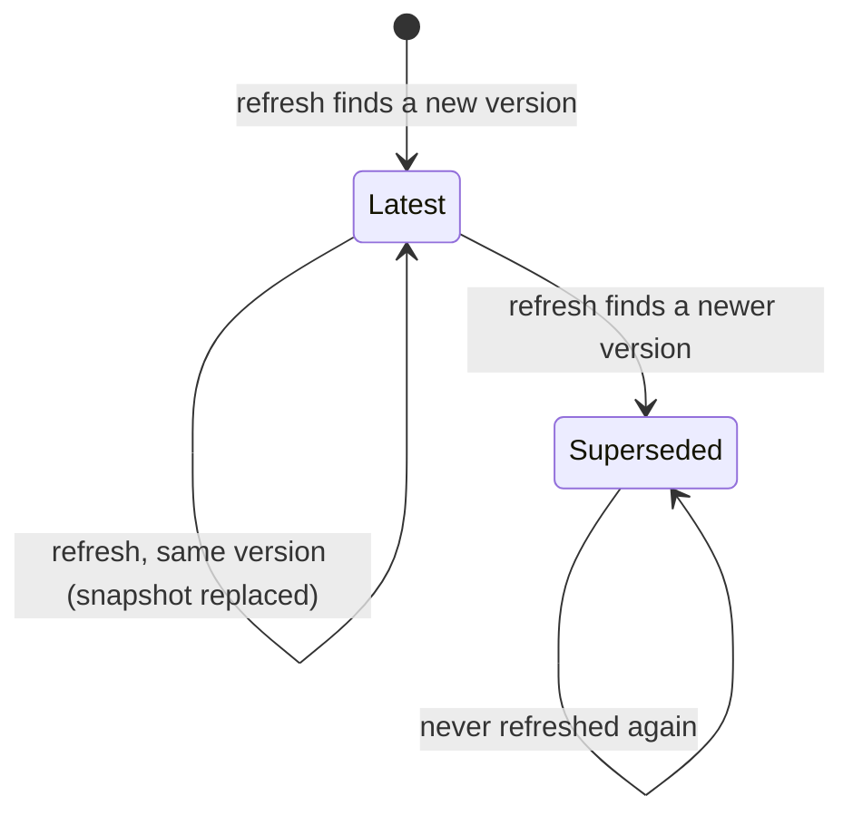

# Data Model: DEDL Reference

**Feature**: [spec.md](spec.md) | **Plan**: [plan.md](plan.md) | **Research**: [research.md](research.md)

The reference has two layers of data:

- **Stored**: committed snapshots, written only by `reference:refresh`.
- **Derived**: the model the build computes from the snapshots on every build and never stores.

The machine-checkable shapes of the stored files are in [contracts/reference-data.schema.json](contracts/reference-data.schema.json).

## Files

| Path | Holds | Written by |
|---|---|---|
| `src/content/reference/languages.json` | the registered definition languages (D17) | site-owned configuration |
| `src/content/reference/<language>/<version>/source/*` | the source files, byte for byte | `reference:refresh` |
| `src/content/reference/<language>/<version>/source.json` | the version's source record and metadata | `reference:refresh` |

Nothing under `src/content/reference/<language>/` is edited by hand. `check:reference` verifies that each file under `source/` hashes to the value recorded in `source.json`.

## Stored entities

### Language (`languages.json`, one entry per language)

| Field | Type | Notes |
|---|---|---|
| `id` | string | `^[a-z]+$`, used in addresses: `dedl` |
| `name` | string | "DEDL — Diagram Editor Definition Language" |
| `short` | string | "DEDL" |
| `repository` | string | `etalii-adp/etalii.adp` |
| `branch` | string | `develop` |
| `path` | string | `specifications/dedl` |
| `prose` | string | `DEDL-specification.md` |
| `schema` | string | `dedl.schema.json` |
| `schemaAddress` | string | `/<id>/schema/{version}/{schema}` under the site base; must equal the path of the schema's `$id` |

### DEDL version (`source.json`)

| Field | Type | Notes |
|---|---|---|
| `language` | string | `dedl` |
| `version` | string | `^\d+\.\d+(\.\d+)?$`, from the prose line `**Specification, version <v> (<status>)**` |
| `status` | string | e.g. `Working Draft`, from the same line |
| `date` | date | the `Date` row of the prose's metadata table |
| `source` | SourceRecord | see below |
| `files` | FileRecord[] | one per file under `source/` |
| `retrieved` | datetime | when the refresh read the source |

Validation, enforced by the refresh before it writes anything (FR-013):

- `version` also appears as the version segment of the schema's `$id`, and in every example's `$schema`.
- The `$id` path equals `schemaAddress` with this version (FR-009).
- `source.licence` is not null. When it is null, the refresh stops and reports it (D14).

### SourceRecord

The same shape as spec 003's source record, so provenance renders the same way across the site.

| Field | Type | Notes |
|---|---|---|
| `kind` | `"git"` | |
| `repository` | string | `owner/name` |
| `path` | string | the folder, `specifications/dedl` |
| `revision` | string | 40 hex characters; the commit the refresh read |
| `licence` | string | SPDX id from the repository's licence |
| `copyright` | string or null | from the licence file, when stated |

### FileRecord

| Field | Type | Notes |
|---|---|---|
| `name` | string | file name as in the source |
| `role` | `"prose"` \| `"schema"` \| `"definition"` \| `"document"` \| `"other"` | from the extension and the `$schema` pointer: `…/$defs/Definition` → definition, `…/$defs/Document` → document |
| `sha256` | string | of the bytes as stored |
| `size` | integer | bytes |

A file the refresh cannot classify is stored as `other`, listed in the report and not published. A new kind of source file needs a decision, not a guess.

## Derived entities (computed by the build, never stored)

### Page

One generated HTML page of a version.

| Field | Notes |
|---|---|
| `kind` | `cover` \| `section` \| `schema` \| `examples-index` \| `example` \| `stub` |
| `slug` | cover: empty; section: title slug without number (D4); schema: `schema`; examples: `examples`, `examples/<stem>` |
| `address` | `/adp/<language>/<version>/<slug>/`, plus the `latest` copy for the latest version |
| `title` | the heading text without number, plus the number shown before it |
| `number` | `1`…`17`, `A`…`D` for sections; null otherwise |
| `informative` | true when the heading carries `*(informative)*` |
| `prev`, `next` | neighbouring section pages in document order |
| `headings` | Heading[] |

Rules:

- The section pages in document order cover every H2 of the source after the table of contents. None is dropped (SC-001).
- Slugs are unique within a version. On a collision the build fails, with both headings named.

### Heading

| Field | Notes |
|---|---|
| `id` | GitHub slug of the source heading (D4), unique within the source document |
| `depth` | 2–6 |
| `number` | leading number such as `5.10` or `A.2`, or null |
| `text` | heading text as in the source |
| `page` | the Page it lands on |

The **anchor map** (`id → page`) and the **number map** (`number → Heading`) resolve every cross-reference (D5).

### Link (the link graph, FR-004 and FR-019)

| Field | Notes |
|---|---|
| `from` | Page and nearest Heading |
| `to` | Heading, SchemaDefinition, Example or GlossaryTerm |
| `kind` | `anchor` (explicit `#` link) \| `number` (section number in prose) \| `schema` (`$defs` name) \| `glossary` \| `example` |
| `text` | the linked text |

Reverse links ("Referenced from", "Described in", "Illustrated by") are queries over this graph. The whole graph is written to `dist/<language>/<version>/reference-links.json` for review (D5).

### SchemaDefinition

| Field | Notes |
|---|---|
| `name` | key under `$defs` |
| `layer` | from Appendix A.2's table; `null` when A.2 does not list it, which the check reports as a warning |
| `json` | the definition as in the schema |
| `refs` | the `$defs` names it references through `$ref` |
| `anchor` | `def-<name>` on the schema page |

### Example

| Field | Notes |
|---|---|
| `file` | FileRecord of role `definition` or `document` |
| `stem` | file name without extension, `.` → `-` |
| `label`, `doc` | definition: `language.label`, `language.doc`; document: the embedding section's title |
| `section` | the 17.x Heading whose body contains ``File `…/<file>`:`` |
| `demonstrates` | that section's leading bullet list, as rendered Markdown, with layer names linked |
| `layers` | definition only: for each of the eight layer keys present, the count of items it declares |
| `embeddedMatches` | whether the section's embedded copy equals the file after JSON normalisation; a mismatch is a warning |
| `visuals` | Visual[] |
| `screenshots` | Screenshot[], possibly empty |

### Visual

| Field | Notes |
|---|---|
| `kind` | `source-diagram` (Mermaid fence in the prose) \| `metamodel` \| `layer-map` \| `document-structure` |
| `mermaid` | the Mermaid text, generated or as in the source |
| `title`, `description` | `accTitle` and `accDescr`, used as alt text |
| `caption` | for generated visuals: "Generated from `<file>` at `<short revision>`" |

### Screenshot

The same entity as spec 003's screenshot, with two added fields from the source's readme row ([contracts/source-inputs.md](contracts/source-inputs.md) S3).

| Field | Notes |
|---|---|
| `host` | `standalone` \| `intellij` \| `vscode` \| `eclipse` |
| `example` | `dedl/<version>/<file>` |
| `shows` | `definition` \| `diagram` |
| `image`, `alt`, `visible`, `source` | as in spec 003 |

## State: the life of a version

- **Latest**: served at `/<language>/<version>/…` and at `/<language>/latest/…`, and searched by default.
- **Superseded**:
  - served at `/<language>/<version>/…` only, with the newer-version banner (FR-008);
  - searchable when chosen explicitly;
  - its page slugs that are missing from the latest version get stubs under `latest/` (D13).
- A version is never deleted by the refresh. Withdrawing a version is a deliberate change and is out of scope here.
