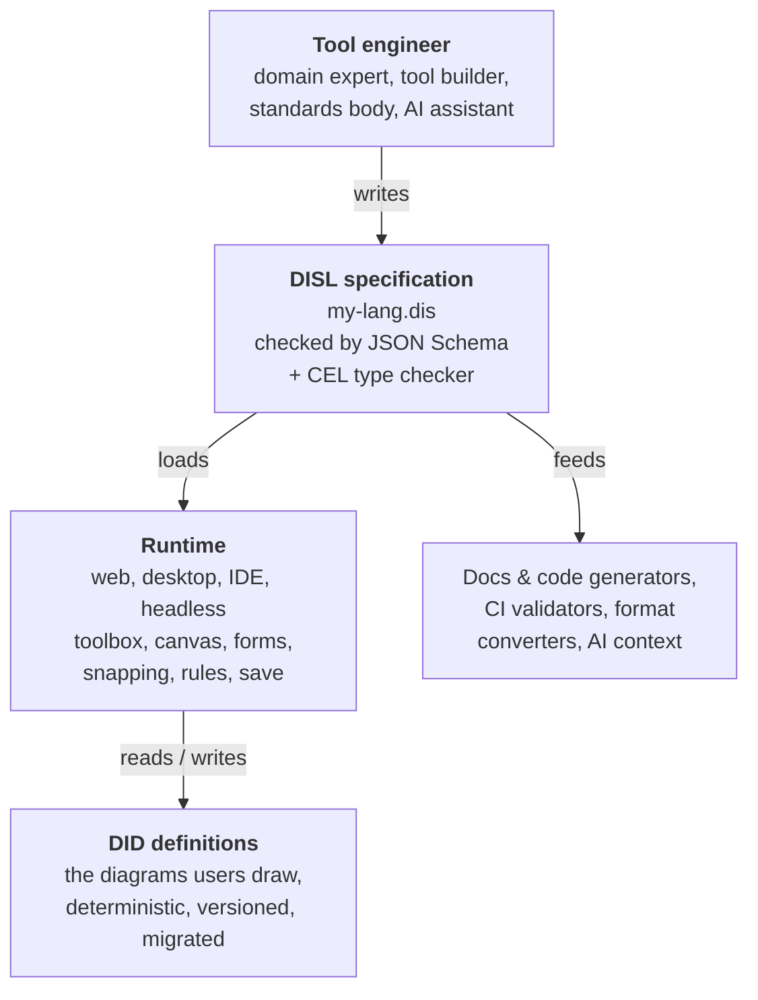
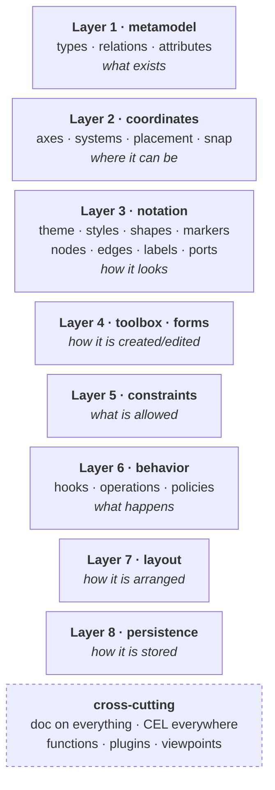
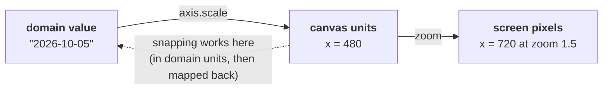
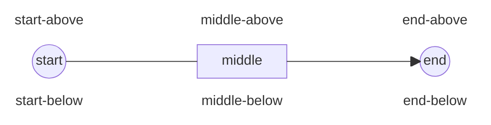
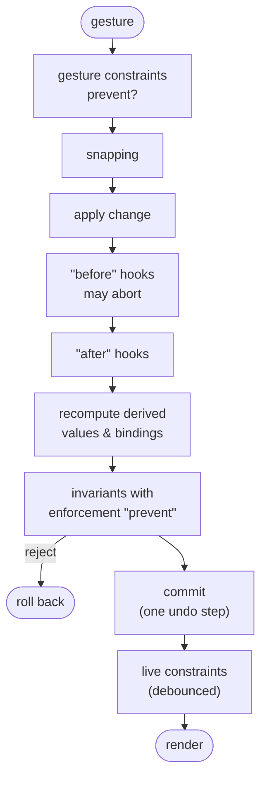

# DISL — Diagram Specification Language

**Specification, version 0.2 (Working Draft)**

|                           |                                                                              |
|---------------------------|------------------------------------------------------------------------------|
| Date                      | 2026-09-30                                                                   |
| Specification schema      | `disl.schema.json` (JSON Schema, draft 2020-12), `$defs/Specification`       |
| Definition language       | DID, the Diagram Definition Language, in [`../did/`](../did/DID-specification.md) |
| Expression language       | CEL — Common Expression Language (https://cel.dev)                           |
| Media type (provisional)  | `application/vnd.disl.specification+json`                                    |
| File extension            | `.dis`                                                                       |

---

## Status of this document

This is a working draft, version 0.2. It is complete enough to implement a conforming validator, a documentation generator and a reference runtime, but individual constructs may still change before version 1.0. DISL 0.1 continued the earlier combined format (DEDL became DISL and DID); section 18 lists the old identifiers that runtimes still read. DISL 0.2 adds declarative constructs to 0.1 (declared identity, findings that point at files, reasons the tool gives, derived elements, gestures and menus, view state, budgets, notation and time details). Every valid 0.1 specification is a valid 0.2 specification and keeps its meaning, except in the places listed in [Changes from 0.1](#changes-from-01), where 0.1 was silent or ambiguous and 0.2 now says what it means. Sections and paragraphs marked *(informative)* explain intent and give guidance; everything else is *normative*.

The key words **MUST**, **MUST NOT**, **REQUIRED**, **SHALL**, **SHALL NOT**, **SHOULD**, **SHOULD NOT**, **RECOMMENDED**, **MAY** and **OPTIONAL** are to be interpreted as described in RFC 2119 and RFC 8174 when, and only when, they appear in bold capitals.

---

## Table of contents

1. [Introduction](#1-introduction)
2. [Foundations](#2-foundations)
3. [Specification structure, layers and viewpoints](#3-specification-structure-layers-and-viewpoints)
4. [Layer 1 — Metamodel](#4-layer-1--metamodel)
5. [Layer 2 — Coordinate systems, placement and snapping](#5-layer-2--coordinate-systems-placement-and-snapping)
6. [Layer 3 — Notation (visual definition)](#6-layer-3--notation-visual-definition)
7. [Layer 4 — Toolbox, context tools and forms](#7-layer-4--toolbox-context-tools-and-forms)
8. [Layer 5 — Constraints](#8-layer-5--constraints)
9. [Layer 6 — Behavior](#9-layer-6--behavior)
10. [Layer 7 — Layout](#10-layer-7--layout)
11. [Layer 8 — Persistence](#11-layer-8--persistence)
12. [The CEL environment](#12-the-cel-environment)
13. [Extensions and plugins](#13-extensions-and-plugins)
14. [Processing model](#14-processing-model)
15. [Conformance](#15-conformance)
16. [Security, privacy and robustness](#16-security-privacy-and-robustness)
17. [Complete examples](#17-complete-examples)
- [Changes from 0.1](#changes-from-01)
18. [Deprecated aliases](#18-deprecated-aliases)
- [Appendix A — JSON Schema](#appendix-a--json-schema)
- [Appendix B — Built-in catalogues](#appendix-b--built-in-catalogues)
- [Appendix C — Glossary](#appendix-c--glossary)
- [Appendix D — Design rationale and open questions](#appendix-d--design-rationale-and-open-questions)

---

## 1. Introduction

### 1.1 What DISL is

DISL (Diagram Specification Language) is a declarative, JSON-based language in which a **tool engineer** specifies a **diagram type** — not individual diagrams, but the *kind* of diagram people can draw, and everything a runtime needs in order to support it:

- **what** can appear in a diagram: element types, their attributes, containment and relationships (*metamodel*);
- **where** things can be placed: coordinate systems whose axes may be numeric, temporal (dates and timestamps) or categorical, how element positions relate to model data, and the snapping rules that make positions discrete on one axis, the other, or both (*coordinates*);
- **how** everything looks: shapes from elementary primitives to finely parameterised paths and composites, labels, compartments, embedded form widgets, and edges with arbitrary line styles, arrowheads and labels at their start, middle and end (*notation*);
- **which tools** users get: toolbox groups, context tools, templates and property forms (*toolbox and forms*);
- **what is allowed**: rules written in CEL, with severities, messages, quick fixes and the choice between preventing a gesture and reporting a finding afterwards (*constraints*);
- **what happens** when users act: hooks and operations (*behavior*);
- **how** diagrams are arranged automatically (*layout*);
- and **how** a diagram is stored: format, identifiers, file split, ordering, precision, migrations and collaboration (*persistence*). The stored diagrams themselves are DID definitions, specified by DID, the Diagram Definition Language ([DID-specification.md](../did/DID-specification.md)).

A single DISL file — a **specification** — is a complete, portable, machine-validated description of a diagram type: a visual language and how it is worked with. Every aspect of it may carry human-readable documentation, so a specification doubles as the reference manual of its language and as the source of help texts inside the runtime.

### 1.2 How DISL is intended to be used *(informative)*

DISL sits between the tool engineers who specify a diagram type and the software that lets others use it.



A typical workflow:

1. **Write a specification.** A tool engineer writes `my-lang.dis` by hand with IDE support from the JSON Schema (validation, completion, hover help), or generates it from an existing source such as a class model, an ontology or an older tool configuration. Specifications can import shared libraries of shapes, markers, styles and types (section 3.3).
2. **Validate it.** A validator checks the specification against the JSON Schema, resolves names and imports, flattens inheritance, and type-checks every CEL expression in the context in which it will be evaluated (section 12). Errors and warnings are reported with the JSON Pointer of the offending node.
3. **Load it into a runtime.** A conforming runtime needs no language-specific code: palette, canvas, rendering, snapping, property forms, validation and saving all come from the specification. Whatever the declarative core cannot express is delegated to named, versioned plugins (section 13) rather than to embedded scripts.
4. **Draw.** End users create diagrams of the type, stored as **DID definitions**, that conform to the specification. The runtime surfaces the specification's documentation as tooltips, field help, explanations of findings and a help view, so users learn the language while using it.
5. **Persist and evolve.** DID definitions are written exactly as the persistence layer prescribes, so they are deterministic, diff-friendly and readable by any other conforming runtime. When the language evolves, declared migrations upgrade old DID definitions automatically.

The same specification serves other consumers too:

- **documentation generators** that render a language reference with rendered samples of every shape;
- **code generators** that produce typed APIs, database schemas or JSON Schemas for DID definitions;
- **headless validators** in CI pipelines that check DID definitions without drawing them;
- **converters** to and from other formats (BPMN DI, draw.io, Ecore, SVG, PlantUML);
- **AI assistants** that read the specification to understand what a diagram may contain, which rules apply and how to produce a valid DID definition.

### 1.3 Who should read what *(informative)*

| Reader                         | Most relevant sections           |
|--------------------------------|----------------------------------|
| Tool engineers                 | 1–11, 17, Appendix B             |
| Runtime implementers           | All, especially 5, 6, 12, 14, 15; DID |
| Converter and generator makers | 3, 4, 11, 12, Appendix A, DID    |
| Reviewers and standards bodies | 1, 14–16, Appendix D             |

### 1.4 Design principles

1. **Declarative first, escape hatches second.** The common 90 % of diagram types must be expressible without code. The remaining 10 % is reached through named plugins with declared parameters, never through embedded general-purpose scripts.
2. **Layered separation of concerns.** Each layer answers one question and can be read, reviewed, reused and replaced independently. Meaning (metamodel) is strictly separated from appearance (notation) and from placement (view data).
3. **One expression language.** Every dynamic value — label text, visibility, conditional styles, geometry of custom shapes, marker choice, constraint rules, default values, snapping functions, placement bindings — is a CEL expression. CEL is side-effect free, non-Turing-complete, guaranteed to terminate, statically typable, and has mature implementations in Go, Java, C++, JavaScript/TypeScript, Python, Rust and .NET.
4. **Self-describing.** Every object may carry a `doc`. Documentation is part of the language, not an afterthought, and runtimes are expected to show it to users.
5. **Domain-true coordinates.** Positions are stored in the units of their axis — pixels, millimetres, timestamps, category identifiers — never only in screen pixels, so stored diagrams keep their meaning when zoom level, scale or renderer change.
6. **Deterministic persistence.** Two conforming runtimes saving the same diagram with the same specification MUST produce byte-identical output.
7. **Extensible without forking.** Vendor extensions live under `x-` keys and plugin names; unknown extensions are ignored, never fatal, and are preserved on round trips.
8. **Progressive complexity.** Every construct has a shorthand for the simple case (`"shape": "ellipse"`) and a full object form for fine control (`"shape": {"type": "ellipse", "params": {...}}`). A usable diagram type needs fewer than fifty lines of DISL.

### 1.5 Non-goals

- DISL is not a general-purpose UI framework. It specifies diagram types, including forms embedded in diagram elements and property inspectors, but not arbitrary application screens.
- DISL does not prescribe a rendering technology. SVG, Canvas 2D, WebGL, native toolkits and print pipelines are all valid targets.
- DISL does not define execution or simulation semantics of the modelled language (for example, how a state machine runs). Such information MAY be carried in extensions. A specification **MAY** play a simulated run of its own, stepwise and outside the model's history (9.6); DISL defines how such a run is declared and played, not what the modelled language means.
- DID definitions are not a lingua franca for unrelated software; a DID definition is always interpreted relative to its specification.

### 1.6 Relation to prior art *(informative)*

DISL deliberately borrows proven ideas:

| Source                           | Idea adopted                                                                  |
|----------------------------------|-------------------------------------------------------------------------------|
| Eclipse Sirius, GMF              | Split into model, graphical, tooling and mapping definitions; viewpoints      |
| MetaEdit+ (GOPPRR)               | Small, closed meta-metamodel of objects, relationships, ports and properties  |
| OMG Diagram Definition, BPMN DI  | Strict separation of semantic model and diagram interchange data              |
| GLSP, Sprotty                    | Runtime-agnostic, client/server-friendly diagram description                  |
| SVG, CSS                         | Paint, stroke, dash, marker and text vocabulary; cascading styles and states  |
| draw.io / mxGraph                | Parameter handles on shapes; jump-overs; rich marker catalogue                |
| Vega-Lite, D3 scales             | Axes as scales from domain values (numbers, time, categories) to screen space |
| ELK                              | Layout algorithm catalogue and option pass-through                            |
| CEL, Kubernetes validation rules | Safe, typed expressions for validation and computed values                    |
| JSON Schema                      | Machine-checkable structure and IDE tooling                                   |
| Yjs, Automerge                   | CRDT-based collaboration hooks                                                |

---

## 2. Foundations

### 2.1 Serialization

A DISL specification is a JSON text (RFC 8259) encoded in UTF-8 without a byte-order mark. Its top-level value MUST be an object. The file extension **SHOULD** be `.dis`.

A specification **SHOULD** declare the schema it conforms to, and MUST declare the DISL version it targets:

```json
{
  "$schema": "https://etalii.net/adp/disl/schema/0.2/disl.schema.json#/$defs/Specification",
  "disl": "0.2",
  "language": { "id": "org.example.statemachine", "version": "1.0.0" },
  "metamodel": { "types": {} }
}
```

> The schema is published by the ADP website at `https://etalii.net/adp/disl/schema/<version>/disl.schema.json`.

Tools MAY accept YAML or JSON5 input for authoring convenience and convert it to JSON before processing, but the normative form is JSON. Because JSON has no comments, explanations belong in `doc` objects (section 2.4), which has the side effect that they reach end users.

Duplicate keys within one JSON object are a specification error. Property order in specifications carries no meaning except where this specification says so explicitly (arrays are always ordered; the order of toolbox groups, form fields, labels and constraints is significant).

### 2.2 Identifiers

Identifiers name types, attributes, styles, shapes, tools, constraints and all other named objects.

- A **simple identifier** matches `^[A-Za-z_][A-Za-z0-9_]*$`. Type names, attribute names, parameter names, port names and function names MUST be simple identifiers so that they are valid CEL identifiers.
- A **qualified identifier** matches `^[A-Za-z_][A-Za-z0-9_-]*(\.[A-Za-z_][A-Za-z0-9_-]*)*$` and is used for language IDs, theme tokens (`color.surface`), names from imports (`std.cylinder`) and plugin names.
- Identifiers are case-sensitive. Two identifiers in the same namespace MUST NOT differ only in case, to keep specifications and DID definitions portable across case-insensitive systems.
- Where an object is stored in a map, the map key is its identifier. Where it is stored in an array, it carries an `id` property.

**Namespaces.** Each of the following is a separate namespace: types (node types and relation types share one namespace), enums and data types (share one namespace, which must also not clash with types), axes, coordinate systems, snapping profiles, styles, shapes, markers, icons, forms, tools, templates, constraints, operations, functions, layouts and viewpoints. Imported specifications contribute names prefixed with their alias (`alias.Name`).

**Reserved names.** The following MUST NOT be used as attribute names, because they are built-in fields of elements in CEL (section 12.2): `id`, `type`, `kind`, `parent`, `children`, `descendants`, `ancestors`, `incoming`, `outgoing`, `source`, `target`, `sourcePort`, `targetPort`, `ports`, `owner`, `view`, `diagram`, `self`, `value`, `item`, `index`, `env`, `old`, `event`, `detail`, and any name beginning with `_` or `$`. CEL keywords (`in`, `as`, `break`, `const`, `continue`, `else`, `for`, `function`, `if`, `import`, `let`, `loop`, `package`, `namespace`, `return`, `var`, `void`, `while`, `true`, `false`, `null`) are also excluded.

### 2.3 Localized text, messages and reasons

Any human-facing string (labels, messages, descriptions, placeholders) is a **LocalizedText**: either a plain string or an object mapping BCP 47 language tags to strings.

```json
{
  "label": "State",
  "label": { "en": "State", "de": "Zustand", "nl": "Toestand" }
}
```

When a map is given, it **SHOULD** include the locale declared in `language.defaultLocale` (default `"en"`). Runtimes select the best match for the user's locale (RFC 4647 lookup) and fall back to the default locale, then to the first entry in the map.

Where a human-facing string must contain computed values (constraint messages, dynamic tooltips), the object form `{ "cel": "..." }` returning a `string` (or a `map(string, string)` keyed by locale) is used instead. DISL deliberately has no second template syntax.

**Message.** A **Message** is a LocalizedText or a CEL value `{ "cel": …, "resultType"?, "doc"? }` that returns a `string` or a `map(string, string)` keyed by locale (`$defs/Message`). It is the one shape of every sentence and label a runtime shows to the user. The positions this document types as Message are: constraint and field validation messages (8.2, 7.5); quick-fix labels (8.5); notation tooltips (6.9, 6.10); handle labels (6.8); the labels of tools, context tools, operations, forms, form items and sections (7.2, 7.3, 7.5, 9.3); form placeholders, button labels and the texts of absent and empty values (7.5, 4.3); confirmations (9.5); refusals and every Reason (below); built-in messages and refusals (8.1) and standard messages (9.1); and every human-facing text property added in 0.2. Metamodel labels (of the language, types, attributes, enums and enum values) and `doc` objects stay LocalizedText, because they name things independently of any element and are read where no CEL context exists.

- In a Message position, an object that has a `cel` property **MUST** be read as CEL, never as a LocalizedText map. A LocalizedText map **MUST NOT** use `cel` as a language tag, and `cel` is not a BCP 47 tag.
- A CEL Message is type-checked in the context of the property that holds it; each property names that context. It **MUST** return `string` or `map(string, string)`. When it fails to evaluate, the runtime **MUST** show the position's default text instead (for a label, the label derived from the identifier, 2.4; for a refusal or reason, a runtime-worded sentence naming the rule or reason id) and log a diagnostic, as for visual properties in 2.5.
- Messages are evaluated against the model, not against what is drawn: a Message **MAY** name an element that is filtered out, truncated or otherwise not drawn.
- A runtime **MUST** evaluate a CEL Message each time it presents it, for the target it is presented for, so a label or reason always describes the current state.

```json
{ "kind": "operation", "operation": "toggleFold",
  "label": { "cel": "self.view.collapsed ? 'Expand' : 'Collapse'" } }
```

**Reason.** A **Reason** says why something is refused, read-only or unavailable (`$defs/Reason`). It is one of:

| Form                                    | Applies                                            |
|-----------------------------------------|----------------------------------------------------|
| a Message                               | always                                             |
| `{ "when": Expression, "message": Message, "id"?: SimpleId, "doc"?: Doc }` | when `when` holds; without `when`, always |
| `{ "reason": "<id>" }`                  | when the named reason of `behavior.reasons` (9.1) applies |

Reasons are used as ordered lists, `Reason[]`: refusals (6.9, 6.10, 8.4), read-only reasons (4.3, 7.5), unavailable entries (7.2, 7.3, 9.3), the diagram-wide edit gate (9.1), budgets (3.2) and ephemeral ids (11.5). `when` and a CEL `message` are evaluated in the context of the property that holds the list.

- The **applicable** reason of a list is the first one that applies. A runtime **MUST** show the applicable reason, and only that one, as the explanation; it **MAY** offer the others on request.
- A `{reason}` entry **MUST** name a reason declared in `behavior.reasons`; a reference to an undeclared reason is a specification error.
- A runtime **MUST** show a refusal or unavailability sentence where the user is looking (the refusal line or cursor tooltip, a tooltip on a disabled entry, beside the property row), and **MUST** show the same sentence wherever the same reason applies, whatever the surface (canvas, menu, toolbar, form, keyboard shortcut).

```json
"readOnlyReasons": [
  { "when": "self.labelledThroughXl", "message": "This concept's labels are stated through SKOS-XL, which this reading does not resolve. Edit them as triples instead." },
  { "reason": "truncated" },
  "Alternate and hidden labels are edited as triples."
]
```

### 2.4 Documentation objects

Every object in a specification MAY carry a `doc` property — the language itself, types, attributes, enum values, data types, axes, coordinate systems, snapping rules, styles, shapes, shape parameters, handles, markers, node and edge notations, labels, compartments, forms, fields, tool groups, tools, templates, constraints, hooks, operations, layouts, persistence settings and migrations. This is the mechanism that keeps users informed: a runtime can explain any element, field, tool, rule or snapping behavior it presents.

`doc` is either a LocalizedText (shorthand for `summary`) or a **Doc** object:

| Property      | Type                                         | Meaning                                                                                                                                        |
|---------------|----------------------------------------------|------------------------------------------------------------------------------------------------------------------------------------------------|
| `summary`     | LocalizedText                                | One sentence of plain text. Used for tooltips, palette entries and hover cards.                                                                |
| `description` | LocalizedText                                | Longer explanation in CommonMark. Used in help panels, inspector help and generated reference docs.                                            |
| `rationale`   | LocalizedText                                | Why this rule or design exists. Particularly useful on constraints and snapping rules.                                                         |
| `examples`    | array of `{title, description, value}`       | Illustrations; `value` is arbitrary JSON (for example a sample attribute value).                                                               |
| `seeAlso`     | array of `{title, href}`                     | Links. External links are absolute URIs; internal links are JSON Pointer fragments into the specification (`#/metamodel/relations/Transition`). |
| `tags`        | array of strings                             | Keywords; used by toolbox search and documentation indexes.                                                                                    |
| `audience`    | array of `"user"`, `"author"`, `"developer"` | Intended readers; `"author"` means the tool engineer. Absent means all. Runtimes SHOULD show only `user` documentation to end users when an audience is declared. |
| `since`       | string                                       | Language version (SemVer) in which the object appeared.                                                                                        |
| `deprecated`  | boolean or `{since, message, replacedBy}`    | Marks the object deprecated. Runtimes SHOULD warn when a deprecated type, attribute or tool is used and MAY offer `replacedBy` as a quick fix. |
| `image`       | string (URI)                                 | An illustration, for example a rendered sample.                                                                                                |
| `helpUrl`     | string (URI)                                 | A page with extended help; runtimes SHOULD render a "Learn more" link.                                                                         |

```json
{
  "doc": {
    "summary": "A condition the system can be in.",
    "description": "A **state** is a stable situation in which the system waits for a trigger.\n\nStates may declare an *entry action* that runs each time the state is entered.",
    "tags": ["behavior", "core"],
    "seeAlso": [{ "title": "Transitions", "href": "#/metamodel/relations/Transition" }]
  }
}
```

**Documentation surfaces.** A conforming runtime at level *Standard* or above (section 15) **SHOULD**:

- show a tool's `doc.summary` as its tooltip, and match `label`, `doc.summary` and `doc.tags` in toolbox search;
- show an attribute's or field's `doc.summary` beneath or beside the form field, and `doc.description` on demand;
- show a constraint's `label`, `doc.summary` and `doc.rationale` alongside every finding it reports, and list its quick fixes;
- show the `doc` of axes, coordinate systems and snapping rules in canvas settings, ruler tooltips or a status bar while dragging (for example "Snapping to working days: tasks start at the beginning of a working day");
- show a node or edge type's `doc` in a hover card on the canvas when a help mode is active;
- offer a help view that renders the whole specification's documentation, including rendered samples of shapes and markers.

A **label** is distinct from `doc`: it is the short display name of an object (for example `"Initial state"` for the type `InitialState`). If `label` is absent, runtimes derive one from the identifier by splitting camel case and snake case and capitalising the first word only (`InitialState` → "Initial state", `due_date` → "Due date").

### 2.5 Expressions and dynamic values

All dynamic values are written in CEL. DISL uses four embeddings, and this document states for every property which one applies.

**(a) Expression.** A property of type *Expression* always contains CEL. It is written either as a bare string or as an object that adds documentation and an expected result type:

```json
{
  "rule": "self.name != ''",
  "rule": { "cel": "self.name != ''", "resultType": "bool", "doc": "Every state needs a name." }
}
```

If `resultType` is present, validators MUST check that the static type of the expression is assignable to it.

**(b) Bindable value.** A property of type *Bindable&lt;T&gt;* accepts a literal of type T or one of these objects:

| Form                      | Meaning                                                                                                                                                                                                                                         |
|---------------------------|-------------------------------------------------------------------------------------------------------------------------------------------------------------------------------------------------------------------------------------------------|
| `{ "cel": "…" }`          | Computed from a CEL expression.                                                                                                                                                                                                                 |
| `{ "attribute": "path" }` | The value of an attribute of the current element (dotted path into structs, for example `"address.city"`). When the property is user-editable (a label, a placement coordinate), the binding is **two-way**: edits write back to the attribute. |
| `{ "token": "name" }`     | A theme token (section 6.2), resolved for the current theme mode.                                                                                                                                                                               |
| `{ "param": "name" }`     | A parameter of the enclosing shape, marker or template.                                                                                                                                                                                         |

Because literals may be strings, **a bare string in a Bindable position is always a literal**; a CEL expression there MUST use the `{"cel": …}` form.

**(c) Geometry expression.** In shape paths, handle positions and part bounds (section 6.8), a coordinate is a *GeomExpr*: a number (canvas units), a percentage string (`"50%"` of the relevant dimension), or any other string, which is CEL returning `double` or `int`. Geometry is so dense with expressions that the shorter form pays for itself.

**(d) Action expression.** In behavior actions, template fragments and migration steps (sections 7.4, 9 and 11.9), **every value position is an Expression**, so strings are always CEL. A string literal is therefore written with CEL quotes: `"'Untitled'"`. The exceptions are keywords and names that the schema restricts to fixed values or identifiers — `as`, `call`, `plugin`, `severity`, `algorithm`, `form`, `label` (label id) — which are never CEL.

**Evaluation guarantees.** Expressions are free of side effects by construction. Runtimes MUST impose a cost limit using CEL's cost estimation, and SHOULD reject at validation time any expression whose worst-case estimated cost exceeds the limit declared in `language.limits.celCost` (default 1 000 000). At run time, an expression that fails (for example division by zero, missing key, cost exceeded) is handled according to its context:

| Context                            | On evaluation error                                                                                                      |
|------------------------------------|--------------------------------------------------------------------------------------------------------------------------|
| Constraint rule                    | Reported as a finding with the constraint's severity and the message "could not be evaluated: …"; never silently passes. |
| Visual property, label, visibility | The property falls back to its default; a diagnostic is logged; rendering continues.                                     |
| Placement binding                  | The element is drawn at its last valid position and marked as invalid.                                                   |
| Snapping function                  | The unsnapped value is used.                                                                                             |
| Behavior action, hook, operation   | The whole transaction is rolled back and the error reported to the user.                                                 |
| Migration                          | Loading the DID definition fails with a descriptive error; the original file is left untouched.                          |
| Derived element (4.11)             | A failing `from` yields no elements of that type and one finding `std.derivedFailed` naming the type and the error; a failing per-item expression drops that item, with one finding per type and error message. The rest of the diagram is drawn. |
| Plugin function call (13.1)        | When the plugin is absent, the call evaluates the declared `fallback`; without one, the call fails and is handled by the row of the context it appears in (a constraint reports "could not be evaluated", never passes). One `std.pluginMissing` finding is reported per missing plugin, not per call. |

**Static checking.** Every expression is evaluated in a well-defined *context* that determines which variables exist and what types they have (section 12.3). Validators MUST type-check every expression in its context, using attribute types from the metamodel. Expressions whose type cannot be determined statically (for example because they use `dyn`) are permitted but SHOULD produce a validator warning.

### 2.6 Values and units

| Kind          | Representation                                                                                                                                                                                                                                                                              |
|---------------|---------------------------------------------------------------------------------------------------------------------------------------------------------------------------------------------------------------------------------------------------------------------------------------------|
| Canvas length | A number in canvas units (the unit of the coordinate system's numeric axis, `px` by default), or a string with an explicit unit: `"12px"`, `"4mm"`, `"0.5in"`, `"1.5em"`, `"50%"`. Percentages refer to the containing box's corresponding dimension. `em` refers to the current font size. |
| Screen length | Quantities that must stay constant on screen regardless of zoom — hit areas, snap tolerances, handle sizes, minimum marker sizes — are always in screen pixels and the property name ends in `ScreenPx`.                                                                                    |
| Color         | A CSS Color Level 4 string: `"#1D9E75"`, `"#1D9E75CC"`, `"rgb(29 158 117 / 80%)"`, `"hsl(160 69% 37%)"`, `"oklch(0.62 0.12 165)"`, named colors, `"transparent"`, `"currentColor"` (the resolved text color of the element).                                                                |
| Angle         | A number of degrees, clockwise, 0 pointing in the positive x direction.                                                                                                                                                                                                                     |
| Fraction      | A number from 0 to 1 inclusive.                                                                                                                                                                                                                                                             |
| Size          | `[width, height]`.                                                                                                                                                                                                                                                                          |
| Insets        | A number (all sides), `[vertical, horizontal]` or `[top, right, bottom, left]`.                                                                                                                                                                                                             |
| Point         | `[x, y]` for numeric axes, or `{"x": …, "y": …}` when axis values are timestamps or categories.                                                                                                                                                                                             |
| Timestamp     | An RFC 3339 string (`"2026-10-01T09:00:00Z"`), a full-date string (`"2026-10-01"`) or an epoch number, as declared by the axis (section 5.4).                                                                                                                                               |
| Duration      | An ISO 8601 duration (`"P3D"`, `"PT15M"`, `"P1W"`) or a CEL duration string (`"15m"`, `"36h"`). Calendar durations (`P1M`, `P1Y`) are only allowed where the property explicitly accepts calendar units, such as time snapping.                                                             |

### 2.7 References

- **Type references** are identifiers from the type namespace, optionally prefixed with an import alias (`bpmn.Task`). Wherever a single type is expected, a list of types MAY be given where the schema allows it; a type reference always includes all subtypes.
- **Library references** — to styles, shapes, markers, icons, forms, tools, snapping profiles — are identifiers of entries in the respective library, or an inline object of the same kind.
- **JSON Pointer references** (`"#/notation/styles/base"`) are used in `doc.seeAlso` and in error reports.
- A reference to an undefined name is a specification error. A reference to a deprecated object is a validator warning.

### 2.8 Extension properties

Any object in a specification or DID definition MAY contain properties whose names begin with `x-` (for example `x-acme-simulation`). Their content is unconstrained. Conforming tools MUST ignore extension properties they do not understand and MUST preserve them unchanged when rewriting a file. Section 13 describes plugins, the structured way to add behavior.

### 2.9 Versioning

- `disl` (required) is the version of DISL the specification targets, as `"major.minor"`: `"0.1"` or `"0.2"`. A runtime MUST refuse a specification with a higher major version than it supports and SHOULD warn for a higher minor version. The deprecated alias of section 18 is still read.
- DISL 0.2 is a superset of 0.1. A 0.2 runtime **MUST** read a specification that declares `"disl": "0.1"`, or whose `$schema` names the 0.1 schema (`https://etalii.net/adp/disl/schema/0.1/disl.schema.json`), as a 0.2 specification with the same meaning, apart from the clarifications listed in [Changes from 0.1](#changes-from-01). A validator **MUST** validate such a specification against the 0.2 schema and **MUST NOT** report its 0.1 version or schema address as deprecated.
- `language.version` (required) is the semantic version (SemVer 2.0.0) of the defined language. DID definitions record the language version they were written with; this drives migrations (section 11.9).
- A change that can make previously valid DID definitions invalid or change their meaning is a **major** change; adding optional constructs is a **minor** change; documentation, visual and toolbox-only changes are **patch** changes. Validators MAY warn when a version increment does not match the observed difference to a previous specification.


---

## 3. Specification structure, layers and viewpoints

### 3.1 Top-level object

| Property      | Type            | Req. | Layer | Description                                                                                                          |
|---------------|-----------------|------|-------|----------------------------------------------------------------------------------------------------------------------|
| `$schema`     | string          | –    | –     | URI of the DISL JSON Schema.                                                                                         |
| `disl`        | string          | ✓   | –     | Targeted DISL version, `"0.1"` or `"0.2"` (2.9).                                                                     |
| `language`    | Language        | ✓   | –     | Identity, version, locales and limits (3.2).                                                                         |
| `imports`     | Import[]        | –    | –     | Reused specifications and libraries (3.3).                                                                            |
| `functions`   | map → Function  | –    | –     | Reusable CEL functions (3.4).                                                                                        |
| `metamodel`   | Metamodel       | ✓   | 1     | What can exist (section 4).                                                                                          |
| `coordinates` | Coordinates     | –    | 2     | Axes, coordinate systems, snapping (section 5). Default: one free cartesian pixel system without snapping.           |
| `notation`    | Notation        | –    | 3     | How things look (section 6). Default: every node a labelled rectangle, every relation a straight line with an arrow. |
| `toolbox`     | Toolbox         | –    | 4     | Palette and context tools (7.1–7.4). Default: one tool per concrete type.                                            |
| `forms`       | map → Form      | –    | 4     | Property and embedded forms (7.5). Default: generated from attributes.                                               |
| `constraints` | Constraints     | –    | 5     | Rules (section 8).                                                                                                   |
| `behavior`    | Behavior        | –    | 6     | Hooks, operations, deletion and clipboard policy (section 9).                                                        |
| `layout`      | Layout          | –    | 7     | Automatic layout (section 10). Default: none.                                                                        |
| `persistence` | Persistence     | –    | 8     | Storage (section 11). Default: single JSON file, UUIDv7 ids.                                                         |
| `viewpoints`  | map → Viewpoint | –    | –     | Several diagram kinds over one model (3.5).                                                                          |
| `plugins`     | map → Plugin    | –    | –     | Declared extensions (section 13).                                                                                    |
| `doc`         | Doc             | –    | –     | Documentation of the language as a whole.                                                                            |
| `x-*`         | any             | –    | –     | Extensions.                                                                                                          |

Only `disl`, `language` and `metamodel` are required. Every other layer has a documented default, so specifications can start tiny and grow.

```json
{
  "disl": "0.2",
  "language": { "id": "org.example.mindmap", "version": "0.1.0", "label": "Mind map" },
  "metamodel": {
    "types": { "Idea": { "attributes": { "text": { "type": "string", "required": true } } } },
    "relations": { "Branch": { "source": "Idea", "target": "Idea" } }
  }
}
```

This five-line language already yields a usable diagram type: a palette with an *Idea* tool and a *Branch* tool, rectangles labelled with `text` (the first string attribute is the default label), arrows, a generated property form, and JSON persistence.

### 3.2 Language

| Property        | Type                   | Req. | Description                                                                                                                                                            |
|-----------------|------------------------|------|------------------------------------------------------------------------------------------------------------------------------------------------------------------------|
| `id`            | qualified identifier   | ✓   | Globally unique language id; reverse-DNS style is RECOMMENDED. Recorded in every DID definition.                                                                          |
| `version`       | SemVer string          | ✓   | Version of this language.                                                                                                                                              |
| `origin`        | string `<vendor>/<type>` | –  | The origin of the tool type this specification implements, matching `^[a-z0-9-]+/[a-z0-9-]+$` (for example `"w3c/rdf"`, `"wardley/map"`). A document's registration names its tool type by origin, and FBL, the Format Binding Language, refers to it; a host maps an origin to the specification that implements it. Successive versions of one tool type keep the same origin. Supersedes the extension property `x-adp-origin`, which stays valid (2.8) but **SHOULD NOT** be written beside `origin`; when both are present, `origin` wins. |
| `label`         | LocalizedText          | –    | Display name ("State machine").                                                                                                                                        |
| `doc`           | Doc                    | –    | Language documentation, shown in the runtime's help view.                                                                                                              |
| `defaultLocale` | BCP 47 tag             | –    | Default `"en"`.                                                                                                                                                        |
| `locales`       | string[]               | –    | Locales for which all LocalizedTexts SHOULD provide translations; validators MAY warn about gaps.                                                                      |
| `authors`       | `{name, email, url}`[] | –    | Maintainers (tool engineers).                                                                                                                                                      |
| `license`       | SPDX expression        | –    | License of the specification.                                                                                                                                          |
| `homepage`      | URI                    | –    | Project page.                                                                                                                                                          |
| `icon`          | IconRef                | –    | Icon of the language (file type icon, window title).                                                                                                                   |
| `fileExtension` | string                 | –    | Preferred extension of stored diagrams without dot, for example `"sm.json"`.                                                                                                   |
| `limits`        | object                 | –    | `celCost` (per-expression cost limit), `maxElements` (soft limit, runtimes SHOULD warn beyond it), `maxDocumentBytes`, `budgets` (map id → Budget, hard budgets, 3.2.1).                                                 |
| `requires`      | object                 | –    | `conformance`: minimum runtime conformance level (`"core"`, `"standard"`, `"full"`); `features`: list of optional feature ids (Appendix B.8) the specification relies on. |

#### 3.2.1 Budgets

A **budget** caps how much of a model a view draws, and says what the tool withholds while the cap is reached. `language.limits.budgets` maps a budget id (a simple identifier) to a **Budget** (`$defs/Budget`):

| Property   | Type                                             | Default                              | Description |
|------------|--------------------------------------------------|--------------------------------------|-------------|
| `measure`  | `{ "count": TypeRef[] }` or `{ "cel": … }`       | **required**                         | What is counted. `count`: the drawn candidates of these node and relation types after steps 1 to 3 of the drawing order (6.1). `cel`: an `int` in the `budget` context, for a measure that is not a count of drawn elements (for example a count of RDF nodes a declared function supplies). |
| `max`      | int ≥ 0                                          | **required**                         | The limit. The budget is **exceeded** while the measure is greater than `max`. |
| `truncate` | bool                                             | `true` for `count`, `false` for `cel` | Whether the budget cuts what is drawn. A budget that does not truncate only gates edits and shows its notice and finding. |
| `order`    | Expression                                       | persistence order                    | Sort key per candidate, ascending, in the `budget` context; ties keep persistence order. It **MAY** return a list, compared element by element. |
| `unit`     | Expression                                       | each element its own unit            | A group key in the `budget` context: the candidates with one key are kept or cut together. |
| `notice`   | bool or `{text, severity, position}`             | `true`                               | The built-in notice `budget:<id>` (6.13) shown while the budget truncates; a notice declared in `canvas.notices` with the id `budget:<id>` replaces it (6.13). `text` is a Message in the `chrome` context; its default names `budget('<id>').shown` and `budget('<id>').total` and says that edits are withheld when they are. |
| `withhold` | `{ "edits": "model" \| "all" \| "none", "reason": Reason }` (`$defs/BudgetWithhold`) | `{ "edits": "model" }` with the runtime's sentence | What is refused while the budget is exceeded: `model`, every change to the model (property writes, operations with model actions, model-changing gestures, paste, delete); `all`, also stored view data such as positions; `none`, nothing. |
| `finding`  | `{severity, message}`                            | none                                 | A diagram-level finding reported while the budget is exceeded; `severity` defaults to `info`, `message` is a Message in the `constraint` context. Because findings never depend on a viewer, the finding is judged on the measure taken without viewer filters (after steps 1 and 2 of 6.1). |
| `doc`      | Doc                                              |                                      | |

The `budget` context binds `self` (the candidate), `index` (its position in persistence order), `diagram` and `env` (12.3). A budget's state is read in CEL with `budget(id)` (12.4), which returns `shown`, `total`, `truncated` and `withheld`; it is a function rather than a Diagram member so that diagram attributes named `shown`, `total` or `truncated`, which existing specifications declare, keep their meaning.

- Budgets **MUST** be applied at step 4 of the drawing order (6.1), after viewer filters, and deterministically: the same model, viewer filters and specification **MUST** give the same kept set in every runtime.
- For a truncating budget, candidates **MUST** be sorted by `order`; with `unit`, units are kept whole in the order of their first candidate while they fit, and the first unit that does not fit ends the cut. A truncating `count` budget **MUST** draw exactly the kept candidates. A relation **MUST** be drawn only when both its ends are kept, and a counted relation only when it is itself within the budget.
- While a budget with `withhold.edits` other than `none` is exceeded, a runtime **MUST** refuse the withheld edits with `withhold.reason`, **MUST** show that reason as the read-only reason of every property row (4.3) and as the reason of every unavailable entry (9.3), and **MUST NOT** apply an edit partly. The withheld reason is checked with the edit gate (9.1), after a notation refusal and before every constraint (8.4).
- A budget **MUST NOT** remove model data, or stored view data of the elements it leaves undrawn. Selecting, revealing or navigating to an undrawn element (for example from a finding) **MAY** be refused; the finding still names it (2.3).
- `limits.maxElements` keeps its 0.1 meaning: a soft limit beyond which runtimes **SHOULD** warn. It is independent of budgets.

```json
"limits": {
  "maxElements": 1000,
  "budgets": {
    "cards": {
      "measure": { "count": ["NodeShape"] }, "max": 1000,
      "notice": { "text": { "cel": "'Showing ' + string(budget('cards').shown) + ' of ' + string(budget('cards').total) + ' shapes.'" } },
      "withhold": { "edits": "none" } },
    "rdfNodes": {
      "measure": { "cel": "rdfNodeCount()" }, "max": 1000, "notice": false,
      "withhold": { "edits": "model", "reason": "The diagram shows only the first part of this file, so edits through it are withheld: an edit through a partial view could touch what the view does not show. Edit the file as text instead." } }
  }
}
```

The SHACL shapes graph above draws at most 1000 cards, in discovery order, and withholds edits by a second measure, the RDF nodes of the file. A budget over several types keeps them in a given order with a list key, for example `"order": "[typeRank(self), index]"` for a SPARQL query's regions, variables, pattern edges and annotations, and a budget that must keep whole groups declares `unit`, for example `"unit": "unitOf(self)"` for an OWL axiom and its expressions.

### 3.3 Imports

Specifications may import other specifications or *libraries* — specifications that contain only notation, forms, functions or data types and whose `metamodel` may be empty.

| Property    | Type                 | Req. | Description                                                                                                                 |
|-------------|----------------------|------|-----------------------------------------------------------------------------------------------------------------------------|
| `from`      | URI or relative path | ✓   | Location of the imported specification.                                                                                     |
| `as`        | simple identifier    | ✓   | Alias; imported names are referenced as `alias.Name`.                                                                       |
| `version`   | SemVer range         | –    | Acceptable versions of the imported language (for example `"^2.1.0"`).                                                      |
| `integrity` | string               | –    | Subresource-integrity hash (`"sha256-…"`). Runtimes MUST verify it when present and SHOULD require it for remote URIs.      |
| `include`   | string[]             | –    | Layers to import: any of `"metamodel"`, `"notation"`, `"forms"`, `"functions"`, `"constraints"`, `"toolbox"`. Default: all. |
| `doc`       | Doc                  | –    | Why the import exists.                                                                                                      |

Imported types may be extended (`"extends": "base.Element"`), imported styles, shapes and markers referenced, and imported constraints are active unless the import lists `include` without `"constraints"`. Import cycles are a specification error. Names are never merged implicitly: a local `State` and `lib.State` are different types.

The DISL standard library is always available under the reserved alias `std` without an import (Appendix B): `std.roundedRect`, `std.arrowFilled`, `std.grid10`, and so on. Built-in names MAY also be referenced without the `std.` prefix when no local name shadows them.

### 3.4 Functions

User-defined functions make repeated CEL logic reusable and documented.

```json
{
  "functions": {
    "displayName": {
      "params": [{ "name": "e", "type": "Element" }],
      "returns": "string",
      "cel": "has(e.name) && e.name != '' ? e.name : e.type + ' ' + e.id.substring(0, 4)",
      "doc": "The human-readable name of an element, falling back to type and short id."
    },
    "workingDaysBetween": {
      "params": [{ "name": "a", "type": "timestamp" }, { "name": "b", "type": "timestamp" }],
      "returns": "int",
      "cel": "workingDays(a, b, 'project')"
    }
  }
}
```

| Property  | Type                  | Req. | Description                                                                                                                                                                                           |
|-----------|-----------------------|------|-------------------------------------------------------------------------------------------------------------------------------------------------------------------------------------------------------|
| `params`  | `{name, type, doc}`[] | ✓   | Positional parameters; `type` is a CEL type name or a metamodel type name.                                                                                                                            |
| `returns` | string                | ✓   | CEL result type.                                                                                                                                                                                      |
| `cel`     | string                | ✓   | Body; may reference parameters, globally available variables of the calling context are **not** visible (functions are pure over their parameters, plus `diagram` and `env` when declared in `uses`). |
| `uses`    | string[]              | –    | Context variables the function may read: `"diagram"`, `"env"`.                                                                                                                                        |
| `recursion` | `{maxDepth, atMaxDepth}` | – | Lets the function call itself (below). `maxDepth` is an int ≥ 1; `atMaxDepth` is CEL source over the same parameters.                                                                            |
| `doc`     | Doc                   | –    | Documentation.                                                                                                                                                                                        |

Functions are called as `displayName(self)`. A function **MAY** call functions declared before it in the specification order. A function without `recursion` **MUST NOT** call itself, and indirect recursion (a function reached again through others) is a specification error in every case. This preserves CEL's termination guarantee.

**Bounded recursion.** A function with `recursion` **MAY** call itself. Recursion depth counts the nested calls of the same function within one top-level call, the top-level call being depth 1. A call that would be nested deeper than `maxDepth` **MUST NOT** evaluate the body; it returns the value of `atMaxDepth`, evaluated over that call's parameters. The run-time cost limit of 2.5 applies to the whole evaluation, including every nested call, and validators **SHOULD** warn when they cannot bound the estimated cost statically. A guard against cycles in the model is a parameter the function passes down (a list of visited ids), not a construct.

```json
"expressionText": {
  "params": [ { "name": "n", "type": "string" }, { "name": "visited", "type": "list(string)" } ],
  "returns": "string", "uses": ["diagram"],
  "recursion": { "maxDepth": 2, "atMaxDepth": "'…'" },
  "cel": "n in visited ? '…' : cel.bind(ts, diagram.nodesOfType('Triple').filter(t, t.s == n), ts.exists(t, t.p == OWL_SOME) ? '∃ ' + owlShort(ts.filter(t, t.p == OWL_ON_PROPERTY)[0].o) + '.' + expressionText(ts.filter(t, t.p == OWL_SOME)[0].o, visited + [n]) : owlShort(n))"
}
```

This is the text of an OWL class expression on a canvas card, two levels deep; the grid's full text is a second function with a larger `maxDepth`.

### 3.5 Viewpoints

A language may offer several diagram kinds over the same model — for example a *structure* diagram and a *timeline* of the same project. Each **viewpoint** selects which types appear, which coordinate system and layout apply, and which toolbox groups are offered. If `viewpoints` is absent, a single implicit viewpoint `main` shows everything.

| Property               | Type                 | Description                                                                                        |
|------------------------|----------------------|----------------------------------------------------------------------------------------------------|
| `label`, `doc`, `icon` |                      | Display name, documentation, icon.                                                                 |
| `coordinateSystem`     | name                 | Coordinate system of diagrams of this kind (section 5).                                            |
| `include`              | TypeRef[]            | Types shown. Default: all.                                                                         |
| `exclude`              | TypeRef[]            | Types hidden.                                                                                      |
| `members`              | Expression → bool    | Whether an element whose type passes `include` and `exclude` belongs to views of this viewpoint; context `element`. Default `true`. |
| `toolbox`              | string[]             | Toolbox group ids offered. Default: all groups.                                                    |
| `layout`               | name or LayoutConfig | Layout used (section 10).                                                                          |
| `notation`             | object               | Per-viewpoint notation overrides: `nodes`, `edges`, `styles` maps merged over the global notation. |
| `canvas`               | Canvas               | Background, bounds and page settings (6.13).                                                       |
| `variantOf`            | viewpoint name       | This viewpoint is an alternative presentation of the named one, offered as a toggle on its views and not as a diagram kind of its own (below). |
| `toggle`               | `{label, icon, position}` | The switch of a variant: `label` a Message (default: this viewpoint's label), `icon` an IconRef, `position` a Position outside the drawing surface. |
| `default`              | boolean              | The viewpoint used for new diagrams. Exactly one viewpoint SHOULD be default.                      |

**Membership.** An element belongs to a view when its type passes `include` and `exclude` and, where the viewpoint declares `members`, the expression holds for it; this is step 1 of what is drawn (6.1). A relation is drawn only when both its ends are drawn. Model elements not shown in any view still exist in the model and are still validated. Membership is computed from the model and never stored. Include and exclude lists written with wildcards are matched with `matchesGlob` (12.4):

```json
"functions": {
  "inView": {
    "params": [{ "name": "e", "type": "Element" }], "returns": "bool", "uses": ["diagram"],
    "cel": "diagram.includes.exists(i, i == '*' || matchesGlob(e.id, i)) && !diagram.excludes.exists(x, matchesGlob(e.id, x))"
  }
},
"viewpoints": {
  "container": { "include": ["Person", "SoftwareSystem", "Container"], "members": "inView(self)", "default": true }
}
```

A C4 container view draws the people, systems and containers its `include` and `exclude` statements name; relationships between members that are not drawn are lifted by a derived relation (4.11).

**Variants.** A viewpoint with `variantOf` is a **variant** of its base viewpoint, such as a compact presentation of the same diagram. A view whose viewpoint has variants **MUST** open in the base viewpoint, and the runtime **MUST** offer each variant as its `toggle`. Which of them a viewer sees is viewer state (the view-data kind `viewpoint`, 11.6): it **MUST NOT** be persisted and **MUST NOT** enter the undo history. A DID view **MUST NOT** name a variant as its viewpoint, and a new diagram **MUST NOT** be created in one. Edits made while a variant is shown are ordinary edits of the model. A variant **MUST NOT** itself have variants.

```json
"compact": { "label": "Compact", "variantOf": "trueTime",
             "toggle": { "label": "Compact", "position": "outside-top-left" },
             "coordinateSystem": "hypeCycle" }
```

### 3.6 Layer overview *(informative)*



Dependencies only point upward: notation refers to metamodel types, constraints to metamodel and coordinates, persistence to metamodel and coordinates — never the reverse. A headless validator therefore only needs layers 1, 2, 5 and 8.

---

## 4. Layer 1 — Metamodel

The metamodel defines the abstract syntax of the language: the kinds of elements that can exist, their attributes, how they nest, how they connect, and which ports they expose. It says nothing about appearance.

### 4.1 Overview

```json
{
  "metamodel": {
    "diagram": { "attributes": { "title": { "type": "string" } } },
    "dataTypes": { "Email": { "base": "string", "format": "email" } },
    "enums": { "Priority": { "values": { "low": {}, "normal": {}, "high": {} }, "ordered": true } },
    "types": { "Task": { "attributes": { "title": { "type": "string", "required": true } } } },
    "relations": { "DependsOn": { "source": "Task", "target": "Task" } }
  }
}
```

| Property    | Type                | Description                                                                                         |
|-------------|---------------------|-----------------------------------------------------------------------------------------------------|
| `diagram`   | `{attributes, doc}` | Attributes of the diagram root element (title, author, version, settings).                          |
| `dataTypes` | map → DataType      | Named value types with facets, or structs (4.4).                                                    |
| `enums`     | map → Enum          | Enumerations (4.5).                                                                                 |
| `types`     | map → NodeType      | Node types — everything that is drawn as a node, including containers, lanes and annotations (4.6). |
| `relations` | map → RelationType  | Relation types — everything that is drawn as an edge (4.9).                                         |
| `doc`       | Doc                 | Documentation of the metamodel.                                                                     |

### 4.2 Primitive types

| Type         | CEL type                  | JSON representation | Facets                                                                          |
|--------------|---------------------------|---------------------|---------------------------------------------------------------------------------|
| `string`     | `string`                  | string              | `minLength`, `maxLength`, `pattern`, `format`                                   |
| `text`       | `string`                  | string (multi-line) | as `string`, plus `markup: "plain" \| "markdown"`                               |
| `int`        | `int`                     | integer             | `min`, `max`, `step`, `unit`                                                    |
| `number`     | `double`                  | number              | `min`, `max`, `exclusiveMin`, `exclusiveMax`, `step`, `precision`, `unit`       |
| `bool`       | `bool`                    | boolean             | –                                                                               |
| `date`       | `timestamp`               | `"YYYY-MM-DD"`      | `min`, `max` (as dates)                                                         |
| `datetime`   | `timestamp`               | RFC 3339 string     | `min`, `max`, `timezone` (stored zone policy: `"utc"`, `"preserve"`, IANA name), `writtenPrecision`, `newPrecision` (below) |
| `yearMonth`  | `int` (month index)       | `"±YYYY-MM"`        | `min`, `max` (as `yearMonth` strings)                                           |
| `time`       | `duration` since midnight | `"HH:MM[:SS]"`      | `min`, `max`, `step`                                                            |
| `duration`   | `duration`                | ISO 8601 duration   | `min`, `max`, `calendar` (allow `P1M`/`P1Y`)                                    |
| `color`      | `string`                  | CSS color string    | `palette` (list of allowed colors), `alpha` (bool)                              |
| `uri`        | `string`                  | URI string          | `schemes` (allowed schemes)                                                     |
| `expression` | `string`                  | CEL source          | `context` (name of the CEL context it will be evaluated in), `resultType`       |
| `json`       | `dyn`                     | any JSON            | `schema` (inline JSON Schema)                                                   |
| `binary`     | `bytes`                   | base64 string       | `mediaTypes`, `maxBytes`                                                        |

Unit facets (`unit`) are informational strings (`"h"`, `"kg"`, `"EUR"`); runtimes SHOULD show them as field suffixes.

**Year and month.** A `yearMonth` value is a month without a day, in astronomical year numbering: year `0000` is 1 BCE and `-3200` is 3201 BCE. Its JSON form is an ISO 8601 expanded year of four to six digits, with a leading `-` for years before `0000`, a hyphen and a two-digit month (`"2026-09"`, `"-3200-01"`). In CEL it is an `int`, the **month index** `year × 12 + (month − 1)`, so `"0000-01"` is 0 and `"-0001-12"` is −1; arithmetic on it is integer arithmetic, and `yearMonth()`, `formatYearMonth()` and `parseYearMonth()` (12.4) convert. A `timestamp` cannot hold these values, because CEL timestamps span the years 0001 to 9999. Writers **MUST** write at least four year digits and a `-` for negative years (DID, section 3).

**Written precision.** Two facets of `datetime` attributes govern the precision a value is written with:

| Facet              | Values                                                          | Default                     | Description |
|--------------------|-----------------------------------------------------------------|-----------------------------|-------------|
| `writtenPrecision` | `"preserve"`, `"date"`, `"minute"`, `"second"`, `"millisecond"` | none (0.1: the writer's precision) | The precision values are written with. `preserve` keeps, per value, the precision it was read with. |
| `newPrecision`     | `"date"`, `"minute"`, `"second"`, `"millisecond"`               | `"second"`                  | The precision of values the tool creates. |

With `writtenPrecision: "preserve"`, a runtime **MUST** record for each stored value the precision it was read with (`date` when it has no time part, otherwise the finest written field that is not zero) and **MUST** write a changed value in that precision, rounding half away from zero; a date-only value is the start of that day. `precisionOf(self, attr)` (12.4) reads the recorded precision, so a snap rule can depend on it, and `samePrecisionAs` (4.3) with `std.mixedPrecision` (8.7) keeps two attributes of one element alike.

```json
"begin": { "type": "datetime", "required": true, "timezone": "floating", "writtenPrecision": "preserve", "newPrecision": "date" }
```

A timeline bar read as `2026-01-05` is written back as `2026-01-05` after a drag, and one read as `2026-01-05T09:30` keeps its minutes.

### 4.3 Attributes

An attribute describes one named value on a node, relation, port or the diagram.

| Property                              | Type                              | Description                                                                                                          |
|---------------------------------------|-----------------------------------|----------------------------------------------------------------------------------------------------------------------|
| `type`                                | TypeName                          | Primitive, enum, data type, or node/relation type (a reference, 4.8). **Required.**                                  |
| `label`                               | LocalizedText                     | Display name.                                                                                                        |
| `doc`                                 | Doc                               | Shown as field help.                                                                                                 |
| `required`                            | bool                              | Must have a non-empty value. Enforced as a built-in constraint with severity `error` (section 8.7). Default `false`. |
| `default`                             | literal or `{cel}`                | Initial value on creation. A CEL default is evaluated in the `create` context (12.3).                                |
| `many`                                | bool                              | The attribute holds a list. Default `false`.                                                                         |
| `minItems`, `maxItems`, `uniqueItems` | int, int, bool                    | List facets when `many`.                                                                                             |
| `readOnly`                            | bool                              | Not editable by users (may still be set by behavior).                                                                |
| `readOnlyReasons`                     | Reason[]                          | Why the attribute cannot be edited, in priority order; context `element`. While one applies the attribute is read-only for users (below). |
| `absentText`                          | Message                           | Shown instead of a value when the attribute is absent (below); context `element`.                                    |
| `emptyText`                           | Message                           | Shown instead of a value when the attribute is empty (below); context `element`.                                     |
| `derived`                             | Expression                        | Computed, never stored; evaluated in the `element` context. Implies `readOnly`.                                      |
| `fixed`                               | literal                           | The attribute always has this value: read-only, never persisted (below). Exclusive with `derived` and `default`.     |
| `transient`                           | bool or `"viewer"`                | `true`: editable but not persisted (for example UI-only flags). `"viewer"`: held per viewer (below).                  |
| `outOfRange`                          | OutOfRange                        | Whether a value past `min` or `max` is clamped or refused, per kind of edit (below).                                  |
| `unique`                              | `"diagram"`, `"parent"`, `"type"` | Value must be unique within the scope. Enforced as a built-in constraint.                                            |
| `samePrecisionAs`                     | attribute name                    | The value must be written with the same precision as the named attribute of the same element (both dates, or both with a time); checked by `std.mixedPrecision` (8.7). |
| `key`                                 | bool                              | Part of the element's natural key (used for `natural` ids, 11.5, and for display).                                   |
| `secret`                              | bool                              | Masked in forms and excluded from exports and logs.                                                                  |
| `facets`                              | object                            | Primitive facets from 4.2 (`min`, `max`, `pattern`, …); may also be written directly on the attribute.               |
| `group`                               | string                            | Default form section when a form is generated.                                                                       |
| `order`                               | int                               | Default position in generated forms.                                                                                 |
| `x-*`                                 | any                               | Extensions.                                                                                                          |

```json
{
  "attributes": {
    "name":      { "type": "string", "required": true, "maxLength": 80, "unique": "parent",
                   "doc": "Unique within the enclosing region." },
    "priority":  { "type": "Priority", "default": "normal" },
    "effort":    { "type": "number", "min": 0, "step": 0.5, "unit": "h" },
    "tags":      { "type": "string", "many": true, "uniqueItems": true },
    "slug":      { "type": "string", "derived": "self.name.lowerAscii().replace(' ', '-')" },
    "owner":     { "type": "Person", "doc": "Reference to a person node in the same diagram." },
    "createdAt": { "type": "datetime", "readOnly": true, "default": { "cel": "env.now" } }
  }
}
```

**Read-only reasons.** A user cannot edit an attribute when it is `readOnly` or `derived`, when it is bound to a computed placement, or when a reason of its `readOnlyReasons` or of `behavior.editGate` (9.1) applies. The reason a runtime shows is the first applicable one in this order: the form field's `readOnlyReasons` (7.5), the attribute's `readOnlyReasons`, then the edit gate; a `{reason}` entry that names a gate reason places that reason where it is listed instead of last. A runtime at level Standard or above **MUST** show the applicable reason with the field (beside it, or as its explanation), and **MUST** refuse a write to a read-only attribute by a user with the same reason, whatever the write's origin (a form, an inline label edit, a paste, a plugin). When an attribute is read-only and no reason applies, the runtime **SHOULD** show its `doc.summary`.

**Absent and empty.** An attribute is **absent** for an element when it has no stored value and no `default` (DID omits it); it is **empty** when its stored value is `""`, `[]` or `{}`. A runtime **MUST** show `absentText` for an absent value and `emptyText` for an empty one, and **MUST NOT** show the two the same way unless neither is set. In CEL, absence stays `!has(self.attr)`. A validator **SHOULD** warn about `absentText` on an attribute that has a `default`, which is never absent.

```json
"description": { "type": "text", "readOnly": true,
  "readOnlyReasons": [ "Published by the package's author and read from the local NuGet cache; nothing in this workspace defines it." ],
  "absentText": "Not available - this package is not in the local NuGet cache" }
```

**Viewer attributes.** An attribute with `transient: true` keeps its 0.1 meaning: editable, not persisted, and with undo behaviour left to the runtime. An attribute with `transient: "viewer"` is viewer state (11.6): its value is held per viewer and starts at `default` each time a viewer opens the view; it **MUST NOT** be persisted, **MUST NOT** enter the undo history, **MUST** be settable in read-only mode, and **MUST NOT** be read in the deterministic contexts of 12.5, where a validator **MUST** reject such a read. A `set` action on it is a viewer-state change, with the rules of the `view` action (9.4).

```json
"showAmbientPackages": { "type": "bool", "default": false, "transient": "viewer", "label": "Show ambient packages" }
```

**Fixed attributes.** An attribute with `fixed` always has that value, which **MUST** be a valid value of its type. It is read-only, and it is never persisted: a writer (DID or a format binding) **MUST NOT** write it, and a reader that finds a stored value **MUST** ignore it and **SHOULD** report a warning when it differs from the fixed value. In CEL, `self.attr` reads the fixed value and `has(self.attr)` is false. A subtype **MAY** narrow an inherited attribute to a fixed one (4.7).

```json
"FdgElement": { "abstract": true, "attributes": { "height": { "type": "number", "min": 1 } } },
"UiElement":  { "extends": "FdgElement", "attributes": { "height": { "type": "number", "fixed": 48 } } }
```

A functional decomposition graph stores a height only for comments; every other element is 48 high and writes nothing.

**Out of range.** `min` and `max` of an attribute **MAY** be a `{cel}` value evaluated in the `element` context (a timeline bar's end bounded by its begin: `"min": { "cel": "self.begin" }`). **OutOfRange** (`$defs/OutOfRange`) chooses what happens to an edit that would put the value past them:

| Property  | Values                  | Default    | Description |
|-----------|-------------------------|------------|-------------|
| `drag`    | `"clamp"`, `"refuse"`   | `"refuse"` | A gesture (move, resize, handle drag) that would put the value past the bound. |
| `typed`   | `"refuse"`, `"clamp"`   | `"refuse"` | A value entered in a form, an inline label or pasted. |
| `message` | Message                 | the runtime's `std.facets` or `std.axisBounds` sentence | The refusal; context `gesture:change` (`self`, `attribute`, `oldValue`, `newValue`) plus `min` and `max`. |

- With `clamp`, a runtime **MUST** stop the value at the bound and **MUST NOT** refuse the edit. The bound **MUST** be applied after snapping: when the snapped value lies past the bound, the bound wins, even when it is not on the snap grid.
- With `refuse`, a runtime **MUST** refuse the edit with `message`, for a drag before it is released (8.4).
- `std.facets` and `std.axisBounds` (8.7) keep their severity and enforcement; `outOfRange` only chooses between clamping and refusing a prevented edit. The defaults are those of 0.1.

```json
"maturity": { "type": "Fraction", "required": true, "step": 0.01,
  "outOfRange": { "drag": "clamp", "typed": "refuse",
                  "message": { "cel": "string(newValue) + ' is off the map; maturity runs from 0 to 1.'" } } }
```

**Unset values.** Reading an attribute that has no stored value yields its `default` when one is declared, otherwise the zero value of its CEL type (`''`, `0`, `0.0`, `false`, `[]`, `{}`, `null` for references, the Unix epoch for timestamps, `0s` for durations). The CEL macro `has(self.attr)` tests whether a value is explicitly stored. Persistence omits unset values (11.8).

### 4.4 Data types

A data type is either a **constrained primitive** or a **struct**.

```json
{
  "dataTypes": {
    "Percentage": { "base": "number", "min": 0, "max": 100, "unit": "%", "doc": "0–100 %" },
    "Iso4217":    { "base": "string", "pattern": "^[A-Z]{3}$", "doc": "Currency code" },
    "Money": {
      "fields": {
        "amount":   { "type": "number", "required": true },
        "currency": { "type": "Iso4217", "default": "EUR" }
      },
      "display": { "cel": "string(value.amount) + ' ' + value.currency" }
    }
  }
}
```

| Property       | Type                   | Description                                                                 |
|----------------|------------------------|-----------------------------------------------------------------------------|
| `base`         | primitive              | For constrained primitives.                                                 |
| facets         |                        | Facets of the base primitive.                                               |
| `fields`       | map → Attribute        | For structs; fields may themselves be structs, lists or references.         |
| `display`      | Bindable&lt;string&gt; | How a value is summarised in labels and list cells (`value` is the struct). |
| `label`, `doc` |                        |                                                                             |

Struct values are CEL maps; fields are accessed as `self.budget.amount`.

### 4.5 Enumerations

```json
{
  "enums": {
    "Priority": {
      "ordered": true,
      "values": {
        "low":    { "label": "Low",    "color": "#639922", "icon": "arrow-down" },
        "normal": { "label": "Normal" },
        "high":   { "label": "High",   "color": "#E24B4A", "icon": "arrow-up",
                    "doc": "Must be scheduled in the current iteration." }
      }
    }
  }
}
```

| Property       | Type                      | Description                                                                                   |
|----------------|---------------------------|-----------------------------------------------------------------------------------------------|
| `values`       | map → EnumValue (ordered) | Value ids are simple identifiers and are what is stored. Map order is the display order.      |
| `ordered`      | bool                      | Values have a meaningful order; enables `<`, `>` comparison via `ordinal(value, 'Priority')`. |
| `extensible`   | bool                      | Users may enter values not listed (combobox).                                                 |
| `label`, `doc` |                           |                                                                                               |

EnumValue: `value`, `label`, `doc`, `color`, `icon`, `deprecated`. The optional `color` and `icon` are hints that notations may use (`{ "cel": "enumColor('Priority', self.priority)" }`).

**Stored form.** An enum value's key is its name in the specification and in CEL; `value` (a non-empty string, default: the key) is its **stored form**, how it is written in a DID definition and the spelling a format binding maps it to by default. Stored forms **MUST** be unique within an enumeration. A reader **MUST** map a stored form back to its key; an unknown stored form is kept as written for an `extensible` enum and reported by `std.facets` otherwise. CEL always sees the key, so a stored form need not be an identifier:

```json
"TaskType": { "values": {
  "notebook": { "label": "Notebook" },
  "run_job":  { "label": "Run job",  "value": "run-job" },
  "for_each": { "label": "For each", "value": "for-each" } } }
```

A Databricks task of type `run-job` is read as `run_job`, compared in CEL as `self.type == 'run_job'`, and written back as `run-job`.

### 4.6 Node types

A node type describes a kind of element that is drawn as a node.

| Property               | Type                 | Description                                                                                                                                                                                                                                |
|------------------------|----------------------|--------------------------------------------------------------------------------------------------------------------------------------------------------------------------------------------------------------------------------------------|
| `label`, `doc`, `icon` |                      | Display name, documentation, default icon.                                                                                                                                                                                                 |
| `abstract`             | bool                 | Cannot be instantiated; exists for inheritance and type references.                                                                                                                                                                        |
| `extends`              | TypeRef or TypeRef[] | Supertypes (4.7).                                                                                                                                                                                                                          |
| `attributes`           | map → Attribute      | Own attributes.                                                                                                                                                                                                                            |
| `ports`                | map → PortType       | Connection points (4.10).                                                                                                                                                                                                                  |
| `children`             | Containment          | What may be nested inside (4.8).                                                                                                                                                                                                           |
| `multiplicity`         | `{min, max}`         | Number of instances allowed per diagram (for example exactly one `Start`). Enforced as a built-in constraint.                                                                                                                              |
| `derived`              | DerivedNode          | The type's elements are computed from the model and never stored (4.11).                                                                                                                                                                   |
| `viewOnly`             | bool                 | The element has no model meaning and lives only in a view: notes, free text, frames, images, annotations. View-only elements are stored in view data (11.6) and are excluded from `diagram.nodes` unless `includeViewOnly` is used (12.4). |
| `labelAttribute`       | attribute name       | The attribute used as the element's name in lists, finding messages, reference pickers and default labels. Default: the first `key` attribute, else the first required `string` attribute, else the first `string` attribute.              |
| `tags`                 | string[]             | Free classification, usable in CEL as `self.isTagged('x')`.                                                                                                                                                                                |
| `x-*`                  |                      | Extensions.                                                                                                                                                                                                                                |

### 4.7 Inheritance

A type inherits all attributes, ports, containment rules and tags from its supertypes, and is accepted wherever a supertype is expected (in relation ends, containment, references, constraint scopes, notation lookups).

- Multiple inheritance is allowed. The set of supertypes MUST form a directed acyclic graph.
- A subtype MAY redeclare an inherited attribute to *narrow* it: tighten facets, change `default`, `label` or `doc`, set `required: true`, narrow a reference type to a subtype, or set `fixed` (a constant is the tightest facet; `default` is then dropped). It MUST NOT change the base type or relax facets. Conflicting inherited declarations of the same attribute from two supertypes are a specification error unless the subtype redeclares it.
- Notation, forms and constraints are looked up along the linearised supertype chain (C3 linearisation, as in Python): the most specific declaration wins, and a node type without its own notation uses its nearest supertype's notation.
- Relation types inherit from relation types only; node types from node types only.

### 4.8 Containment and references

**Containment** makes nodes nest: a pool contains lanes, a lane contains tasks, a table contains columns. A contained node has exactly one `parent`; deleting the parent deletes its contents (unless behavior says otherwise, 9.5).

```json
{
  "Lane": {
    "attributes": { "name": { "type": "string" } },
    "children": {
      "allowed": ["Task", "Event", "Gateway"],
      "min": 0,
      "max": null,
      "ordered": true,
      "slots": {
        "header":  { "allowed": ["LaneHeader"], "max": 1 },
        "content": { "allowed": ["Task", "Event", "Gateway"] }
      }
    }
  }
}
```

| Property      | Type                             | Description                                                                                                                                 |
|---------------|----------------------------------|---------------------------------------------------------------------------------------------------------------------------------------------|
| `allowed`     | TypeRef[]                        | Types that may be direct children.                                                                                                          |
| `min`, `max`  | int / null                       | Child count bounds (`null` = unbounded).                                                                                                    |
| `perType`     | map TypeRef → `{min, max}`       | Per-type bounds.                                                                                                                            |
| `ordered`     | bool                             | Child order is meaningful and persisted (for example stacked compartments, table columns).                                                  |
| `slots`       | map → `{allowed, min, max, doc}` | Named sub-containers when a node has several distinct regions; each child records its slot. Notation maps slots to compartments or regions. |
| `acrossViews` | bool                             | Whether a child may be shown outside its parent in other viewpoints. Default `false`.                                                       |

A node type without `children` cannot contain other nodes. Top-level nodes have the diagram as parent (`parent == null` in CEL, `self.owner == diagram`).

**References** are attributes whose type is a node or relation type. They store the target's id, are resolved to elements in CEL, and are not containment: deleting the target sets the reference to `null` (or deletes the referencing element when behavior declares `onDelete: cascade-references`, 9.5). References are drawn as edges only if a notation says so (6.10, `edges` for reference attributes).

### 4.9 Relation types

A relation type describes a kind of connection, drawn as an edge.

```json
{
  "relations": {
    "Transition": {
      "doc": "A change from one state to another, fired by a trigger.",
      "source": { "types": ["State"], "max": null },
      "target": { "types": ["State"], "exclude": ["InitialState"] },
      "directed": true,
      "allowSelfLoops": true,
      "allowParallel": true,
      "attributes": {
        "trigger": { "type": "string" },
        "guard":   { "type": "expression", "context": "x-guard" }
      }
    }
  }
}
```

| Property               | Type                              | Description                                                                                                                       |
|------------------------|-----------------------------------|-----------------------------------------------------------------------------------------------------------------------------------|
| `label`, `doc`, `icon` |                                   |                                                                                                                                   |
| `abstract`, `extends`  |                                   | As for node types.                                                                                                                |
| `source`, `target`     | TypeRef, TypeRef[] or RelationEnd | Allowed endpoints. **Required.**                                                                                                  |
| `directed`             | bool                              | Default `true`. Undirected relations treat `source`/`target` as unordered for `allowParallel` and cycle checks.                   |
| `allowSelfLoops`       | bool                              | Source and target may be the same element. Default `false`.                                                                       |
| `allowParallel`        | bool                              | More than one relation of this type between the same pair. Default `true`.                                                        |
| `acyclic`              | bool                              | Shorthand for a built-in constraint (`std.acyclic`) forbidding cycles in the graph formed by all relations whose type is this type or one of its subtypes (below).                                                    |
| `attributes`           | map → Attribute                   | Relation attributes.                                                                                                              |
| `connectsRelations`    | bool                              | Endpoints may be relations, not only nodes (for example UML association classes, annotations pointing at edges). Default `false`. |
| `derived`              | Expression or DerivedRelation     | Derived relations are computed and drawn read-only: an Expression returning a list of maps (below), or the object form of 4.11.3. |
| `viewOnly`             | bool                              | As for node types — connectors between notes, for instance.                                                                       |

**RelationEnd**

| Property     | Type       | Description                                                                                                     |
|--------------|------------|-----------------------------------------------------------------------------------------------------------------|
| `types`      | TypeRef[]  | Allowed element types.                                                                                          |
| `exclude`    | TypeRef[]  | Subtypes excluded from `types`.                                                                                 |
| `ports`      | string[]   | Port types the end must attach to (4.10). If set, the end MUST be a port of that type.                          |
| `min`, `max` | int / null | How many relations of this type an element may have at this end (outgoing for `source`, incoming for `target`). |
| `role`       | string     | Role name, usable in CEL and labels (for example `"parent"` / `"child"`).                                       |
| `optional`   | bool       | On the `target` end only: a relation of this type **MAY** have no target. Default `false`.                       |
| `doc`        | Doc        |                                                                                                                 |

Connectivity rules that depend on attributes or on the pair of endpoints are written as `connect` constraints (8.4).

**Acyclic over subtypes.** `acyclic` forbids cycles in the graph formed by all relations whose type is this type or one of its subtypes; on an abstract relation type it therefore covers any mix of its subtypes. A subtype of an acyclic type is acyclic and **MUST NOT** set `acyclic: false`. This is the 0.1 meaning made explicit, since a subtype is accepted wherever its supertype is (4.7).

```json
"Owns":     { "abstract": true, "extends": "FdgRelation", "acyclic": true },
"UiChild":  { "extends": "Owns", "source": "UiElement", "target": { "types": ["UiElement"], "max": 1 } },
"OwnsData": { "extends": "Owns", "source": ["UiElement", "Action", "DataElement"], "target": { "types": ["DataElement"], "max": 1 } }
```

In a functional decomposition graph, no mix of `UiChild`, `OwnsData` and the other ownership relations may close a loop.

**Relations without a target.** When the `target` end is `optional`, a relation of the type **MAY** be stored without a target; `self.target` is then `null`, the relation is drawn as its edge notation's `stub` (6.10), and `std.endpoints` (8.7) **MUST NOT** report the missing target. A `connect` gesture never creates a relation without a target; reconnecting the free end to an element is a `connect` gesture. DID stores such a relation without its `target` (DID, section 3).

```json
"UsesRole": { "source": "Play", "target": { "types": ["Role"], "optional": true } }
```

An Ansible play that names a role the folder does not contain keeps its relation, drawn as a short stub labelled with the role as written.

**Derived relations, expression form.** The 0.1 form of `derived` is an Expression, in the `derive` context (12.3), returning a list of maps. Each map **MUST** have `source` and `target` (elements) and yields one relation. Any other key that names an attribute of the relation type gives that attribute's value, and the keys `id`, `sources` and `owner` have the meanings of the object form (4.11.3); other keys are a specification error where statically known and are otherwise ignored. When `id` is absent, the id **MUST** be `<Type>:<source.id>-><target.id>`, where `<Type>` is the relation type's name, with `#2`, `#3`, … appended to the second and later maps that give the same id, in list order. The 0.1 meaning of the form is unchanged: this only fills what 0.1 left open (Changes from 0.1). The object form of 4.11.3 adds merging, provenance, ownership and edits.

### 4.10 Ports

Ports are named connection points on nodes: pins of a circuit component, input/output handles of a data-flow block, the sockets of a UML component.

```json
{
  "Block": {
    "attributes": { "name": { "type": "string" } },
    "ports": {
      "in":  { "direction": "in",  "multiplicity": { "min": 1, "max": 8 }, "dynamic": true,
               "attributes": { "name": { "type": "string" }, "dataType": { "type": "string" } } },
      "out": { "direction": "out", "multiplicity": { "min": 1, "max": 1 } }
    }
  }  
}
```

| Property         | Type                       | Description                                                                                  |
|------------------|----------------------------|----------------------------------------------------------------------------------------------|
| `label`, `doc`   |                            |                                                                                              |
| `direction`      | `"in"`, `"out"`, `"inout"` | Allowed edge direction at this port. Default `"inout"`.                                      |
| `multiplicity`   | `{min, max}`               | Number of port instances of this type per node. Default `{min: 1, max: 1}` (one fixed port). |
| `dynamic`        | bool                       | Users may add and remove instances (within `multiplicity`).                                  |
| `maxConnections` | int / null                 | Edges per port instance.                                                                     |
| `accepts`        | TypeRef[]                  | Relation types that may attach. Default: all whose ends allow this node type.                |
| `attributes`     | map → Attribute            | Attributes of each port instance.                                                            |

Port instances are elements with `kind == "port"`, an `id`, a `type` of the form `Block.in`, and an `owner` (the node). They are persisted with their owner (11.4).

### 4.11 Derived elements

A **derived element** is an element the runtime computes from other elements of the model: it groups, merges, splits, lifts or filters them, or its ends or parent are themselves derived. It has no stored record of its own and is never written. A **stored element** is one that is read from storage: a record of a DID definition, or an element a format binding reads from one entry of a foreign file. A node type becomes derived with `derived` (4.6, a DerivedNode); a relation type with `derived` in the object form of 4.11.3, or in the 0.1 expression form (4.9).

#### 4.11.1 Stored and derived elements *(informative)*

FBL, the Format Binding Language, reads a foreign file into **stored** elements, one per entry of the file (a triple, a list entry, a statement, a project reference), each with its source location and with or without a rule to write it back. DISL computes everything else. The line between them is drawn by the entry: an element that corresponds to exactly one entry, and whose ends and parent are stored, is a stored element of the binding; an element that groups several entries (an RDF resource card is every triple sharing a subject), merges them (one SKOS hierarchy edge stated by both `broader` and `narrower`), splits one (an OWL IRI that is both a class and an individual), lifts or filters them for a view (C4 membership and lifted relationships), or whose ends or parent are derived (a SPARQL variable placed in its shallowest scope) is a DISL derived element.

So a format binding produces the fine-grained stored records and leaves the drawn projection to DISL. Stored records that are never drawn are ordinary node types that the viewpoint excludes (3.5): they stay in the model and are validated. Elements that the binding reads but cannot write back, such as unknown kinds or unresolved template references, are FBL's "not written back" elements; they are stored, not derived, and differ from DISL's `fixed` attributes (4.3), which are never written at all.

A derived element **MUST NOT** have a source entry of its own; where it needs a source location, it borrows that of its first source (4.11.4). An element that corresponds to exactly one source entry, and whose ends and parent are stored, **SHOULD** be a stored element produced by the format binding rather than a derived element.

#### 4.11.2 Derived node types

**DerivedNode** (`$defs/DerivedNode`):

| Property     | Type                                     | Req. | Context      | Description |
|--------------|------------------------------------------|------|--------------|-------------|
| `from`       | Expression → `list`                      | ✓    | `derive`     | The items. One element is derived per item, or per distinct `key`. |
| `key`        | Expression                               | –    | `deriveItem` | Items with equal keys (CEL `==`) yield one element, with `group` bound to all of them. Default: every item is its own element. |
| `id`         | Expression → `string`                    | ✓    | `deriveItem` | The element's id. It **MUST** be unique among all elements of the diagram (4.11.5). |
| `attributes` | map attribute → Expression               | –    | `deriveItem` | Values of the type's attributes. An attribute not listed has its default. |
| `parent`     | Expression → `Element?`                  | –    | `deriveItem` | Computed containment (below). Default `null`: top level. |
| `slot`       | Expression → `string`                    | –    | `deriveItem` | The slot in the parent (4.8). |
| `sources`    | Expression → `list(Element)`             | –    | `deriveItem` | The provenance (4.11.4). Default: `group` when the items are elements, else `[]`. |
| `reason`     | Reason                                   | –    | `element`    | Why a gesture on the element is refused (4.11.4). Default: the runtime's sentence saying that the element is computed from the model and cannot be edited here. |
| `edits`      | map gesture → operation id               | –    | –            | Gestures carried out by an operation instead of being refused (4.11.4). Keys: `delete`, `reparent`, `move`, `connect`, `rename`, `attribute:<name>`. |
| `doc`        | Doc                                      | –    | –            | |

The `derive` context binds `diagram` and `env`; the `deriveItem` context binds `item` (the first item of the group), `group` (all items with this key, in `from` order), `index` (the position of the group in `from` order), `diagram` and `env` (12.3). A key **MUST** be a string, number, bool or list of those; any other key is a specification error where it is statically known.

- A node type with `derived` **MUST NOT** be instantiated by a user, a tool, a template or an action. `create`, `delete`, `retype` and `reparent` actions whose target is a derived element are a specification error where that is statically known, and a run-time error that rolls the transaction back otherwise.
- Every attribute of a derived node type is read-only. An attribute with its own `derived` expression (4.3) is evaluated on the derived element in the `element` context, as for stored elements.
- A derived node type **MAY** extend stored or abstract node types, and inherits their notation, forms and constraints (4.7). A stored type **MUST NOT** extend a derived one. A derived type **MUST NOT** declare attributes named `derived` or `sources`, which name its provenance in CEL (12.2).
- One stored element **MAY** be a source of any number of derived elements, of one type or several; an IRI that is both an OWL class and an individual is two derived types over the same triples, whose ids differ by prefix.

**Computed containment.** The parent of a derived node is the value of `parent`. It **MAY** be a stored node or a derived node of a type computed earlier (4.11.5), and **MUST** be allowed by that type's `children` (4.8); otherwise the element is drawn at top level and one `std.containment` finding is reported. A stored node's parent is always stored: DISL does not compute containment for stored nodes.

```json
"Triple": {
  "doc": "One triple of the file, as the format binding reads it. Never drawn.",
  "attributes": { "s": { "type": "string" }, "p": { "type": "uri" }, "o": { "type": "string" }, "oKind": { "type": "TermKind" } }
},
"Resource": {
  "extends": "Term",
  "attributes": { "iri": { "type": "uri" }, "types": { "type": "uri", "many": true } },
  "derived": {
    "from": "diagram.nodesOfType('Triple').map(t, t.oKind == 'iri' && t.p != RDF_TYPE ? [[t.s, t], [t.o, t]] : [[t.s, t]]).flatten()",
    "key": "item[0]",
    "id": "'res:' + item[0]",
    "attributes": {
      "iri":   "item[0]",
      "types": "group.map(g, g[1]).filter(t, t.s == item[0] && t.p == RDF_TYPE && t.oKind == 'iri').map(t, t.o)"
    },
    "sources": "group.map(g, g[1]).distinct()",
    "reason": "Resources are read from the triples; add, rename or remove them through the context menu.",
    "edits": { "delete": "removeResource", "rename": "renameResource" }
  }
}
```

An RDF graph derives one resource card per IRI, from every triple that names it as subject or as the object of a non-type triple; the `Triple` records are excluded from the viewpoint (`"exclude": ["Triple"]`). `RDF_TYPE` stands for the IRI of `rdf:type`, so a class used only as a type is a badge on its instances, not a card.

#### 4.11.3 Derived relations

**DerivedRelation** (`$defs/DerivedRelation`) is the object form of a relation type's `derived`. It has the properties of DerivedNode except `parent` and `slot`, with `id` optional, plus:

| Property | Type                     | Req. | Context      | Description |
|----------|--------------------------|------|--------------|-------------|
| `source` | Expression → `Element`   | ✓    | `deriveItem` | The source end. |
| `target` | Expression → `Element`   | ✓    | `deriveItem` | The target end. |
| `owner`  | Expression → `Element?`  | –    | `deriveItem` | The element the relation belongs to (below). |

- When `id` is absent, the id **MUST** be `<Type>:<source.id>-><target.id>`, with `#2`, `#3`, … appended to repeats in `from` order, as for the expression form (4.9).
- The ends **MUST** satisfy the relation type's `source` and `target` declarations (4.9). An item whose ends do not is dropped, and one `std.derivedEnds` finding is reported per relation type, not per item.
- The ends **MAY** be stored or derived elements of types computed earlier (4.11.5).

**Owner.** The owner of a relation is the element it belongs to: it is drawn in the owner's layer (6.16), hidden when the owner is collapsed or not drawn, and counted among the owner's contents by layout. Without `owner`, and for every stored relation, the owner is the nearest common ancestor of its two ends, or the diagram when they have none. CEL reads it as `self.owner` (12.2).

```json
"functions": {
  "liftTo": {
    "params": [{ "name": "e", "type": "Element" }], "returns": "Element", "uses": ["diagram"],
    "cel": "([e] + e.ancestors()).filter(a, inView(a)).first().orValue(null)"
  }
},
"relations": {
  "DrawnRelationship": {
    "source": "Element", "target": "Element",
    "attributes": { "description": { "type": "string" }, "technology": { "type": "string" } },
    "derived": {
      "from": "diagram.relationsOfType('Relationship').filter(r, liftTo(r.source) != null && liftTo(r.target) != null && liftTo(r.source) != liftTo(r.target))",
      "key": "[liftTo(item.source).id, liftTo(item.target).id]",
      "id": "'rel:' + liftTo(item.source).id + '->' + liftTo(item.target).id",
      "source": "liftTo(item.source)",
      "target": "liftTo(item.target)",
      "attributes": { "description": "item.description", "technology": "item.technology" },
      "edits": { "attribute:description": "describeRelationship", "delete": "deleteRelationships" }
    }
  }
}
```

A C4 view lifts each stored relationship to the nearest ancestor of each end that the view draws (`ancestors()` lists the parent first, 12.2), and draws several relationships that land on one pair as one line carrying the first one's description; the stored `Relationship` type is excluded from the viewpoint, so every drawn line is the derived one.

#### 4.11.4 Provenance, findings and edits

- Every derived element has `derived == true` and a list of `sources` in CEL (12.2); a stored element has `derived == false` and no sources.
- Constraints **MAY** scope derived types. A finding on a derived element is keyed by its id, and its location, where the constraint declares none, **MUST** be that of the first of its sources that has one (8.6).
- A suppression **MUST NOT** name a derived element whose id is ephemeral (11.5.3); one with a stable id **MAY** be suppressed like any element.
- Hooks (9.2) **MUST NOT** fire for derived elements appearing, changing or disappearing.
- A gesture that would change a derived element in the model (delete, reparent, connect, a rename, an attribute write) **MUST** be refused with `reason`, as the refusal of 8.4, unless `edits` maps the gesture to an operation. A mapped gesture **MUST** run that operation, as one transaction, with `self` bound to the derived element; the operation reaches the stored elements through `self.sources`, and the derived element then follows from recomputation. `rename` is the inline edit of the label, and `attribute:<name>` a write of that attribute from a form or label.
- Moving or resizing a derived node writes view data like any node's, when its id is not ephemeral; `edits.move` instead carries the move out by an operation (for example one that writes a bound attribute of the sources).

```json
"removeResource": {
  "for": ["Resource"],
  "label": { "cel": "self.sources.size() > 1 ? 'Remove (with ' + string(self.sources.size()) + ' statements)' : 'Remove'" },
  "actions": [ { "delete": "self.sources" } ]
}
```

#### 4.11.5 Computation

- A runtime **MUST** compute derived elements when a model is loaded (14.2) and in the "recompute derived" step of every transaction (14.4), in declaration order: first the derived node types, in the order of `metamodel.types`, then the derived relation types, in the order of `metamodel.relations`. Each `from` sees the stored elements and the derived elements of every type computed before it. A reference to a derived type computed later is a specification error.
- The elements of one derived type are ordered by the position of their group's first item in `from`; that order is the type's order in `diagram.nodes`, `nodesOfType` and the other lists of 12.2 (12.5).
- Two derived elements with the same id, or a derived id equal to a stored id, are a run-time error: the later one in computation order **MUST NOT** be drawn, and one `std.derivedId` finding names both.
- Derived elements **MUST NOT** be written, to a DID definition or by a format binding, and **MUST NOT** enter the undo history; undoing a change to their sources recomputes them. A runtime **MAY** recompute incrementally, but the result **MUST** equal a full recomputation.
- A failing `from` yields no elements of its type and one `std.derivedFailed` finding; a failing per-item expression drops that item, with one finding per type and error message (2.5). The rest of the diagram is drawn.
- Derived ids are stable unless the id rule of their type makes them ephemeral (11.5.3). View data and style overrides **MAY** be stored for derived elements with stable ids and **MUST NOT** be stored for the others; a stored view key that names no element once derived elements are computed is kept and ignored, not reported as an unresolved reference (DID, section 5).
- Derived elements are drawn at step 2 of the drawing order (6.1) and count toward budgets (3.2.1) in their computation order.
- `from` is subject to `language.limits.celCost` per evaluation; every other derived expression per item.


---

## 5. Layer 2 — Coordinate systems, placement and snapping

Most diagram tools assume a single, infinite pixel plane. Many real diagrams do not fit that assumption: a Gantt chart places tasks along **time**; a swimlane diagram places activities in **categories** (lanes); a sequence diagram orders messages along a **logical sequence**; a floor plan measures in **millimetres**; a radial mind map uses **angles and radii**. DISL makes the coordinate system an explicit layer so that positions keep their meaning, can be bound to model data, and can be snapped in domain units.

### 5.1 Concepts

- An **axis** maps *domain values* (numbers, timestamps, categories) to *canvas distance* along one direction. It is a scale in the sense of charting libraries.
- A **coordinate system** combines two axes (x and y, or angle and radius) and defines orientation, bounds and the grid display.
- **Placement** (5.8) defines, per node type, where each coordinate of an element comes from: stored freely in the view, **bound** to a model attribute (two-way), or **computed** by an expression (read-only).
- **Snapping** (5.9–5.11) restricts positions and sizes to discrete values, independently per axis, in the axis's own units.
- **Canvas units** are the internal unit of rendering at zoom 1. The screen maps canvas units to device pixels via the zoom factor.



### 5.2 The coordinates object

```json
{
  "coordinates": {
    "axes": { "px": { "kind": "linear", "unit": "px" } },
    "systems": {
      "canvas": {
        "kind": "cartesian",
        "x": "px", "y": "px",
        "orientation": "y-down",
        "grid": { "visible": true, "style": "dots", "spacing": 10, "majorEvery": 5 },
        "snapping": "grid10"
      }
    },
    "snapProfiles": { "grid10": { "x": { "grid": { "spacing": 10 } }, "y": { "grid": { "spacing": 10 } } } },
    "default": "canvas"
  }
}
```

| Property       | Type                   | Description                                            |
|----------------|------------------------|--------------------------------------------------------|
| `axes`         | map → Axis             | Named axes; may also be written inline inside systems. |
| `systems`      | map → CoordinateSystem | Named coordinate systems.                              |
| `snapProfiles` | map → Snapping         | Reusable snapping definitions.                         |
| `default`      | name                   | System used by viewpoints that do not name one.        |
| `doc`          | Doc                    |                                                        |

If `coordinates` is absent, the default is a single cartesian system `canvas` with two linear pixel axes, y pointing down, unbounded, grid hidden and snapping off.

### 5.3 Axes: common properties

| Property     | Type                                                    | Description                                                                                                          |
|--------------|---------------------------------------------------------|----------------------------------------------------------------------------------------------------------------------|
| `kind`       | `"linear"`, `"log"`, `"time"`, `"ordinal"`, `"angular"` | **Required.**                                                                                                        |
| `label`      | LocalizedText                                           | Axis title, shown on rulers and headers.                                                                             |
| `doc`        | Doc                                                     | Explains to users what the axis means ("Calendar time in the project's time zone").                                  |
| `min`, `max` | domain value                                            | Domain bounds; placements outside are rejected by a built-in placement constraint.                                   |
| `reversed`   | bool                                                    | Domain increases towards negative canvas direction (for example values increasing upward in a y-down system).        |
| `origin`     | domain value                                            | The domain value mapped to canvas coordinate 0.                                                                      |
| `ruler`      | Ruler                                                   | Ruler or header display (5.13).                                                                                      |
| `expand`     | `"none"`, `"auto"`                                      | Whether the axis domain grows automatically when elements are placed beyond it. Default `"auto"` for unbounded axes. |
| `outOfRange` | OutOfRange                                              | Whether a gesture or typed value past `min` or `max` is clamped or refused (4.3). Default: refused both ways, as in 0.1. |
| `ranges`     | AxisRange[]                                             | Named ranges of the domain, drawn as bands (below).                                                                   |
| `endLabels`  | `{min, max}` of Message                                 | Labels at the two ends of the axis line or ruler, by domain end.                                                      |

**Out of range on an axis.** An axis `outOfRange` works as on an attribute (4.3), with `std.axisBounds` in place of `std.facets`: with `drag: "clamp"`, a dragged element stops at the bound, and the bound is applied after snapping, so it wins over the snap grid.

**Axis ranges.** An **AxisRange** (`$defs/AxisRange`) names a part of the domain: `id` (**required**), `label` (Message), `from` and `to` (**required**, domain values, `from` included and `to` excluded except at the axis maximum), `fill` (Paint), `style` (StyleRef), `separator` (Stroke, the line drawn at `from`) and `labelPosition` (`"start"`, `"center"` (default) or `"end"`). Ranges **MAY** be unequal and need not be contiguous. They are drawn with the grid (6.16), under every element, and are not elements: they cannot be selected, and take no part in layout or findings. `axisRange(axis, value)` (12.4) returns the id of the range holding a value, so an attribute can derive a stage from the axis instead of repeating its numbers.

```json
"maturity": { "kind": "linear", "label": "Evolution", "min": 0, "max": 1,
  "ranges": [
    { "id": "genesis",   "label": "Genesis",              "from": 0,     "to": 0.175, "style": { "fillOpacity": 0.35 } },
    { "id": "custom",    "label": "Custom Built",         "from": 0.175, "to": 0.4,   "style": { "fillOpacity": 0.5 },  "separator": { "dash": [6, 6], "dashScale": "absolute" } },
    { "id": "product",   "label": "Product (+rental)",    "from": 0.4,   "to": 0.7,   "style": { "fillOpacity": 0.65 }, "separator": { "dash": [6, 6], "dashScale": "absolute" } },
    { "id": "commodity", "label": "Commodity (+utility)", "from": 0.7,   "to": 1,     "style": { "fillOpacity": 0.8 },  "separator": { "dash": [6, 6], "dashScale": "absolute" } } ] },
"visibility": { "kind": "linear", "label": "Value chain", "min": 0, "max": 1, "reversed": true,
  "endLabels": { "min": "Visible", "max": "Invisible" } }
```

A Wardley map divides evolution into its four unequal stages and labels the ends of the value chain.

### 5.4 Numeric axes (`linear`, `log`)

| Property    | Type   | Description                                                                                                                          |
|-------------|--------|--------------------------------------------------------------------------------------------------------------------------------------|
| `unit`      | string | `"px"` (default), `"pt"`, `"mm"`, `"cm"`, `"in"`, `"m"`, `"unitless"`, or any custom unit label.                                     |
| `scale`     | number | Canvas units per domain unit at zoom 1. Default: 1 for `px`; 96/25.4 for `mm` (CSS reference pixel); 96 for `in`; 72/… for `pt` etc. |
| `precision` | int    | Decimal places stored (overrides persistence default for this axis).                                                                 |
| `base`      | number | For `log` axes (default 10). Domain values MUST be > 0.                                                                              |
| `format`    | string | Number format pattern for rulers (ICU/Unicode LDML, for example `"#,##0.0 'mm'"`).                                                   |

```json
{
  "mm": { "kind": "linear", "unit": "mm", "precision": 1, "label": "Millimetres",
        "doc": "Real-world length on the printed sheet. 1 mm = 3.78 px at 100 %." }
}
```

### 5.5 Time axes (`time`)

Time axes place elements by date or timestamp. They are used for Gantt charts, roadmaps, timelines, event storms with a real time dimension, and schedules.

| Property     | Type                                              | Description                                                                                                                                                                                                                                                                                                                 |
|--------------|---------------------------------------------------|-----------------------------------------------------------------------------------------------------------------------------------------------------------------------------------------------------------------------------------------------------------------------------------------------------------------------------|
| `valueType`  | `"date"`, `"datetime"`, `"epoch-ms"`, `"epoch-s"`, `"yearMonth"` | Stored representation of positions on this axis. Default `"datetime"`. `yearMonth` places by month index (below).                                                                                                                                                                                                                                                      |
| `timezone`   | IANA name, `"UTC"`, `"floating"`                  | Zone in which dates are interpreted and calendar snapping is computed. `"floating"` means local wall-clock time without zone. Default `"UTC"`. A bindable form `{ "attribute": "timezone" }` refers to a diagram attribute.                                                                                                 |
| `scale`      | `{unit, size}`                                    | How much canvas distance one unit of time occupies at zoom 1, for example `{ "unit": "day", "size": 40 }` (40 canvas units per day). Units (`$defs/TimeUnit`): `millisecond`, `second`, `minute`, `hour`, `day`, `week`, `month`, `quarter`, `year`, `decade`, `century`, `millennium`. For `month` and larger units the scale is the average length (a month is 30.436875 days). `unit` **MAY** be bound to a diagram attribute, `{ "attribute": "unit" }` (below). |
| `calendar`   | Calendar                                          | Working time definition (below).                                                                                                                                                                                                                                                                                            |
| `collapse`   | `"none"`, `"non-working"`                         | If `"non-working"`, non-working time takes no canvas space (a *compressed* timeline in which weekends vanish). Default `"none"`.                                                                                                                                                                                            |
| `min`, `max` | timestamp or `{cel}`                              | Bounds; may be bound to diagram attributes such as project start and end.                                                                                                                                                                                                                                                   |
| `origin`     | timestamp or `{cel}`                              | Timestamp at canvas x = 0. Default: `min` if set, else the Unix epoch.                                                                                                                                                                                                                                                      |
| `zoomLevels` | ZoomLevel[]                                       | Presets that change `scale` and the header (for example *days*, *weeks*, *months*).                                                                                                                                                                                                                                         |
| `today`      | object                                            | `{ "visible": true, "style": StyleRef, "label": "Today" }` — a marker line at `env.now`.                                                                                                                                                                                                                                    |

**Calendar**

```json
{
  "calendar": {
    "id": "project",
    "workingDays": [1, 2, 3, 4, 5],
    "workingHours": [["09:00", "12:30"], ["13:30", "17:30"]],
    "holidays": { "attribute": "holidays" },
    "firstDayOfWeek": 1,
    "doc": "Mon–Fri, 8 working hours; holidays come from the diagram's holiday list."
  }
}
```

| Property         | Type                     | Description                                                           |
|------------------|--------------------------|-----------------------------------------------------------------------|
| `id`             | identifier               | Name used by CEL time functions (`workingDays(a, b, 'project')`).     |
| `workingDays`    | int[]                    | ISO weekday numbers (1 = Monday … 7 = Sunday). Default `[1,2,3,4,5]`. |
| `workingHours`   | `[start, end]`[]         | Working intervals per working day. Default `[["00:00","24:00"]]`.     |
| `holidays`       | date[] or Bindable       | Non-working dates.                                                    |
| `exceptions`     | `{date, workingHours}`[] | Special days (half days, working Saturdays).                          |
| `firstDayOfWeek` | int                      | For week snapping and headers. Default 1 (ISO).                       |

The grid and header of time axes show non-working time shaded by default; the style is set in `ruler.nonWorkingStyle`.

**Units coarser than a year.** `decade`, `century` and `millennium` are accepted wherever a time unit is (`scale.unit`, `zoomLevels`, ruler levels and ticks, calendar snap rules, grid `spacing`, and the CEL functions `startOf`, `endOf` and `addUnits`). Their boundaries are the years divisible by 10, 100 and 1000 in astronomical numbering, so year 0 starts a decade, a century and a millennium.

**Month axes.** With `valueType: "yearMonth"`, the axis domain is the month index of the `yearMonth` primitive (4.2): `origin`, `min` and `max` are `yearMonth` strings, positions are stored as `yearMonth` values, and the scale's unit is `month` or coarser. `timezone`, `calendar` and `collapse` do not apply, and a validator **MUST** reject units finer than `month` on such an axis. In its formats, LDML `u` **MUST** be read as the signed astronomical year; a validator **MUST** reject `y`, whose era is ambiguous before year 1.

**Bound unit.** `scale.unit` and the `unit` of a calendar snap rule (5.10) **MAY** be `{ "attribute": name }`, naming a diagram attribute whose values are time units (an enum whose keys or stored forms are unit names, 4.5). Changing the attribute is a model edit that rescales the axis.

```json
"time": { "kind": "time", "valueType": "yearMonth", "origin": "1900-01",
  "scale": { "unit": { "attribute": "unit" }, "size": 4 },
  "ruler": { "visible": true, "position": "bottom",
             "levels": [ { "unit": "decade", "format": "u", "minSpacingPx": 64 } ] } }
```

A hype cycle's time axis runs over months from any year, before or after the common era, at four canvas units per step of the unit the diagram chooses.

### 5.6 Ordinal axes (`ordinal`) and angular axes

**Ordinal axes** place elements into discrete **bands** (categories): lanes, rows, resources, lifelines, columns of a Kanban board, days of a timetable.

| Property                     | Type                               | Description                                                                                                                                                                                                                                                                                                                                                                                                                                               |
|------------------------------|------------------------------------|-----------------------------------------------------------------------------------------------------------------------------------------------------------------------------------------------------------------------------------------------------------------------------------------------------------------------------------------------------------------------------------------------------------------------------------------------------------|
| `categories`                 | Category[] or `{cel}` or `{nodes}` | The bands. Static list, a CEL expression returning a list of `{id, label}` maps, or `{ "nodes": "Resource", "orderBy": "self.order" }` — one band per node of a type. With `nodes`, the bands *are* model elements: they can be edited, reordered and deleted, their node notation is used to draw the band header, their placement is determined by the axis (not by `placement`), and attributes bound to this axis store a reference to the band node. |
| `bandSize`                   | number or `"auto"`                 | Canvas size of each band. `"auto"` grows each band to fit its content.                                                                                                                                                                                                                                                                                                                                                                                    |
| `minBandSize`, `maxBandSize` | number                             | Limits for auto sizing.                                                                                                                                                                                                                                                                                                                                                                                                                                   |
| `bandSizes`                  | `{attribute}`                      | Per-band size stored on the category element.                                                                                                                                                                                                                                                                                                                                                                                                             |
| `padding`                    | number                             | Space before the first and after the last band.                                                                                                                                                                                                                                                                                                                                                                                                           |
| `gap`                        | number                             | Space between bands.                                                                                                                                                                                                                                                                                                                                                                                                                                      |
| `reorderable`                | bool                               | Users may drag bands to reorder them (updates the order attribute or category list).                                                                                                                                                                                                                                                                                                                                                                      |
| `allowUnassigned`            | bool                               | Whether elements may lie outside any band. Default `false`.                                                                                                                                                                                                                                                                                                                                                                                               |
| `header`                     | object                             | `{ "size": 120, "label": {cel}, "style": StyleRef }` — band headers (the "lane titles").                                                                                                                                                                                                                                                                                                                                                                  |

A **Category** is `{ "id": "backlog", "label": "Backlog", "doc": "...", "color": "#…", "size": 200 }`.

Position values on an ordinal axis are **band references**: either the band id as a string, or `{ "band": "backlog", "offset": 12.5 }` where `offset` is the canvas distance from the band's start edge. The offset lets several elements share a band at different positions (for example activities within a swimlane).

**Angular axes** (`angular`) are used with polar coordinate systems (5.7). Properties: `unit` (`"deg"` default or `"rad"`), `start` (angle of domain 0, default −90 = pointing up), `direction` (`"clockwise"` default or `"counterclockwise"`), `wrap` (default `true`, values modulo 360°).

### 5.7 Coordinate systems

| Property          | Type                           | Description                                                                                                                            |
|-------------------|--------------------------------|----------------------------------------------------------------------------------------------------------------------------------------|
| `kind`            | `"cartesian"`, `"polar"`       | **Required.**                                                                                                                          |
| `x`, `y`          | Axis or name                   | For cartesian systems.                                                                                                                 |
| `angle`, `radius` | Axis or name                   | For polar systems; `radius` is linear or ordinal (concentric rings).                                                                   |
| `center`          | `[x, y]`                       | Canvas point of the polar origin.                                                                                                      |
| `orientation`     | `"y-down"`, `"y-up"`           | Cartesian direction of the positive y axis on screen. Default `"y-down"` (screen convention); engineering drawings often use `"y-up"`. |
| `bounds`          | `{x: [min,max], y: [min,max]}` | Canvas bounds (in domain values); elements must stay inside.                                                                           |
| `infinite`        | bool                           | Canvas extends indefinitely. Default `true` unless `bounds` is set.                                                                    |
| `grid`            | GridDisplay                    | Visible grid (5.13). Independent of snapping, but defaults to the snapping grid.                                                       |
| `snapping`        | Snapping or profile name       | Default snapping in this system (5.9).                                                                                                 |
| `guides`          | Guides                         | Alignment and distribution guides (5.12).                                                                                              |
| `nested`          | map TypeRef → system name      | Coordinate systems local to containers of a type (below).                                                                              |
| `label`, `doc`    |                                |                                                                                                                                        |

**Nested coordinate systems.** A container node may establish its own coordinate system for its children. The children's positions are then stored relative to the container in the nested system's units. Examples: a Kanban board node whose x axis is the ordinal *status* column set; a sub-timeline inside a project phase; a pin layout inside a chip outline measured in millimetres.

```json
{
  "systems": {
    "board": {
      "kind": "cartesian",
      "x": { "kind": "ordinal", "categories": { "nodes": "Column", "orderBy": "self.position" }, "bandSize": 260, "gap": 16 },
      "y": { "kind": "linear", "unit": "px" },
      "nested": { "Swimlane": "laneLocal" }
    }
  }
}
```

A position in a nested system is converted to canvas coordinates through the container's placement. Frames compose: a node inside a lane inside a pool resolves its canvas position through all three.

### 5.8 Placement

Placement tells the runtime, for each node type, where each coordinate of an element comes from. It is declared in the node notation (6.9) under `placement`, because the same model type may be placed differently in different viewpoints.

| Property          | Type             | Description                                                                                                                                                                                                                                                                      |
|-------------------|------------------|----------------------------------------------------------------------------------------------------------------------------------------------------------------------------------------------------------------------------------------------------------------------------------|
| `system`          | name             | Coordinate system. Default: the viewpoint's system, or the nearest container's nested system.                                                                                                                                                                                    |
| `x`, `y`          | PlacementSource  | Position of the element's anchor on each axis.                                                                                                                                                                                                                                   |
| `x2`, `y2`        | PlacementSource  | Position of the opposite edge; if given, the extent is `x2 − x` in domain units (for example `end − start` on a time axis).                                                                                                                                                      |
| `width`, `height` | PlacementSource  | Extent in domain units (a duration on time axes, a number of bands on ordinal axes). Mutually exclusive with `x2`/`y2`.                                                                                                                                                          |
| `angle`, `radius` | PlacementSource  | For polar systems.                                                                                                                                                                                                                                                               |
| `anchor`          | Anchor           | Which point of the node the position refers to: `"top-left"` (default), `"top"`, `"top-right"`, `"left"`, `"center"`, `"right"`, `"bottom-left"`, `"bottom"`, `"bottom-right"`, or `[fx, fy]` fractions. Point-like elements on time axes (milestones) typically use `"center"`. |
| `movable`         | bool or `{x, y}` | Whether users may move the element along each axis. Default `true`. `{ "x": true, "y": false }` constrains dragging to the x direction.                                                                                                                                          |
| `resizable`       | bool or `{x, y}` | Whether users may change the extent along each axis (see also `size` in 6.9).                                                                                                                                                                                                    |
| `stack`           | Stack            | How elements that share a band are arranged (below).                                                                                                                                                                                                                             |
| `clampToParent`   | bool             | Keep the element within its container's content area. Default `true` for contained nodes.                                                                                                                                                                                        |
| `doc`             | Doc              | Explains placement to users ("Drag horizontally to reschedule; drag vertically to reassign").                                                                                                                                                                                    |

**PlacementSource** is one of:

| Form                                                                       | Kind                  | Meaning                                                                                                                                                                                                                                           |
|----------------------------------------------------------------------------|-----------------------|---------------------------------------------------------------------------------------------------------------------------------------------------------------------------------------------------------------------------------------------------|
| `"free"` (or absent)                                                       | free                  | The value is stored in view data (11.6); moving the element updates the view only.                                                                                                                                                                |
| `{ "attribute": "start" }`                                                 | bound                 | The value is read from and written to a model attribute. Moving the element changes the model (and triggers `change` hooks and constraints).                                                                                                      |
| `{ "attribute": "start", "offset": "P1D" }`                                | bound                 | Bound with a constant offset in domain units.                                                                                                                                                                                                     |
| `{ "cel": "…" }`                                                           | computed              | Read-only; the element cannot be moved along this axis.                                                                                                                                                                                           |
| `{ "cel": "…", "write": { "set": { "attr": "value - duration('1h')" } } }` | computed with inverse | The expression computes the position; when the user moves the element, the `write` actions (an Action, 9.4) run with `value` bound to the new snapped domain value. This allows bindings such as "x is `start`, width is `durationDays * 1 day`". |
| `{ "layout": true }`                                                       | layout                | Determined by the layout algorithm (section 10); not user-movable.                                                                                                                                                                                |

The attribute type MUST be compatible with the axis: `number`/`int` for numeric axes, `date`/`datetime` for time axes, `string`, enum or a reference to a category node type for ordinal axes, `number` for angular axes.

**Stacking** — when several elements fall into the same ordinal band and overlap along the other axis (two tasks of one resource in the same week), `stack` decides what happens:

| Property   | Type                             | Description                                                                                                                                                           |
|------------|----------------------------------|-----------------------------------------------------------------------------------------------------------------------------------------------------------------------|
| `mode`     | `"overlap"`, `"stack"`, `"pack"` | `overlap`: draw over each other; `stack`: every element gets its own sub-row in order; `pack`: greedy interval packing into the fewest sub-rows. Default `"overlap"`. |
| `order`    | Expression                       | Sort key for stacking (for example `"self.start"`).                                                                                                                   |
| `rowSize`  | number                           | Sub-row height.                                                                                                                                                       |
| `growBand` | bool                             | Band grows to fit sub-rows (requires `bandSize: "auto"`).                                                                                                             |

#### Example: a Gantt task

```json
{
  "placement": {
    "system": "schedule",
    "x":  { "attribute": "start" },
    "x2": { "attribute": "end" },
    "y":  { "attribute": "assignee" },
    "movable": { "x": true, "y": true },
    "resizable": { "x": true, "y": false },
    "stack": { "mode": "pack", "order": "self.start", "rowSize": 28, "growBand": true },
    "doc": "Drag to reschedule or reassign. Drag the right edge to change the end date."
  }
}
```

Dragging the task horizontally moves both `start` and `end` (keeping the duration); dragging its right edge changes `end` only; dragging it into another lane changes `assignee` to that lane's category id (or node reference).

### 5.9 Snapping: model

Snapping restricts where elements can be placed and how they can be sized, so that diagrams stay tidy and values stay meaningful (a task starts on a day, not at 13:47:12; a component sits on a 2.54 mm pitch).

Snapping is defined **per axis**. Each axis of a coordinate system can have its own rule, so a diagram type may snap only horizontally, only vertically, or both, with different rules on each. The same rule model applies to positions, sizes, edge bendpoints, label offsets and rotation.

```json
{
  "snapping": {
    "enabled": true,
    "mode": "always",
    "x": { "calendar": { "unit": "day", "align": "nearest" } },
    "y": { "bands": { "align": "center" } },
    "size": { "x": { "calendar": { "unit": "day" }, "min": "P1D" } },
    "bendpoints": "inherit",
    "targets": ["rule", "objects", "guides"],
    "toleranceScreenPx": 8,
    "bypassModifier": "Alt",
    "feedback": { "showGhost": true, "showValue": true },
    "doc": {
      "summary": "Tasks snap to whole days and into resource lanes.",
      "rationale": "Plans are made in days; sub-day precision would suggest accuracy the plan does not have."
    }
  }
}
```

| Property              | Type                                             | Description                                                                                                                                                                                                                                             |
|-----------------------|--------------------------------------------------|---------------------------------------------------------------------------------------------------------------------------------------------------------------------------------------------------------------------------------------------------------|
| `enabled`             | bool                                             | Master switch; users MAY toggle it at run time if `userToggle` is true. Default `true` when `snapping` is present.                                                                                                                                      |
| `userToggle`          | bool                                             | Users may switch snapping on and off (toolbar button, shortcut). Default `true`.                                                                                                                                                                        |
| `mode`                | `"always"`, `"magnetic"`                         | `always`: the value is always replaced by the nearest allowed value; `magnetic`: only when within `toleranceScreenPx` of an allowed value (free placement otherwise). Default `"always"` for rule snapping, `"magnetic"` for object and guide snapping. |
| `x`, `y`              | SnapRule                                         | Rule for positions along each axis (5.10). Absent or `"none"` = continuous.                                                                                                                                                                             |
| `both`                | SnapRule                                         | Shorthand applying the same rule to `x` and `y` (numeric axes only).                                                                                                                                                                                    |
| `angle`, `radius`     | SnapRule                                         | For polar systems.                                                                                                                                                                                                                                      |
| `size`                | `{x, y, both}` of SnapRule                       | Rules for extents (width/height). Default: follows the position rule of the axis for bound extents, none for free ones.                                                                                                                                 |
| `reference`           | `"anchor"`, `"bounds"`, `"center"`, `"edges"`    | Which point(s) of the element are snapped: the placement anchor (default), any edge of the bounds (the nearest wins), the center, or leading edges only.                                                                                                |
| `rotation`            | `{step, tolerance}`                              | Rotation snapping in degrees (for example `{ "step": 15 }`).                                                                                                                                                                                            |
| `bendpoints`          | `"inherit"`, `"none"` or `{x, y}`                | Snapping for edge bendpoints and orthogonal segments.                                                                                                                                                                                                   |
| `labels`              | `"none"` or LabelSnap                            | Snapping for draggable labels (for example to the nearest of `start`, `middle`, `end` on an edge).                                                                                                                                                      |
| `targets`             | string[]                                         | Which snapping sources participate, in priority order: `"rule"` (the axis rules), `"objects"` (edges and centers of other elements), `"guides"` (user guides), `"ports"`, `"parent"` (container edges and padding). Default `["rule"]`.                 |
| `toleranceScreenPx`   | number                                           | Attraction distance for magnetic snapping and object snapping. Default 8.                                                                                                                                                                               |
| `applyToProgrammatic` | bool                                             | Whether changes made by operations, hooks and templates are snapped too. Default `false`.                                                                                                                                                               |
| `bypassModifier`      | `"Alt"`, `"Shift"`, `"Ctrl"`, `"Meta"`, `"none"` | Holding this key temporarily disables snapping. Default `"Alt"`.                                                                                                                                                                                        |
| `feedback`            | object                                           | `showGhost` (preview of snapped position), `showValue` (tooltip with the snapped domain value, formatted by the axis), `highlightBand` (for ordinal axes), `style` (StyleRef for snap indicator lines).                                                 |
| `byGesture`           | map gesture → Snapping                           | Snapping for one kind of gesture, merged over this level (below). Keys: `move`, `resize`, `drop`, `paste`, `handle`.                                                                                                                                   |
| `doc`                 | Doc                                              | Explains the snapping to users; runtimes SHOULD show `summary` when snapping is toggled or while dragging.                                                                                                                                              |

**Where snapping is declared, and precedence.** Snapping can be declared in a snap profile, on a coordinate system, on a viewpoint's canvas, on a node or edge notation (`snapping` property, 6.9 and 6.10), and on a placement. The most specific declaration wins **per property and per axis**: a node notation that only declares `x` keeps the system's `y` rule. `"inherit"` explicitly refers to the next level.

**Snapping per gesture.** An entry of `byGesture` applies to that gesture only and is more specific than the level it is declared on: it **MUST** be merged over that level per property and per axis, with the rule above. `move` covers dragging an element, `resize` dragging its extent, `drop` a toolbox drop, a create at the pointer (7.2) and a context-menu entry run at a point (7.3), `paste` pasting, and `handle` dragging a shape handle (6.8). `reference` **MAY** differ per gesture.

```json
"snapping": {
  "x": { "grid": { "spacing": 1 }, "ties": "away-from-zero" },
  "y": { "grid": { "spacing": 1 }, "ties": "away-from-zero" },
  "byGesture": { "drop": { "x": { "grid": { "spacing": 1 }, "direction": "floor" }, "reference": "center" } }
}
```

On a hype cycle a move or resize snaps to the nearest step, while a toolbox drop lands in the step that contains the drop point and finds its row from the element's middle.

### 5.10 Snap rules

A **SnapRule** is `"none"`, a profile name, or an object with exactly one of the rule keys below, plus optional common properties.

| Rule key    | Applies to               | Description                                                                                                                                                                                                                                                |
|-------------|--------------------------|------------------------------------------------------------------------------------------------------------------------------------------------------------------------------------------------------------------------------------------------------------|
| `grid`      | numeric axes             | Regular grid: `{ "spacing": 10, "offset": 0, "subdivisions": 2 }`. Positions snap to `offset + k·spacing` (or to subdivisions when zoomed in beyond `subdivideAtZoom`).                                                                                    |
| `values`    | numeric, time, angular   | Explicit list of allowed values: `{ "values": [0, 12.5, 25, 50, 100] }`. May be `{cel}` returning a list.                                                                                                                                                  |
| `calendar`  | time                     | Calendar units: `{ "unit": "day", "step": 1, "align": "nearest", "workingTime": true, "calendar": "project", "at": "09:00" }` (details below).                                                                                                             |
| `ticks`     | any                      | Snap to the axis ticks visible at the current zoom level: `{ "ticks": { "level": "minor" } }`. Useful for zoom-adaptive snapping.                                                                                                                          |
| `bands`     | ordinal                  | Snap into bands: `{ "align": "start" \| "center" \| "end" \| "keep-offset", "offsetGrid": 8 }`. `keep-offset` preserves the offset within the band but still snaps `offsetGrid` if given.                                                                  |
| `divisions` | numeric extents, angular | Divide a range into n equal parts: `{ "count": 12, "of": "parent" }` — positions at twelfths of the container (column layouts).                                                                                                                            |
| `ratio`     | sizes                    | Keep the aspect ratio or snap to preferred ratios: `{ "ratios": [1, 1.5, 2] }`.                                                                                                                                                                            |
| `cel`       | any                      | Custom function: `{ "cel": "value < 100.0 ? snap(value, 5.0) : snap(value, 25.0)" }`. Receives `value` (domain value), `axis`, `zoom`, `self`, `parent`; returns the snapped domain value.                                                                 |
| `byZoom`    | any                      | Zoom-dependent rules: `{ "byZoom": [ { "maxZoom": 0.5, "rule": { "grid": { "spacing": 50 } } }, { "rule": { "grid": { "spacing": 10 } } } ] }` — the first entry whose `maxZoom` ≥ current zoom applies; the last entry without `maxZoom` is the fallback. |
| `plugin`    | any                      | `{ "plugin": "acme.snap-to-rails", "args": {…} }`.                                                                                                                                                                                                         |

Common properties of snap rules are written next to the rule key, not inside it (`{ "grid": { "spacing": 10 }, "min": 20 }`):

| Property     | Type                             | Description                                                      |
|--------------|----------------------------------|------------------------------------------------------------------|
| `min`, `max` | domain value                     | Clamp the snapped value (for sizes: minimum and maximum extent). |
| `direction`  | `"nearest"`, `"floor"`, `"ceil"` | Rounding direction. Default `"nearest"`.                         |
| `ties`       | `"away-from-zero"`, `"toward-zero"`, `"up"`, `"down"`, `"even"` | How a value exactly halfway between two allowed values rounds when `direction` is `nearest`. Default `"away-from-zero"`. |
| `mode`       | `"always"`, `"magnetic"`         | Overrides the snapping-level mode for this rule.                 |
| `doc`        | Doc                              | Explanation for this axis.                                       |

**Ties.** With `direction: "nearest"`, a value exactly halfway between two allowed values **MUST** round as `ties` says: `away-from-zero` to the one farther from zero (on both sides of the origin, as CEL `math.round` does), `toward-zero` to the one nearer zero, `up` to the greater, `down` to the smaller, `even` to the one that is an even multiple of the step from the rule's offset. The default makes declared snapping and CEL snapping (`snap`, 12.4) agree.

**Calendar rules** snap timestamps using the axis's time zone and calendar:

| Property      | Type                            | Description                                                                                                                                                                        |
|---------------|---------------------------------|------------------------------------------------------------------------------------------------------------------------------------------------------------------------------------|
| `unit`        | `millisecond` … `millennium`, or `{attribute}` | Snapping unit (`$defs/TimeUnit`, 5.5). `week` respects `firstDayOfWeek`; `month` and coarser units snap to calendar boundaries (not to fixed durations). May be bound to a diagram attribute, as `scale.unit` (5.5). |
| `step`        | int                             | Multiples of the unit (for example 15 minutes: `{ "unit": "minute", "step": 15 }`). Steps are counted from the start of the next larger unit (15-minute steps restart every hour). |
| `align`       | `"start"`, `"end"`, `"nearest"` | Snap to the start of the unit, its end, or whichever boundary is closer. Default `"nearest"`.                                                                                      |
| `workingTime` | bool                            | Only working time of `calendar` is allowed; values in non-working time move to the nearest working boundary (in `direction`).                                                      |
| `calendar`    | id                              | Calendar to use; default: the axis calendar.                                                                                                                                       |
| `at`          | time                            | Time of day for day-level snapping (tasks start at 09:00, not midnight).                                                                                                           |

Size snapping on time axes uses durations: `{ "calendar": { "unit": "day" }, "min": "P1D" }` makes every task at least one day long and a whole number of days.

**Applying rules on an axis — algorithm.** When the user drags an element (or a handle, bendpoint or label), for each axis independently:

1. Convert the pointer's canvas position to the axis's domain value through the axis scale (and the container's nested frame, if any).
2. If snapping is disabled (globally, by the bypass modifier, or for this axis), use the raw value.
3. Compute candidates: the rule result (if `"rule"` is a target), the nearest object/guide/port/parent alignment candidates within tolerance.
4. Choose the highest-priority candidate in `targets` order that exists; for `magnetic` mode, discard candidates farther than the tolerance (measured in screen pixels after mapping back).
5. Clamp to rule `min`/`max`, axis `min`/`max` and container bounds.
6. For bound placements, write the domain value to the attribute; for free placements, to the view data.

The rule result MUST be idempotent: snapping an already snapped value returns the same value. Runtimes MUST apply snapping to programmatic changes made through tools and operations only if the specification sets `snapping.applyToProgrammatic: true` (default `false`); values typed into forms are never snapped, but a placement constraint (8.4) can reject them.

### 5.11 Snapping examples

Grid in both directions (classic node-and-edge diagram):

```json
{
  "snapProfiles": {
    "grid10": {
      "both": { "grid": { "spacing": 10 } },
      "size": { "both": { "grid": { "spacing": 10 }, "min": 20 } },
      "doc": "Everything aligns to a 10 px grid."
    }
  }
}
```

Horizontal only (a timeline of freely stacked cards):

```json
{
  "snapping": { "x": { "calendar": { "unit": "week", "align": "start" } }, "y": "none" }
}
```

Vertical only (a sequence diagram: lifelines are placed by layout on an ordinal x axis, messages snap to 20 px rows):

```json
{
  "snapping": { "x": { "bands": { "align": "center" } }, "y": { "grid": { "spacing": 20, "offset": 60 } } }
}
```

Different rules per axis and zoom (a floor plan in millimetres):

```json
{
  "snapping": {
    "x": { "byZoom": [ { "maxZoom": 0.25, "rule": { "grid": { "spacing": 500 } } },
                       { "maxZoom": 1.0,  "rule": { "grid": { "spacing": 100 } } },
                       { "rule": { "grid": { "spacing": 10 } } } ] },
    "y": "inherit-x",
    "rotation": { "step": 90 },
    "doc": "Walls snap to 10 cm, 50 cm or 1 cm depending on zoom; rotation in right angles."
  }
}
```

`"inherit-x"` / `"inherit-y"` copy the rule of the other axis, a convenience when rules are long.

Working-time snapping (15-minute slots during office hours):

```json
{
  "x": { "calendar": { "unit": "minute", "step": 15, "workingTime": true, "calendar": "office" } }
}
```

Circuit pins on a 2.54 mm pitch with magnetic port snapping:

```json
{
  "snapping": { "both": { "grid": { "spacing": 2.54 } }, "targets": ["ports", "rule"], "toleranceScreenPx": 10 }
}
```

### 5.12 Guides

| Property       | Type     | Description                                                                                   |
|----------------|----------|-----------------------------------------------------------------------------------------------|
| `smart`        | bool     | Show alignment guides to edges and centers of nearby elements while dragging. Default `true`. |
| `distribution` | bool     | Show equal-spacing guides. Default `true`.                                                    |
| `user`         | bool     | Users may drag guides out of rulers; guides are stored in view data. Default `false`.         |
| `style`        | StyleRef | Style of guide lines.                                                                         |

### 5.13 Grid display and rulers

The **visible grid** is separate from snapping (a grid can be displayed without snapping and vice versa) but defaults to mirroring the snapping rules.

| Property                   | Type                                       | Description                                                                                                       |
|----------------------------|--------------------------------------------|-------------------------------------------------------------------------------------------------------------------|
| `visible`                  | bool                                       | Default `false`.                                                                                                  |
| `style`                    | `"lines"`, `"dots"`, `"crosses"`, `"none"` | Default `"lines"`.                                                                                                |
| `spacing`                  | number or `{x, y}`                         | Canvas spacing; for time axes, a calendar unit `{ "unit": "day" }`. Default: from snapping.                       |
| `majorEvery`               | int or `{x, y}`                            | Every n-th line is major.                                                                                         |
| `minorColor`, `majorColor` | Paint                                      | Colors (tokens recommended).                                                                                      |
| `minZoomForMinor`          | number                                     | Hide minor lines below this zoom.                                                                                 |
| `bands`                    | object                                     | For ordinal axes: `{ "alternate": true, "fill": [Paint, Paint], "separator": Stroke }` — zebra striping of lanes. |
| `nonWorking`               | Style                                      | For time axes: fill for non-working time.                                                                         |

A **Ruler** (axis property `ruler`) configures rulers and headers: `visible`, `position` (`"top"`, `"bottom"`, `"left"`, `"right"`), `size`, and `levels` — a list of header rows for multi-level time scales:

```json
{
  "ruler": {
    "position": "top",
    "levels": [
      { "unit": "month", "format": "MMMM yyyy" },
      { "unit": "week",  "format": "'W'w",  "minZoom": 0.5 },
      { "unit": "day",   "format": "EEE d", "minZoom": 1.0 }
    ]
  }
}
```

Formats use Unicode LDML date patterns for time axes and number patterns for numeric axes; ordinal axes show category labels.

A ruler level also accepts `minSpacingPx`, which shows the level only while its adjacent labels are at least that many screen pixels apart (an alternative to `minZoom` and `maxZoom`), and `step`, a multiple of `unit` (default 1). A Ruler gains:

| Property          | Type                                     | Default   | Description |
|-------------------|------------------------------------------|-----------|-------------|
| `ticks`           | `{minSpacingPx, steps: [{unit, step, format}]}` (`$defs/RulerTicks`) | – | A single adaptive row: of `steps`, listed from finest to coarsest, the finest whose labels are at least `minSpacingPx` apart on screen is used. `ticks` and `levels` **MUST NOT** both be set. |
| `boundaryFormats` | map unit → format                        | –         | A tick that falls exactly on the start of a listed unit uses that unit's format; when several apply, the coarsest unit wins. |
| `attach`          | `"view"`, `"canvas"`                     | `"view"`  | `view`: the ruler stays at its edge of the pane whatever is scrolled; `canvas`: it scrolls with the drawing. |

Ticks and level boundaries **MUST** fall on round boundaries of their unit in the axis's time zone, never on offsets from the edge of the viewport; on a `yearMonth` axis, on month indices divisible by the step's number of months, counted from year 0.

```json
"ruler": { "visible": true, "position": "bottom", "size": 24,
  "ticks": { "minSpacingPx": 80, "steps": [
    { "unit": "hour", "step": 1, "format": "HH:mm" }, { "unit": "hour", "step": 6, "format": "HH:mm" },
    { "unit": "day", "step": 1, "format": "MMM d" }, { "unit": "week", "step": 1, "format": "MMM d" },
    { "unit": "month", "step": 1, "format": "MMM yyyy" }, { "unit": "year", "step": 1, "format": "yyyy" } ] },
  "boundaryFormats": { "month": "MMM yyyy", "year": "yyyy" } }
```

A timeline's one ruler row chooses the finest step that leaves 80 pixels per label, and writes the bare year on the first of January.


---

## 6. Layer 3 — Notation (visual definition)

The notation layer defines the concrete syntax: how every node, edge, port and label looks, from a plain rectangle to a finely parameterised shape with draggable handles and embedded form widgets, and from a straight line to a rounded orthogonal route with a double casing, custom arrowheads and labels at its start, middle and end.

### 6.1 Overview and resolution

```json
{
  "notation": {
    "theme":   { "tokens": {}, "modes": { "dark": {} } },
    "styles":  { "base": {}, "state": { "extends": "base" } },
    "shapes":  { "folder": {} },
    "markers": { "openDiamond": {} },
    "icons":   { "bolt": { "svg": "…" } },
    "nodes":   { "State": {} },
    "edges":   { "Transition": {} },
    "ports":   { "Block.in": {} },
    "canvas":  {},
    "doc":     "…"
  }
}
```

**Resolution of a visual property.** For a given element, the value of a visual property (for example `stroke.width` of a node's body) is resolved in this order; the first value found wins:

1. **Per-element style override** stored in the DID definition's view data (11.6), if the specification allows overrides.
2. **Interaction state** styles (`states.selected`, `states.hover`, …) that are active, in the fixed priority `dragging` > `selected` > `focused` > `hover` > `highlighted` > `dropTarget` > `invalid` > `warning` > `disabled`.
3. **Conditional styles** (`conditions`) whose `when` expression is true, in declaration order (later wins).
4. **Variants** (`variants`) whose `when` is true — they may replace shape, size, labels and style.
5. The notation's own `style` (inline or referenced), with `extends` chains resolved.
6. The notation of the nearest supertype (C3 order), repeating steps 2–5.
7. The viewpoint override and then the global `notation.defaults` for the element kind.
8. The built-in default (Appendix B.1).

Properties merge per key: a state style that only sets `stroke.color` keeps the resolved `stroke.width`.

**What is drawn.** Which elements of the model a view draws is decided in one order, and filters, budgets, legends, notices and the empty-canvas message all read its result. A runtime **MUST** compute the drawn elements of a view in these steps, each working on what the previous step left:

1. **Viewpoint membership**: the elements whose type the viewpoint includes and does not exclude, narrowed by its `members` when it declares them (3.5).
2. **Derived elements**: the derived nodes and relations (4.11) computed from the model are added.
3. **Viewer filters**: elements hidden by viewer state, such as the children of a collapsed container and elements a canvas filter (6.13) filters out, are removed.
4. **Budgets**: when a hard budget (3.2) is exceeded, the elements it cuts are removed, so a budget applies to what the filters leave.
5. **Visibility**: elements whose resolved notation has `visible: false` are removed.

A relation **MUST** be drawn only when both of its ends are drawn, or as a stub where its notation declares one (6.10); a relation with an undrawn end is otherwise not drawn. The result, in model order, is the Diagram member `diagram.drawn` (12.2). Because steps 3 and 4 depend on the viewer, `diagram.drawn` **MUST NOT** be read in the deterministic contexts of 12.5; a constraint about what a view shows uses `over: "view"` and `view.members` instead (8.2). Undrawn elements still exist in the model, are still validated, and may still be named in messages and reasons (2.3).

### 6.2 Theme and tokens

Tokens give colors, fonts and sizes semantic names so that one specification renders correctly in light mode, dark mode, high contrast and the brand palette of an organisation.

```json
{
  "theme": {
    "tokens": {
      "color.surface":      "#FFFFFF",
      "color.text":         "#1F1E1C",
      "color.border":       "#8A8880",
      "color.accent":       "#534AB7",
      "color.accent.soft":  "#EEEDFE",
      "color.danger":       "#E24B4A",
      "font.body":          "Inter, system-ui, sans-serif",
      "font.mono":          "JetBrains Mono, monospace",
      "size.corner":        8,
      "size.stroke":        1.25
    },
    "modes": {
      "dark": {
        "color.surface":     "#1F1E1C",
        "color.text":        "#F1EFE8",
        "color.border":      "#B4B2A9",
        "color.accent.soft": "#3C3489"
      },
      "high-contrast": { "color.border": "#000000", "size.stroke": 2 }
    },
    "defaultMode": "light",
    "followSystem": true
  }
}
```

| Property       | Type                     | Description                                                                                              |
|----------------|--------------------------|----------------------------------------------------------------------------------------------------------|
| `tokens`       | map qualified id → value | Base token values (colors, font stacks, numbers, strings).                                               |
| `modes`        | map mode → token map     | Overrides per mode. Mode names are free; `light`, `dark` and `high-contrast` are recognised by runtimes. |
| `defaultMode`  | string                   | Initial mode.                                                                                            |
| `followSystem` | bool                     | Follow the operating system's light/dark preference.                                                     |
| `extends`      | string                   | Name of an imported theme to extend (`"corp.theme"`).                                                    |
| `contrast`     | ContrastRequirement[]    | Pairs of tokens whose contrast ratio a validator checks (below).                                         |

**Contrast requirements.** A **ContrastRequirement** (`$defs/ContrastRequirement`) is `{ "foreground": token, "background": token or token[], "minRatio": number ≥ 1, "doc": Doc }`. A specification validator **MUST** compute the WCAG 2.x contrast ratio of every foreground and background pair in every theme mode (the mode's tokens merged over `tokens`) and **MUST** report each pair below `minRatio` as a specification warning. Runtimes are unaffected. 6.15 recommends 4.5 for text.

```json
"contrast": [ { "foreground": "color.text", "background": ["fdg.ui", "fdg.data", "fdg.action", "fdg.function"], "minRatio": 4.5 } ]
```

Tokens are referenced with `{ "token": "color.accent" }` in any Bindable position, and from CEL with `token('color.accent')`. Runtimes MAY let users switch modes; DID definitions never store resolved token values unless a user explicitly overrides a style.

### 6.3 Paint

A **Paint** fills an area or colors a stroke.

| Form                    | Example                                                                                                                         |
|-------------------------|---------------------------------------------------------------------------------------------------------------------------------|
| Color                   | `"#EEEDFE"`, `"transparent"`, `"currentColor"`                                                                                  |
| Token / CEL / attribute | `{ "token": "color.accent" }`, `{ "cel": "self.done ? '#639922' : '#BA7517'" }`, `{ "attribute": "color" }`                     |
| `none`                  | `"none"` — no paint (unlike `transparent`, `none` is not hit-testable).                                                         |
| Linear gradient         | `{ "type": "linear", "angle": 90, "stops": [ { "offset": 0, "color": "#FAC775" }, { "offset": 1, "color": "#EF9F27" } ] }`      |
| Radial gradient         | `{ "type": "radial", "center": [0.5, 0.5], "radius": 0.7, "stops": [ … ] }`                                                     |
| Pattern                 | `{ "type": "pattern", "pattern": "hatch", "color": "#888780", "background": "#FFFFFF", "spacing": 6, "angle": 45, "width": 1 }` |
| Image                   | `{ "type": "image", "src": "icons/brick.png", "fit": "tile", "opacity": 0.5 }`                                                  |

Built-in patterns: `hatch`, `cross-hatch`, `dots`, `grid`, `vertical`, `horizontal`, `zigzag`, `checker`, `bricks`. Patterns are also RECOMMENDED as a secondary visual cue when color distinguishes categories, for accessibility (6.15).

Gradient `stops` accept Bindable colors, so gradients can follow tokens. `offset` is a fraction.

### 6.4 Stroke and line styles

A **Stroke** describes how an outline or a line is drawn. The same object is used for node outlines, edge lines, separators, grid lines and marker outlines.

| Property           | Type                                               | Description                                                                                                                                |
|--------------------|----------------------------------------------------|--------------------------------------------------------------------------------------------------------------------------------------------|
| `color`            | Paint                                              | Default `{ "token": "color.border" }` or `#5F5E5A`.                                                                                        |
| `width`            | Bindable number                                    | Canvas units. Default 1.                                                                                                                   |
| `minWidthScreenPx` | number                                             | Lines never render thinner than this on screen when zoomed out (hairline preservation).                                                    |
| `opacity`          | fraction                                           | Default 1.                                                                                                                                 |
| `dash`             | DashStyle                                          | See below. Default `"solid"`.                                                                                                              |
| `dashOffset`       | number                                             | Phase of the dash pattern.                                                                                                                 |
| `dashScale`        | `"absolute"`, `"width"`                            | Whether dash lengths are canvas units or multiples of `width`. Default `"width"`.                                                          |
| `cap`              | `"butt"`, `"round"`, `"square"`                    | Line cap. Default `"butt"`.                                                                                                                |
| `join`             | `"miter"`, `"round"`, `"bevel"`                    | Line join. Default `"miter"`.                                                                                                              |
| `miterLimit`       | number                                             | Default 4.                                                                                                                                 |
| `align`            | `"center"`, `"inside"`, `"outside"`                | Stroke alignment on closed outlines. Default `"center"`.                                                                                   |
| `double`           | `{ "gap": 2, "innerColor": Paint }`                | Draw two parallel lines (UML composition borders, "is-a" rails, road casings).                                                             |
| `casing`           | `{ "color": Paint, "width": 4 }`                   | Draw a wider line underneath (halo). Makes edges readable where they cross others.                                                         |
| `effect`           | LineEffect                                         | Geometric effect along the path (below).                                                                                                   |
| `flow`             | `{ "speed": 20, "direction": "forward" }`          | Animated dash movement along the path (data flow, active connections). Runtimes MUST honour reduced-motion preferences and MAY disable it. |
| `sketch`           | `{ "roughness": 1.2, "bowing": 1, "seed": {cel} }` | Hand-drawn rendering. The seed SHOULD be derived from the element id so the sketch is stable.                                              |

**DashStyle** is one of the named presets or an explicit array of alternating dash and gap lengths:

| Preset         | Pattern (in multiples of width) | Typical use                                     |
|----------------|---------------------------------|-------------------------------------------------|
| `solid`        | –                               | Default                                         |
| `dashed`       | `[4, 3]`                        | Optional, dependency, inheritance of interfaces |
| `long-dash`    | `[8, 4]`                        | Boundaries, planned items                       |
| `short-dash`   | `[2, 2]`                        |                                                 |
| `dotted`       | `[0.1, 2]` with round cap       | Annotations, notes, traces                      |
| `dash-dot`     | `[6, 3, 0.1, 3]` with round cap | Center lines, axes                              |
| `dash-dot-dot` | `[6, 3, 0.1, 3, 0.1, 3]`        | Phantom lines                                   |
| `[n, …]`       | explicit                        | Anything else                                   |

**LineEffect** modifies the geometry of a line or outline:

| `type`   | Parameters                                                  | Result                                                                   |
|----------|-------------------------------------------------------------|--------------------------------------------------------------------------|
| `wave`   | `amplitude`, `wavelength`                                   | Sine wave along the path (signals, "wireless", uncertain dependencies).  |
| `zigzag` | `amplitude`, `wavelength`                                   | Zigzag (lightning, "breaks" on axes).                                    |
| `loops`  | `radius`, `spacing`                                         | Coil (springs, inductors).                                               |
| `ticks`  | `length`, `spacing`, `side` (`"left"`, `"right"`, `"both"`) | Tick marks along the line (railways, fences, boundaries).                |
| `arrows` | `spacing`, `marker`                                         | Repeated small arrowheads along the line (flow direction on long edges). |
| `offset` | `distance`                                                  | Parallel offset (lane markings).                                         |
| `plugin` | `name`, `args`                                              | Custom effect.                                                           |

Effects apply to the path before dashes, so a dashed wave is possible. Effects never change the hit-test geometry, which follows the base path widened by `hitWidth` (6.10).

### 6.5 Text and fonts

A **Font** object:

| Property          | Type                                                    | Description                                                                                  |
|-------------------|---------------------------------------------------------|----------------------------------------------------------------------------------------------|
| `family`          | Bindable string                                         | Font stack. Default `{ "token": "font.body" }` or `"system-ui, sans-serif"`.                 |
| `size`            | Bindable number                                         | Canvas units. Default 14.                                                                    |
| `minSizeScreenPx` | number                                                  | Text below this on-screen size is hidden or replaced by a placeholder bar (level of detail). |
| `weight`          | 100–900 or `"normal"`, `"bold"`                         | Default 400.                                                                                 |
| `style`           | `"normal"`, `"italic"`                                  |                                                                                              |
| `color`           | Paint                                                   | Default `{ "token": "color.text" }`.                                                         |
| `lineHeight`      | number                                                  | Multiple of size. Default 1.3.                                                               |
| `letterSpacing`   | number                                                  | Canvas units.                                                                                |
| `decoration`      | `"none"`, `"underline"`, `"line-through"`, `"overline"` | UML static members are underlined, for instance.                                             |
| `transform`       | `"none"`, `"uppercase"`, `"lowercase"`, `"capitalize"`  |                                                                                              |
| `variant`         | `"normal"`, `"small-caps"`, `"tabular-nums"`            |                                                                                              |
| `halo`            | `{ "color": Paint, "width": 3 }`                        | Outline around glyphs for legibility over lines and fills.                                   |

Font files MAY be declared in `notation.fonts`: `{ "Inter": { "src": ["fonts/Inter.woff2"], "weights": [400, 600] } }`. Runtimes that cannot load a font use the next family in the stack.

**Text metric.** `notation.textMetric` (`$defs/TextMetric`) says how text is measured wherever a measurement affects geometry. It is `"host"` (default, the 0.1 behaviour: the host's font metrics) or `{ "kind": "average", "advance": number, "count": "utf16" | "codepoint" | "grapheme", "lineHeight": number }`: every counted character advances by `advance` times the font size, and a line is `lineHeight` times the font size high. When a metric other than `host` is declared, runtimes and headless layout **MUST** use it for every measurement that affects geometry (`autoSize`, wrapping at `maxWidth`, `overflow: "ellipsis"` and `"shrink"`, and the inputs of layout), so that every host draws the same geometry; the glyphs themselves are still drawn in the real font. CEL reads the metric with `textWidth` and `textHeight` (12.4).

```json
"textMetric": { "kind": "average", "advance": 0.55, "count": "utf16", "lineHeight": 1.4 }
```

A mind map sizes its topic boxes from `textWidth(self.text, 14.0)`, so two hosts lay out the same map the same way.

### 6.6 Styles

A **Style** bundles visual properties. Styles are declared in `notation.styles` and referenced by name, or written inline.

| Property        | Type                                         | Description                                                            |
|-----------------|----------------------------------------------|------------------------------------------------------------------------|
| `extends`       | style name or name[]                         | Inherit from other styles (merged left to right, then own properties). |
| `fill`          | Paint                                        | Area fill.                                                             |
| `fillOpacity`   | fraction                                     |                                                                        |
| `stroke`        | Stroke                                       | Outline or line.                                                       |
| `opacity`       | fraction                                     | Whole-element opacity.                                                 |
| `cornerRadius`  | number or `[tl, tr, br, bl]`                 | For shapes that support it.                                            |
| `shadow`        | `{dx, dy, blur, color}` or `"none"`          | Drop shadow. Runtimes MAY omit shadows in low-power modes.             |
| `font`          | Font                                         | Default font for labels of the element.                                |
| `textAlign`     | `"left"`, `"center"`, `"right"`, `"justify"` |                                                                        |
| `verticalAlign` | `"top"`, `"middle"`, `"bottom"`              |                                                                        |
| `padding`       | Insets                                       | Inner spacing for labels and content.                                  |
| `cursor`        | CSS cursor name                              | Pointer cursor over the element.                                       |
| `filter`        | `"none"`, `"grayscale"`, `"blur"`            | Visual filter (for disabled or ghost elements).                        |
| `blend`         | CSS blend mode                               |                                                                        |
| `visible`       | Bindable bool                                |                                                                        |

```json
{
  "styles": {
    "base":     { "fill": { "token": "color.surface" },
                  "stroke": { "color": { "token": "color.border" }, "width": { "token": "size.stroke" } },
                  "font": { "size": 13 } },
    "emphasis": { "extends": "base", "stroke": { "width": 2 }, "font": { "weight": 600 } },
    "ghost":    { "extends": "base", "opacity": 0.5, "stroke": { "dash": "dashed" } }
  }
}
```

**Interaction states.** Every node, edge, port and label notation MAY declare `states`, a map from state to Style:

| State         | Active when                                                                                          |
|---------------|------------------------------------------------------------------------------------------------------|
| `hover`       | Pointer is over the element.                                                                         |
| `selected`    | Element is in the selection.                                                                         |
| `focused`     | Element has keyboard focus.                                                                          |
| `dragging`    | Element is being moved or resized.                                                                   |
| `highlighted` | Highlighted by search, a finding link, a hook action or a related selection.                         |
| `dropTarget`  | A dragged element can be dropped into this container or connected to this element.                   |
| `dropReject`  | A dragged element cannot be dropped or connected here (a `connect`/`containment` constraint failed). |
| `invalid`     | The element has at least one finding with severity `error`.                                          |
| `warning`     | The element has at least one finding with severity `warning` (and none with `error`).                |
| `disabled`    | The element is read-only (locked, or `enabled` of its notation is false).                            |
| `editing`     | A label of the element is being edited inline.                                                       |
| `filteredOut` | A canvas filter with `effect: "dim"` filters the element out (6.13.1).                               |

Runtimes provide sensible defaults for `hover`, `selected`, `dropTarget`, `dropReject`, `invalid` and `warning` (for example a selection outline and a red finding badge) that apply when the specification declares none. A notation that declares a badge with the id `finding` (6.9) replaces the runtime's default finding badge on that kind of element, so a specification can place its own glyph, driven by `self.findingSeverity()` (12.2):

```json
{ "id": "finding", "position": "bottom-right", "offset": [-10, -10],
  "text": { "cel": "self.findingSeverity() == 'error' ? '✖' : '⚠'" },
  "visible": { "cel": "self.findingSeverity() in ['error', 'warning']" } }
```

**Conditional styles** apply when an expression holds:

```json
{
  "conditions": [
    { "when": "self.priority == 'high'", "style": { "stroke": { "color": { "token": "color.danger" }, "width": 2 } },
      "doc": "High-priority tasks have a red border." },
    { "when": "self.done", "style": "ghost" }
  ]
}
```

### 6.7 Shapes: built-in primitives

A node's body is a **shape**. A shape reference is either a name (`"ellipse"`), or an object with a `type` and parameters, where every parameter is Bindable:

```json
{
  "shape": "roundedRect",
  "shape": { "type": "roundedRect", "params": { "radius": 12 } },
  "shape": { "type": "polygon", "params": { "sides": { "cel": "self.corners" }, "rotation": 0 } },
  "shape": { "type": "note", "params": { "fold": 14 }, "doc": "Folded corner signals a comment." }
}
```

The standard library offers these primitives (all parameters optional; defaults in Appendix B.2):

| Shape           | Parameters                                                                        | Notes                                                            |
|-----------------|-----------------------------------------------------------------------------------|------------------------------------------------------------------|
| `rect`          | –                                                                                 |                                                                  |
| `roundedRect`   | `radius`, `radii` `[tl,tr,br,bl]`                                                 |                                                                  |
| `pill`          | –                                                                                 | Stadium; radius = half the smaller side.                         |
| `ellipse`       | –                                                                                 | Circle when width = height.                                      |
| `superellipse`  | `exponent` (≥ 2)                                                                  | The curve \|2x/w − 1\|ⁿ + \|2y/h − 1\|ⁿ = 1 with n = `exponent`; outline and text area as for `ellipse`, the text area inset where the curve crosses the diagonals. |
| `circle`        | –                                                                                 | Always circular; size is min(width, height).                     |
| `diamond`       | –                                                                                 | Rhombus touching the bounds' midpoints.                          |
| `triangle`      | `apex` (fraction along top edge), `direction` (`up`, `down`, `left`, `right`)     |                                                                  |
| `parallelogram` | `skew` (fraction or length), `direction` (`right`, `left`)                        | Data, I/O.                                                       |
| `trapezoid`     | `inset` (fraction), `direction`                                                   | Manual operations.                                               |
| `hexagon`       | `inset`, `orientation` (`flat`, `pointy`)                                         | Preparation.                                                     |
| `octagon`       | `inset`                                                                           |                                                                  |
| `polygon`       | `sides`, `rotation`, `points` (explicit fractional points)                        | Regular or explicit polygon.                                     |
| `star`          | `points`, `innerRadius` (fraction), `rotation`                                    |                                                                  |
| `cross`         | `thickness` (fraction)                                                            | Plus shape.                                                      |
| `cylinder`      | `cap` (height of the ellipse cap), `orientation` (`vertical`, `horizontal`)       | Databases, storage.                                              |
| `document`      | `wave` (amplitude fraction)                                                       | Wavy bottom.                                                     |
| `multiDocument` | `wave`, `offset`, `count`                                                         | Stacked documents.                                               |
| `note`          | `fold` (size of the folded corner)                                                | Comments.                                                        |
| `folder`        | `tabWidth`, `tabHeight`, `tabPosition` (`left`, `right`)                          | Packages.                                                        |
| `frame`         | `tabWidth`, `tabHeight`                                                           | UML frames with name tab.                                        |
| `cloud`         | `bumps`                                                                           | External systems.                                                |
| `process`       | `inset`                                                                           | Predefined process (double side bars).                           |
| `delay`         | –                                                                                 | D-shape.                                                         |
| `display`       | –                                                                                 | Flowchart display.                                               |
| `manualInput`   | `slope`                                                                           | Sloped top.                                                      |
| `offPage`       | `pointer`                                                                         | Pentagon pointing down.                                          |
| `callout`       | `pointerX`, `pointerY` (fractions, may lie outside 0–1), `pointerWidth`, `radius` | Speech bubble with a tail.                                       |
| `blockArrow`    | `direction`, `headLength`, `shaftThickness`, `doubleHeaded`                       | Arrow as a node.                                                 |
| `chevron`       | `depth`, `direction`                                                              | Process steps.                                                   |
| `actor`         | –                                                                                 | Stick figure; label below by default.                            |
| `component`     | –                                                                                 | UML component icon rectangle.                                    |
| `line`          | `orientation` (`horizontal`, `vertical`)                                          | A line node (separators, lifeline bodies).                       |
| `bracket`       | `side`, `curl`                                                                    | Braces for annotations.                                          |
| `text`          | –                                                                                 | No visible body; just the label (free text).                     |
| `image`         | `src` (Bindable URI), `fit` (`contain`, `cover`, `fill`, `none`), `crop`          | Image nodes.                                                     |
| `icon`          | `icon` (IconRef), `padding`                                                       | Icon filling the node.                                           |
| `none`          | –                                                                                 | Invisible body; used for pure containers or label-only elements. |

Every built-in shape defines its **outline** (for edge anchoring and hit testing) and its **text area** (where the main label goes). For example, a cylinder's text area excludes its top cap; an actor's text area lies below the figure.

```json
"shape": { "type": "superellipse", "params": { "exponent": 4 } }
```

A functional decomposition graph draws its UI elements as a squircle with exponent 4, exactly rather than approximated by curves.

### 6.8 Custom shapes

When no primitive fits, a specification declares its own shapes in `notation.shapes`. A custom shape can be as simple as a static SVG path, or a fully parameterised, handle-editable shape whose geometry is computed with CEL.

| Property       | Type                                       | Description                                                                                                        |
|----------------|--------------------------------------------|--------------------------------------------------------------------------------------------------------------------|
| `label`, `doc` |                                            | Shown in shape pickers and documentation.                                                                          |
| `params`       | map → ShapeParam                           | Parameters (below).                                                                                                |
| `path`         | PathDef                                    | A single path (below).                                                                                             |
| `parts`        | ShapePart[]                                | A composite of several shapes (below).                                                                             |
| `svg`          | string                                     | Inline SVG markup scaled into the bounds (static shapes only). MUST be sanitised (section 16).                     |
| `plugin`       | `{name, args}`                             | Rendered by a plugin.                                                                                              |
| `outline`      | `"path"`, `"bounds"`, `"ellipse"`, PathDef | Geometry used for edge anchoring and hit testing. Default: the path, or the union of parts marked `outline: true`. |
| `textArea`     | Box                                        | Where the main label is laid out, in shape coordinates. Default: the bounds minus padding.                         |
| `handles`      | Handle[]                                   | Interactive handles that edit parameters (below).                                                                  |
| `defaultSize`  | Size                                       | Suggested size when used without an explicit node size.                                                            |
| `aspectRatio`  | number                                     | Fixed aspect ratio, if any.                                                                                        |
| `scaling`      | ScaleMode                                  | How static geometry maps into bounds (below).                                                                      |

Exactly one of `path`, `parts`, `svg` or `plugin` MUST be present.

A custom shape whose name equals a built-in shape's name shadows the built-in within the specification, so a specification written before a built-in was added keeps drawing its own shape. Shapes that are neither a primitive nor worth one, such as a diode whose ends are rounded by `min(w, h)`, are custom shapes with GeomExpr geometry, which is exact up to sampling.

**Shape coordinate context.** Geometry expressions (GeomExpr, 2.5c) are evaluated with these variables:

| Variable | Type    | Meaning                                                |
|----------|---------|--------------------------------------------------------|
| `w`, `h` | double  | Width and height of the node's bounds in canvas units. |
| `p`      | map     | Resolved parameter values (`p.fold`).                  |
| `self`   | Element | The model element (attributes available, read-only).   |
| `env`    | Env     | Zoom, theme mode, locale.                              |

Coordinates are relative to the top-left of the bounds; x grows right, y grows down, regardless of the coordinate system orientation.

**ShapeParam**

| Property       | Type                                                           | Description                                                                                                          |
|----------------|----------------------------------------------------------------|----------------------------------------------------------------------------------------------------------------------|
| `type`         | `"number"`, `"int"`, `"bool"`, `"enum"`, `"color"`, `"string"` | **Required.**                                                                                                        |
| `default`      | value or `{cel}`                                               | Default value; CEL defaults may depend on `w` and `h` (for example `"min(w, h) * 0.15"`).                            |
| `min`, `max`   | GeomExpr                                                       | Bounds; may depend on `w` and `h`.                                                                                   |
| `values`       | string[]                                                       | For `enum`.                                                                                                          |
| `unit`         | `"length"`, `"fraction"`, `"angle"`, `"count"`                 | Semantics for property forms and handle behavior.                                                                          |
| `label`, `doc` |                                                                | Shown in the shape parameter panel.                                                                                  |
| `persist`      | `"view"`, `"none"`                                             | Whether user-adjusted values (via handles or the style panel) are stored per element in view data. Default `"view"`. |

**PathDef** — a path is either an SVG path string in a declared `viewBox`, scaled into the bounds, or a list of segments whose coordinates are GeomExprs:

```json
{
  "path": { "viewBox": [0, 0, 100, 60], "d": "M0 10 Q50 -10 100 10 L100 50 Q50 70 0 50 Z" }
}
```

```json
{
  "path": {
    "segments": [
      { "op": "M", "x": 0,            "y": 0 },
      { "op": "L", "x": "w - p.fold", "y": 0 },
      { "op": "L", "x": "w",          "y": "p.fold" },
      { "op": "L", "x": "w",          "y": "h" },
      { "op": "L", "x": 0,            "y": "h" },
      { "op": "Z" }
    ]
  }
}
```

| `op`     | Fields                                                | Meaning                         |
|----------|-------------------------------------------------------|---------------------------------|
| `M`      | `x`, `y`                                              | Move to.                        |
| `L`      | `x`, `y`                                              | Line to.                        |
| `H`, `V` | `x` or `y`                                            | Horizontal or vertical line to. |
| `Q`      | `cx`, `cy`, `x`, `y`                                  | Quadratic Bézier.               |
| `C`      | `c1x`, `c1y`, `c2x`, `c2y`, `x`, `y`                  | Cubic Bézier.                   |
| `A`      | `rx`, `ry`, `rotation`, `largeArc`, `sweep`, `x`, `y` | Elliptical arc (SVG semantics). |
| `R`      | `x`, `y`, `w`, `h`, `r`                               | Rounded rectangle sub-path.     |
| `E`      | `cx`, `cy`, `rx`, `ry`                                | Ellipse sub-path.               |
| `Z`      | –                                                     | Close.                          |

A path MAY have several sub-paths and a `fillRule` (`"nonzero"` default, `"evenodd"`). Each segment MAY carry `when` (Expression) to include it conditionally, which enables shapes whose topology depends on parameters (for example an optional double border).

**ScaleMode** controls how `viewBox` geometry and `svg` content fit the bounds: `"stretch"` (default), `"uniform"` (keep aspect ratio, centered), `"none"` (1:1 at the top-left), or `{ "nineSlice": [top, right, bottom, left] }` — the corners of the viewBox keep their size and only the middle stretches, so rounded corners and tabs do not distort.

**ShapePart** — composite shapes combine parts, each of which is itself a shape (built-in or custom) with its own box and style. This is how an actor, a database with a label band, or a UML class header is composed.

| Property  | Type                       | Description                                                           |
|-----------|----------------------------|-----------------------------------------------------------------------|
| `id`      | identifier                 | Name of the part; styles and states can address parts (`partStyles`). |
| `shape`   | ShapeRef                   | The part's shape.                                                     |
| `box`     | `{x, y, w, h}` of GeomExpr | Part bounds in shape coordinates.                                     |
| `style`   | StyleRef                   | Style of the part, merged over the node style.                        |
| `rotate`  | GeomExpr                   | Rotation in degrees around the part's center.                         |
| `when`    | Expression                 | Include only when true.                                               |
| `outline` | bool                       | Part contributes to the connection outline.                           |
| `hit`     | bool                       | Part is hit-testable. Default `true`.                                 |

**Handles** let users fine-tune a shape directly on the canvas — dragging the fold of a note, the tail of a callout, the skew of a parallelogram — like the yellow diamonds of classic drawing tools.

| Property           | Type                               | Description                                                                                                                                                                       |
|--------------------|------------------------------------|-----------------------------------------------------------------------------------------------------------------------------------------------------------------------------------|
| `param`            | param name                         | The parameter the handle edits. **Required.**                                                                                                                                     |
| `x`, `y`           | GeomExpr                           | Handle position in shape coordinates, computed from the current parameter values.                                                                                                 |
| `axis`             | `"x"`, `"y"`, `"both"`, `"radial"` | Direction the handle moves in.                                                                                                                                                    |
| `value`            | Expression                         | Inverse mapping: computes the new parameter value from the pointer position `px`, `py` (shape coordinates), for example `"w - px"`. Default: the pointer coordinate along `axis`. |
| `yParam`, `yValue` | param name, Expression             | For two-parameter handles (`axis: "both"`).                                                                                                                                       |
| `snap`             | SnapRule                           | Snapping of the parameter value (for example `{ "grid": { "spacing": 2 } }` or `{ "values": [0, 0.25, 0.5] }`).                                                                   |
| `cursor`, `style`  |                                    | Handle appearance.                                                                                                                                                                |
| `label`            | Message                            | Tooltip while hovering or dragging ("Fold size: 14 px"); context `handle` (12.3), with `p` holding the parameter values under the pointer while dragging.                           |
| `doc`              | Doc                                |                                                                                                                                                                                   |
| `visible`          | Expression                         | Whether the handle is offered; context `element`. Default `true`.                                                                                                                 |
| `write`            | Action[]                           | For a parameter bound with `{cel}`: the inverse, run with `value` (and `yValue`) bound to the new, snapped parameter value; context `handleWrite` (12.3).                         |
| `refusals`         | `{ "move": Reason }`               | Shown when the user tries to drag the handle while it is not offered.                                                                                                             |

**Handles that write the model.** Where the shape instance binds a handle's parameter with `{ "attribute": path }` (2.5b), dragging the handle **MUST** write that attribute, as the two-way binding of 2.5b says, and not view data. Where it binds the parameter with `{cel}`, the handle's `write` actions are run instead, like a computed placement's inverse (5.8); without `write`, the handle behaves as in 0.1 and its value is overridden by the binding, so a validator **SHOULD** warn about it. A handle on a free or `{param}` parameter keeps writing view data, as in 0.1.

- A handle drag that writes the model **MUST** be one transaction, one undo step, of the gesture kind `change`, with `attribute` bound for each written attribute: `change` gesture constraints, `outOfRange` (4.3), hooks and invariants apply as to any other attribute change. A refused drag **MUST** return the handle to its previous position and show the refusal.
- A parameter written through the model **MUST NOT** also be stored in view data; its `persist` is ignored.
- A handle whose `visible` is false is not drawn. A runtime that lets the user try it anyway **MUST** refuse with `refusals.move` when it is declared.
- The handle's `snap` **MAY** be a CEL snap rule in the `handle` context, which lets a handle land a step away from its neighbours.

```json
"handles": [
  { "param": "b1", "x": "w * p.b1", "y": "h / 2", "axis": "x",
    "visible": "self.view.selected && env.viewpoint == 'trueTime' && visiblePhases(self) >= 2",
    "snap": { "cel": "boundaryLanding(self, 1, value)" },
    "write": [ { "set": { "peakEnd": "fractionToMonth(self, value)" } } ] }
]
```

A hype cycle's phase boundary is a handle on its banner that writes the month the peak ends, as a model edit, and is offered only between two visible phases.

**Example — a callout with a draggable tail and adjustable radius.**

```json
{
  "shapes": {
    "speech": {
      "label": "Speech bubble",
      "doc": "Drag the round handle to point the tail, the square handle to change the corner radius.",
      "params": {
        "tipX":   { "type": "number", "unit": "fraction", "default": 0.2, "min": -0.5, "max": 1.5 },
        "tipY":   { "type": "number", "unit": "fraction", "default": 1.4, "min": -0.8, "max": 1.8 },
        "base":   { "type": "number", "unit": "fraction", "default": 0.3, "min": 0.1, "max": 0.8 },
        "radius": { "type": "number", "unit": "length", "default": 8, "min": 0, "max": "min(w, h) / 2" }
      },
      "parts": [
        { "id": "body", "shape": { "type": "roundedRect", "params": { "radius": { "param": "radius" } } },
          "box": { "x": 0, "y": 0, "w": "w", "h": "h" }, "outline": true },
        { "id": "tail",
          "shape": { "path": { "segments": [
            { "op": "M", "x": "w * p.base",        "y": "h - 1" },
            { "op": "L", "x": "w * p.tipX",        "y": "h * p.tipY" },
            { "op": "L", "x": "w * (p.base + 0.15)", "y": "h - 1" },
            { "op": "Z" } ] } },
          "box": { "x": 0, "y": 0, "w": "w", "h": "h" } }
      ],
      "textArea": { "x": 10, "y": 8, "w": "w - 20", "h": "h - 16" },
      "handles": [
        { "param": "tipX", "yParam": "tipY", "axis": "both",
          "x": "w * p.tipX", "y": "h * p.tipY",
          "value": "px / w", "yValue": "py / h", "label": "Tail tip" },
        { "param": "radius", "axis": "x", "x": "p.radius", "y": 0, "value": "px",
          "snap": { "grid": { "spacing": 2 } }, "label": "Corner radius" }
      ]
    }
  }
}
```

**Example — a static path from a viewBox with nine-slice scaling.**

```json
{
  "ticket": {
    "path": { "viewBox": [0, 0, 120, 60],
              "d": "M8 0 H112 A8 8 0 0 0 120 8 V52 A8 8 0 0 0 112 60 H8 A8 8 0 0 0 0 52 V8 A8 8 0 0 0 8 0 Z" },
    "scaling": { "nineSlice": [8, 8, 8, 8] }
  }
}
```

### 6.9 Node notation

`notation.nodes` maps node type names to **NodeNotation** objects.

| Property                                             | Type                                                                    | Description                                                                             |
|------------------------------------------------------|-------------------------------------------------------------------------|-----------------------------------------------------------------------------------------|
| `shape`                                              | ShapeRef                                                                | Body shape. Default `"rect"`.                                                           |
| `style`                                              | StyleRef or StyleRef[]                                                  | Base style(s).                                                                          |
| `partStyles`                                         | map part id → StyleRef                                                  | Styles for parts of composite shapes.                                                   |
| `size`                                               | SizeSpec                                                                | Default, minimum, maximum size and resize behavior (below).                             |
| `placement`                                          | Placement                                                               | Coordinate binding (5.8).                                                               |
| `snapping`                                           | Snapping                                                                | Per-type snapping override (5.9).                                                       |
| `rotation`                                           | `{allowed, default, step}`                                              | Whether nodes may rotate; rotation is stored in view data.                              |
| `labels`                                             | Label[]                                                                 | Text labels (6.12). If absent, one centered label bound to the type's `labelAttribute`. |
| `compartments`                                       | Compartment[]                                                           | Stacked regions listing items (below).                                                  |
| `form`                                               | EmbeddedForm                                                            | Form widgets drawn inside the node (7.6).                                               |
| `icon`                                               | NodeIcon                                                                | Icon placement (below).                                                                 |
| `badges`                                             | Badge[]                                                                 | Small indicators at corners or edges (below).                                           |
| `badgeLayout`                                        | BadgeLayout                                                             | Slots that packed badges fill in order (below).                                         |
| `ports`                                              | map port name → PortNotation                                            | Port visuals (below).                                                                   |
| `anchors`                                            | AnchorSpec                                                              | Where edges attach when no port is used (below).                                        |
| `container`                                          | ContainerSpec                                                           | How children are laid out and clipped (below).                                          |
| `variants`                                           | Variant[]                                                               | Conditional alternative notations (below).                                              |
| `lod`                                                | LodRule[]                                                               | Level of detail by zoom (below).                                                        |
| `states`                                             | map state → Style                                                       | Interaction states (6.6).                                                               |
| `conditions`                                         | `{when, style, doc}`[]                                                  | Conditional styles (6.6).                                                               |
| `tooltip`                                            | Message                                                                 | Hover text; context `element`. Default: the type's `doc.summary`.                       |
| `layer`                                              | `"background"`, `"default"`, `"foreground"`, or int                     | Rendering layer (6.16).                                                                 |
| `selectable`, `deletable`, `copyable`, `connectable` | Bindable bool                                                           | Interaction permissions (default `true`).                                               |
| `refusals`                                           | GestureRefusals                                                         | Why a gesture this notation switches off is refused, per gesture (below).               |
| `hitPaddingScreenPx`                                 | number                                                                  | Extra hit area around the outline.                                                      |
| `doubleClick`                                        | `"editLabel"`, `"openForm"`, `"drillDown"`, `"none"`, or operation name | Double-click action. Default `"editLabel"`.                                             |
| `drillDown`                                          | `{viewpoint, filter}`                                                   | Open a sub-diagram (for example a sub-process) when drilling down.                      |
| `accessibility`                                      | `{role, name, description}`                                             | Accessible name and description (6.15).                                                 |
| `doc`                                                | Doc                                                                     | Documents the notation itself ("Rounded corners mark states, circles pseudo-states").   |

**GestureRefusals** (`$defs/GestureRefusals`) maps a gesture to the Reason[] shown when a user attempts it on an element of this kind and the notation, placement or metamodel switches it off. Its keys are `move` (placement `movable: false`, any edge, a layout-placed element), `resize`, `reparent`, `delete` (`deletable: false`), `connect` (`connectable: false`), `reconnect` (`reconnectable: false`), `copy` (`copyable: false`) and `editLabel` (a label with `editable: false`). Reasons are evaluated in the `element` context. A runtime **MUST** show the applicable refusal when a user attempts that gesture on an element of that kind, and **MUST NOT** refuse silently when one is declared. A refusal here comes first in the order of gesture checks (8.4).

```json
"nodes": {
  "Annotation": { "refusals": { "move": [ "An annotation stays with what it constrains; move that instead." ] } },
  "Variable":   { "refusals": { "reparent": [ "A query's structure comes from its text, so nothing here can be moved into a different group. Dragging changes where an element sits on the canvas." ] } }
}
```

**SizeSpec**

| Property          | Type                                                            | Description                                                                                                                            |
|-------------------|-----------------------------------------------------------------|----------------------------------------------------------------------------------------------------------------------------------------|
| `default`         | Size                                                            | Size on creation.                                                                                                                      |
| `min`, `max`      | Size                                                            | Limits (`null` for unbounded in one dimension).                                                                                        |
| `fixed`           | Size                                                            | Shorthand for `default = min = max` and not resizable.                                                                                 |
| `resizable`       | bool, `"horizontal"`, `"vertical"`                              | Default `true`.                                                                                                                        |
| `aspectRatio`     | number or `"keep"`                                              | Fixed ratio or keep the ratio of the default size while resizing.                                                                      |
| `autoSize`        | `"none"`, `"fitContent"`, `"fitWidth"`, `"fitHeight"`, `"grow"` | Size follows content: labels, compartments, children, embedded forms. `grow` fits content but never shrinks below the user's size.     |
| `width`, `height` | Bindable number                                                 | Computed or attribute-bound size in canvas units (for example a bar chart node). Placement `width`/`x2` take precedence on bound axes. |

**Compartments** are stacked horizontal regions inside a node that list items — class attributes and operations, table columns, BPMN lanes' contents, checklist items.

| Property                   | Type                                                       | Description                                                                                                                  |
|----------------------------|------------------------------------------------------------|------------------------------------------------------------------------------------------------------------------------------|
| `id`                       | identifier                                                 | **Required.**                                                                                                                |
| `title`                    | LocalizedText                                              | Optional header text.                                                                                                        |
| `items`                    | `{attribute}`, `{children}`, or `{cel}`                    | Source list: a `many` attribute, children of certain types (`{ "children": ["Column"], "slot": "columns" }`), or a CEL list. |
| `itemText`                 | Bindable string                                            | Text per item; the context adds `item` and `index`. For child elements, a label binding writes back.                         |
| `itemIcon`                 | Bindable IconRef                                           | Icon per item.                                                                                                               |
| `itemStyle`                | StyleRef                                                   | Style of every item.                                                                                                         |
| `itemConditions`           | `{when, style}`[]                                          | Conditional item styles; `when` sees `item` and `index` (for example primary-key columns underlined).                        |
| `layout`                   | `"vertical"` (default), `"horizontal"`, `"grid"`, `"wrap"` | Arrangement of items.                                                                                                        |
| `separator`                | Stroke or `"none"`                                         | Line above the compartment.                                                                                                  |
| `size`                     | `"auto"` or number or `{min, max}`                         | Height.                                                                                                                      |
| `overflow`                 | `"grow"`, `"clip"`, `"scroll"`, `"ellipsis"`               | When items exceed `max`. `ellipsis` shows "… 3 more".                                                                        |
| `maxItems`                 | int                                                        | Items shown before overflow.                                                                                                 |
| `collapsible`, `collapsed` | bool, Bindable bool                                        | Collapse state persisted in view data.                                                                                       |
| `emptyText`                | LocalizedText                                              | Placeholder when empty.                                                                                                      |
| `editable`                 | `{add, remove, reorder, inline}` of bool                   | In-place editing of items.                                                                                                   |
| `visible`                  | Bindable bool                                              |                                                                                                                              |
| `padding`, `style`         |                                                            |                                                                                                                              |

**NodeIcon**: `{ "icon": IconRef, "position": Position, "size": 16, "color": Paint, "flip": Bindable, "visible": Bindable }`. **Badge**: `{ "id", "pack": bool, "position": Position, "offset": [dx, dy], "shape": ShapeRef, "text": Bindable string, "icon": IconRef, "flip": Bindable, "style": StyleRef, "size", "visible": Bindable bool, "tooltip", "onClick": operation }` — for example a finding counter, a lock, a stereotype glyph, a progress ring. `flip` mirrors the icon: `"none"` (default), `"horizontal"`, `"vertical"` or `"both"`; hit testing is unchanged.

**Packed badges.** **BadgeLayout** (`$defs/BadgeLayout`) is `{ "start": Position, "offset": [dx, dy], "direction": "left" | "right" | "up" | "down", "spacing": number }`. Badges with `pack: true` whose `visible` holds **MUST** take consecutive slots in declaration order, the first at `start` moved by `offset`, each next one `spacing` canvas units further in `direction`; a badge that is not visible takes no slot. The `position` and `offset` of a packed badge are ignored. `badgeLayout` **MAY** also be set in a variant.

```json
"badgeLayout": { "start": "top-right", "offset": [-12, 12], "direction": "left", "spacing": 16 },
"badges": [
  { "id": "disabled", "pack": true, "text": "⊘", "visible": { "cel": "!self.enabled" }, "tooltip": "Disabled: this will not run." },
  { "id": "manual",   "pack": true, "text": "▶", "visible": { "cel": "self.manual" } }
]
```

A pipeline step shows only the indicators that apply, leftward from its top-right corner, without gaps.

**Positions** inside a node are one of `"center"`, `"top"`, `"bottom"`, `"left"`, `"right"`, `"top-left"`, `"top-right"`, `"bottom-left"`, `"bottom-right"`, the same prefixed with `outside-` (for example `"outside-bottom"` below the node, as for actors and events), or an object `{ "anchor": [fx, fy], "offset": [dx, dy], "align": "center" }`. The `offset` of the object form **MAY** be bound: `{ "attribute": path }`, naming an attribute that holds `[dx, dy]` or a struct with `dx` and `dy`, or `{ "cel": … }` returning `[dx, dy]`. An absent attribute value falls back to the notation's default position. A label whose offset is bound to an attribute writes that attribute when it is dragged (6.12).

**Ports notation**

| Property          | Type                                                         | Description                                                                                     |
|-------------------|--------------------------------------------------------------|-------------------------------------------------------------------------------------------------|
| `shape`           | ShapeRef                                                     | Port shape. Default `"rect"` 8 × 8.                                                             |
| `size`            | Size                                                         |                                                                                                 |
| `style`, `states` |                                                              |                                                                                                 |
| `side`            | `"top"`, `"right"`, `"bottom"`, `"left"`, `"auto"`, Bindable | Side of the node. `auto` chooses by direction (in = left, out = right) in the layout direction. |
| `position`        | Bindable fraction or `"distribute"`                          | Position along the side; `distribute` spaces all instances evenly. Default `"distribute"`.      |
| `inset`           | number                                                       | Offset from the outline: negative = outside, 0 = centered on the outline, positive = inside.    |
| `movable`         | bool                                                         | Users may drag ports along the outline (positions stored in view).                              |
| `label`           | Label                                                        | Port label; default position `"outside"` of the side.                                           |
| `order`           | Expression                                                   | Sort key for distributed ports.                                                                 |

**AnchorSpec** — when edges attach to the node itself (not a port):

| Property | Type                                          | Description                                                                                                                                                                                                                   |
|----------|-----------------------------------------------|-------------------------------------------------------------------------------------------------------------------------------------------------------------------------------------------------------------------------------|
| `mode`   | `"outline"`, `"center"`, `"fixed"`, `"sides"` | `outline` (default): intersection of the line towards the center with the outline; `center`: all edges aim at the center; `fixed`: only at listed points; `sides`: at the midpoint of the nearest side (orthogonal diagrams). |
| `points` | `{id, x, y}`[]                                | Fixed anchor points as fractions of the bounds.                                                                                                                                                                               |
| `gap`    | number                                        | Distance between the outline and the edge end.                                                                                                                                                                                |
| `spread` | bool                                          | Distribute several edges arriving on the same side instead of converging on one point.                                                                                                                                        |
| `sides`  | (`"top"`, `"right"`, `"bottom"`, `"left"`)[]  | The sides edges may attach to. Default: all four. With `sides` mode, the midpoint of the nearest allowed side is used; with `outline`, the attachment point is clamped to the allowed sides; `fixed` and `center` ignore it. |

```json
"anchors": { "mode": "sides", "sides": ["left", "right"] }
```

A mind map's branches leave a topic at the middle of its left or right side, never at the top or bottom.

**ContainerSpec** — for nodes whose type has `children`:

| Property          | Type                                                                  | Description                                                                                                                                    |
|-------------------|-----------------------------------------------------------------------|------------------------------------------------------------------------------------------------------------------------------------------------|
| `layout`          | `"free"`, `"stack"`, `"grid"`, `"flow"`, `"lanes"`, `"layout:<name>"` | Arrangement of children. `lanes` splits the container into bands (pools with lanes). `layout:<name>` delegates to a named layout (section 10). |
| `direction`       | `"vertical"`, `"horizontal"`                                          | For stack, flow and lanes.                                                                                                                     |
| `gap`, `padding`  | number, Insets                                                        |                                                                                                                                                |
| `columns`         | int                                                                   | For grid.                                                                                                                                      |
| `header`          | `{size, side, label, style}`                                          | Header band (title bar of a group, vertical name band of a BPMN pool on `side: "left"`).                                                       |
| `contentArea`     | Box                                                                   | Area children are placed in, in node coordinates.                                                                                              |
| `clip`            | bool                                                                  | Clip children to the content area.                                                                                                             |
| `autoGrow`        | bool                                                                  | Grow when children are moved to the edge.                                                                                                      |
| `collapsible`     | bool                                                                  | Collapsing hides children and optionally switches to a `collapsed` variant.                                                                    |
| `dropZones`       | `{slot, box, style}`[]                                                | Explicit regions that accept children of a slot (4.8).                                                                                         |
| `highlightOnDrop` | bool                                                                  | Apply the `dropTarget` state while a valid child is dragged over.                                                                              |
| `nesting`         | `"inside"`, `"none"`                                                  | Whether children are drawn inside the container. Default `"inside"`, the 0.1 behaviour.                                                        |

With `nesting: "none"`, children **MUST NOT** be drawn inside the parent's bounds: the parent does not grow to enclose them (`autoGrow`, `clip`, `contentArea`, `header` and `dropZones` are ignored), child positions are not relative to the parent, and moving the parent does not move its children unless the layout does. Containment still governs `parent`, `children`, deletion (9.5), the clipboard and `collapsible`. The lines that show the containment are drawn by a derived relation (4.9), as a mind map draws its branches:

```json
"container": { "layout": "layout:mindmap", "nesting": "none", "collapsible": true, "highlightOnDrop": true }
```

**Variants** switch whole parts of a notation based on model state — for example a collapsed sub-process, an event rendered differently when interrupting, a gateway symbol that depends on its kind:

```json
{
  "variants": [
    { "when": "self.kind == 'exclusive'", "doc": "XOR gateway shows an ×.",
      "icon": { "icon": "std.x", "position": "center", "size": 18 } },
    { "when": "self.kind == 'parallel'",
      "icon": { "icon": "std.plus", "position": "center", "size": 18 } },
    { "when": "self.view.collapsed", "shape": "roundedRect", "size": { "fixed": [120, 60] }, "compartments": [] }
  ]
}
```

A Variant may contain any NodeNotation property except `placement`; matching variants are applied in order over the base notation.

**Level of detail** (`lod`) implements semantic zoom: `[ { "maxZoom": 0.3, "hide": ["compartments", "badges", "form"], "labels": "primary", "shape": "rect" }, { "maxZoom": 0.1, "render": "box" } ]`. `hide` lists notation properties or label ids; `render: "box"` draws a plain filled rectangle for performance.

### 6.10 Edge notation

`notation.edges` maps relation type names — and optionally `Type.attribute` names for reference attributes that should be drawn as edges — to **EdgeNotation** objects.

| Property                                              | Type                                | Description                                                                                                                |
|-------------------------------------------------------|-------------------------------------|----------------------------------------------------------------------------------------------------------------------------|
| `line`                                                | LineSpec                            | Stroke, routing and geometry (below).                                                                                      |
| `style`                                               | StyleRef                            | Style whose `stroke` and `font` apply to line and labels.                                                                  |
| `sourceMarker`, `targetMarker`                        | MarkerRef or Bindable               | Arrowheads and end decorations (6.11). Default: `none` at source, `arrowFilled` at target for directed relations.          |
| `midMarkers`                                          | MidMarker[]                         | Decorations along the edge (below).                                                                                        |
| `labels`                                              | EdgeLabel[]                         | Labels at start, middle, end or any fraction (6.12).                                                                       |
| `anchoring`                                           | `{source, target}` of EndAnchor     | How ends attach (below).                                                                                                   |
| `selfLoop`                                            | SelfLoopSpec                        | Geometry of self loops.                                                                                                    |
| `parallel`                                            | `{spread, mode}`                    | How parallel edges between the same nodes are separated: `spread` distance and `mode` (`"offset"`, `"curve"`, `"bundle"`). |
| `jumps`                                               | JumpSpec                            | How this edge crosses others.                                                                                              |
| `snapping`                                            | Snapping                            | Bendpoint snapping override.                                                                                               |
| `hitWidthScreenPx`                                    | number                              | Width of the hit area. Default 8.                                                                                          |
| `layer`                                               | `"belowNodes"`, `"aboveNodes"`, int | Rendering layer (6.16). Default `"belowNodes"`.                                                                            |
| `states`, `conditions`, `variants`                    |                                     | As for nodes; variants may replace line, markers and labels.                                                               |
| `tooltip`, `selectable`, `deletable`, `reconnectable` |                                     | `tooltip` is a Message (context `element`). `reconnectable` controls whether users may drag an end to another element.     |
| `refusals`                                            | GestureRefusals                     | As for nodes (6.9); for example `"move": ["An edge is drawn between its endpoints; move one of those instead."]`.          |
| `connect`                                             | ConnectGesture                      | The anchors a connect gesture of this relation type starts from, and which end each one makes (below).                     |
| `stub`                                                | Stub                                | How a relation without a target is drawn (below). Also allowed in variants.                                                |
| `accessibility`, `doc`                                |                                     |                                                                                                                            |

**LineSpec**

| Property                         | Type                                                        | Description                                                                                                                                                                                                                                                                                                                                                                                                                                                         |
|----------------------------------|-------------------------------------------------------------|---------------------------------------------------------------------------------------------------------------------------------------------------------------------------------------------------------------------------------------------------------------------------------------------------------------------------------------------------------------------------------------------------------------------------------------------------------------------|
| `stroke`                         | Stroke                                                      | Everything from 6.4: color, width, dash, caps, double, casing, effect, flow, sketch.                                                                                                                                                                                                                                                                                                                                                                                |
| `routing`                        | Routing                                                     | `"straight"` (default), `"polyline"` (user bendpoints), `"orthogonal"` (horizontal/vertical segments), `"rounded"` (orthogonal with rounded corners), `"curved"` (smooth curve through bendpoints), `"bezier"` (cubic with editable control points), `"spline"` (Catmull-Rom through points), `"arc"` (single circular arc), `"tree"` (fork from a common trunk), `"metro"` (octilinear: 0°/45°/90°), `"layout"` (from the layout algorithm), or `{ "plugin": … }`. |
| `cornerRadius`                   | number                                                      | Rounding for `orthogonal`, `metro` and `polyline`.                                                                                                                                                                                                                                                                                                                                                                                                                  |
| `curvature`                      | number                                                      | For `arc` and `curved` (0 = straight, 1 = semicircle).                                                                                                                                                                                                                                                                                                                                                                                                              |
| `avoidNodes`                     | bool                                                        | Route around nodes that are not endpoints.                                                                                                                                                                                                                                                                                                                                                                                                                          |
| `avoidPadding`                   | number                                                      | Clearance around avoided nodes.                                                                                                                                                                                                                                                                                                                                                                                                                                     |
| `bendpoints`                     | `{editable, max, addOnDrag, removeOnStraighten}`            | User editing of bendpoints; `removeOnStraighten` merges collinear points.                                                                                                                                                                                                                                                                                                                                                                                           |
| `segments`                       | `{editable, keepOrthogonal}`                                | Dragging whole segments of orthogonal edges.                                                                                                                                                                                                                                                                                                                                                                                                                        |
| `minSegmentLength`               | number                                                      | Minimum length of the first and last segment (so markers do not sit on a corner).                                                                                                                                                                                                                                                                                                                                                                                   |
| `startDirection`, `endDirection` | `"auto"`, `"up"`, `"down"`, `"left"`, `"right"`, `"normal"` | Direction the line leaves or enters its node; `normal` is perpendicular to the outline.                                                                                                                                                                                                                                                                                                                                                                             |
| `bezier`                         | BezierSpec                                                  | Control points of a `bezier` route (below).                                                                                                                                                                                                                                                                                                                                                                                                                         |

**Curvature.** For `arc`, and for `curved` without bendpoints, a positive `curvature` **MUST** bow the line to the left of the direction from source to target as drawn on screen (y down), and a negative one to the right, so that A → B and B → A with the same curvature bow to opposite sides. `curved` without bendpoints is one quadratic Bézier whose control point lies `curvature` × the chord's length from the chord's midpoint, perpendicular to the chord. `arc` is a circular arc whose sagitta is `curvature` × the chord's length / 2, so 1 is a semicircle.

```json
"line": { "routing": "curved", "curvature": 0.2 },
"variants": [ { "when": "self.flipped", "line": { "curvature": -0.2 } } ]
```

**Bézier reach.** **BezierSpec** (`$defs/BezierSpec`) is `{ "reach": number | "auto", "backward": "direct" | "loop", "maxReach": number }`. With `routing: "bezier"`, the two control points **MUST** lie on the start and end directions (`startDirection`, `endDirection`), `reach` canvas units from each end; `auto` is half the distance between the ends along the start direction, and at least 30. With `backward: "loop"`, when the end lies behind the start along the start direction (for `right`, the target anchor lies left of the source anchor), the reach becomes the larger of `reach` and half that distance plus the larger of the two nodes' heights (their widths, for `up` and `down`), capped by `maxReach`, so the curve leaves forward and comes back from behind instead of doubling over itself. Without `bezier`, the control points stay runtime-defined, as in 0.1.

```json
"line": { "routing": "bezier", "startDirection": "right", "endDirection": "right", "bezier": { "reach": "auto", "backward": "loop" } }
```

**JumpSpec**: `{ "style": "none" | "arc" | "gap" | "square" | "sharp", "size": 6, "over": "later" | "horizontal" | "all" }` — draws a small bridge where this edge crosses another. `over` decides which of two crossing edges jumps: the later-drawn one (default), always the horizontal one, or both.

**EndAnchor**: `{ "mode": "outline" | "center" | "port" | "fixed" | "sides" | "part", "gap": 2, "points": [...], "sides": [...] }` overrides the node's AnchorSpec for this edge type; `gap` leaves space between the node outline and the marker, and `sides` restricts the sides as in AnchorSpec (6.9).

**Ends bound to the model.** With `mode: "part"`, the end is a point on a side of a named part of the end node's shape (6.8), and the three values that say where can be bound to attributes of the relation:

| Property  | Type                                              | Description |
|-----------|---------------------------------------------------|-------------|
| `part`    | Bindable string                                   | The id of a ShapePart of the end node's shape. |
| `side`    | Bindable `"top"`, `"right"`, `"bottom"`, `"left"` | The side of that part's box. |
| `at`      | Bindable fraction                                 | The position along that side, from its start (its left or top end). |
| `movable` | bool                                              | The user may drag the end along the node's parts and sides. Default `true` when all three are attribute bindings. |
| `default` | `{part, side, at}`                                | The values written when a connect gesture does not determine them. |

The end point **MUST** be the point at `at` along `side` of the part's current box, so resizing the node or changing its parameters moves the end in proportion. A connect gesture **MUST** write the bound attributes of both ends in the same transaction as the relation, and dragging an end **MUST** write them as one model edit, subject to constraints. When the named part is not drawn (its `when` is false), the edge **MUST NOT** be drawn; it stays in the model. The anchors of such an end are not written to `EdgeView` (DID, section 5).

```json
"anchoring": {
  "source": { "mode": "part", "part": { "attribute": "fromPhase" }, "side": { "attribute": "fromEdge" }, "at": { "attribute": "fromAt" },
              "default": { "part": { "cel": "lastVisiblePhase(source)" }, "side": "bottom", "at": 0.5 } },
  "target": { "mode": "part", "part": { "attribute": "toPhase" }, "side": { "attribute": "toEdge" }, "at": { "attribute": "toAt" },
              "default": { "part": "peak", "side": "top", "at": 0.5 } }
}
```

An influence on a hype cycle ends at a phase, an edge of that phase and a fraction along it, all stored on the influence.

**Direction chosen by the anchor.** **ConnectGesture** (`$defs/ConnectGesture`) is `{ "from": map anchor id → "source" | "target", "tool": tool id }`. `from` lists the anchors of the node notation (AnchorSpec `points[].id`) from which a connect gesture of this relation type starts, and which end the node dragged from becomes; without `connect`, every anchor starts one, as `source` (0.1). `tool` names a library tool (7.1) whose `mode`, `initial`, `createSource` and `createTarget` apply to a gesture started from an anchor.

- A connect gesture started from an anchor listed in `from` **MUST** make the node dragged from the end named there, and the node it lands on the other end; `connect` gesture constraints (8.4) see `source` and `target` after this assignment.
- `createSource` and `createTarget` (7.2) keep their meaning by role: when the gesture lands on empty canvas, the runtime creates the missing end, so a gesture from a `"target"` anchor uses `createSource`.
- An anchor not listed in `from` **MUST NOT** start a connect gesture of this relation type.

```json
"DependsOn": { "connect": { "from": { "right": "source", "left": "target" }, "tool": "dependsOn" } }
```

In a dependency graph, dragging from a node's right anchor makes it depend on the node dropped on; dragging from its left anchor makes that node depend on it.

**Stubs.** **Stub** (`$defs/Stub`) is `{ "length": number, "side": "right" | "left" | "top" | "bottom" | "auto", "style": StyleRef, "label": Label }`. A relation whose target is absent (an `optional` target end, 4.9) **MUST** be drawn as a stub: a line of `length` canvas units leaving the source at the middle of `side`, with its `style` and `label`. The stub is the relation: selecting it selects the relation, and dragging its free end onto an element is a `connect` gesture. A relation without a target and without a stub is not drawn.

```json
"UsesRole": { "stub": { "length": 48, "side": "right",
  "style": { "stroke": { "color": { "token": "color.warning" }, "dash": [3, 3], "dashScale": "absolute" } },
  "label": { "id": "asWritten", "text": { "cel": "self.targetAsWritten + ' (missing)'" }, "side": "above" } } }
```

**SelfLoopSpec**: `{ "shape": "arc" | "rect" | "circle", "size": 30, "side": "top" | "right" | "bottom" | "left" | "auto", "spread": 10 }`.

**MidMarker** — decorations anywhere along the path:

| Property  | Type                                     | Description                                           |
|-----------|------------------------------------------|-------------------------------------------------------|
| `marker`  | MarkerRef                                | The decoration.                                       |
| `at`      | fraction, `"middle"`, `"start"`, `"end"` | Position along the path length. Default `"middle"`.   |
| `repeat`  | `{spacing, from, to}`                    | Repeat every `spacing` canvas units within the range. |
| `orient`  | `"auto"`, `"auto-reverse"`, angle        | Rotation relative to the path tangent.                |
| `visible` | Bindable bool                            |                                                       |

**Example — a richly decorated edge.**

```json
{
  "edges": {
    "Association": {
      "line": {
        "stroke": { "color": { "token": "color.border" }, "width": 1.25,
                    "dash": { "cel": "self.derived ? 'dashed' : 'solid'" },
                    "casing": { "color": { "token": "color.surface" }, "width": 5 } },
        "routing": "rounded", "cornerRadius": 6, "avoidNodes": true,
        "bendpoints": { "editable": true, "removeOnStraighten": true },
        "minSegmentLength": 16
      },
      "jumps": { "style": "arc", "size": 5 },
      "sourceMarker": { "cel": "self.sourceAggregation == 'composite' ? 'diamondFilled' : (self.sourceAggregation == 'shared' ? 'diamond' : 'none')" },
      "targetMarker": { "cel": "self.navigable ? 'arrow' : 'none'" },
      "labels": [
        { "id": "name",   "text": { "attribute": "name" }, "at": "middle", "side": "above", "editable": "inline" },
        { "id": "srcRole","text": { "attribute": "sourceRole" }, "at": "start", "offset": 12, "side": "above", "editable": "inline" },
        { "id": "srcMul", "text": { "attribute": "sourceMultiplicity" }, "at": "start", "offset": 12, "side": "below" },
        { "id": "tgtRole","text": { "attribute": "targetRole" }, "at": "end", "offset": 12, "side": "above", "editable": "inline" },
        { "id": "tgtMul", "text": { "attribute": "targetMultiplicity" }, "at": "end", "offset": 12, "side": "below" }
      ],
      "states": { "selected": { "stroke": { "color": { "token": "color.accent" }, "width": 2 } } }
    }
  }
}
```

### 6.11 Markers (arrowheads and end decorations)

A **marker** is drawn at an edge end (or along the edge) and oriented along the path tangent. References are a name, a name with parameters, or an inline declaration:

```json
{
  "targetMarker": "arrowFilled",
  "targetMarker": { "type": "arrow", "params": { "length": 12, "width": 10, "angle": 30 } },
  "targetMarker": { "type": "stack", "markers": ["bar", "erMany"], "spacing": 3 },
  "targetMarker": { "cel": "self.optional ? 'erZeroOrMany' : 'erOneOrMany'" }
}
```

**Built-in markers** (details and default sizes in Appendix B.3):

| Group               | Markers                                                                                                                                                                                                                                                            |
|---------------------|--------------------------------------------------------------------------------------------------------------------------------------------------------------------------------------------------------------------------------------------------------------------|
| Arrows              | `arrow` (open V), `arrowFilled` (solid triangle), `arrowHollow` (outlined triangle, UML generalisation), `arrowConcave` (swept-back barbed head), `arrowThin`, `arrowDouble` (two heads), `halfArrowTop`, `halfArrowBottom` (asynchronous messages), `arrowCircle` |
| Geometric           | `diamond`, `diamondFilled`, `circle`, `circleFilled`, `square`, `squareFilled`, `dot`, `triangle`, `triangleFilled`                                                                                                                                                |
| Lines               | `bar` (perpendicular line), `doubleBar`, `cross` (×), `slash`                                                                                                                                                                                                      |
| Crow's foot (ER)    | `erOne`, `erOnlyOne`, `erMany`, `erZeroOrOne`, `erOneOrMany`, `erZeroOrMany`                                                                                                                                                                                       |
| UML and engineering | `ballSocketBall` (provided interface), `socket` (required interface), `containment` (circled plus), `ground`, `fork`                                                                                                                                               |
| Other               | `none`                                                                                                                                                                                                                                                             |

**Marker parameters** (all optional, Bindable):

| Parameter         | Description                                                                                                                                                                              |
|-------------------|------------------------------------------------------------------------------------------------------------------------------------------------------------------------------------------|
| `length`          | Size along the path (canvas units).                                                                                                                                                      |
| `width`           | Size across the path.                                                                                                                                                                    |
| `angle`           | Half-opening angle of arrows, in degrees.                                                                                                                                                |
| `scaleWithStroke` | Scale with the line width (default `true`, relative to width 1).                                                                                                                         |
| `fill`            | Paint, or `"stroke"` (same as line color, default for filled markers) or `"background"` (canvas or token `color.surface`, default for hollow markers so the line does not show through). |
| `stroke`          | Stroke of the marker outline; default inherits the line's color and width, never its dash.                                                                                               |
| `inset`           | Distance from the edge end point (move the marker back).                                                                                                                                 |
| `shorten`         | How far the line is shortened so it ends inside the marker rather than poking through its tip. Default: computed per marker.                                                             |
| `minSizeScreenPx` | Minimum on-screen size when zoomed out.                                                                                                                                                  |

**Custom markers** in `notation.markers`:

| Property         | Type                                    | Description                                                                                                         |
|------------------|-----------------------------------------|---------------------------------------------------------------------------------------------------------------------|
| `path`           | PathDef                                 | Geometry in marker coordinates: x points along the path tangent towards the end, the tip is at the reference point. |
| `parts`          | ShapePart[]                             | Composite marker.                                                                                                   |
| `ref`            | `[x, y]`                                | Reference point placed exactly at the edge end. Default `[0, 0]`.                                                   |
| `size`           | `[length, width]`                       | Nominal size (scales `viewBox` geometry).                                                                           |
| `params`         | map → ShapeParam                        | Parameters, used in GeomExprs as `p.<name>` (plus `sw` = stroke width).                                             |
| `orient`         | `"auto"`, `"auto-start-reverse"`, angle | Default `"auto"`; source markers are automatically reversed.                                                        |
| `fill`, `stroke` | Paint, Stroke                           | Defaults as above.                                                                                                  |
| `shorten`        | GeomExpr                                | Line shortening.                                                                                                    |
| `label`, `doc`   |                                         | Shown in marker pickers and generated docs.                                                                         |

```json
{
  "markers": {
    "chevronPair": {
      "label": "Double chevron",
      "doc": "Signals a streamed (continuous) flow.",
      "params": { "gap": { "type": "number", "default": 4 } },
      "path": { "segments": [
        { "op": "M", "x": -10, "y": -5 }, { "op": "L", "x": 0,           "y": 0 }, { "op": "L", "x": -10,          "y": 5 },
        { "op": "M", "x": "-10 - p.gap", "y": -5 }, { "op": "L", "x": "-p.gap", "y": 0 }, { "op": "L", "x": "-10 - p.gap", "y": 5 } ] },
      "fill": "none",
      "shorten": 0
    }
  }
}
```

**Stacked markers** (`type: "stack"`) compose several markers from the end inward with a `spacing`, for example `bar` + `erMany` for "one or many" in some ER dialects, or an arrow followed by a circle.

### 6.12 Labels

Labels display text on nodes, edges, ports and compartments. The same **Label** object is used everywhere; edges add path-relative positioning.

| Property         | Type                                            | Description                                                                                                                                           |
|------------------|-------------------------------------------------|-------------------------------------------------------------------------------------------------------------------------------------------------------|
| `id`             | identifier                                      | Unique within the notation; used in view data (label offsets), `lod.hide` and styles.                                                                 |
| `text`           | Bindable string or `{ "attribute": … }`         | Content. Attribute bindings make the label editable.                                                                                                  |
| `format`         | `"plain"`, `"markdown"`, `"rich"`               | `markdown` renders a safe inline subset (emphasis, code, links); `rich` enables spans from `{ "cel": … }` returning a list of `{text, style}`.        |
| `placeholder`    | LocalizedText                                   | Shown (dimmed) when text is empty and the element is selected.                                                                                        |
| `editable`       | `false`, `"inline"`, `"multiline"`, `"form"`    | How users edit the text; `form` opens the field in the form. Requires an attribute binding. Default: `"inline"` for attribute bindings, else `false`. |
| `parse`          | `{cel, write}`                                  | Parse edited text into several attributes (for example `"name : Type"` → `name`, `type`), with `value` = entered text and `write` actions (9.4).      |
| `position`       | Position                                        | For nodes and ports (6.9).                                                                                                                            |
| `style`          | StyleRef                                        | Font, color, alignment.                                                                                                                               |
| `background`     | `{fill, stroke, padding, cornerRadius}`         | Box behind the text (tags, pills).                                                                                                                    |
| `maxWidth`       | number or `"parent"`                            | Wrap width.                                                                                                                                           |
| `wrap`           | `"none"`, `"word"`, `"char"`                    | Default `"word"` for node labels, `"none"` for edge labels.                                                                                           |
| `maxLines`       | int                                             |                                                                                                                                                       |
| `overflow`       | `"visible"`, `"clip"`, `"ellipsis"`, `"shrink"` | `shrink` reduces font size down to `font.minSizeScreenPx`.                                                                                            |
| `rotation`       | angle or `"vertical"`                           | Vertical text for lane headers.                                                                                                                       |
| `icon`           | IconRef                                         | Icon before the text.                                                                                                                                 |
| `visible`        | Bindable bool                                   |                                                                                                                                                       |
| `draggable`      | bool                                            | Users may move the label; the offset is stored in view data. Default `true` for edge labels, `false` for node labels.                                 |
| `link`           | Bindable URI                                    | Clickable label.                                                                                                                                      |
| `layer`          | `"top"`                                         | Draw the label above all elements (6.16) so it is never covered.                                                                                      |
| `tooltip`, `doc` |                                                 |                                                                                                                                                       |

**Label offsets in the model.** When a node label's `position` has an `offset` bound to an attribute (6.9), dragging the label (where it is `draggable`) **MUST** write that attribute as a model edit, with undo and constraints, instead of view data; a label whose offset is bound to a `readOnly` or `fixed` attribute is not draggable.

```json
"labels": [ { "id": "name", "text": { "attribute": "name" },
  "position": { "anchor": [1, 0.5], "offset": { "cel": "has(self.labelOffset) ? [self.labelOffset.dx, self.labelOffset.dy] : [15.0, 4.0]" } },
  "draggable": false } ]
```

A Wardley map reads each component's label offset from the map text, and draws the label at the default offset where the text gives none.

**Edge label positioning** — for labels in `EdgeNotation.labels`:

| Property        | Type                                              | Description                                                                                                            |
|-----------------|---------------------------------------------------|------------------------------------------------------------------------------------------------------------------------|
| `at`            | `"start"`, `"middle"`, `"end"`, or fraction       | Anchor along the path. `start` and `end` are measured from the visible ends (after markers). Default `"middle"`.       |
| `offset`        | number                                            | Distance along the path from the anchor, in canvas units (towards the middle for `start`/`end`).                       |
| `side`          | `"above"`, `"below"`, `"left"`, `"right"`, `"on"` | Side of the line relative to its direction. `on` centers the label on the line (with a background that interrupts it). |
| `distance`      | number                                            | Perpendicular distance from the line. Default 4 plus half the label height.                                            |
| `orientation`   | `"horizontal"`, `"follow"`, `"upright"`           | Keep text horizontal (default), rotate along the path, or rotate but never upside down.                                |
| `avoidMarkers`  | bool                                              | Push start/end labels clear of markers. Default `true`.                                                                |
| `keepOnSegment` | bool                                              | For orthogonal routes, keep `start`/`end` labels on the first/last segment.                                            |

Together, `at` and `side` place labels in any of the conventional slots:



### 6.13 Canvas

`notation.canvas` (or a viewpoint's `canvas`) configures the drawing surface:

| Property     | Type                                       | Description                                                                         |
|--------------|--------------------------------------------|-------------------------------------------------------------------------------------|
| `background` | Paint                                      | Canvas background (default token `color.canvas`).                                   |
| `page`       | `{size, orientation, margins, showBreaks}` | Paged canvas for printing: size `"A4"`, `"Letter"`, `[w, h]` in mm.                 |
| `bounds`     | Box                                        | Fixed drawing area.                                                                 |
| `fit`        | `"none"`, `"stretch"`                      | Whether the drawing area is stretched to the pane (below). Default `"none"`.         |
| `margin`     | Insets                                     | Space kept around the stretched `bounds`. Default 0.                                 |
| `zoom`       | `{min, max, default, steps, initial, fitPadding, fitWhen}` | Zoom limits and presets, and the zoom a viewer starts with (below).  |
| `watermark`  | Label                                      | Text drawn under everything (for example "DRAFT" when `diagram.status == 'draft'`). |
| `legend`     | `{visible, position, entries, title, from, computed}` | Auto-generated legend of types, markers and conditional styles that carry `doc` (below). |
| `minimap`    | bool                                       | Show an overview map.                                                               |
| `selection`  | `{style, handles}`                         | Selection outline and resize handle appearance.                                     |
| `title`      | Label                                      | A title above the drawing surface (below).                                          |
| `header`     | ChromeBand                                 | A band of rows between the title and the drawing surface (below).                   |
| `notices`    | Notice[]                                   | Status notices outside the drawing (below).                                         |
| `filters`    | map id → Filter                            | User filters, whose values are viewer state (6.13.1).                               |
| `empty`      | EmptyMessage                               | The message shown on an empty canvas (below).                                       |

**Chrome.** The title, the header, notices, filter controls, variant toggles (3.5), a legend at an `outside-` position and the empty-canvas message are **chrome**: they are drawn outside the drawing surface, are not zoomed or panned, and are not elements. A runtime **MUST NOT** let them be selected, moved, deleted or included in layout or in the model's export. Their texts are Messages evaluated in the `chrome` context (12.3), which binds `diagram` and `env` and may read `diagram.drawn`, `budget()` and `filterValue()`; the title and header rows are Labels evaluated with `self` bound to the diagram.

- **Title.** `title` is drawn above the drawing surface. `editable` works as for any label, and defaults to `false` when the text is bound to a derived attribute.
- **Header.** `header` (`$defs/ChromeBand`) is `{ "rows": Label[], "style": StyleRef, "visible": Bindable bool }`, drawn between the title and the drawing surface; the surface's coordinate origin lies below it.
- **Notices.** A **Notice** (`$defs/Notice`) is `{ "id", "text": Message, "severity": "info" | "warning" | "error", "position": "top" | "bottom" | "top-left" | "top-right" | "bottom-left" | "bottom-right", "visible": Bindable bool, "actions": [{label, operation, args}], "dismissible": bool, "style" }`, with `severity` `info` and `position` `top` by default. Visible notices **MUST** stack in declaration order per position, and **MUST** be exposed to assistive technology as a status region. Each button runs its operation (9.3) with `args` evaluated in the `chrome` context. A dismissal is viewer state. Two notices are built in: each truncating budget contributes `budget:<id>` (3.2.1) while it truncates, and a parse failure of the primary file (8.6) contributes `unavailable`, whose text is the finding's message. A notice `id` is a simple identifier or `budget:<id>` naming a declared budget. A declared notice with the id of a built-in one (`budget:<id>` or `unavailable`) **MUST** replace it: it is shown only while the built-in one would be, and its own `visible` narrows that further. A declared `budget:<id>` notice replaces the notice whatever that budget's `notice` says. The 0.1 `watermark` keeps its meaning.
- **Empty canvas.** `empty` (`$defs/EmptyMessage`) is `{ "text": Message, "when": Expression, "style": StyleRef }`, drawn centred on the surface while `when` holds. The default `when` is that the view draws no element after steps 1 and 2 of the drawing order (6.1), before viewer filters and budgets, so a canvas emptied by a filter does not claim that the model is empty. The toolbox and empty-canvas gestures stay available.
- **Stretching.** With `fit: "stretch"`, `bounds` **MUST** be set, and the runtime **MUST** scale x and y independently so that `bounds` fills the pane minus `margin`, again when the pane is resized. Node sizes, strokes, fonts and label offsets are not stretched: they stay in canvas units at zoom 1, placed at their stretched anchor. User zoom and pan **MAY** be disabled. Stored positions are domain values and are unaffected.
- **Initial zoom.** `zoom.initial` is a number or `"fit"`; default: `zoom.default`, as in 0.1. With `"fit"`, the runtime **MUST** fit zoom and pan to the drawn content once per viewer and view, keeping `fitPadding` (a fraction of the content's extent, default 0.05) on each side, when the view opens or, with `fitWhen: "firstContent"` (default), the first time it has content; afterwards a model change **MUST NOT** change zoom or pan. A stored `viewport` (11.6) takes precedence, and an empty view uses `default`. The fitted value is viewer state.
- **Legend.** With `legend.from: "drawn"`, an entry **MUST** be shown only while at least one element of `diagram.drawn` matches it: a string entry of `entries` matches when a drawn element has that type, takes that enum value, uses that marker or satisfies that conditional style. With `from: "declared"` (default), every entry is shown, as in 0.1. `legend.computed` (`$defs/LegendComputed`) computes entries from the drawn elements: `key` (Expression, `legend` context) groups them into one entry each; `label` (Message) and `swatch` (`{shape, fill, stroke, icon}`) are evaluated on the first element of each group; `order` sorts the entries (default: first appearance in model order). `legend.title` is a Message heading the legend.

```json
"canvas": {
  "title": { "id": "heading", "text": { "attribute": "heading" }, "style": "diagramTitle" },
  "legend": { "visible": true, "position": "outside-bottom", "from": "drawn",
    "computed": { "key": "self.kindTag + (self.external ? ' (external)' : '')",
                  "label": { "cel": "self.kindTag + (self.external ? ' (external)' : '')" },
                  "swatch": { "shape": "roundedRect", "fill": { "cel": "kindBackground(self)" } } } },
  "notices": [ { "id": "ambientHidden", "position": "bottom-left",
    "visible": { "cel": "!filterValue('ambient') && diagram.nodesOfType('Package').exists(p, p.isAmbient)" },
    "text": { "cel": "string(diagram.nodesOfType('Package').filter(p, p.isAmbient).size()) + ' ambient packages are hidden.'" },
    "actions": [ { "label": "Show them", "operation": "showAmbient" } ] } ],
  "empty": { "text": "This causal loop diagram states no variables yet." },
  "zoom": { "default": 1, "initial": "fit", "fitPadding": 0.1 }
}
```

The title and key of a C4 view, the ambient-package notice of a .NET dependency graph, the empty message of a causal loop diagram and a timeline's fit-once zoom, together in one canvas.

#### 6.13.1 Filters

`canvas.filters` maps a filter id to a **Filter** (`$defs/Filter`), a control on the canvas chrome with which a viewer hides or dims elements. Its value is viewer state (the view-data kind `filters`, 11.6), whatever `persistence.view.viewer` lists.

| Property    | Type                                            | Default                  | Description |
|-------------|-------------------------------------------------|--------------------------|-------------|
| `label`     | Message                                         | the id                   | Shown on the control. |
| `control`   | `"chips"`, `"switch"`, `"select"`, `"search"`   | **required**             | `chips`: a list of chosen values; `switch`: a bool; `select`: one of `options`; `search`: free text. |
| `appliesTo` | TypeRef[]                                       | every node type          | The types the filter can hide; others always stay. |
| `options`   | `{cel}`                                         | –                        | The values offered by `chips` and `select`; context `filter`, without `self`. |
| `default`   | literal or `{cel}`                              | `[]`, `false` or `''`    | The value a viewer starts with. |
| `match`     | `{ "default": "any" \| "all", "userToggle": bool }` | `{ "default": "any", "userToggle": true }` | For `chips`: whether an element must match any or all chosen values, and whether the viewer may switch. |
| `keep`      | Expression → bool                               | **required**             | True when `self` stays drawn; context `filter`. |
| `effect`    | `"hide"`, `"dim"`                               | `"hide"`                 | `dim` applies the `filteredOut` state (6.6) instead of hiding. |
| `position`  | Position                                        | the runtime's            | Where the control sits, outside the drawing surface. |
| `doc`       | Doc                                             |                          | |

The `filter` context binds `self`, `value` (the filter's current value), `match` (`"any"` or `"all"`), `diagram` and `env` (12.3); `filterValue(id)` (12.4) reads a filter's value in the `element` and `chrome` contexts.

- An element of a type in `appliesTo` for which `keep` is false **MUST NOT** be drawn, or, with `effect: "dim"`, **MUST** take the `filteredOut` state. A relation with an end that is not drawn is not drawn (6.1).
- Filtering **MUST NOT** change the model, the findings or the undo history. Filtered-out elements are excluded from `diagram.drawn` and from a legend with `from: "drawn"`; a message or reason that names a filtered-out element still names it (2.3).

```json
"filters": {
  "tags": {
    "label": "Filter by tags", "control": "chips", "appliesTo": ["Trend", "Trigger"],
    "options": { "cel": "diagram.nodes.filter(n, n.isA('Trend') || n.isA('Trigger')).map(n, n.tags).flatten().map(t, lower(t)).distinct()" },
    "match": { "default": "any", "userToggle": true },
    "keep": "value.size() == 0 || (match == 'any' ? value.exists(t, self.tags.exists(s, lower(s) == lower(t))) : value.all(t, self.tags.exists(s, lower(s) == lower(t))))"
  }
}
```

A hype cycle's tag chips hide the trends and triggers without the chosen tags, and every influence to or from them; notes always stay.
### 6.14 Icons

`notation.icons` declares icons used by tools, nodes, badges and labels.

| Form            | Example                                                             |
|-----------------|---------------------------------------------------------------------|
| Inline SVG      | `{ "svg": "<svg viewBox='0 0 24 24'>…</svg>" }` (sanitised)         |
| Path            | `{ "path": { "viewBox": [0,0,24,24], "d": "M…" }, "stroke": true }` |
| Image           | `{ "src": "icons/db.png", "size": [24, 24] }`                       |
| Icon font glyph | `{ "font": "tabler", "glyph": "database" }`                         |
| Library         | `"std.database"` or `"tabler:database"`                             |

Icons are monochrome by default and take `currentColor`, so they follow the theme; `colored: true` keeps their own colors.

Wherever an IconRef is accepted, `{ "icon": IconRef, "flip": "none" | "horizontal" | "vertical" | "both" }` mirrors the icon; `flip` is Bindable and does not change hit testing.

```json
"icon": { "icon": "mdi-sync", "position": "top", "size": 26, "flip": { "cel": "self.kind == 'reinforcing' ? 'none' : 'horizontal'" } }
```

A causal loop turns its loop arrow clockwise for a reinforcing loop and anticlockwise for a balancing one.

### 6.15 Accessibility

Notations SHOULD make diagrams accessible:

- `accessibility.name` (Bindable string) names each element for screen readers; the default is the type label plus `labelAttribute`.
- `accessibility.description` describes relations (default: "Transition from Idle to Running, trigger start").
- Runtimes SHOULD provide keyboard navigation between elements and along edges, and expose the model as an accessible tree.
- Color MUST NOT be the only carrier of meaning in built-in defaults; specifications SHOULD pair color with shape, pattern, dash, icon or text. Validators MAY warn when two types differ only in fill color.
- Themes SHOULD provide a `high-contrast` mode; runtimes SHOULD honour reduced-motion settings (disable `flow` animations).
- Specifications **SHOULD** state the contrast their text needs with `theme.contrast` (6.2), with a `minRatio` of at least 4.5 for text against the fills it is drawn on.

### 6.16 Rendering order

Elements are drawn in layers: canvas background → grid and bands → `background` layer nodes → edges with `layer: "belowNodes"` → `default` nodes (containers before their children; siblings by `zIndex` in view data, then by stored order) → edges with `layer: "aboveNodes"` → `foreground` nodes → labels that are marked `layer: "top"` → selection, handles, guides and snapping feedback. Integer layers sort numerically between these named layers (background = −100, default = 0, foreground = 100).


---

## 7. Layer 4 — Toolbox, context tools and forms

This layer defines how users create and edit elements: the palette (toolbox), tools that appear next to a selection, reusable templates, and forms — both property inspectors and widgets embedded directly in nodes.

### 7.1 Toolbox

```json
{
  "toolbox": {
    "layout": "list",
    "searchable": true,
    "showRecent": 5,
    "groups": [
      { "id": "states", "label": "States", "icon": "square-rounded",
        "doc": "Elements that describe where the system can be.",
        "tools": [
          { "id": "state",   "creates": "State",        "shortcut": "S" },
          { "id": "initial", "creates": "InitialState", "shortcut": "I" },
          { "id": "final",   "creates": "FinalState" }
        ] },
      { "id": "connections", "label": "Connections",
        "tools": [ { "id": "transition", "creates": "Transition", "mode": "drag", "shortcut": "T" } ] }
    ]
  }
}
```

| Property     | Type                                                        | Description                                                                       |
|--------------|-------------------------------------------------------------|-----------------------------------------------------------------------------------|
| `groups`     | ToolGroup[]                                                 | Ordered groups.                                                                   |
| `tools`      | map → Tool                                                  | Library of tools referenced from groups by id (a group entry may be a string id). |
| `layout`     | `"list"`, `"grid"`, `"icons"`, `"compact"`                  | Presentation. Default `"list"`.                                                   |
| `position`   | `"left"`, `"right"`, `"top"`, `"floating"`                  | Suggested placement; runtimes MAY ignore it.                                      |
| `searchable` | bool                                                        | Offer a search box (matches labels, `doc.summary`, `doc.tags`). Default `true`.   |
| `showRecent` | int                                                         | Show a group with the n most recently used tools.                                 |
| `generic`    | `{select, pan, lasso, text, note, image, freehand}` of bool | Which generic tools are offered. Defaults: select and pan `true`, others `false`. |
| `doc`        | Doc                                                         |                                                                                   |

If `toolbox` is absent, the runtime generates one group per 10 concrete types, alphabetically, with one creation tool per concrete node and relation type.

**ToolGroup**: `id`, `label`, `doc`, `icon`, `collapsed` (bool), `visible` (Expression in the `diagram` context), `viewpoints` (string[]), `tools` (Tool or tool id)[], and nested `groups` for sub-groups.

### 7.2 Tools

| Property               | Type                                              | Description                                                                                          |
|------------------------|---------------------------------------------------|------------------------------------------------------------------------------------------------------|
| `id`                   | identifier                                        | **Required**.                                                                                        |
| `kind`                 | ToolKind                                          | Default: `"create-node"` or `"create-edge"` depending on `creates`; otherwise required.              |
| `label`                | Message                                           | Palette text; context `element` with `self` bound to the diagram. Default: from the created type.    |
| `doc`, `icon`          |                                                   | Default: from the created type. `doc.summary` is the tooltip.                                        |
| `creates`              | TypeRef                                           | Type to create.                                                                                      |
| `initial`              | map attribute → value or `{cel}`                  | Initial attribute values, overriding metamodel defaults. CEL values use the `create` context (12.3). |
| `size`                 | Size                                              | Initial size overriding the notation default.                                                        |
| `variantOf`            | tool id                                           | Presents this tool as a variant (dropdown) of another.                                               |
| `mode`                 | see below                                         | Interaction mode.                                                                                    |
| `sticky`               | bool                                              | Tool stays active after use until Escape. Default `false`; shift-click MAY toggle.                   |
| `shortcut`             | string                                            | Keyboard shortcut (`"S"`, `"Ctrl+Shift+E"`). Conflicts are a validator warning.                      |
| `enabled`, `visible`   | Expression                                        | Context `diagram`.                                                                                   |
| `unavailable`          | Reason[]                                          | Why the tool cannot be used now; context `element` with `self` bound to the diagram. A tool of kind `operation` also inherits its operation's reasons (9.3). |
| `preview`              | `{style, shape}`                                  | Ghost appearance while placing.                                                                      |
| `after`                | `"select"`, `"editLabel"`, `"openForm"`, `"none"` | What happens after creation. Default `"editLabel"` when the type has an editable label.              |
| `template`             | template id                                       | For `kind: "template"`.                                                                              |
| `operation`            | operation id                                      | For `kind: "operation"`.                                                                             |
| `plugin`               | `{name, args}`                                    | For `kind: "plugin"`.                                                                                |
| `drop`                 | DropSpec                                          | What a drop of the tool does, by what lies under it (below).                                         |
| `createSource`, `createTarget` | TypeRef or CreateEnd; `createTarget` also `"ask"` | For edge tools: the node created when the gesture starts or ends on empty canvas (below).   |

A runtime **MUST** evaluate a CEL label each time it presents the entry, for the entry's current target. Where an entry is listed without a target (a list of keyboard shortcuts, toolbox search), a runtime **MUST** use its `doc.summary`, or else its label evaluated with no target if that evaluates, or else the label derived from its id (2.4); toolbox search **MUST** match the evaluated label and `doc.summary`. A tool that is visible but unavailable **MUST** be shown disabled with the applicable reason, as 9.3 describes for operations; a tool whose `visible` is false is not shown.

**ToolKind**: `create-node`, `create-edge`, `template` (inserts a fragment), `operation` (runs an operation on the selection or diagram), `select`, `pan`, `lasso`, `text`, `note`, `image`, `freehand`, `plugin`.

**Modes.** For node tools: `"click"` (place at default size), `"drag"` (drag out the size; default), `"stamp"` (click repeatedly, implies sticky). For edge tools: `"drag"` (drag from source to target; default), `"click-click"` (click source, then target, with intermediate clicks adding bendpoints), `"chain"` (each click continues from the last target), `"auto"` (drag between nodes or start from a port). When a node tool is dragged on a coordinate system with bound placement, the dragged extent is written to the bound attributes: dragging across five days of a time axis creates a task with `start` and `end` set to those days, dropped into a lane it sets the lane attribute. Edge tools that start on empty canvas may create the source node when `createSource: TypeRef` is set; ending on empty canvas may create the target when `createTarget: TypeRef` is set (or offer a context menu of valid targets when `createTarget: "ask"`). For every tool, `"drop"` means the user drags the palette entry and releases it (below).

**Creating an end with the relation.** `createSource` and `createTarget` also accept a **CreateEnd** (`$defs/CreateEnd`), `{ "type": TypeRef, "initial": map attribute → value or {cel}, "size": Size }`. `initial` is evaluated in the `create` context (12.3), where `position` is the release point in domain values (a timestamp on a time axis) and `parent` the container under it, with `other` (the existing end) and `relationType` also bound. Creating the missing end, the relation, their hooks and their snapping **MUST** be one transaction and one undo step, and the created node **MUST** be placed at the release point through its placement, snapped as a drop (5.9).

```json
{ "id": "relate", "creates": "Relation", "mode": "drag",
  "createTarget": { "type": "Element", "initial": {
      "label": "New element",
      "begin": { "cel": "position.x.startOf('day')" },
      "end":   { "cel": "position.x.startOf('day') + duration('336h')" } } } }
```

A timeline relation dragged to empty canvas creates a two-week element starting on the day under the pointer and relates it, in one undo step.

**Drops.** With `mode: "drop"`, the user drags the palette entry and releases it: the release point is the **drop point**, and the topmost element under it is the **drop target** (`null` on empty canvas). For the `click` mode, the click point and the element under it play the same roles. **DropSpec** (`$defs/DropSpec`) is:

| Property    | Type                                          | Default    | Description |
|-------------|-----------------------------------------------|------------|-------------|
| `targets`   | DropTarget[]                                  | `[]`       | Tried in order; the first whose `on` matches runs. |
| `elsewhere` | `"create"`, `"ignore"`, `"refuse"`, `"menu"`  | `"create"` | What happens when no target matches: `create`, the tool's own creation at the drop point; `ignore`, nothing and no message; `refuse`, the `refusal` is shown; `menu`, the context menu of the empty canvas (7.3) opens at the drop point. |
| `refusal`   | Reason                                        | the runtime's sentence | For `refuse`; context `create` plus `dropTarget`. |

A **DropTarget** (`$defs/DropTarget`) is a context tool (7.3) of any kind plus `on`, a list of TypeRefs and the keyword `"canvas"`; its `self` is the drop target (the diagram for `"canvas"`), and `position` is the drop point.

- A runtime **MUST** resolve a drop by trying `targets` in order against the drop target's type (`on` matches subtypes, 2.7) and **MUST** run the first match as one transaction; with no match it **MUST** apply `elsewhere`.
- A matching target that is unavailable (9.3) **MUST** refuse the drop with its reason and **MUST NOT** fall through to `elsewhere`.
- While the entry is dragged, a runtime at level Standard or above **SHOULD** apply the `dropTarget` state to an element a target accepts and the `dropReject` state otherwise, and **SHOULD** show the refusal before the release.
- A `create-node` tool without `drop` behaves as in 0.1: it creates at the point, inside a container under it when containment allows. An `operation` tool without `drop` runs on the drop target when the operation's `for` admits it, else on the diagram.
- `"canvas"` is a reserved word in `on`; a type named `canvas` cannot be listed there.

The `create` gesture context (8.4) binds `dropTarget` and `tool`, so a `create` constraint can refuse per target with a sentence that names what lies under the pointer.

```json
{ "id": "link", "label": "Causal link", "icon": "mdi-arrow-right-thin", "mode": "drop", "creates": "CausalLink",
  "drop": { "targets": [ { "on": ["Variable"], "kind": "connect", "via": "CausalLink" } ],
            "elsewhere": "refuse", "refusal": "Drop a link or a loop onto a variable." } }
```

### 7.3 Context tools

Context tools appear next to the selected element (a "quick bar" or radial menu) and are the fastest way to grow a diagram. They are declared in `toolbox.contextTools`.

```json
{
  "contextTools": [
    {
      "for": ["State"],
      "placement": "around",
      "tools": [
        { "kind": "create-connected", "creates": "State", "via": "Transition", "direction": "outgoing",
          "label": "Add next state", "icon": "arrow-right", "position": "right" },
        { "kind": "connect", "via": "Transition", "icon": "link", "position": "bottom" },
        { "kind": "operation", "operation": "makeFinal", "icon": "flag", "position": "top-right" },
        { "kind": "delete", "position": "top-right" }
      ]
    }
  ]
}
```

| Property    | Type                                          | Description                               |
|-------------|-----------------------------------------------|-------------------------------------------|
| `for`       | TypeRef[], or the keywords `"diagram"` and `"connection"` | Element types the context tools apply to; `"diagram"` is the empty canvas and `"connection"` a pending connection (below). |
| `when`      | Expression                                    | Additional condition (`element` context; `connection` context for a pending connection). |
| `placement` | `"around"`, `"toolbar"`, `"menu"`, `"radial"` | Presentation.                             |
| `tools`     | ContextTool[]                                 | Items.                                    |
| `runSingle` | bool                                          | When exactly one entry is available, run it without showing the set. Default `false`. |

ContextTool kinds: `create-connected` (create a node of type `creates` connected via relation `via`, placed at `position` using the layout's spacing; `direction` `outgoing` or `incoming`), `connect` (start an edge of type `via` from this element), `create-child` (create a child of `creates` in `slot`), `operation`, `delete`, `duplicate`, `editLabel`, `openForm`, `plugin`, `moveUp` and `moveDown` (move the element one place earlier or later among its siblings with the `reorder` action, 9.4). All kinds accept `label`, `doc`, `icon`, `shortcut`, `enabled`, `position`, `visible` and `unavailable`:

| Property      | Type       | Description                                                                                                                                  |
|---------------|------------|----------------------------------------------------------------------------------------------------------------------------------------------|
| `label`       | Message    | Entry text, evaluated for the element the entry is on; context `element`.                                                                    |
| `enabled`     | Expression | Whether the entry can run; context `element`. False shows the entry disabled.                                                                |
| `visible`     | Expression | Whether the entry is offered at all; context `element`. False hides the entry instead of disabling it. Default `true`.                      |
| `unavailable` | Reason[]   | Why the entry cannot run now; context `element`. An entry of kind `operation` also inherits the operation's `enabled` and `unavailable` (9.3). |

An entry whose `visible` is false, or whose operation's `for` does not admit the target, **MUST NOT** be shown. A visible entry that is unavailable **MUST** be shown disabled with the applicable reason and **MUST NOT** run (9.3). Actions that do not apply are either not offered or shown disabled with their reason, never silently absent where the specification declares a reason:

```json
{ "kind": "operation", "operation": "addSibling", "label": "Add sibling", "visible": "self.parent != null" },
{ "kind": "operation", "operation": "editNotes", "label": { "cel": "self.notes != '' ? 'Edit notes…' : 'Add notes…'" } }
```

Right-click **context menus** are defined the same way under `toolbox.contextMenus` with `placement: "menu"`; runtimes add standard entries (cut, copy, paste, delete, arrange) unless `standardEntries: false`.

**Move up and move down.** `moveUp` at the first position among the siblings and `moveDown` at the last **MUST** be unavailable, with the reason `behavior.messages` gives for `std.atStart` or `std.atEnd` (9.1), or else the runtime's sentence. They are refused like any reorder by `reorder` gesture constraints (8.4).

**Choosing the other end from a list.** A `connect` or `create-connected` entry chooses the other end by `target`:

| Property         | Type                              | Default                        | Description |
|------------------|-----------------------------------|--------------------------------|-------------|
| `target`         | `"drag"`, `"pick"`, `"either"`    | `"drag"`                       | `drag`: the user drags to the other end (0.1); `pick`: a picker lists the candidates; `either`: both are offered. |
| `candidates`     | Expression → list(Element)        | every element the relation's ends and gesture constraints admit | The elements the picker offers; context `element`. |
| `candidateLabel` | Message                           | `item.label()`                 | The text of each row; context `element` plus `item`. |
| `pickerTitle`    | Message                           | the entry's label              | The picker's title. |
| `emptyText`      | Message                           | the runtime's sentence         | Shown when there are no candidates; the entry is then unavailable with it as its reason. |

With `pick`, a runtime **MUST** list only the candidates for which the `connect` gesture checks (8.4) would pass, in the order the expression returns them, and **MUST** make the entry unavailable with `emptyText` when none remain. Choosing a candidate **MUST** run the same transaction a drag to that element would.

```json
{ "kind": "connect", "via": "Dependency", "label": "Link to…", "target": "pick",
  "candidates": "diagram.nodesOfType('Positioned').filter(n, n != self)",
  "candidateLabel": { "cel": "item.name" }, "emptyText": "There is nothing else on this map to link to." }
```

**One entry per item.** Any entry **MAY** carry `forEach` (Expression → list), `as` (the name the item is bound to, default `item`), `args` (map parameter → Expression, the invoked operation's parameters, usable without `forEach` too) and `submenu` (a Message).

- An entry with `forEach` **MUST** produce one entry per list item, in list order, with the item (under its `as` name) and `index` bound in its `label`, `visible`, `enabled`, `unavailable`, `args` and `icon`; an empty list produces no entry.
- When `args` gives every required parameter of the operation, the runtime **MUST NOT** open the parameter dialog.
- The entries **MAY** be grouped under one submenu labelled `submenu`, and a runtime **MAY** collapse more generated entries than it can show into the submenu or a picker.

```json
{ "kind": "operation", "operation": "disconnect", "forEach": "self.incomingOf('Dependency')", "as": "dep",
  "label": { "cel": "'Disconnect from \\'' + dep.source.key + '\\''" }, "args": { "dependency": "dep" } }
```

A Databricks task offers one "Disconnect from" entry per task it depends on.

**The empty canvas.** A set whose `for` includes `"diagram"` is the context menu of the canvas background. A right-click (or the platform's context gesture) on empty canvas **MUST** open the sets whose `for` includes `"diagram"` and whose `when` holds, with `self` bound to the diagram, plus the standard entries unless `standardEntries: false`. Its entries see `position`, the clicked point in domain values, snapped as a drop would be (5.9); the `operation` context binds `position` too, `null` when an operation is not invoked at a point, so the operation can ask for the value instead (`initial`, 7.5).

```json
{ "for": ["diagram"], "placement": "menu", "when": "self.ontologyDeclared", "tools": [
  { "kind": "operation", "operation": "addClass", "label": "Add class here…", "icon": "mdi:shape-circle-plus" } ] }
```

**Pending connections.** A set whose `for` includes `"connection"` is offered for a **pending connection**: a connect gesture that ends on an element when no relation type's `connect` (6.10) claims the anchor it started from. Its `when` and entries are evaluated in the `connection` context (12.3), which binds `source` and `target` (after the anchor assignment of 6.10), `sourceAnchor`, `position`, `diagram` and `env`; entries are typically operations that take `source` and `target` through `args`.

- A pending connection **MUST NOT** create any model element until an entry runs; cancelling the menu **MUST** leave the model unchanged and record nothing.
- The entry that runs **MUST** see `source` and `target` as they were when the gesture ended.
- With `runSingle: true`, when exactly one entry is available it **MUST** run without the menu being shown.

A drop whose `elsewhere` is `"menu"` (7.2) opens the empty-canvas menu at the drop point, the other transient target. `"diagram"` and `"connection"` are reserved words in `for`: a type with one of these names cannot be listed there.

```json
{ "for": ["connection"], "placement": "menu", "when": "source.isA('Resource') && target.isA('Resource')",
  "tools": [ { "kind": "operation", "operation": "relate", "label": "Relate…", "args": { "from": "source", "to": "target" } } ] }
```

### 7.4 Templates

Templates insert pre-built fragments — patterns, starter structures, snippets. They are declared in `toolbox.templates`:

```json
{
  "templates": {
    "retryLoop": {
      "label": "Retry loop",
      "doc": "A state that retries up to three times before failing.",
      "params": { "attempts": { "type": "int", "default": 3, "label": "Attempts" } },
      "fragment": {
        "nodes": [
          { "ref": "try",  "type": "State", "attributes": { "name": "'Trying'" }, "at": [0, 0] },
          { "ref": "fail", "type": "FinalState", "attributes": { "name": "'Failed'" }, "at": [200, 0] }
        ],
        "relations": [
          { "type": "Transition", "source": "try", "target": "try",  "attributes": { "guard": "'retries < ' + string(p.attempts)" } },
          { "type": "Transition", "source": "try", "target": "fail", "attributes": { "guard": "'retries >= ' + string(p.attempts)" } }
        ]
      },
      "preview": "templates/retry.svg"
    }
  }
}
```

`fragment` uses local `ref` names instead of ids; attribute values are Expressions (strings are CEL) evaluated with template parameters as `p`. `at` positions are relative to the insertion point, in the coordinate system of the target container (time values are durations relative to the drop time on time axes). Templates are placed with a `kind: "template"` tool or dragged from a template gallery. Templates MAY also be offered on the creation of a new diagram (`language`-level starter templates: `toolbox.starters: ["retryLoop", …]`).

### 7.5 Forms

A **form** is a declarative description of editable fields for one element type. Forms are used as property inspectors (side panel or popover), as creation dialogs, and — embedded — inside nodes on the canvas.

If no form is defined for a type, runtimes generate one: one field per non-derived attribute, grouped by the attribute `group`, ordered by `order` then declaration order, with widgets chosen by type (Appendix B.7).

```json
{
  "forms": {
    "taskInspector": {
      "for": "Task",
      "usage": ["inspector", "create"],
      "layout": { "columns": 2 },
      "items": [
        { "kind": "section", "title": "General", "items": [
          { "attribute": "title", "colSpan": 2, "widget": "text" },
          { "attribute": "assignee", "widget": "reference",
            "options": { "cel": "diagram.nodesOfType('Resource')" } },
          { "attribute": "priority", "widget": "segmented" }
        ] },
        { "kind": "section", "title": "Schedule", "items": [
          { "attribute": "start", "widget": "date" },
          { "attribute": "end",   "widget": "date",
            "validate": [ { "rule": "value >= self.start", "message": "End must not be before start." } ] },
          { "kind": "computed", "label": "Duration",
            "value": { "cel": "string(workingDays(self.start, self.end, 'project')) + ' working days'" } }
        ] },
        { "kind": "section", "title": "Notes", "collapsed": true, "items": [
          { "attribute": "notes", "widget": "markdown", "rows": 6 }
        ] },
        { "kind": "button", "label": "Split task", "operation": "splitTask", "icon": "scissors" }
      ]
    }
  }
}
```

**Form**

| Property               | Type                                                               | Description                                                                                                                                                                     |
|------------------------|--------------------------------------------------------------------|---------------------------------------------------------------------------------------------------------------------------------------------------------------------------------|
| `for`                  | TypeRef or TypeRef[]                                               | Types edited. For relations, the relation type. `"diagram"` edits the diagram root.                                                                                             |
| `usage`                | (`"inspector"`, `"create"`, `"embedded"`, `"popover"`, `"bulk"`)[] | Where the form is used. `create` shows it as a dialog before creation; `bulk` supports editing several selected elements (fields show "mixed" values). Default `["inspector"]`. |
| `layout`               | `"vertical"`, `"horizontal"`, `{columns, labelPosition, density}`  | `labelPosition`: `"top"`, `"left"`, `"inline"`, `"none"`; `density`: `"comfortable"`, `"compact"`.                                                                              |
| `items`                | FormItem[]                                                         | Fields and containers.                                                                                                                                                          |
| `commit`               | `"immediate"`, `"onBlur"`, `"explicit"`                            | When edits become model changes (each commit is one undoable transaction). Default `"immediate"` for inspectors, `"explicit"` for create dialogs.                               |
| `label`                | Message                                                            | Title of the form or dialog; context `form` with `self` bound to the target.                                                                                                    |
| `doc`, `icon`          |                                                                    | Help and icon of the form.                                                                                                                                                      |
| `submitLabel`          | Message                                                            | Label of the confirming button of a dialog (`create`, `popover`, and an operation's `paramsForm`). Default: the runtime's "OK".                                                  |
| `cancelLabel`          | Message                                                            | Label of the cancelling button of a dialog. Default: the runtime's "Cancel".                                                                                                    |
| `danger`               | bool                                                               | Styles the confirming button as destructive. Default `false`.                                                                                                                   |

**Field** (an item with `attribute`, or `kind: "field"`):

| Property                   | Type                                | Description                                                                                                                |
|----------------------------|-------------------------------------|----------------------------------------------------------------------------------------------------------------------------|
| `attribute`                | path                                | Attribute edited (dotted path into structs). **Required** for fields.                                                      |
| `widget`                   | Widget                              | Default by type (Appendix B.7).                                                                                            |
| `label`                    | Message                             | Default: attribute label. Context `form`.                                                                                  |
| `doc`                      | Doc                                 | Field help. Default: attribute `doc`. Shown below the field (`summary`) and via an info icon (`description`, `rationale`). |
| `placeholder`              | Message                             | Hint text inside empty inputs. Context `form`.                                                                             |
| `initial`                  | Expression                          | The value the field is pre-filled with when a dialog opens, evaluated once in the `form` context with `self` bound to the operation's target (the element, or the diagram) and `position` to the point the operation was invoked at, or `null`; for a `create` form, in the `create` context. |
| `visible`, `enabled`       | Expression                          | Context `form` (12.3): `self`, `value`, `diagram`.                                                                         |
| `required`                 | bool                                | Visual required marker; may tighten but not loosen the attribute.                                                          |
| `validate`                 | FieldValidation[]                   | Field-local validation; does not replace constraints (below).                                                              |
| `options`                  | `{cel}` or `{enum}` or literal list | Choices for select-like widgets: values or `{value, label, icon, doc}` maps, or elements for `reference`.                  |
| `widgetOptions`            | object                              | Widget-specific settings (below).                                                                                          |
| `colSpan`, `width`         | int, length                         | Grid layout.                                                                                                               |
| `prefix`, `suffix`, `unit` | LocalizedText                       | Adornments.                                                                                                                |
| `format`                   | string                              | Display format for numbers and dates.                                                                                      |
| `rows`                     | int                                 | For multi-line widgets.                                                                                                    |
| `readOnly`                 | Bindable bool                       |                                                                                                                            |
| `readOnlyReasons`          | Reason[]                            | Why the field cannot be edited, in priority order; context `form`. Shown before the attribute's own reasons (4.3).         |
| `absentText`, `emptyText`  | Message                             | Override the attribute's texts for an absent or empty value (4.3). Context `form`.                                         |
| `showAbsent`               | bool                                | Whether the field is shown while its value is absent. Default `true`.                                                      |
| `onChange`                 | Action[]                            | Actions run after the value is committed (9.4).                                                                            |

**FieldValidation** (`$defs/FieldValidation`): `rule` (Expression → bool, context `form`), `message` (Message, context `form`), `severity` (default `"error"`), and `timing`: `"input"` (default, as in 0.1: checked and shown as the user types) or `"commit"` (checked when the value is committed or the dialog is submitted, for input that is only judged complete). A validation message may call a declared function or a plugin's CEL function, so a format's own term grammar can word the refusal.

**Dialogs.** A form used as a dialog (`usage` `create` or `popover`, or an operation's `paramsForm`) **MUST** show `placeholder` in an empty input, **MUST** pre-fill `initial`, and **MUST** label its confirming button with `submitLabel`. It **MUST NOT** submit while a validation of severity `error` fails, and **MUST** show that validation's message beside the field. When the invoking entry supplies every parameter of the operation, the dialog **MUST NOT** open.

```json
"renameDialog": {
  "for": [ "Resource" ], "usage": [ "popover" ],
  "label": "Rename resource", "icon": "mdi:pencil-outline", "submitLabel": "Rename",
  "items": [ {
    "attribute": "newName", "placeholder": "New IRI or prefixed name",
    "initial": "rdfCompress(self.iri)",
    "validate": [
      { "rule": "rdfResolveTerm(value) != ''", "message": { "cel": "rdfTermRefusal(value)" }, "timing": "commit" },
      { "rule": "!diagram.nodesOfType('Resource').exists(r, r.iri == rdfResolveTerm(value) && r != self)",
        "message": { "cel": "rdfResolveTerm(value) + ' already names something in this document; renaming onto it would silently merge two resources.'" } }
    ] } ]
}
```

**Widgets**: `text`, `textarea`, `markdown`, `code` (with `widgetOptions.language`: `"cel"`, `"json"`, `"sql"`, …; the `cel` language is type-checked in the attribute's `context`), `number`, `slider` (`min`, `max`, `step`, `marks`), `spinner`, `rating` (`max`, `icon`), `checkbox`, `switch`, `select`, `combobox` (free entry allowed), `radio`, `segmented` (button group), `multiselect`, `tags`, `date`, `datetime`, `time`, `duration`, `month` (a `yearMonth` value), `daterange` (edits two attributes: `attribute` and `widgetOptions.endAttribute`), `color` (`palette`, `alpha`), `icon` (icon picker), `reference` (element picker, with `widgetOptions.pickOnCanvas: true` to select by clicking), `references` (for `many` references), `list` (editable list of primitives), `table` (list of structs, with `widgetOptions.columns`), `struct` (nested sub-form), `file` (binary or URI, `mediaTypes`), `image`, `link`, `progress` (read-only bar), `readonly` (plain text), `plugin`.

**Containers and other items** (by `kind`): `section` (`title` as a Message, `collapsible`, `collapsed`, `items`), `row` (horizontal group), `tabs` (`tabs: [{title, icon, items}]`), `group` (a bordered box with `title`), `text` (static help text, Markdown), `divider`, `computed` (read-only `value` Bindable), `button` (`label` as a Message, `icon`, `operation` or `actions`, `enabled`, `unavailable` as Reason[], `confirm` as a Message or Confirmation (9.5); a button that runs an operation inherits its reasons, 9.3), `findings` (list of the element's current findings with quick fixes; `problems` is its deprecated alias, section 18), `plugin`.

### 7.6 Embedded forms (widgets inside nodes)

Nodes MAY display live form widgets on the canvas — checkboxes in a to-do card, a slider on a parameter block, a dropdown on a gateway, a table inside an entity — via `NodeNotation.form`:

```json
{
  "form": {
    "form": "taskCard",
    "region": { "x": 8, "y": 30, "w": "w - 16", "h": "h - 38" },
    "interaction": "always",
    "minZoom": 0.6,
    "fallback": "labels",
    "autoSize": true
  }
}
```

| Property      | Type                                                      | Description                                                                                                                       |
|---------------|-----------------------------------------------------------|-----------------------------------------------------------------------------------------------------------------------------------|
| `form`        | form id or inline Form                                    | The form (its `usage` SHOULD include `"embedded"`).                                                                               |
| `region`      | Box of GeomExpr                                           | Area inside the node, in shape coordinates. Default: the shape's text area.                                                       |
| `interaction` | `"always"`, `"onSelect"`, `"onDoubleClick"`, `"readOnly"` | When the widgets accept input. `readOnly` renders values only. Default `"onSelect"`.                                              |
| `minZoom`     | number                                                    | Below this zoom, the form is not rendered; `fallback` decides what is shown instead (`"labels"`, `"none"`, `"summary"`).          |
| `autoSize`    | bool                                                      | The node grows to fit the form.                                                                                                   |
| `style`       | StyleRef                                                  | Styling of embedded widgets (font, density). Runtimes SHOULD render embedded widgets in the node's style, not the platform style. |

Embedded forms MUST NOT capture canvas gestures outside their widgets: dragging on a non-interactive area moves the node. Every widget change is an undoable model transaction, exactly as in the inspector.

---

## 8. Layer 5 — Constraints

Constraints state what makes a diagram valid. They are written in CEL, evaluated by the runtime (live, on save, or on demand) and by headless validators, and reported to users with explanations and quick fixes.

### 8.1 Overview

```json
{
  "constraints": {
    "groups": {
      "structure": { "label": "Structure", "doc": "Rules without which the machine cannot run." },
      "style":     { "label": "Style guide", "enabledByDefault": false }
    },
    "rules": [
      {
        "id": "singleInitial",
        "group": "structure",
        "scope": "diagram",
        "rule": "diagram.nodesOfType('InitialState').size() == 1",
        "severity": "error",
        "message": "A state machine needs exactly one initial state.",
        "doc": { "rationale": "Execution must start somewhere, and only in one place." },
        "fixes": [
          { "label": "Add an initial state", "when": "diagram.nodesOfType('InitialState').size() == 0",
            "actions": [ { "create": { "type": "'InitialState'", "at": "[40.0, 40.0]" } } ] }
        ]
      }
    ]
  }
}
```

| Property      | Type                                                     | Description                                                                                                                                 |
|---------------|----------------------------------------------------------|---------------------------------------------------------------------------------------------------------------------------------------------|
| `rules`       | Constraint[]                                             | Ordered list of constraints.                                                                                                                |
| `groups`      | map → `{label, doc, enabledByDefault, severityOverride}` | Groups users can enable, disable or re-rate as a unit ("rule sets").                                                                        |
| `defaults`    | `{severity, timing}`                                     | Defaults for rules.                                                                                                                         |
| `blockSaveOn` | `"never"`, `"error"`                                     | Whether saving is prevented while errors exist. Default `"never"` (never lose work); DID definitions are saved with findings and remain loadable. |
| `builtIn`     | map built-in id → BuiltInSetting                         | Tune the built-in constraints (8.7).                                                                                                        |

**BuiltInSetting** (`$defs/BuiltInSetting`), the value of each `constraints.builtIn` entry:

| Property   | Type                                                   | Description                                                                                                                                                                                                 |
|------------|--------------------------------------------------------|-------------------------------------------------------------------------------------------------------------------------------------------------------------------------------------------------------------|
| `severity` | `"error"`, `"warning"`, `"info"`, `"hint"`             | Re-rates the built-in.                                                                                                                                                                                      |
| `enabled`  | bool                                                   | Switches the built-in off. Default `true`.                                                                                                                                                                  |
| `code`     | QualifiedId (hyphens allowed)                          | The code reported with its findings (8.6), for example `"dependencies.duplicate-id"`.                                                                                                                      |
| `message`  | Message                                                | Replaces the runtime's own wording of the built-in's findings (8.6); evaluated in the `constraint` context plus `detail`.                                                                                  |
| `refusal`  | Message                                                | Replaces the runtime's own wording when the built-in refuses a gesture (8.4); evaluated in that gesture's context plus `violation`. Without it a refusal is worded by the runtime, never taken from `message`. |
| `doc`      | Doc                                                    |                                                                                                                                                                                                             |

`detail` is a map whose keys each built-in lists in 8.7; `violation` is a map with `rule` (the built-in id) and the keys 8.4 lists per built-in. `detail` **MUST** be bound only in a built-in's `message`, and `violation` only in its `refusal`. Without `message` or `refusal`, the runtime words and localises the text itself, as in 0.1.

```json
"builtIn": {
  "std.multiplicity": { "refusal": { "cel": "'Refused by the cardinality check: ' + target.name + ' already has its ' + violation.relationType + ' parent, and may have ' + string(violation.max) + '.'" } },
  "std.acyclic":      { "refusal": { "cel": "'Refused by the cycle check: ' + target.name + ' already owns ' + source.name + ', so this link would make an ownership loop.'" } },
  "std.unparseable":  { "code": "rdf.unparseable", "message": { "cel": "'This is not RDF that can be read: ' + detail.reason" } }
}
```

### 8.2 Constraint object

| Property       | Type                                                                       | Description                                                                                                                                                                                   |
|----------------|----------------------------------------------------------------------------|-----------------------------------------------------------------------------------------------------------------------------------------------------------------------------------------------|
| `id`           | identifier                                                                 | **Required**, unique. Stored with suppressions and reported in findings.                                                                                                                      |
| `code`         | QualifiedId (hyphens allowed)                                              | The code reported to users and tools with every finding of this rule, for example `"databricks.duplicate-task-key"`. Supersedes the extension property `x-adp-ruleId` and rule ids kept in `label` or `tags`. Suppressions stay keyed by `id`. |
| `label`        | LocalizedText                                                              | Short name ("Single initial state").                                                                                                                                                          |
| `doc`          | Doc                                                                        | `summary` explains the rule; `rationale` why it exists; `description` how to comply; `examples` valid and invalid snippets. Runtimes show it with every reported finding.                     |
| `kind`         | ConstraintKind                                                             | Default `"invariant"` (8.3, 8.4).                                                                                                                                                             |
| `scope`        | `"diagram"`, `"node"`, `"relation"`, `"port"`, `"*"`, TypeRef or TypeRef[] | Which elements the rule is evaluated for; `self` is bound to each. `diagram` evaluates once. Default `"diagram"`.                                                                             |
| `over`         | `"model"`, `"view"`                                                          | What the rule is evaluated over. `model` (default, the 0.1 meaning): once per model, however many views or readings of it are open. `view`: once per view, with `view` bound. |
| `forEach`      | Expression → list                                                          | Items to judge one by one: evaluated once for each scope element, and `when`, `rule`, `severity`, `message`, `target`, `location`, `subject` and `attribute` are then evaluated per item with `item` and `index` bound. One finding per failing item. |
| `when`         | Expression                                                                 | Precondition; the rule is only evaluated where it holds.                                                                                                                                      |
| `rule`         | Expression → bool                                                          | The condition that MUST hold. **Required** unless `forEach` is present; with `forEach` the default is `false`, so every item yielded is a finding.                                           |
| `severity`     | `"error"`, `"warning"`, `"info"`, `"hint"`, or `{cel}`                     | Default `"error"`.                                                                                                                                                                            |
| `message`      | Message                                                                    | Finding text. CEL messages may interpolate values: `{ "cel": "'State ' + self.name + ' is unreachable'" }`.                                                                                   |
| `target`       | `"self"` or Expression                                                     | Element(s) the finding is attached to; an expression returning an element or list (for example all duplicates). Default `self`; with `forEach`, `item` when the item is an element, else `self`. |
| `location`     | Expression → SourceLocation map or `null`                                  | Where in the files the finding is (8.6), when that is not the target's own location or is more precise. Default: the target's `location()` (12.2). |
| `subject`      | Expression → string                                                        | A display string naming what the finding is about when that is not drawn: a triple, a key path, a prefix (8.6). |
| `attribute`    | path                                                                       | Attribute to mark in forms.                                                                                                                                                                   |
| `timing`       | (`"live"`, `"save"`, `"explicit"`, `"export"`)[]                           | When evaluated. `live`: after each transaction (debounced); `save`: before saving; `explicit`: on "Validate" command; `export`: before export. Default `["live", "save"]`.                    |
| `enforcement`  | `"report"`, `"prevent"`, `"prevent-and-report"`                            | `prevent`: a transaction that would make the rule false (for elements it was true for before) is rejected with the message. Default `"report"` for invariants, `"prevent"` for gesture kinds. |
| `fixes`        | QuickFix[]                                                                 | Suggested corrections.                                                                                                                                                                        |
| `suppressible` | bool                                                                       | Users may suppress the finding for a specific element, or for its subject when it has no element; suppressions are stored in the DID definition (11.7). Default `true` for warnings and below, `false` for errors. |
| `enabled`      | bool                                                                       | Default `true` (subject to group).                                                                                                                                                            |
| `group`        | group id                                                                   |                                                                                                                                                                                               |
| `tags`         | string[]                                                                   |                                                                                                                                                                                               |
| `cost`         | `"cheap"`, `"expensive"`                                                   | Hint: expensive rules (graph traversals) MAY be evaluated with lower frequency or off the main thread.                                                                                        |

**One finding per item.** A constraint with `forEach` **MUST** produce one finding for each item for which `when` holds and `rule` does not, in list order, and none when the list is empty. A constraint with `forEach` **MUST** have `enforcement: "report"`; a validator **MUST** reject any other enforcement, so `prevent` stays defined over elements only. With `positionIn` (12.4) and the graph functions `diagram.cycles` and `diagram.knots` (12.4), `forEach` reports one finding per cycle, naming its members in loop order, and flags only the second and later of a group of duplicates:

```json
{ "id": "unlabelledLoop", "code": "causal-loop.unlabelled-loop", "scope": "diagram", "severity": "info", "cost": "expensive",
  "forEach": "diagram.cycles('CausalLink', 500).filter(c, !diagram.nodesOfType('Loop').exists(l, signature(l.members) == signature(c)))",
  "target": "item",
  "message": { "cel": "'The links form a feedback loop through ' + item.map(v, v.name).join(' → ') + ' that no loop statement names.'" } }
```

```json
{ "id": "duplicateTaskKey", "code": "databricks.duplicate-task-key", "scope": "Task", "severity": "error",
  "rule": "self.positionIn(diagram.nodesOfType('Task').filter(t, t.key == self.key)) == 0",
  "message": { "cel": "'The task key \\'' + self.key + '\\' is used more than once. Every task needs its own.'" } }
```

**Model or view.** `diagram` **MUST** always denote the whole model. A constraint with `over: "model"` **MUST** be evaluated once per model, however many views or readings of it are open, and its findings **MUST** be shared by all of them. A constraint with `over: "view"` **MUST** be evaluated once per view, with `view` bound to that view (members `id`, `viewpoint`, `name` and `members → list(Element)`), and each of its findings **MUST** carry that view's id. A rule about the views of the model as a whole reads `diagram.views` (12.2):

```json
{ "id": "elementNotOnAnyView", "code": "c4.element-not-on-any-view", "over": "model",
  "scope": ["Person", "SoftwareSystem", "Container", "Component"],
  "when": "diagram.views.size() > 0",
  "rule": "diagram.views.exists(v, v.members.exists(m, m.id == self.id))",
  "severity": "warning",
  "message": { "cel": "\"'\" + self.name + \"' is on no view.\"" } }
```

**Location and subject.** When a finding targets an element and the constraint declares no `location`, the runtime **MUST** use the target's `location()` when it has one. `location` returns a SourceLocation map (8.6) or `null`; `subject` returns a string that is shown, never resolved as an id. A rule about something the model does not hold as an element locates it itself:

```json
{ "id": "unusedPrefix", "code": "sparql.unused-prefix", "scope": "diagram", "severity": "info",
  "forEach": "diagram.prefixes.filter(p, !p.used)",
  "location": "{'file': diagram.file, 'line': item.line}",
  "subject": "'PREFIX ' + item.prefix + ':'",
  "message": { "cel": "\"The prefix '\" + item.prefix + \":' is declared but never used.\"" } }
```

### 8.3 Invariants

Invariants (`kind: "invariant"`) are statements about the current state of the diagram, evaluated for each element in `scope`:

```json
[
  { "id": "nameRequired", "scope": "State", "rule": "self.name.trim() != ''",
    "attribute": "name", "severity": "error", "message": "Every state needs a name." },

  { "id": "uniqueNames", "scope": "State",
    "rule": "diagram.nodesOfType('State').filter(s, s.name == self.name).size() == 1",
    "severity": "warning", "message": { "cel": "'The name \"' + self.name + '\" is used more than once.'" },
    "target": "diagram.nodesOfType('State').filter(s, s.name == self.name)" },

  { "id": "reachable", "scope": "State",
    "when": "!self.isA('InitialState')",
    "rule": "diagram.nodesOfType('InitialState').exists(i, self in i.reachable('Transition'))",
    "severity": "warning", "cost": "expensive",
    "message": { "cel": "'State \"' + self.name + '\" can never be reached.'" } },

  { "id": "deterministic", "scope": "State",
    "rule": "self.outgoingOf('Transition').map(t, t.trigger).isUnique()",
    "severity": "error",
    "message": "Two transitions leave this state on the same trigger.",
    "doc": { "rationale": "The machine would not know which transition to take." } }
]
```

### 8.4 Gesture constraints

Gesture constraints are evaluated **before** a user action is applied, while the user is still dragging, so the runtime can show a "not allowed" cursor, apply the `dropReject` state and explain why. Their default enforcement is `prevent`.

| `kind`        | Evaluated when                                     | Variables (in addition to `diagram`, `env`)                                                                                                   |
|---------------|----------------------------------------------------|-----------------------------------------------------------------------------------------------------------------------------------------------|
| `connect`     | Creating or reconnecting an edge                   | `relationType` (string), `source`, `target` (elements or ports), `sourcePort`, `targetPort`, `self` (the edge when reconnecting, else `null`) |
| `containment` | Dropping or creating an element inside a container | `child` (element or `{type}` for new elements), `parent`, `slot`                                                                              |
| `create`      | Creating an element with a tool or operation       | `elementType` (string), `parent`, `position`, `dropTarget` (the topmost element under the pointer, which may differ from `parent` when it is not a container; `null` on empty canvas), `tool` (the id of the tool used, or `null`) |
| `delete`      | Deleting elements                                  | `self`, `selection` (all elements being deleted)                                                                                              |
| `placement`   | Moving or resizing                                 | `self`, `oldBounds`, `newBounds` (in domain values: `newBounds.x` is a timestamp on time axes), `newParent`, `gesture` (`"move"`, `"resize"` or `"reparent"`) |
| `change`      | Changing an attribute in a form or label           | `self`, `attribute`, `oldValue`, `newValue`                                                                                                   |
| `reorder`     | Changing an element's place among its siblings (`moveUp`, `moveDown`, a `reorder` action, or dragging a child along an ordered stack or flow) | `self`, `parent`, `oldIndex`, `newIndex`, `siblings` (the siblings in their current order) |

```json
[
  { "id": "noEntryIntoInitial", "kind": "connect",
    "when": "relationType == 'Transition'",
    "rule": "!target.isA('InitialState')",
    "message": "Transitions cannot enter the initial state." },

  { "id": "noOverlapPerResource", "kind": "placement", "scope": "Task",
    "rule": "!diagram.nodesOfType('Task').exists(t, t.id != self.id && t.assignee == self.assignee && t.start < newBounds.x2 && newBounds.x < t.end)",
    "enforcement": "report", "severity": "warning",
    "message": "This resource already has a task in that period." },

  { "id": "lockedPhase", "kind": "delete", "scope": "Phase",
    "rule": "!self.locked", "message": "Unlock the phase before deleting it." }
]
```

When enforcement is `report` on a gesture kind, the gesture is allowed and a finding is reported afterwards if the corresponding state still violates the rule.

**Reorder.** A reorder **MUST** change only the order among siblings, as one transaction, and is refused by `reorder` constraints with their message. Dragging a child along the direction of a container whose layout is `stack` or `flow` (6.9) is a reorder gesture.

```json
{ "id": "templateStepsKeepOrder", "kind": "reorder", "scope": "Step",
  "rule": "!siblings.exists(s, s.fromTemplate)",
  "message": "Some of this job's steps come from a template, so their order cannot be changed here." }
```

A gesture constraint with enforcement `prevent` **MUST** refuse the gesture before it is applied and **MUST** show its `message`, evaluated in the gesture's context, as the refusal (2.3).

**Order of gesture checks.** When several checks would refuse one gesture, a runtime **MUST** show the refusal of the first one in this order, and **MAY** list the others on request:

1. the notation's refusal for a gesture it switches off for the element's kind (`refusals`, 6.9, 6.10), then the refusal of a gesture on a derived element that `edits` does not map (4.11.4), then that of a gesture that would store an ephemeral id (11.5.3);
2. the diagram-wide edit gate (`behavior.editGate`, 9.1), then the edits withheld by an exceeded budget (3.2.1), for a gesture that changes the model;
3. the built-in constraints, in the order `std.endpoints`, `std.containment`, `std.multiplicity`, `std.acyclic`, `std.axisBounds`, `std.facets` (8.7);
4. the declared gesture constraints, in the order of `rules`.

A refused gesture changes nothing. A refusal about a selection of several elements **MUST** be evaluated once for the gesture, with `selection` bound to all of them and `self` bound to the element under the pointer (or the first of the selection).

A built-in's `refusal` (8.1) sees the gesture's variables plus `violation`, a map with `rule` (the built-in id) and:

| Built-in           | Keys of `violation`                                           |
|--------------------|---------------------------------------------------------------|
| `std.endpoints`    | `relationType`, `end` (`"source"` or `"target"`)             |
| `std.containment`  | `parentType`, `childType`, `slot`                             |
| `std.multiplicity` | `min`, `max`, `count`, `relationType` or `type`, `end`        |
| `std.acyclic`      | `relationType`, `cycle` (list of elements, in loop order)     |
| `std.axisBounds`   | `axis`, `min`, `max`                                          |
| `std.facets`       | `attribute`, `facet`, `limit`                                 |

### 8.5 Quick fixes

| Property     | Type                     | Description                                                                                    |
|--------------|--------------------------|------------------------------------------------------------------------------------------------|
| `label`      | Message                  | Menu text ("Rename to 'Idle 2'"), in the `constraint` context.                                 |
| `doc`        | Doc                      | What the fix does.                                                                             |
| `when`       | Expression               | Offer the fix only if true.                                                                    |
| `actions`    | Action[]                 | Behavior actions (9.4) executed as one transaction with `self` bound to the finding's element. |
| `operation`  | operation id             | Alternatively run a declared operation.                                                        |
| `preferred`  | bool                     | The fix offered by "fix all" and keyboard shortcut.                                            |
| `applyToAll` | bool                     | May be applied to all findings of this constraint at once.                                     |

### 8.6 Findings

Evaluating constraints, and reading a model, produce **findings**: each is the result of one rule or of the reader, with a severity, a message and where it applies. DISL 0.1 called them problems; many findings are `info` or `hint`, so 0.2 uses the wider word. A host **MAY** keep its platform's own name for the panel that lists them.

**The finding.** A finding carries:

| Property     | Type                                           | Description                                                                                                                                  |
|--------------|------------------------------------------------|----------------------------------------------------------------------------------------------------------------------------------------------|
| `constraint` | constraint id or built-in id                   | The rule that raised it. **Required.** Suppressions are keyed by it.                                                                         |
| `code`       | QualifiedId                                    | The rule's `code` (8.1, 8.2). When the rule has one, the finding **MUST** report it.                                                         |
| `severity`   | `"error"`, `"warning"`, `"info"`, `"hint"`     | **Required.**                                                                                                                                |
| `message`    | string                                         | The rule's Message, evaluated. **Required.**                                                                                                 |
| `target`     | element or elements                            | What the finding is attached to; the diagram itself for a rule with `scope: "diagram"` and no other target.                                   |
| `attribute`  | path                                           | The attribute to mark in forms.                                                                                                              |
| `location`   | SourceLocation                                 | Where in the files the finding is (below).                                                                                                   |
| `subject`    | string                                         | A display string naming something not drawn: a triple, a key path such as `resources.jobs.x`, a prefix. It is not an id, and runtimes **MUST NOT** resolve it as one. |
| `view`       | view id                                        | The view it was found in, for a rule with `over: "view"` (8.2).                                                                               |
| `fixes`      | QuickFix[]                                     | The rule's quick fixes whose `when` holds (8.5).                                                                                             |

Every finding **MUST** carry a rule, a severity and a message, and at least one of `target`, `location` and `subject`; it **MAY** carry several. Runtimes **MUST** present findings on the canvas (the `invalid`/`warning` states and a badge), in a list of findings (sortable, filterable, where choosing one reveals its element or goes to its location), and in forms (next to `attribute`). A runtime **MUST** present a finding with a location so that the user can go to that place in the file, and a finding with a subject with the subject shown, and **MUST NOT** fail to present a finding because it has no element.

**SourceLocation** (`$defs/SourceLocation`) says where in a file something is:

| Property | Type            | Description                                                                                          |
|----------|-----------------|------------------------------------------------------------------------------------------------------|
| `file`   | string          | The file, as a relative path with `/` separators, relative to the diagram's subject (below). **Required.** |
| `line`   | integer ≥ 1     | The 1-based line. Absent: the finding is about the whole file.                                       |
| `column` | integer ≥ 1     | The 1-based column, counted in Unicode code points. Requires `line`.                                 |
| `length` | integer ≥ 0     | The length of the span, counted in Unicode code points. Requires `column`.                           |

`line` and `column` **MUST** be 1-based, and `column` and `length` **MUST** count Unicode code points, not UTF-16 code units or bytes. `file` **MAY** name a file other than the model's own (an included file, a sibling in a folder, a lock file). A host **MAY** rebase `file` for display, for example relative to its project, but **MUST NOT** write a rebased path into a finding it passes on.

**Subject, primary file and reading order.** These three are defined by FBL, the Format Binding Language, which reads foreign files into a model; DISL uses them as FBL defines them and defines none of its own:

- The **subject** of a diagram is the file or folder it shows. For a diagram stored as a DID definition, the subject is the DID definition file. For a file subject, `file` is that file's own name; for a folder subject, it is the path of a file inside the folder.
- The **primary file** is the subject when the subject is a file. A folder subject has no primary file.
- **Reading order** is the order in which the reader produced the elements: record order for a DID definition; for a model read through FBL, document order within a file and, for a folder, its files in ordinal order of their relative paths, each in document order. `positionIn` (12.4), repeat counters in derived ids (11.5) and "the second and later duplicates" (8.7) rely on it.

**Parse failure.** A reader that cannot parse a file of the model **MUST** report exactly one `std.unparseable` finding for that file, located at the file, and at the parser's line and column when it has them. A runtime **MUST NOT** report any other finding whose location names a file for which `std.unparseable` was reported. When that file is the primary file, the runtime **MUST NOT** evaluate any constraint over the model. When the subject is a folder, `std.unparseable` on one of its files never stops rule evaluation: the model read from the remaining files is validated as usual. A runtime **MUST NOT** crash, hide the diagram, or report a parse failure in any other way than this finding; whether the diagram then opens empty or read-only is for the reader to say (FBL, or DID section 8.1).

**Order of findings.** Findings **MUST** be ordered as follows:

1. findings raised by the reader (`std.unparseable`, `std.unreadableEntry`, `std.missingId`, `std.duplicateId`), in reading order;
2. the other built-in constraints, in the order of the table in 8.7;
3. declared constraints, in the order of `rules`;
4. within one constraint, by scope element in model order (12.5), then by `forEach` item order.

The headless validator's output and a runtime's default presentation **MUST** use this order; a runtime **MAY** let the user sort differently.

**Suppressions.** A user may suppress a finding of a suppressible rule for an element, or, for a finding without an element, for its subject; suppressions are stored in the DID definition (DID, section 3) and are keyed by the rule's `id`, never by its `code`. A suppression **MUST NOT** name an ephemeral id (11.5).

**Headless validator output.** A headless validator **MUST** write its findings as a JSON array valid against `$defs/ValidatorOutput`, in the order above, and **MUST** exit with a non-zero status when any finding has severity `error`. A stored copy of that output (such as `findings.json` beside this document) **MAY** use the object form `{ "$schema", "findings" }` of `$defs/ValidatorOutput`, whose `findings` is the same array. Each item keeps the 0.1 keys `constraintId` (the finding's `constraint`), `severity`, `message`, `elementId`, `attribute` and `pointer`, and may add `code`, `elementIds`, `location`, `subject` and `view`. `elementId` **MUST** equal the first of `elementIds` when both are present. `pointer` (a JSON Pointer) **MUST** be present for a finding about a record of a DID definition, and **MUST** be absent when `location` names a file that is not a DID definition. A headless validator **MUST** be given, or **MUST** derive from its input, the subject that `location.file` and the file-system facts (12.4) are relative to.

```json
[
  { "constraintId": "std.duplicateId", "code": "dependencies.duplicate-id", "severity": "warning",
    "message": "The id 'api-gateway' is declared more than once, which makes every reference to it ambiguous.",
    "elementIds": ["api-gateway"], "location": { "file": "shop.dgr", "line": 14 } },
  { "constraintId": "std.unparseable", "code": "sparql.unparseable", "severity": "error",
    "message": "This query does not parse: a closing brace is missing.",
    "location": { "file": "q.rq", "line": 3, "column": 17 } },
  { "constraintId": "nonConceptTarget", "code": "skos.nonconcept-target", "severity": "warning",
    "message": "ex:Widget is the object of skos:broader but is not a concept.",
    "subject": "ex:Widget", "location": { "file": "stw.ttl", "line": 812 } }
]
```

### 8.7 Built-in constraints

Metamodel declarations generate built-in constraints automatically, and the reader and the runtime raise the others in the situations below. They behave like declared constraints, can be re-rated, switched off, given a `code`, a `message` for their findings and a `refusal` for the gestures they refuse in `constraints.builtIn` (8.1); without them, their texts are worded and localised by the runtime.

| Id                 | Generated from                                                                             | Default severity / enforcement                                |
|--------------------|--------------------------------------------------------------------------------------------|---------------------------------------------------------------|
| `std.required`     | `required: true`                                                                           | error / report                                                |
| `std.facets`       | `min`, `max`, `pattern`, `minLength`, …                                                    | error / report (and prevent in forms)                         |
| `std.unique`       | `unique`                                                                                   | error / report                                                |
| `std.multiplicity` | `multiplicity`, `children.min/max`, `perType`, relation end `min/max`, port `multiplicity` | lower bounds: warning / report; upper bounds: error / prevent |
| `std.endpoints`    | relation `source`/`target`, `ports`, `accepts`, `allowSelfLoops`, `allowParallel`; silent on a missing target of an `optional` target end (4.9) | error / prevent                                               |
| `std.containment`  | `children.allowed`, `slots`                                                                | error / prevent                                               |
| `std.acyclic`      | `acyclic: true`, over the type and all its subtypes (4.9)                                  | error / prevent                                               |
| `std.references`   | references to missing elements                                                             | error / report                                                |
| `std.axisBounds`   | axis `min`/`max`, system `bounds`                                                          | error / prevent                                               |
| `std.typeExists`   | unknown types in loaded DID definitions                                                     | error / report (element preserved, 14.3)                      |
| `std.unparseable`  | the reader, once per file of the model that cannot be parsed; replaces every other finding located in that file (8.6) | error / report                                                |
| `std.unreadableEntry` | the reader, per entry of a parsed file that cannot become an element (an unknown key, a malformed value, a line in no known form); the entry is kept and not drawn | warning / report                                              |
| `std.missingId`    | the reader or runtime, per element without a usable id, or whose derived id cannot be computed (11.5) | warning / report                                              |
| `std.duplicateId`  | the reader or runtime, per element whose id, compared as `persistence.ids.compare` says, equals that of an element earlier in reading order; only the second and later are flagged (11.5) | warning / report                                              |
| `std.mixedPrecision` | the runtime, when attributes of one element tied by `samePrecisionAs` (4.3) hold values written with different precisions (`precisionOf`, 12.4) | warning / report (and prevent in forms)                       |
| `std.ephemeralViewData` | the runtime, per stored view data, style override or suppression keyed by an ephemeral id (11.5) | info / report                                                 |
| `std.pluginMissing` | the runtime, once per declared plugin that is absent and whose CEL functions are called (13.1) | warning / report                                              |
| `std.derivedFailed` | the runtime, per derived type whose `from` fails, and per derived type and error message for items whose other expressions fail (4.11.5) | warning / report                                              |
| `std.derivedId`    | the runtime, when a derived id equals another derived or a stored id; the later one in computation order is not drawn (4.11.5) | warning / report                                              |
| `std.derivedEnds`  | the runtime, once per derived relation type some of whose items have ends that do not satisfy its `source` or `target` (4.11.3) | warning / report                                              |

Each built-in binds `detail` in its `message` (8.1) with the keys below; the built-ins of 0.1 bind the keys that name what failed (`attribute`, `facet`, `limit`, `min`, `max`, `count`, `relationType`, `missingId`).

| Built-in                | Keys of `detail`                                                     | Location and target                                                                  |
|-------------------------|----------------------------------------------------------------------|--------------------------------------------------------------------------------------|
| `std.unparseable`       | `reason` (the parser's message)                                      | the file, at the parser's line and column when known; no element                     |
| `std.unreadableEntry`   | `reason`, `entry` (a map: `text`, the entry's source text as written; `path`, a JSON Pointer (RFC 6901) to the entry in the file's parsed tree, or `''` when the format has no tree) | the entry's location; `subject` names the entry                                      |
| `std.missingId`         | `reason` (`"absent"`, `"empty"`, `"pattern"` or `"derived"`)         | the element, with its new or ephemeral id, and its location                          |
| `std.duplicateId`       | `id`, `first` (the element that keeps the id)                        | each second and later element, and its location                                      |
| `std.mixedPrecision`    | `attribute`, `other`, `precision`, `otherPrecision`                  | the element and the attribute                                                        |
| `std.ephemeralViewData` | `key` (the stored id)                                                | the element when present; otherwise `subject` is the stored key                      |
| `std.pluginMissing`     | `plugin` (the plugin id), `functions` (the names of its functions that were called) | the diagram; no location                                                   |
| `std.derivedFailed`     | `type`, `reason` (the evaluation error), `property` (the failing property, such as `from` or `id`), `count` (the items dropped) | the diagram; `subject` names the type                    |
| `std.derivedId`         | `id`, `first` (the element that keeps the id), `type`               | the element that is not drawn is named by `subject`; the finding targets `first`     |
| `std.derivedEnds`       | `type`, `end` (`"source"` or `"target"`), `count` (the items dropped) | the diagram; `subject` names the type                                              |

A reader **MUST** report `std.unparseable`, `std.unreadableEntry`, `std.missingId` and `std.duplicateId` as they occur, and **MUST NOT** fail to open a model because of any of them. Each built-in is raised only from a situation that 0.1 rejected or from a declaration that 0.2 adds, so a valid 0.1 diagram reports nothing new. `std.pluginMissing` defaults to `warning` because an absent plugin degrades the diagram without making it unusable (15.2); a specification that cannot work without the plugin declares it `required` (13.1) instead.

A finding on a derived element (4.11) is located, where the constraint declares no `location`, at the first of its sources that has a location; one about a model element that is not drawn (filtered out, cut by a budget, excluded by the viewpoint) is still reported and still names it.

---

## 9. Layer 6 — Behavior

Behavior declares what happens in response to user actions, beyond the direct manipulation that the other layers already define: derived updates, cascades, generated names, multi-step operations.

### 9.1 Overview

```json
{
  "behavior": {
    "hooks": [
      { "id": "nameNewState", "on": "create", "for": "State", "when": "!has(self.name)",
        "actions": [ { "set": { "name": "'State ' + string(diagram.nodesOfType('State').size())" } } ],
        "doc": "New states are numbered automatically." }
    ],
    "operations": {
      "makeFinal": {
        "label": "Convert to final state", "for": "State", "icon": "flag",
        "enabled": "self.outgoing.size() == 0",
        "actions": [ { "retype": { "to": "'FinalState'" } } ]
      }
    },
    "deletion": { "State": { "relations": "delete" } },
    "clipboard": { "relations": "internal", "ids": "regenerate", "offset": [20, 20] },
    "undo": { "mergeWindowMs": 500 }
  }
}
```

Besides hooks (9.2), operations (9.3) and the policies of 9.5, `behavior` holds the reasons a runtime gives:

| Property   | Type                              | Description                                                                                                                                                                                     |
|------------|-----------------------------------|-------------------------------------------------------------------------------------------------------------------------------------------------------------------------------------------------|
| `reasons`  | map id → NamedReason              | A library of named reasons (`$defs/NamedReason`: `{when, message, doc}`), so one sentence is declared once and referred to as `{ "reason": "<id>" }` wherever a Reason is accepted (2.3). `when` is evaluated in the context of the position that refers to it; absent, the reason always applies. |
| `editGate` | Reason[]                          | Diagram-wide reasons that withhold every model change while one applies. Context `element`, with `self` bound to the diagram.                                                                  |
| `messages` | map standard message id → Message | Replaces the sentences a runtime otherwise words itself: `std.notApplicable` (an action invoked on a selection it does not apply to; context `operation`, plus `operationId`), `std.readOnly` (the diagram is opened read-only; context `element` on the diagram), `std.atStart` and `std.atEnd` (a move up or down at the first or last position). |

**The edit gate.** While any reason of `behavior.editGate` applies, a runtime **MUST** treat every model-changing tool, context tool, operation, form field and gesture as unavailable or refused, with the applicable reason. Gestures that write only view data (moving, resizing, folding) are not model changes and **MUST NOT** be withheld by the gate. The gate is checked after a notation refusal and before every constraint (8.4).

```json
"behavior": {
  "reasons": {
    "truncated": { "when": "budget('cards').truncated",
      "message": "The diagram shows only the first part of this file, so edits through it are withheld: an edit through a partial view could touch what the view does not show. Edit the file as text instead." }
  },
  "editGate": [ { "reason": "truncated" } ]
}
```

### 9.2 Hooks

| Property    | Type                  | Description                                                                                                                                                                                       |
|-------------|-----------------------|---------------------------------------------------------------------------------------------------------------------------------------------------------------------------------------------------|
| `id`        | identifier            | **Required.**                                                                                                                                                                                     |
| `on`        | Event or Event[]      | `create`, `delete`, `change`, `connect`, `disconnect`, `reconnect`, `reparent`, `move`, `resize`, `paste`, `duplicate`, `retype`, `load`, `save`, `viewpointOpen`.                                |
| `for`       | TypeRef or TypeRef[]  | Element types; absent for diagram-level events (`load`, `save`).                                                                                                                                  |
| `attribute` | path or path[]        | For `change`: only when these attributes change.                                                                                                                                                  |
| `when`      | Expression            | Condition (context `hook`, 12.3).                                                                                                                                                                 |
| `actions`   | Action[]              | Executed in order.                                                                                                                                                                                |
| `phase`     | `"before"`, `"after"` | `before` hooks run inside the gesture transaction before constraints and may `abort`; `after` hooks (default) run after the change and before live constraints, in the same undoable transaction. |
| `order`     | int                   | Ordering among hooks for the same event.                                                                                                                                                          |
| `doc`       | Doc                   |                                                                                                                                                                                                   |

Hook context variables: `self` (the element after the change), `old` (a snapshot before the change, or `null` for `create`), `event` (`{kind, attribute, oldValue, newValue, source}` where `source` is `"user"`, `"hook"`, `"operation"`, `"layout"`, `"import"`, `"remote"`).

**Termination.** Actions of a hook MAY trigger further hooks. Runtimes MUST detect cycles: the same hook MUST NOT run twice for the same element within one transaction, and the total number of hook executions per transaction is bounded by `behavior.maxHookDepth` (default 100); exceeding it aborts the transaction.

**Remote changes.** Hooks do not run for changes received from collaborators (`event.source == "remote"`); those changes were already processed on the originating client.

**Derived elements.** Hooks **MUST NOT** fire for derived elements (4.11) appearing, changing or disappearing; a hook on a derived type fires only for an event no recomputation causes, such as `viewpointOpen`. Changes of viewer state (11.6) are not model events and fire no hook.

### 9.3 Operations

Operations are named, documented commands, invoked from tools, context tools, form buttons, quick fixes, keyboard shortcuts or menus.

| Property                           | Type                                  | Description                                                                                                            |
|------------------------------------|---------------------------------------|------------------------------------------------------------------------------------------------------------------------|
| `label`                            | Message                               | Menu and button text; context `operation` without `p`. Evaluated for each target it is offered for (2.3).              |
| `doc`, `icon`, `shortcut`          |                                       |                                                                                                                        |
| `for`                              | TypeRef[], `"selection"`, `"diagram"` | What the operation applies to. For type lists, `self` is the target element; for `selection`, `selection` is the list. |
| `params`                           | map → Attribute                       | Parameters; if present, the runtime shows a generated dialog (or `paramsForm`). Available as `p` in actions.           |
| `paramsForm`                       | form id                               | Custom dialog.                                                                                                         |
| `enabled`                          | Expression                            | Whether available.                                                                                                     |
| `unavailable`                      | Reason[]                              | Why the operation cannot run now; context `operation` without `p`. While one applies, it is unavailable with that reason (below). |
| `confirm`                          | Message or Confirmation               | Question asked before running (9.5).                                                                                   |
| `actions`                          | Action[]                              | Body, executed as one transaction.                                                                                     |
| `plugin`                           | `{name, args}`                        | Alternatively implemented by a plugin.                                                                                 |
| `simulate`                         | Simulation                            | Alternatively a simulated run (9.6). Exactly one of `actions`, `plugin` and `simulate` **MUST** be present.            |

**Available, unavailable, not offered.** An operation is **unavailable** when its `enabled` is false, or when a reason in its `unavailable` list or in `behavior.editGate` (9.1) applies. Every entry that invokes an operation (a tool, context tool, menu entry, form button, quick fix or shortcut) inherits the operation's `enabled` and `unavailable`, so a reason is declared once. A runtime **MUST** show an unavailable entry disabled with the applicable reason (a tooltip, inline text or a status line), **MUST NOT** run it, and **MUST** refuse it with the same reason when it is invoked anyway, by a shortcut or from another surface. An entry that is disabled only by `enabled`, with no reason applying, is disabled as in 0.1, and the runtime **MAY** show a generic reason. Whether an entry is offered at all is decided by its own `visible` (7.2, 7.3) and, for operations, by `for`: an entry that is not offered is not shown.

```json
"arrange": {
  "label": "Arrange diagram", "for": "diagram",
  "unavailable": [ { "when": "diagram.nodesOfType('Variable').size() < 2",
                     "message": "There is nothing to arrange until this diagram has two variables." } ],
  "actions": [ { "layout": { "scope": "diagram.nodes", "algorithm": "selfOrganizing" } } ]
}
```

### 9.4 Actions

Actions are a small, closed set of declarative steps. **All values in actions are Expressions** (2.5d).

| Action      | Form                                                                                                                      | Effect                                                                       |
|-------------|---------------------------------------------------------------------------------------------------------------------------|------------------------------------------------------------------------------|
| `set`       | `{ "set": { "attr": expr, … }, "target": expr }`                                                                          | Assign attributes of `target` (default `self`).                              |
| `unset`     | `{ "unset": ["attr"], "target": expr }`                                                                                   | Remove stored values.                                                        |
| `create`    | `{ "create": { "type": expr, "attributes": {…}, "parent": expr, "slot": expr, "at": expr, "size": expr, "after": expr, "before": expr }, "as": "name" }` | Create a node; the new element is available as `name` in subsequent actions. `after` or `before` places it next to a sibling (below). |
| `connect`   | `{ "connect": { "type": expr, "source": expr, "target": expr, "attributes": {…} }, "as": "name" }`                        | Create a relation.                                                           |
| `delete`    | `{ "delete": expr }`                                                                                                      | Delete an element or list.                                                   |
| `move`      | `{ "move": { "target": expr, "x": expr, "y": expr, "parent": expr } }`                                                    | Change placement (domain values, snapped if `applyToProgrammatic`).          |
| `resize`    | `{ "resize": { "target": expr, "width": expr, "height": expr } }`                                                         |                                                                              |
| `retype`    | `{ "retype": { "to": expr, "target": expr } }`                                                                            | Change the type, keeping compatible attributes and relations.                |
| `reparent`  | `{ "reparent": { "target": expr, "parent": expr, "slot": expr, "after": expr, "before": expr } }`                          | `after` or `before` places it next to a sibling (below).                     |
| `reorder`   | `{ "reorder": { "target": expr, "by": expr } }`, or with `after` or `before` in place of `by`                             | Change only the element's place among its siblings: `by` a signed number of places (−1 is one earlier), or directly after or before a sibling. |
| `view`      | `{ "view": { "collapsed": expr, "filters": { "<id>": expr }, "viewpoint": expr }, "target": expr }`                        | Change viewer state (11.6) of `target` (default `self`): its collapsed state, the canvas filters' values (6.13.1), or the viewpoint variant shown (3.5). |
| `let`       | `{ "let": { "name": expr } }`                                                                                             | Bind a variable for later actions.                                           |
| `if`        | `{ "if": expr, "then": [ … ], "else": [ … ] }`                                                                            | Conditional.                                                                 |
| `forEach`   | `{ "forEach": expr, "as": "item", "do": [ … ] }`                                                                          | Iterate a list (bounded: lists are finite).                                  |
| `select`    | `{ "select": expr }`                                                                                                      | Change the selection.                                                        |
| `reveal`    | `{ "reveal": expr }`                                                                                                      | Scroll the canvas to elements.                                               |
| `highlight` | `{ "highlight": expr, "durationMs": 2000 }`                                                                               | Apply the `highlighted` state.                                               |
| `editLabel` | `{ "editLabel": { "target": expr, "label": "id" } }`                                                                      | Start inline editing.                                                        |
| `openForm`  | `{ "openForm": { "target": expr, "form": "id" } }`                                                                        |                                                                              |
| `notify`    | `{ "notify": { "message": expr, "severity": "info" } }`                                                                   | Toast message.                                                               |
| `layout`    | `{ "layout": { "scope": expr, "algorithm": "id" } }`                                                                      | Run a layout (section 10).                                                   |
| `abort`     | `{ "abort": { "message": expr } }`                                                                                        | Cancel the transaction (only in `before` hooks and operations). A runtime **MUST** show the message to the user as the refusal of the gesture or command, in the words given. |
| `call`      | `{ "call": "operationId", "args": { … } }`                                                                                | Run another operation.                                                       |
| `plugin`    | `{ "plugin": "name", "args": { … } }`                                                                                     | Delegate to a plugin action.                                                 |

Every action MAY carry `when` (skip unless true) and `doc`.

**Order of evaluation.** Actions **MUST** run in order against the transaction's working state. Every expression of an action, including its `when`, **MUST** see the effects of every action run before it in the same transaction, including those of earlier iterations of an enclosing `forEach`. The list of a `forEach` **MUST** be evaluated once, before its first iteration, and a `let` value once, where it appears. So a hook that claims closed loops one by one sees, in each iteration, the loops the earlier iterations created: the second loop takes the identifier after the first one's.

**Positional create.** `after` and `before` (at most one of the two) name a sibling element. With either, the new or reparented element **MUST** be placed directly after or before that sibling in its parent's child order, and the sibling **MUST** have the same parent (or both be top level); otherwise the transaction is rolled back with an error. The parent's type **MUST** declare `children.ordered: true` (4.8), or for top-level elements the diagram's children are ordered: a validator **SHOULD** warn where it cannot prove this, and a runtime **MUST** roll back a positional create into an unordered parent. The runtime assigns the stored `order` between the neighbours in the same transaction (a fractional index under `persistence.collaboration.ordering: "fractional-index"`, otherwise by renumbering the following siblings). Without `after` or `before`, a new child is appended last, as in 0.1.

```json
"addSibling": { "label": "Add sibling", "for": ["Node"], "shortcut": "Enter",
  "actions": [
    { "create": { "type": "'Node'", "parent": "self.parent", "after": "self",
                  "attributes": { "text": "siblingName(self.parent.children.map(c, c.text))" } }, "as": "added" },
    { "select": "added" }, { "editLabel": { "target": "added" } } ] }
```

**Reorder.** A `reorder` action **MUST** change only the order among siblings and is a `reorder` gesture (8.4), refused by `reorder` constraints. A `by` that would move the element past the first or last place is an error that rolls the transaction back; `moveUp` and `moveDown` (7.3) are unavailable at the ends instead.

**View actions.** A `view` action **MUST** change viewer state only. It is allowed in read-only mode, is never persisted and never enters the undo history. An operation whose actions are all `view`, `select`, `reveal` and `highlight` actions **MUST** be offered in read-only mode and **MUST NOT** create an undo step. A `set` action on a `transient: "viewer"` attribute (4.3) follows the same rules.

```json
"toggleFold": { "label": { "cel": "self.view.collapsed ? 'Expand' : 'Collapse'" }, "for": ["Node"],
  "enabled": "self.children.size() > 0",
  "actions": [ { "view": { "collapsed": "!self.view.collapsed" } } ] }
```

### 9.5 Deletion, clipboard, retyping and undo policies

**Deletion** (`behavior.deletion`, per type):

| Property     | Values                                                  | Description                                                                                                     |
|--------------|---------------------------------------------------------|-----------------------------------------------------------------------------------------------------------------|
| `children`   | `"delete"` (default), `"reparent"`, `"forbid"`          | What happens to contained elements. `reparent` moves them to the deleted node's parent.                         |
| `relations`  | `"delete"` (default), `"forbid"`, `"reconnect"`         | Attached edges. `reconnect` bridges incoming to outgoing edges of the same type (removing a step from a chain). |
| `references` | `"unset"` (default), `"delete-referencing"`, `"forbid"` | Reference attributes pointing at the element.                                                                   |
| `confirm`    | Message or Confirmation                                 | Ask before deleting (below).                                                                                    |

**Confirmation** (`$defs/Confirmation`). A `confirm` in a deletion policy, an operation (9.3) or a form button (7.5) is a Message, the 0.1 form, or a Confirmation:

| Property       | Type              | Default                                            | Description                                                                 |
|----------------|-------------------|----------------------------------------------------|-----------------------------------------------------------------------------|
| `message`      | Message           | **required**                                       | The question.                                                               |
| `title`        | Message           | the operation's label, or "Delete" for a deletion   | Title of the dialog.                                                        |
| `confirmLabel` | Message           | the runtime's "OK", or "Delete" for a deletion      | Label of the confirming button.                                             |
| `cancelLabel`  | Message           | the runtime's "Cancel"                             | Label of the cancelling button.                                             |
| `danger`       | bool              | `true` for a deletion, `false` otherwise           | Styles the confirming button as destructive.                                |
| `when`         | Expression → bool | `true`                                             | Ask only when it holds.                                                     |
| `count`        | Expression → int  | absent                                             | A number the confirmation is about, bound as `count` in the texts and in `when`. |
| `threshold`    | int               | `0`                                                | Ask only when `count >= threshold`. Ignored without `count`.                |
| `doc`          | Doc               |                                                    |                                                                             |

Its expressions are evaluated in the context of what is confirmed, plus `count`: for a deletion, the `delete` gesture context (`self`, `selection`, `diagram`, `env`); for an operation, the `operation` context (with `p` once the parameter dialog is answered); for a form button, the `form` context.

- A runtime **MUST** ask for confirmation before the transaction when `when` holds and, if `count` is given, `count >= threshold`; otherwise it **MUST** proceed without asking. A threshold of `0` asks every time.
- A plain Message in `confirm` is a Confirmation with only `message`, and asks every time, as in 0.1.
- One deletion transaction asks at most once. With several elements selected, the runtime uses the confirmation of the first element, in selection order, whose confirmation asks, with `selection` bound to all of them.

```json
"deletion": { "Node": { "children": "delete", "relations": "delete",
  "confirm": {
    "count": "self.descendants().size()", "threshold": 1,
    "title": "Delete branch?",
    "message": { "cel": "'Delete \\'' + self.text + '\\' and the ' + string(count) + ' nodes under it? You can undo this.'" },
    "confirmLabel": "Delete", "danger": true } } }
```

A leaf has no descendants, so deleting it asks nothing; a branch asks with its count. Asking only when a deleted element still has connections is the same pattern with `"count": "self.incoming.size() + self.outgoing.size()"`.

**Clipboard** (`behavior.clipboard`): `relations` (`"internal"` — only edges between copied elements, `"all"`, `"none"`), `ids` (`"regenerate"`), `names` (`"keep"`, `"suffix"` — adds " (copy)" to the label attribute), `offset` (canvas offset on paste; on time axes a duration), `crossDocument` (bool), `formats` (clipboard MIME types offered: `application/vnd.did.fragment+json` (DID, section 7), `image/svg+xml`, `text/plain`).

**Retyping** (`behavior.retype`): map of type → allowed target types, with `attributeMapping` (target attr → Expression over `old`).

**Undo** (`behavior.undo`): `mergeWindowMs` (typing in a label merges into one step), `maxSteps`, `persistHistory` (bool, stores history in the DID definition for collaborative review, default `false`).

### 9.6 Simulations

A **simulation** plays a run of the diagram over time, step by step, without changing the model: a job's tasks turning from pending to running to succeeded, a change rippling through a bundle. It is the body of an operation, `simulate`, in place of `actions` or `plugin`. **Simulation** (`$defs/Simulation`):

| Property   | Type                             | Req. | Description |
|------------|----------------------------------|------|-------------|
| `for`      | TypeRef or TypeRef[]             | ✓    | The element types that take part. |
| `state`    | attribute name                   | ✓    | An attribute declared on each of those types with `transient: true` or `transient: "viewer"` (4.3); the only thing a simulation writes. |
| `initial`  | Expression                       | ✓    | Each taking-part element's state at step 0. |
| `next`     | Expression                       | ✓    | Each element's state at the next step. |
| `until`    | Expression → bool                | ✓    | Evaluated after each step, once, with `self` bound to the diagram; the run finishes when it holds. |
| `stepMs`   | int ≥ 0                          | –    | The time between steps, in milliseconds. Default 700. |
| `maxSteps` | int ≥ 1                          | –    | A hard stop. Default 1000. |
| `notice`   | `{ "running": Message, "finished": Message }` | – | The status notice (6.13) shown while the run plays and after it finishes. |

Its expressions are evaluated in the `simulation` context (12.3), which binds `self`, `state` (a map from element id to that element's state at the previous step), `step` (the number of the step being computed, from 1), `p` (the operation's parameters), `diagram` and `env`.

- A simulation **MUST** run outside any transaction. Its writes to `state` **MUST NOT** enter the undo history, mark the diagram modified, be persisted, fire hooks or be seen by constraints.
- Every element's `next` **MUST** be evaluated against the previous step's states, all elements at once (a simultaneous update), and the new states applied together.
- Committing any transaction, changing the viewpoint, closing the view or dismissing the notice **MUST** end the run and clear the states.
- A runtime that honours reduced-motion settings **MAY** run the steps without delay. Headless validators never run simulations.
- A simulation is offered in read-only mode, like an operation whose actions change only viewer state (9.4).

```json
"simulateRun": {
  "label": "Run job (simulated)", "icon": "mdi-play-outline", "for": "diagram",
  "params": { "failTaskId": { "type": "string" } },
  "simulate": {
    "for": ["Task"], "state": "simulated", "stepMs": 700,
    "initial": "'pending'",
    "next": "state[self.id] == 'running' ? (self.key == p.failTaskId ? 'failed' : 'succeeded') : state[self.id] == 'pending' && upstreamSettled(self, state) ? (mayRun(self, state, p) ? 'running' : 'skipped') : state[self.id]",
    "until": "state.all(id, state[id] in ['succeeded', 'failed', 'skipped'])",
    "notice": { "running": "Simulated: job run", "finished": "Simulated: job run, finished" }
  }
}
```

A Databricks job plays a mock run wave by wave: a task starts once its upstream tasks have settled and its `run_if` condition allows, and one chosen task fails. `upstreamSettled` and `mayRun` are user functions (3.4).

---

## 10. Layer 7 — Layout

Automatic layout arranges nodes and routes edges. DISL does not define layout algorithms; it names them, passes options, and declares when layout runs and how it interacts with user placement and bound coordinates.

```json
{
  "layout": {
    "algorithms": {
      "flow": {
        "algorithm": "layered",
        "direction": "right",
        "spacing": { "node": 40, "layer": 80, "edge": 12 },
        "edgeRouting": "orthogonal",
        "options": { "elk.layered.crossingMinimization.strategy": "LAYER_SWEEP" },
        "doc": "Left-to-right flow; transitions become orthogonal."
      }
    },
    "default": "flow",
    "trigger": "manual",
    "respect": "pinned",
    "animate": { "durationMs": 300 }
  }
}
```

| Property      | Type                                                                    | Description                                                                                                                                                                                                            |
|---------------|-------------------------------------------------------------------------|------------------------------------------------------------------------------------------------------------------------------------------------------------------------------------------------------------------------|
| `algorithms`  | map → LayoutConfig                                                      | Named configurations.                                                                                                                                                                                                  |
| `default`     | name                                                                    | Used by the "Arrange" command and `trigger`.                                                                                                                                                                           |
| `containers`  | map TypeRef → name or LayoutConfig                                      | Layout inside containers of a type (in addition to ContainerSpec's simple layouts).                                                                                                                                    |
| `trigger`     | `"manual"`, `"onCreate"`, `"onChange"`, `"onLoadIfMissing"`, `"always"` | When layout runs automatically. `onLoadIfMissing`: when a DID definition lacks view data (for example generated by a program). `always`: positions are never user-controlled (pure layout-driven diagrams). Default `"manual"`. |
| `respect`     | `"none"`, `"pinned"`, `"all"`                                           | Which user positions survive automatic layout: none, only pinned elements (users can pin), or all existing (incremental layout places new elements only). Default `"pinned"`.                                          |
| `incremental` | bool                                                                    | Prefer stability: minimise movement of existing elements.                                                                                                                                                              |
| `animate`     | `{durationMs, easing}` or `false`                                       |                                                                                                                                                                                                                        |
| `doc`         | Doc                                                                     |                                                                                                                                                                                                                        |

**LayoutConfig**

| Property          | Type                                   | Description                                                                                                                                                                                                                                                                                                                |
|-------------------|----------------------------------------|----------------------------------------------------------------------------------------------------------------------------------------------------------------------------------------------------------------------------------------------------------------------------------------------------------------------------|
| `algorithm`       | string                                 | `"none"`, `"layered"` (Sugiyama), `"tree"`, `"mrtree"`, `"radial"`, `"force"`, `"stress"`, `"orthogonal"`, `"box"`, `"grid"`, `"circular"`, `"rectpacking"`, `"lanes"` (assign nodes to ordinal bands, then layer within bands), `"sequence"` (sequence diagrams), `"elk:<id>"` (any ELK algorithm id), `"plugin:<name>"`. |
| `direction`       | `"right"`, `"down"`, `"left"`, `"up"`  | Main flow direction.                                                                                                                                                                                                                                                                                                       |
| `spacing`         | `{node, layer, edge, component, port}` | Canvas units.                                                                                                                                                                                                                                                                                                              |
| `edgeRouting`     | Routing                                | Routing applied to edges with `routing: "layout"` or when `overrideRouting` is true.                                                                                                                                                                                                                                       |
| `overrideRouting` | bool                                   | Layout replaces user bendpoints.                                                                                                                                                                                                                                                                                           |
| `options`         | map string → JSON                      | Pass-through options for the algorithm (ELK option ids recommended for interoperability). Unknown options are ignored.                                                                                                                                                                                                     |
| `scope`           | `"all"`, `"selection"`, `"component"`  | Default scope when invoked.                                                                                                                                                                                                                                                                                                |
| `includeViewOnly` | bool                                   | Whether notes and annotations take part.                                                                                                                                                                                                                                                                                   |
| `doc`             | Doc                                    |                                                                                                                                                                                                                                                                                                                            |

**Interaction with coordinate systems.** Layout only assigns coordinates whose PlacementSource is `free` or `layout`. Bound coordinates (a task's start date) are never changed by layout; algorithms receive them as fixed constraints. For example, `"lanes"` on a schedule keeps x (time) fixed and only packs y within bands. Layout results are snapped with the rules of the coordinate system unless `options["dedl.snap"]` is `false`.


---

## 11. Layer 8 — Persistence

The persistence layer declares exactly how the diagrams users draw are stored as DID definitions: which format, which files, how identifiers are generated, how elements and keys are ordered, which view data is kept, how precise numbers are, how old DID definitions are migrated, and how several people can edit at once. The goal is that any two conforming runtimes produce identical files for the same diagram, that files diff and merge well in version control, and that stored diagrams remain readable for decades. The structure these settings configure, and the rules a writer follows, are specified by DID ([DID-specification.md](../did/DID-specification.md)).

A diagram type whose model lives in a file another tool owns (a Structurizr workspace, a Freeplane mind map, a pipeline's YAML) is not stored as a DID definition: its persistence names a binding in FBL, the Format Binding Language ([FBL-specification.md](../fbl/FBL-specification.md)), with `format: "fbl"` (11.2). *(informative)*

### 11.1 Overview

```json
{
  "persistence": {
    "format": "json",
    "files": { "mode": "split", "model": "{name}.sm.json", "view": "{name}.sm.view.json" },
    "ids": { "strategy": "uuid-v7", "prefix": { "State": "st_", "Transition": "tr_" } },
    "references": "id",
    "ordering": { "elements": "type-then-id", "keys": "canonical" },
    "omitDefaults": true,
    "precision": { "canvas": 2 },
    "timestamps": { "format": "rfc3339", "timezone": "utc" },
    "view": { "store": ["bounds", "waypoints", "labelOffsets", "collapsed", "zIndex", "rotation", "viewport"],
              "styleOverrides": ["fill", "stroke.color", "font.weight"] },
    "metadata": ["languageVersion", "createdAt", "modifiedAt", "generator"],
    "migrations": [],
    "collaboration": { "mode": "crdt", "engine": "yjs" }
  }
}
```

### 11.2 Formats and encoding

| Property       | Type                                                                 | Description                                                                                                                                                                            |
|----------------|----------------------------------------------------------------------|----------------------------------------------------------------------------------------------------------------------------------------------------------------------------------------|
| `format`       | `"json"` (default), `"yaml"`, `"jsonl"`, `"cbor"`, `"fbl"`, `"plugin:<name>"` | Serialization. All formats except `fbl` encode the same logical DID definition (11.4). `jsonl` writes one element per line, which merges particularly well. `cbor` is for large binary-efficient storage. `fbl`: the model is a body in another format, read and written through `binding`. |
| `binding`      | URI reference or FBL Binding                                         | Required when `format` is `"fbl"`, forbidden otherwise: the binding that reads and writes the model, as `<uri>#<name>` of an FBL document ([FBL-specification.md](../fbl/FBL-specification.md), section 2.3), or an inline FBL Binding object. |
| `encoding`     | `"utf-8"`                                                            | Only UTF-8 is allowed.                                                                                                                                                                 |
| `indent`       | int or `"tab"`                                                       | Default 2. `0` writes minified JSON.                                                                                                                                                   |
| `newline`      | `"lf"`, `"crlf"`                                                     | Default `"lf"`.                                                                                                                                                                        |
| `finalNewline` | bool                                                                 | Default `true`.                                                                                                                                                                        |
| `compression`  | `"none"`, `"gzip"`, `"zip-bundle"`                                   | `zip-bundle` stores model, views and binary assets (images) in one archive with a manifest.                                                                                            |
| `mediaType`    | string                                                               | Media type of DID definitions.                                                                                                                                                            |

YAML output MUST quote strings that would otherwise be read as other types (the "Norway problem": `no`, `yes`, `on`, `off`, `~`, numeric-looking strings, dates) and MUST NOT use anchors, aliases or tags.

When `format` is `"fbl"`, the stored model is the body the binding describes, not a DID definition, and it is written by the splices FBL defines, keeping the body's own conventions. `files`, `encoding`, `indent`, `newline`, `finalNewline`, `compression`, `mediaType`, `ordering`, `omitDefaults`, `precision`, `timestamps`, `canonical`, `metadata` and `definition` **MUST NOT** be given. `ids`, `view`, `migrations`, `collaboration`, `import` and `export` keep their meaning; view data is stored in the registration FBL defines. Such a specification needs no persistence plugin; the refusal of 13.1 for a missing required plugin applies only to a plugin the binding's reader names.

### 11.3 Files

| Property                 | Type                                                         | Description                                                                                                                                                                                                                                                                                         |
|--------------------------|--------------------------------------------------------------|-----------------------------------------------------------------------------------------------------------------------------------------------------------------------------------------------------------------------------------------------------------------------------------------------------|
| `mode`                   | `"single"` (default), `"split"`, `"per-element"`, `"bundle"` | `single`: one file with model and views. `split`: model and view data in separate files, so layout edits never touch the model file. `per-element`: one file per top-level element in a directory plus an index (for very large models edited by teams). `bundle`: see `compression: "zip-bundle"`. |
| `model`, `view`, `index` | pattern                                                      | File name patterns; `{name}` is the diagram's name, `{id}` and `{type}` the element's id and type for `per-element`.                                                                                                                                                                                 |
| `assets`                 | `{mode, dir}`                                                | Binary assets: `"inline"` (base64), `"external"` (files in `dir`, referenced by relative URI), `"bundle"`.                                                                                                                                                                                          |
| `lock`                   | bool                                                         | Write a lock file while open (for file-based single-user editing).                                                                                                                                                                                                                                  |

### 11.4 Stored structure

What a stored diagram looks like, independently of format and file split, is specified by DID, the Diagram Definition Language ([DID-specification.md](../did/DID-specification.md), section 3): the element, relation and view records, and the node and edge view data. Every DID definition names the DISL specification it was made with in its `language` object. The settings in this section and in 11.5–11.7 are declared by a specification and configure that structure; DID specifies what a conforming writer produces from them.

### 11.5 Identifiers

`persistence.ids` (`$defs/IdStrategy`) says how the elements of a diagram are identified: a rule that applies to every type, and, in `types`, rules for single types that override it. Each rule is an **IdRule** (`$defs/IdRule`); `types`, `missing` and `compare` are allowed only at the top level.

| Property     | Type                                                                                           | Description                                                                                                                                                                                                                                                                                                                         |
|--------------|------------------------------------------------------------------------------------------------|-------------------------------------------------------------------------------------------------------------------------------------------------------------------------------------------------------------------------------------------------------------------------------------------------------------------------------------|
| `strategy`   | `"uuid-v4"`, `"uuid-v7"` (default), `"ulid"`, `"nanoid"`, `"sequential"`, `"natural"`, `"cel"`, `"derived"` | How ids are made (DID, section 4). `uuid-v7` and `ulid` are time-ordered, which keeps `id`-sorted files in creation order and helps merges. `sequential` uses per-type counters (`State_1`) and is only suitable for single-user editing. `natural` derives ids from `key` attributes (unique by constraint). `cel` evaluates `expression` once, on creation. `derived` computes the id from the model with `expression`, whenever the model is read or changed (11.5.2). |
| `encoding`   | `"hex"` (default), `"base64url"`, `"base36"`                                                   | Text form of `uuid-v4` and `uuid-v7` ids (11.5.1).                                                                                                                                                                                                                                                                                   |
| `prefix`     | string or map TypeRef → string                                                                 | Type prefixes (`"st_"`), making ids self-describing in diffs. A map is allowed only at the top level. Not applied to the results of `cel` and `derived`, whose expression writes any prefix itself.                                                                                                                                  |
| `expression` | Expression                                                                                     | **Required** for `cel` and `derived`. For `cel`: context `create`, must return a string. For `derived`: context `identity` (12.3), must return a string.                                                                                                                                                                             |
| `stable`     | bool                                                                                           | Ids never change once assigned, even if `natural` keys change (the first derived id is kept). Default `true`. Has no effect on `derived` ids, which always follow their expression.                                                                                                                                                  |
| `pattern`    | regex                                                                                          | Allowed id syntax; default `^[A-Za-z0-9_.:#-]{1,128}$`.                                                                                                                                                                                                                                                                             |
| `suffix`     | string containing `{n}`                                                                        | How a generated `natural` or `cel` id is made unique. Default `"-{n}"`, the 0.1 behaviour (`-2`, `-3`, …).                                                                                                                                                                                                                          |
| `ephemeral`  | bool or Expression → bool                                                                      | The id identifies the element within one reading of the model only (11.5.3). An Expression is evaluated in the `identity` context. Default `false`.                                                                                                                                                                                 |
| `reason`     | Reason                                                                                         | The refusal shown when a gesture would store an ephemeral id (11.5.3); context `element`, with `self` bound to the ephemeral element.                                                                                                                                                                                              |
| `types`      | map TypeRef → IdRule                                                                           | Per-type rules (11.5.2). Top level only.                                                                                                                                                                                                                                                                                            |
| `missing`    | `"assign"` (default), `"ephemeral"`                                                            | What a runtime does with an element read without a usable id (11.5.4). Top level only.                                                                                                                                                                                                                                              |
| `compare`    | `"exact"` (default), `"ignore-case"`                                                           | How ids are compared (11.5.4). Top level only.                                                                                                                                                                                                                                                                                      |
| `doc`        | Doc                                                                                            |                                                                                                                                                                                                                                                                                                                                     |

#### 11.5.1 Generation

- Ids **MUST** be treated as opaque strings. A runtime **MUST NOT** decode an id to recover a UUID, a time or a key.
- A hand-written id that matches `pattern` **MUST** be accepted whatever the strategy; the strategy governs only the ids the runtime makes.
- `encoding` gives the text form of `uuid-v4` and `uuid-v7` ids. `hex` is the RFC 9562 hyphenated lowercase form (the 0.1 form). `base64url` is the 16 bytes in RFC 9562 byte order encoded with base64url (RFC 4648, section 5) without padding: 22 characters. `base36` is the 128-bit value as an unsigned integer in lowercase base 36, left-padded with `0` to 25 characters.
- A `natural` id **MUST** be the type's `prefix` followed by the string forms of its `key` attributes, in declaration order after inheritance is flattened, joined by `|`.
- When a generated `natural` or `cel` id is already in use, the runtime **MUST** append `suffix` with `{n}` replaced by the smallest integer n ≥ 2 that makes the id unique.
- An id generated for a new element **MUST** be generated once, when the transaction is first applied. Redoing the transaction **MUST** re-create the element with the same id, and a redo that would create a duplicate id **MUST** be refused.

```json
"ids": { "strategy": "uuid-v4", "encoding": "base36", "stable": true }
```

```json
"ids": { "strategy": "natural", "stable": true, "pattern": "^[A-Za-z_][A-Za-z0-9_]*$", "suffix": "{n}", "compare": "ignore-case" }
```

The first is the functional decomposition graph's ShortGuid, 25 base-36 characters; the second gives new C4 elements the identifiers `web`, `web2`, `web3`, compared without regard to case as the DSL does.

#### 11.5.2 Per-type rules and derived ids

- A rule in `types` **MUST** apply to the named type and to every subtype that has no rule of its own; where two inherited rules apply, the one nearest in the type's linearisation (4.7) wins. Properties a rule leaves out are taken from the top-level rule.
- For the `derived` strategy, the id of an element **MUST** be the value of `expression`, evaluated in the `identity` context (12.3). It **MUST** be recomputed after the model is read and in the "recompute derived" step of every transaction, before invariants are checked (14.4).
- A runtime **MUST** compute ids in this order: nodes, ancestors before descendants, then relations. An `identity` expression **MUST NOT** read the id of an element other than an ancestor of `self` or, for a relation, its ends and their ancestors; a validator **MUST** reject one that visibly does. A runtime **MUST** report an expression that fails, or that reads an id not yet computed, as `std.missingId` on `self` (8.7).
- The id of an element of a derived node type or of a derived relation type (4.11) **MUST** be its `derived.id` (for a relation without one, the default of 4.11.3), not the id rule's. A rule in `types` that applies to such a type contributes only `ephemeral` and `reason` (11.5.3); its `strategy`, `expression`, `prefix`, `encoding`, `suffix` and `stable` are ignored, and a validator **SHOULD** warn when a rule for a derived type sets one of them.
- A derived id **MUST NOT** be altered to make it unique; two elements with the same derived id are reported by `std.duplicateId` (11.5.4).
- When a derived id changes in a transaction, the runtime **MUST** rewrite every stored reference to it (parent, relation ends, reference attributes, view keys) in the same transaction. When an id read from storage differs from its recomputed value, the element takes the computed id, every reference follows, and the change is written with the next save; it is not an undo step.
- A rename or move that changes what a derived id is computed from changes the id, so stored view data keyed by the old id no longer applies (*informative*: that is intended for path ids).

Paths, IRIs, triples with a repeat counter, term forms, scope paths, relation formula ids and fixed singleton ids are all written as `derived` rules; they differ only in the expression:

```json
"ids": {
  "strategy": "natural", "pattern": "^(res:.+|blank:[0-9]+|edge:.+|truncation)$",
  "types": {
    "Resource":   { "strategy": "derived", "expression": "'res:' + self.iri" },
    "BlankNode":  { "strategy": "derived", "expression": "'blank:' + string(self.ordinal)", "ephemeral": true,
                    "reason": "That is a blank node, whose identity does not survive a reparse, so a stored position could not be trusted. Name it with an IRI to arrange it." },
    "Statement":  { "strategy": "derived",
                    "expression": "cel.bind(n, self.positionIn(diagram.relationsOfType('Statement').filter(r, r.source.id == self.source.id && r.predicateIri == self.predicateIri && r.target.id == self.target.id)), 'edge:' + self.source.id + '|' + self.predicateIri + '|' + self.target.id + (n > 0 ? '|' + string(n) : ''))" },
    "Truncation": { "strategy": "derived", "expression": "'truncation'" }
  }
}
```

A relation formula id reads its ends, for example `"expression": "'depends:' + self.source.id + '->' + self.target.id"` for a .NET project reference, and a path id reads the attribute the reader filled, for example `"expression": "'playbook:' + self.path"`.

#### 11.5.3 Ephemeral ids

An element is **ephemeral** when the rule that applies to its type has `ephemeral` true, or an `ephemeral` expression that evaluates to true for it. Its id identifies it within one reading of the model only: blank nodes, anonymous terms, elements numbered by their position in the file. The word `ephemeral` is used because `stable` already has its 0.1 meaning.

- A runtime **MUST NOT** store, for an ephemeral element, view data (11.6; DID, section 5; or a registration's layout, which is FBL's), a style override, a suppression (8.6), or a reference by its id (a parent, a relation end, or a reference attribute).
- A gesture whose effect would be one of those writes (moving, resizing or pinning an ephemeral node, connecting to it where the relation would be stored by id, suppressing one of its findings) **MUST** be refused before it is applied, with the rule's `reason` or, without one, a runtime sentence saying that the element's identity does not survive re-reading.
- An ephemeral element **MAY** be selected, shown in forms, and targeted by findings and operations within the session.
- Stored view data, style overrides and suppressions keyed by an id that the current reading makes ephemeral **MUST** be ignored, **MUST** be reported by `std.ephemeralViewData` (8.7), and **MUST** be dropped when they are next written.
- A relation read from the model that ends at an ephemeral node is not a reference by id; the reader writes it back in the model's own syntax (FBL). DISL forbids only storage keyed by an ephemeral id.
- A specification whose stored elements are referred to by id (a DID definition, 11.4) **SHOULD NOT** declare a stored type's ids ephemeral, and a validator **SHOULD** warn when it does.

```json
"Shape": { "strategy": "derived", "expression": "self.blank ? 'blank:' + string(self.ordinal) : 'res:' + self.iri",
           "ephemeral": { "cel": "self.blank" } }
```

#### 11.5.4 Missing and duplicate ids

- Nodes, relations and views of one diagram **MUST** share one id space. Ports are in the id space of their element when ids are written as `element#port`.
- A runtime **MUST** open a model in which ids are missing or duplicated, and **MUST** report each case through `std.missingId` or `std.duplicateId` (8.7). It **MUST NOT** refuse the model for it.
- Of the elements that share an id, the first in reading order (8.6) **MUST** keep it: every lookup and reference resolves to it. The second and later **MUST** be drawn, and **MUST** be treated as ephemeral (11.5.3) until the duplication is resolved.
- With `missing: "assign"`, an element without a usable id (absent, empty, or not matching `pattern`) **MUST** receive a new id from the rule that applies to its type. The new id **MUST NOT** be written when the model is opened or validated, and **MUST** be written with the next save that writes the model. With `missing: "ephemeral"`, such an element **MUST** be drawn and treated as ephemeral.
- A runtime **MUST NOT** change an id in order to resolve a duplicate, except through a user action such as a quick fix of `std.duplicateId`.
- With `compare: "ignore-case"`, ids **MUST** be compared using Unicode default case folding for lookups, references, duplicate detection and view keys, and the spelling of the first occurrence in reading order **MUST** be kept. With `compare: "exact"`, ids compare as code-point sequences, as in 0.1.

```json
"ids": { "strategy": "uuid-v4", "prefix": "ID_", "missing": "assign" }
```

A mind map node without an id gets `ID_` and a new id in memory, written with the next save and never by opening the file or by the headless validator.

### 11.6 View data and style overrides

`view.store` lists which kinds of view data are persisted: `bounds`, `waypoints`, `anchors`, `labelOffsets`, `collapsed`, `zIndex`, `rotation`, `params`, `ports`, `viewport`, `guides`, `pinned`, `settings`. Anything not listed is recomputed on load (by layout or defaults). A pure layout-driven language stores nothing but the model. DID, section 5, specifies the stored form.

`view.styleOverrides` is `"none"` (default), `"all"`, or a list of style property paths users may override per element (`"fill"`, `"stroke.color"`, `"stroke.dash"`, `"font.size"`). Overrides are stored in `NodeView.style` / `EdgeView.style` and have the highest precedence (6.1).

No view data or style override is stored for an element with an ephemeral id (11.5.3); stored data keyed by one is ignored, reported by `std.ephemeralViewData` and dropped on the next write.

**Viewer state.** Some view data belongs to the person looking, not to the diagram: which branches of a mind map are folded, which filters are set, whether the compact variant is shown. `persistence.view` gains:

| Property        | Type                   | Default | Description |
|-----------------|------------------------|---------|-------------|
| `viewer`        | ViewKind[]             | `[]`    | The view-data kinds each viewer holds for themselves. Kinds (`$defs/ViewKind`): those of `store`, plus `selection`, `filters` and `viewpoint`. |
| `initial`       | map kind → value or `{cel}` | the kind's default | The value a viewer starts with, evaluated in the `element` context when a viewer first opens the view; `collapsed` without one starts `false`. |
| `revealExpands` | bool                   | `true`  | Revealing or selecting an element inside a collapsed container expands its collapsed ancestors. |

**Viewer state** is the value of every kind in `view.viewer`, of every `transient: "viewer"` attribute (4.3), of canvas filters (6.13.1), of the variant shown (3.5), of dismissed notices and of a fitted zoom (6.13).

- A kind **MUST NOT** appear in both `view.store` and `view.viewer`.
- Viewer state **MUST NOT** be written to a DID definition or by a format binding, **MUST NOT** enter the undo or redo history, **MUST** be changeable in read-only mode, and **MUST NOT** be shared with another viewer. A runtime **MAY** keep it for the viewer's session; it **MUST NOT** outlive the view unless the host keeps it as a per-user preference, which DISL does not define.
- Viewer state **MUST NOT** be read in the deterministic contexts of 12.5: `self.view` for a kind in `view.viewer`, a viewer attribute, `filterValue()` and `diagram.drawn` are rejected there by validators. Findings never depend on a viewer.
- `self.view.collapsed` (12.2) reads the viewer's value, and a `view` action (9.4) sets it.

```json
"persistence": {
  "view": { "store": [], "viewer": ["collapsed", "viewport"],
            "initial": { "collapsed": { "cel": "self.folded" } },
            "doc": "Folding belongs to each viewer: FOLDED in the file seeds it once." }
}
```

A mind map's folds are each viewer's own, seeded from the file's folded flags the first time a viewer opens it; folding is allowed in read-only mode and is never undone. Without `viewer`, kinds not in `store` are recomputed on load, as in 0.1.

### 11.7 Ordering, precision and canonical form

| Property            | Type                                                      | Description                                                                                                                                                                                 |
|---------------------|-----------------------------------------------------------|---------------------------------------------------------------------------------------------------------------------------------------------------------------------------------------------|
| `ordering.elements` | `"creation"`, `"id"`, `"type-then-id"`, `"tree"`, `"cel"` | Order of `elements` and `relations`. `tree` writes parents before children (depth-first, siblings by `order`). Default `"id"`.                                                              |
| `ordering.orderBy`  | Expression                                                | For `cel`: sort key per element.                                                                                                                                                            |
| `ordering.keys`     | `"canonical"`, `"alphabetical"`                           | Key order within objects. `canonical`: the order of this specification's tables (id, type, parent, slot, order, attributes, ports; then x-); attribute keys in metamodel declaration order. |
| `omitDefaults`      | bool                                                      | Do not write attribute values equal to their default, view sizes equal to the notation default, or empty collections. Default `true`.                                                       |
| `precision`         | `{canvas, numbers}`                                       | Decimal places for canvas coordinates (default 2) and for `number` attributes without `precision` facet (default: shortest round-trip representation).                                      |
| `timestamps`        | `{format, timezone}`                                      | `format`: `"rfc3339"` (default) or `"epoch-ms"`; `timezone`: `"utc"` (normalise to `Z`) or `"preserve"` (keep the offset entered).                                                          |
| `canonical`         | bool                                                      | Follow RFC 8785 (JSON Canonicalization Scheme) number and string serialization. Default `true`.                                                                                             |

A conforming writer applies these settings as DID, section 6, specifies, including its determinism requirement: the same logical DID definition and specification MUST produce byte-identical output. Suppressions of findings are stored as DID, section 3, describes.

### 11.8 Metadata and specification embedding

`metadata` lists the metadata a DID definition carries in `meta`: `languageVersion` (always written in `language.version`), `createdAt`, `modifiedAt`, `generator`, `authors` (from `env.user` if the user consents), `title` (mirrors a diagram attribute), `checksum`.

`definition` controls how DID definitions refer to their specification: `{ "embed": "none" | "reference" | "inline", "uri": "https://…/statemachine-1.2.0.dis" }`. `reference` writes `language.definition` with the URI of the specification and its integrity hash; `inline` embeds the whole specification (self-contained archives). The property names `definition` are kept unchanged from the earlier format.

### 11.9 Migrations

Migrations upgrade DID definitions written with older language versions. They run on load, before validation, in version order.

```json
{
  "migrations": [
    {
      "from": ">=1.0.0 <1.1.0", "to": "1.1.0",
      "doc": "Renamed 'label' to 'name'; transitions got explicit priorities.",
      "steps": [
        { "renameAttribute": { "type": "State", "from": "label", "to": "name" } },
        { "setAttribute": { "type": "Transition", "attribute": "priority", "value": "0", "when": "!has(element.attributes.priority)" } }
      ]
    },
    {
      "from": ">=1.1.0 <2.0.0", "to": "2.0.0",
      "steps": [
        { "renameType": { "from": "EndState", "to": "FinalState" } },
        { "transform": { "type": "State", "cel": "element.attributes.with({'entryAction': element.attributes.?entry.orValue('')})" } },
        { "deleteAttribute": { "type": "State", "attribute": "entry" } },
        { "convertView": { "system": "canvas", "x": "value * 2.0", "y": "value * 2.0" } }
      ]
    }
  ]
}
```

| Step                       | Fields                                            | Effect                                                                                |
|----------------------------|---------------------------------------------------|---------------------------------------------------------------------------------------|
| `renameType`               | `from`, `to`                                      | Changes `type` of elements, relations and references.                                 |
| `renameAttribute`          | `type`, `from`, `to`                              | Renames stored attribute keys (including in subtypes).                                |
| `deleteType`               | `type`, `mode` (`"delete"`, `"keep-as-unknown"`)  | Removes elements of a type (and attached relations).                                  |
| `deleteAttribute`          | `type`, `attribute`                               |                                                                                       |
| `setAttribute`             | `type`, `attribute`, `value` (Expression), `when` | Sets a value, for example a default for a new required attribute.                     |
| `convertAttribute`         | `type`, `attribute`, `cel`                        | Converts a value; `value` is the old value.                                           |
| `transform`                | `type`, `cel`                                     | Returns a replacement `attributes` map; `element` is the raw element record as a map. |
| `retype`                   | `type`, `to`, `when`                              | Changes the type conditionally.                                                       |
| `convertView`              | `system`, `x`, `y`, `w`, `h`                      | Converts stored view coordinates (unit or origin changes).                            |
| `renamePort`, `renameSlot` |                                                   |                                                                                       |
| `plugin`                   | `name`, `args`                                    | Custom migration.                                                                     |

Migration expressions run in the `migration` context (12.3), which sees raw records as maps (`element`, `value`, `document`) rather than typed elements, because the old DID definition does not conform to the new metamodel. A migration that fails aborts loading; the original file is never modified until the user saves. Runtimes SHOULD tell users that a diagram was migrated and to which version, and MAY keep a backup.

DID definitions with a **newer** minor or patch language version than the loaded specification are opened with a warning; newer major versions are opened read-only or refused.

### 11.10 Collaboration

| Property      | Type                                           | Description                                                                                                                   |
|---------------|------------------------------------------------|-------------------------------------------------------------------------------------------------------------------------------|
| `mode`        | `"none"` (default), `"lock"`, `"ot"`, `"crdt"` | Single user; pessimistic element locks; operational transformation; conflict-free replicated data types.                      |
| `engine`      | `"yjs"`, `"automerge"`, `"plugin:<name>"`      | CRDT or OT engine.                                                                                                            |
| `granularity` | `"element"`, `"attribute"`                     | Conflict unit. `attribute` merges concurrent edits of different attributes of one element.                                    |
| `text`        | `"replace"`, `"merge"`                         | Concurrent edits of `text`/`string` attributes: last writer wins or character-level merge.                                    |
| `ordering`    | `"fractional-index"`                           | Order keys for ordered children and lists that merge without renumbering.                                                     |
| `presence`    | bool                                           | Share cursors and selections.                                                                                                 |
| `conflicts`   | `"last-writer-wins"`, `"report"`               | Whether semantic conflicts (both sides valid, the merge invalid) are reported as findings attributed to the merge.    |

The CRDT state is a transport concern; the persisted DID definition remains the canonical form (DID, section 6). Constraints are re-evaluated after merges.

### 11.11 Import and export

`persistence.export` and `persistence.import` declare conversions: `[{ "format": "svg" | "png" | "pdf" | "did-fragment" | "plugin:<name>", "label", "doc", "options" }]`. `did-fragment` writes a DID fragment (DID, section 7). Image exports render the notation exactly as on screen (without interaction states) at a chosen scale; `pdf` honours `canvas.page`. Constraints with `timing: "export"` run before export.

---

## 12. The CEL environment

### 12.1 Base language

DISL uses CEL as specified at https://github.com/google/cel-spec, with these standard extensions REQUIRED: **strings** (`charAt`, `indexOf`, `lastIndexOf`, `lowerAscii`, `replace`, `split`, `substring`, `trim`, `upperAscii`, `format`, `join`, `reverse`, `quote`), **math** (`math.greatest`, `math.least`, `math.ceil`, `math.floor`, `math.round`, `math.abs`, `math.sqrt`, …), **lists** (`distinct`, `flatten`, `range`, `slice`, `sort`, `sortBy`), **sets** (`sets.contains`, `sets.intersects`, `sets.equivalent`), **optional types** (`?.`, `.?`, `optional.of`, `orValue`), and the `cel.bind` macro. Comprehension macros `all`, `exists`, `exists_one`, `map`, `filter` and `has` are available as in core CEL.

**String order.** `<`, `sort()` and `sortBy()` **MUST** order strings by Unicode code point, comparing code point by code point, which is CEL's own string order; a runtime on a platform whose strings are UTF-16 **MUST NOT** compare UTF-16 code units directly, which orders characters beyond U+FFFF differently. `sort()` and `sortBy()` **MUST** be stable. DISL has no locale-dependent sort.

### 12.2 DISL types

| CEL type                                     | Fields and methods                                                                                                                                                                                                                                                                                                                                                                                                                                                                                                                                 |
|----------------------------------------------|----------------------------------------------------------------------------------------------------------------------------------------------------------------------------------------------------------------------------------------------------------------------------------------------------------------------------------------------------------------------------------------------------------------------------------------------------------------------------------------------------------------------------------------------------|
| `Element` (nodes, relations, ports, diagram) | `id` (string), `type` (string), `kind` (`"node"`, `"relation"`, `"port"`, `"diagram"`), every attribute as a field (typed from the metamodel; references resolve to `Element` or `null`), `isA(typeName) → bool`, `isTagged(tag) → bool`, `view → ViewData` (placement of the element in the current view, `null` in headless contexts), `label() → string` (value of `labelAttribute`), `location() → optional(map)` (the SourceLocation (8.6) the reader recorded for the start of the element's declaration; `optional.none()` when it recorded none, as for every element of a DID definition), `location(attr) → optional(map)` (the same for one attribute's value), `derived → bool` (whether the element is derived, 4.11), `sources → list(Element)` (a derived element's sources, 4.11.4; `[]` for a stored element), `findingSeverity() → string` (the severity of the worst open, unsuppressed finding on the element: `"error"`, `"warning"`, `"info"`, `"hint"` or `""`), `findings() → list(map)` (the open findings on the element, each with `constraint`, `code`, `severity` and `message`), `drawn() → bool` (whether the current view draws the element, 6.1). `findingSeverity()`, `findings()` and `drawn()` are not readable in the deterministic contexts of 12.5. An attribute named `derived` or `sources`, which a 0.1 specification may declare, shadows the member for its type. |
| Node-specific                                | `parent → Element?`, `owner → Element` (parent or diagram), `slot → string`, `children → list(Element)`, `childrenOfType(t)`, `descendants()`, `ancestors()` (the parent first and the top-level ancestor last), `ancestorsOfType(t)` (in the same order), `depth() → int`, `ports → list(Element)`, `portsOfType(name)`, `incoming → list(Element)`, `outgoing → list(Element)`, `incomingOf(relType)`, `outgoingOf(relType)`, `neighbors()`, `successors(relType)`, `predecessors(relType)`, `reachable(relType) → list(Element)` (transitive successors, excluding self unless on a cycle), `inCycle(relType) → bool`. |
| Relation-specific                            | `source → Element`, `target → Element` (`null` for a relation without a target, 4.9), `sourcePort`, `targetPort` (`Element?`), `other(e) → Element` (the opposite end), `owner → Element` (the element the relation belongs to: its derived `owner`, else the nearest common ancestor of its ends, else the diagram, 4.11.3).                                                                                                                                                                                                                                                                                                                                                                                                                          |
| Port-specific                                | `owner → Element`, `connections → list(Element)`, `direction → string`.                                                                                                                                                                                                                                                                                                                                                                                                                                                                            |
| Diagram                                      | `nodes → list(Element)` (model nodes, not view-only), `relations`, `elements` (both), `nodesOfType(t)`, `relationsOfType(t)`, `elementById(id) → Element?`, `hasCycle(relType) → bool`, `viewOnly → list(Element)` (in the current view), `file → string` (the model's file relative to the diagram's subject, 8.6), `views → list(View)` (the views of the model: those a DID definition stores, or those the model's readings define), `drawn → list(Element)` (the elements the current view draws, after the five steps of 6.1, in model order; `[]` in headless contexts; not readable in the deterministic contexts of 12.5), diagram attributes as fields.                                                                                                                                                                                                                                                                            |
| `View`                                       | `id` (string), `viewpoint` (string), `name` (string), `members → list(Element)` (the elements of the model the view shows). Bound as `view` in constraints with `over: "view"` (8.2).                                                                                                                                                                                                                                                                                                  |
| `ViewData`                                   | `x`, `y`, `x2`, `y2`, `width`, `height` (domain values, `dyn`: `double`, `timestamp`, `duration`, month index or band id), `bounds → Bounds` (canvas units), `collapsed` (the viewer's value when `collapsed` is viewer state, 11.6), `rotation`, `z`, `pinned`, `params` (map), `selected → bool` (whether the element is selected; viewer state).                                                                                                                                                                                                                                                                                                                                            |
| `Bounds`                                     | `x`, `y`, `width`, `height`, `x2`, `y2` (canvas or domain units depending on the context, as documented there), `center() → list(double)`, `intersects(Bounds) → bool`, `contains(Bounds) → bool`.                                                                                                                                                                                                                                                                                                                                                 |
| `Env`                                        | `now → timestamp`, `locale → string`, `mode → string` (theme mode), `zoom → double`, `user → map` (`id`, `name`; empty unless the runtime is configured to expose it), `viewpoint → string`, `readOnly → bool`.                                                                                                                                                                                                                                                                                                                                    |

Attribute types map to CEL types per 4.2; enum values are strings (their keys, never their stored forms, 4.5); `yearMonth` values are `int` month indices; structs are `map(string, dyn)` with statically known fields; `many` attributes are lists.

**Type names include subtypes.** Wherever a function or member takes a type name — `nodesOfType`, `relationsOfType`, `childrenOfType`, `ancestorsOfType`, `incomingOf`, `outgoingOf`, `successors`, `predecessors`, `reachable`, `inCycle`, `hasCycle`, `cycles`, `cyclesTruncated`, `knots` and `isA` — the name **MUST** include every subtype of the type (2.7), so a query over an abstract relation type covers any mix of its subtypes.

### 12.3 Contexts

The context of an expression determines its variables. Validators type-check each expression in exactly one context.

| Context           | Used by                                                                                                                                      | Variables                                                                                 |
|-------------------|----------------------------------------------------------------------------------------------------------------------------------------------|-------------------------------------------------------------------------------------------|
| `element`         | derived attributes, labels, styles conditions, variants, visibility, tooltips, markers, notation Bindables, `form.visible` of embedded forms | `self`, `diagram`, `env`                                                                  |
| `compartmentItem` | `itemText`, `itemIcon`, `itemStyle`                                                                                                          | `self`, `item`, `index`, `diagram`, `env`                                                 |
| `shape`           | GeomExpr in shapes, markers, handles, form regions                                                                                           | `w`, `h`, `p`, `self`, `env`; in markers additionally `sw` (stroke width)                 |
| `handle`          | `Handle.value`, `yValue`, `label`                                                                                                            | as `shape`, plus `px`, `py`                                                               |
| `placement`       | computed placement sources                                                                                                                   | `self`, `diagram`, `env`, `parent`, `axis` (`{kind, min, max}`)                           |
| `placementWrite`  | placement `write` actions                                                                                                                    | as `placement`, plus `value` (snapped domain value)                                       |
| `snap`            | CEL snap rules                                                                                                                               | `value`, `axis`, `zoom`, `self`, `parent`, `diagram`                                      |
| `categories`      | ordinal `categories` expressions                                                                                                             | `diagram`, `env`                                                                          |
| `constraint`      | invariant `when`, `rule`, `message`, `target`, `severity`, `forEach`, `location`, `subject`, fix `when` and `label`, built-in `message`       | `self`, `diagram`, `env` (`env.now` is fixed at the start of a validation run); `item`, `index` with `forEach`; `view` with `over: "view"`; `detail` in built-in messages (8.7) |
| `identity`        | id `expression` and `ephemeral` of the `derived` strategy (11.5.2)                                                                           | `self`, `diagram`; no `env`, so an id never depends on locale, user or time. `self.id` is not readable; the ids readable are those of `self`'s ancestors and, for a relation, of its ends and their ancestors |
| `gesture:<kind>`  | gesture constraints; a built-in's `refusal`                                                                                                  | per 8.4; `violation` in a built-in's `refusal`; `count` in deletion confirmations (9.5)        |
| `create`          | attribute CEL defaults, tool `initial`, CreateEnd `initial` (7.2), a drop's `refusal`, id `expression` of the `cel` strategy                  | `diagram`, `env`, `parent`, `elementType`, `position`; `dropTarget` and `tool` for a drop (7.2); `other` and `relationType` in a CreateEnd |
| `form`            | form `visible`, `enabled`, `validate`, `options`, `label`, `placeholder`, `initial`, `readOnlyReasons`, `absentText`, `emptyText`, button `confirm` | `self`, `value` (current field value), `diagram`, `env`; `position` in `initial` (7.5); `count` in confirmations (9.5) |
| `hook`            | hook `when` and actions                                                                                                                      | `self`, `old`, `event`, `diagram`, `env`, plus `let`/`as` bindings                        |
| `operation`       | operation `enabled`, `label`, `unavailable`, `confirm` and actions                                                                           | `self` or `selection`, `p` (not in `label`, `unavailable` and `enabled`), `diagram`, `env`, `position` (the point it was invoked at, 7.3, or `null`), plus bindings; `count` in confirmations (9.5); `operationId` in `behavior.messages.std.notApplicable` |
| `derive`          | a derived type's `from` (4.11)                                                                                                               | `diagram`, `env`                                                                          |
| `deriveItem`      | every other expression of a derived type (4.11)                                                                                              | `item` (the group's first item), `group` (its items in `from` order), `index` (the group's position), `diagram`, `env` |
| `filter`          | a canvas filter's `keep` and `options` (6.13.1)                                                                                              | `self` (not in `options`), `value`, `match`, `diagram`, `env`                             |
| `legend`          | `legend.computed` (6.13)                                                                                                                     | `self`, `diagram`, `env`                                                                  |
| `chrome`          | notice, empty-canvas and notice-button texts and conditions, a budget notice's text (6.13, 3.2.1)                                            | `diagram`, `env`; `diagram.drawn`, `budget()` and `filterValue()` are readable            |
| `budget`          | a budget's `measure`, `order` and `unit` (3.2.1)                                                                                             | `self` (the candidate; absent in `measure`), `index` (its position in persistence order), `diagram`, `env` |
| `connection`      | a `connection` context-menu set's `when` and entries (7.3)                                                                                   | `source`, `target`, `sourceAnchor`, `position`, `diagram`, `env`                          |
| `handleWrite`     | a handle's `write` actions (6.8)                                                                                                             | `self`, `diagram`, `env`, `p`, `w`, `h`, `value`, `yValue` (the new, snapped parameter values) |
| `simulation`      | a simulation's `initial`, `next` and `until` (9.6)                                                                                           | `self`, `state`, `step`, `p`, `diagram`, `env`                                            |
| `template`        | template attribute and position expressions                                                                                                  | `p`, `diagram`, `env`, `refs` (map of created elements by ref)                            |
| `migration`       | migration steps                                                                                                                              | `element` (raw record map), `value`, `document` (raw map), `from`, `to` (version strings) |
| `function`        | user functions                                                                                                                               | parameters, plus `diagram`/`env` if declared in `uses`                                    |

Entries generated by a context tool's `forEach` (7.3) see `item` (or the `as` name) and `index` in addition to the variables of their context. The `gesture:reorder` context of 8.4 binds `self`, `parent`, `oldIndex`, `newIndex` and `siblings`.

### 12.4 DISL function library

In addition to the members listed in 12.2, these global functions are available in all contexts unless noted:

| Function                                                                                                                     | Description                                                                                                            |
|------------------------------------------------------------------------------------------------------------------------------|------------------------------------------------------------------------------------------------------------------------|
| `l.isUnique() → bool`                                                                                                        | All elements of the list differ.                                                                                       |
| `l.sum()`, `l.min()`, `l.max()`, `l.avg()`                                                                                   | Numeric aggregates (`int`/`double`/`duration`).                                                                        |
| `l.count(x, pred)`                                                                                                           | Macro: number of elements satisfying `pred`.                                                                           |
| `l.indexOf(v) → int`                                                                                                         | First index or −1.                                                                                                     |
| `l.first()`, `l.last()`                                                                                                      | `optional` element.                                                                                                    |
| `snap(v, step) → double`                                                                                                     | Round to the nearest multiple, halves away from zero. `snap(v, step, ties)` rounds halves as the snap rule `ties` of 5.10 says. `snapFloor`, `snapCeil`. |
| `snapTo(v, list) → double`                                                                                                   | Nearest value from a list.                                                                                             |
| `clamp(v, lo, hi)`                                                                                                           | Clamp a number.                                                                                                        |
| `min(a, b, …)`, `max(a, b, …)`                                                                                               | Smallest or largest of two to four numbers (aliases of `math.least` / `math.greatest`, convenient in geometry).        |
| `m.with(m2) → map`                                                                                                           | A copy of map `m` with the entries of `m2` added or replaced (used in migrations and actions to build attribute maps). |
| `ordinal(value, enumName) → int`                                                                                             | Position of an enum value.                                                                                             |
| `enumLabel(enumName, value) → string`, `enumColor(...)`, `enumIcon(...)`                                                     | Enum metadata.                                                                                                         |
| `token(name) → string`                                                                                                       | Resolved theme token (element, shape contexts).                                                                        |
| `color(c).lighten(f)`, `.darken(f)`, `.alpha(f)`, `.mix(c2, f)`, `.contrastText() → string`                                  | Color manipulation; `contrastText` returns a readable text color for a background. `mix` and `alpha` are pinned below. |
| `formatNumber(n, pattern) → string`                                                                                          | ICU number formatting in `env.locale`.                                                                                 |
| `formatDate(t, pattern) → string`, `formatDate(t, pattern, tz)`                                                              | LDML date formatting.                                                                                                  |
| `formatDuration(d, style) → string`                                                                                          | `"short"` (`3d 4h`), `"long"`, `"iso"`.                                                                                |
| `date(y, m, d) → timestamp`, `timestamp(string)` (core)                                                                      | Construction.                                                                                                          |
| `t.startOf(unit[, tz])`, `t.endOf(unit[, tz])`, `t.addUnits(n, unit[, tz])`                                                  | Calendar arithmetic (units as in 5.5).                                                                                 |
| `workingDays(a, b, calendarId) → int`, `addWorkingDays(t, n, calendarId) → timestamp`, `isWorkingTime(t, calendarId) → bool` | Calendar functions using axis calendars.                                                                               |
| `daysBetween(a, b) → int`                                                                                                    | Calendar days.                                                                                                         |
| `distance(p1, p2) → double`                                                                                                  | Euclidean distance of points.                                                                                          |
| `lower(s)`, `upper(s)`                                                                                                       | Aliases of `lowerAscii`/`upperAscii` with Unicode case mapping.                                                        |
| `matchesGlob(s, glob) → bool`                                                                                                | Glob matching (safer than regex for users): `*` matches any run of characters, including none, `?` exactly one character, and every other character itself; the whole of `s` must match, and case matters. |
| `diagram.nodesOfType(t, includeViewOnly)`                                                                                    | Include view-only elements.                                                                                            |
| `e.positionIn(l) → int`                                                                                                      | The zero-based position of element `e` in list `l`, comparing elements by identity, never by id, or −1. Lists of elements are in reading order (8.6), so `positionIn` works while ids are being computed and when ids are duplicated: `self.positionIn(group) == 0` holds for the first of a group only. |
| `diagram.cycles(relType, max) → list(list(Element))`                                                                         | The elementary cycles over relations of `relType` (including its subtypes), at most `max` of them. Each cycle is in loop order and starts at its member that comes first in model order; the cycles are ordered by their first member, then lexicographically by member order. A self-loop is a cycle of one. |
| `diagram.cyclesTruncated(relType, max) → bool`                                                                               | Whether `max` cut the list `diagram.cycles(relType, max)` returns.                                                     |
| `diagram.knots(relType) → list(list(Element))`                                                                               | The strongly connected components over relations of `relType` that have more than one member or a self-loop; members in model order, components ordered by their first member. |
| `fs.exists(path) → optional(bool)`, `fs.isDirectory(path) → optional(bool)`                                                  | File-system facts, `constraint` context only (below).                                                                  |
| `budget(id) → map`, `budget() → map`                                                                                         | The state of a budget (3.2.1): `shown` (int), `total` (int), `truncated` (bool) and `withheld` (bool, whether edits are withheld now). `budget()` aggregates every budget: `truncated` and `withheld` are true when they are for any. Not in the deterministic contexts of 12.5. |
| `filterValue(id) → dyn`                                                                                                      | The viewer's value of a canvas filter (6.13.1); `element` and `chrome` contexts only.                                   |
| `axisRange(axis, value) → string`                                                                                            | The id of the range of axis `axis` (5.3) that holds `value`, or `''` when none does.                                  |
| `textWidth(text, fontSize) → double`, `textHeight(lines, fontSize) → double`                                                 | The width of `text` and the height of `lines` lines at `fontSize`, under the declared text metric (6.5). With the `host` metric, not in the deterministic contexts of 12.5. |
| `yearMonth(y, m) → int`, `ym.year() → int`, `ym.month() → int`                                                               | Build a month index from an astronomical year and a month 1–12, and take it apart (4.2).                               |
| `formatYearMonth(i, pattern) → string`, `parseYearMonth(s) → optional(int)`                                                  | Format a month index with an LDML pattern, where `u` is the signed astronomical year, and parse the `"±YYYY-MM"` form (4.2); `parseYearMonth` returns `optional.none()` for a string not in that form or with a month outside 1–12, so a validation can test `hasValue()`. |
| `precisionOf(self, attr) → string`                                                                                           | The precision a `datetime` value was written with (4.2): `"date"`, `"minute"`, `"second"`, `"millisecond"`, or `""` when unset; `element`, `snap` and `placementWrite` contexts. |

Implementations MUST provide cost estimates for all library functions; graph traversals (`reachable`, `hasCycle`, `inCycle`, `knots`) have cost proportional to the number of relations of the given type and SHOULD be memoised per validation run. `diagram.cycles` and `diagram.cyclesTruncated` **MUST NOT** return or consider more than `max` cycles, and their cost **MUST** be estimated as proportional to (nodes + relations) × (`max` + 1), which keeps CEL's termination guarantee. All three graph functions **MUST** be deterministic given the model and the reading order.

**Colour mixing.** `color(c).mix(c2, f)`, with `f` from 0 to 1, **MUST** return CSS Color 5 `color-mix(in srgb, c (1 − f) × 100%, c2 f × 100%)`: interpolated on gamma-encoded sRGB with premultiplied alpha. `color(c).alpha(f)` **MUST** multiply the colour's alpha by `f`. Both results **MUST** be written as `#RRGGBBAA`. A Paint string **MAY** also be a CSS `color-mix()` literal whose arguments are colour literals, not tokens:

```json
"fill": { "cel": "color(token('ansible.play')).mix(token('color.surface.raised'), 0.82)" }
```

An Ansible play's fill is its hue mixed 18 % into the raised surface colour, in every theme mode.

**File-system facts.** `fs.exists(path)` and `fs.isDirectory(path)` are the only file-system facts DISL defines, and they are available in the `constraint` context only.

- `path` **MUST** be resolved relative to the folder of the diagram's subject (8.6), with `/` separators. The result **MUST** be `optional.none()` when the path is absolute, carries a URI scheme, resolves outside the root the runtime was given (the host's project, or the headless validator's root), or when the runtime has no file-system access; a rule then stays silent through `orValue`.
- The functions **MUST** reveal only whether a path exists and whether it is a folder, never a file's content, size or time, and **MUST NOT** follow network paths (section 16).
- The facts **MUST** be taken once per validation run, as `env.now` is (12.5). A runtime **MUST** re-evaluate the constraints that use them on explicit validation and on save, and **SHOULD** re-evaluate them when the file system changes.

```json
{ "id": "submapMissing", "code": "wardley.submap-missing", "scope": "Submap", "severity": "warning",
  "when": "self.url != '' && !self.url.contains(':')",
  "rule": "fs.exists(self.url).orValue(true)",
  "message": { "cel": "\"The submap '\" + self.name + \"' points at '\" + self.url + \"', which is not in this project.\"" } }
```

### 12.5 Determinism

Expressions in the contexts `constraint`, `identity`, `migration`, `create` (except `env.now`), `placement`, `snap`, `derive`, `deriveItem` and `budget` MUST be deterministic given the DID definition. `env.now` is the only source of time and is fixed per evaluation run; the file-system facts of 12.4 are likewise taken once per run. Members that depend on the viewer, on findings or on budgets **MUST NOT** be used in these contexts, and a validator **MUST** reject an expression there that uses one: `diagram.drawn`, `e.drawn()`, `filterValue()`, `self.view` for a kind of viewer state (11.6), a `transient: "viewer"` attribute (4.3), `findingSeverity()`, `findings()` and `budget()`, and `textWidth()` and `textHeight()` under the `host` text metric (6.5). The `budget` context **MAY** read what viewer filters leave, since budgets apply after them (3.2.1), but nothing else a viewer sets. A plugin function declared `deterministic: false` (13.1) **MUST NOT** be called in these contexts. Random functions do not exist. Iteration order of `diagram.nodes` and similar lists is the persistence order (11.7), with derived elements after the stored ones in their computation order (4.11.5), so results are reproducible across tools.

Sorting is deterministic too: strings order by code point and sorts are stable (12.1).

---

## 13. Extensions and plugins

### 13.1 Plugin declarations

Plugins provide what the declarative core does not: exotic shapes, special routers and layouts, domain-specific widgets, imports/exports, snapping to external data, custom actions. A specification declares every plugin it uses:

```json
{
  "plugins": {
    "acme.bpmnRouter": {
      "version": "^2.0.0",
      "provides": ["routing", "layout"],
      "required": false,
      "fallback": { "routing": "orthogonal", "layout": "layered" },
      "args": { "gridAware": { "type": "bool", "default": true } },
      "doc": "Specialised BPMN router that keeps sequence flows off pool boundaries.",
      "source": { "npm": "@acme/disl-bpmn-router", "integrity": "sha256-…" }
    }
  }
}
```

| Property       | Type                                   | Description                                                                                                                                                                                     |
|----------------|----------------------------------------|-------------------------------------------------------------------------------------------------------------------------------------------------------------------------------------------------|
| `version`      | SemVer range                           | Accepted plugin versions.                                                                                                                                                                       |
| `provides`     | string[]                               | Extension points: `shape`, `marker`, `lineEffect`, `routing`, `layout`, `snap`, `widget`, `action`, `celFunctions`, `import`, `export`, `persistenceFormat`, `collaboration`.                   |
| `required`     | bool                                   | If `true`, runtimes without the plugin MUST refuse to open diagrams of the type for editing (read-only viewing MAY still be offered). If `false`, `fallback` is used.                                      |
| `fallback`     | map extension point → built-in name    | Declarative fallbacks.                                                                                                                                                                          |
| `args`         | map → Attribute                        | Declared arguments with types, so uses of the plugin are validated.                                                                                                                             |
| `source`       | object                                 | Hints where implementations can be obtained (`npm`, `maven`, `url`, …) with integrity hashes. Runtimes MUST NOT download and execute code automatically without user or administrator approval. |
| `celFunctions` | `{name, params, returns, cost, uses, deterministic, fallback, doc}`[] | Declarations of CEL functions the plugin adds, so validators can type-check expressions that use them (13.1.1).                                                             |
| `doc`          | Doc                                    |                                                                                                                                                                                                 |

Every plugin use (`{ "plugin": "acme.bpmnRouter", "args": {…} }`) references a declared plugin; `args` are validated against the declaration.

#### 13.1.1 Plugin functions in CEL

A `celFunctions` entry declares one function:

| Property        | Type                                     | Description |
|-----------------|------------------------------------------|-------------|
| `name`          | simple identifier                        | The function's name. **Required.** |
| `params`        | (string or `{name, type, doc}`)[]        | The parameters in order: a CEL type (the 0.1 form), or an object that also names the parameter, for `fallback`. |
| `returns`       | string                                   | The CEL result type. |
| `cost`          | int                                      | The cost a validator charges per call (2.5). |
| `uses`          | (`"diagram"`, `"env"`)[]                 | As for user functions (3.4): the implementation receives a read-only view of the working state, `env`, or both. Without it, the result **MUST** depend on the arguments only. |
| `deterministic` | bool                                     | Whether the result depends only on the arguments and what `uses` names. Default `true`; `false` forbids calls in the deterministic contexts of 12.5. |
| `fallback`      | CEL source                               | Evaluated in place of the call when the plugin is absent, over the named parameters. |
| `doc`           | Doc                                      | |

- A plugin function **MUST** be called by its bare name, like a user function. Its name **MUST NOT** equal a function of 12.4, a user function (3.4) or another declared plugin function; a clash is a specification error.
- Validators **MUST** type-check calls against the declaration (14.1, step 8) and charge its `cost` per call.
- A plugin function **MUST NOT** change the model or any state visible to CEL.
- When the plugin is absent, a call **MUST** evaluate `fallback` when one is declared; otherwise the call is an evaluation error, handled per the table of 2.5, so a constraint reports that it could not be evaluated and never passes. The runtime **MUST** report one `std.pluginMissing` finding (8.7) per missing plugin, not per call.
- The rule for `required: true` is unchanged: a diagram whose required plugin is absent is not opened for editing, and read-only viewing follows the rules above.

```json
{ "name": "rdfDisplayName", "params": [ { "name": "iri", "type": "string" } ], "returns": "string",
  "cost": 10, "uses": ["diagram"], "fallback": "rdfLocalName(iri) != '' ? rdfLocalName(iri) : iri",
  "doc": "An IRI as drawn: prefixed name under the file's prefixes, else the local name, else the IRI." }
```

An RDF graph shows prefixed names through its Turtle plugin, which knows the file's prefixes; without the plugin, its cards fall back to local names.

### 13.2 Extension properties and profiles

`x-` properties (2.8) carry tool-specific data. A group of related extension properties MAY be documented as a **profile** — a JSON Schema published by a vendor or community that constrains `x-<prefix>-*` properties. Specifications list profiles they use in `language.profiles: ["https://…/simulation-profile.json"]`; validators that know a profile validate accordingly.

---

## 14. Processing model

### 14.1 Loading a specification

1. **Parse** the JSON; reject duplicate keys.
2. **Check versions**: `disl` major version supported (or its deprecated alias, section 18).
3. **Resolve imports** recursively, verify integrity hashes, detect cycles, apply `include` filters, prefix names with aliases.
4. **Validate structure** against the JSON Schema `$defs/Specification`.
5. **Resolve names**: every type, style, shape, marker, icon, form, tool, snap profile, layout, operation, function and plugin reference must resolve.
6. **Flatten inheritance**: compute C3 linearisations; merge attributes, ports, containment; check narrowing rules (4.7).
7. **Derive built-ins**: generate built-in constraints (8.7), default notations, default forms and the default toolbox where absent.
8. **Compile CEL**: parse and type-check every expression in its context (12.3); estimate costs against `language.limits.celCost`; check user functions for recursion other than the bounded self-recursion of 3.4, and plugin function names for clashes (13.1.1).
9. **Check semantic rules** not expressible in JSON Schema: reserved attribute names, placement attribute types compatible with axes, snapping rules compatible with axis kinds, `x2` vs `width` exclusivity, handle parameters exist, label `editable` requires attribute binding, exactly one of `path`/`parts`/`svg`/`plugin` in shapes, and all other MUST statements of this document.
10. **Build** the runtime model.

Validators report every error or warning in a specification with the JSON Pointer of its location, a severity (`error` makes the specification unusable; `warning` does not) and a message.

### 14.2 Loading a DID definition

A runtime loads a stored diagram as DID specifies ([DID-specification.md](../did/DID-specification.md), section 8.1): it checks the language id and version against the specification's, runs this specification's migrations (11.9), validates, resolves view data, evaluates `live` constraints and renders.

Loading is tolerant of ids (11.5.4). A runtime **MUST** load a model in which ids are missing or duplicated rather than refuse it, and **MUST** in this order:

1. read the elements in reading order (8.6), reporting `std.missingId` for each element without a usable id and, following `persistence.ids.compare`, `std.duplicateId` for each second and later element with an id already used;
2. give an element without a usable id a new id under `missing: "assign"` (held in memory and written with the next save, never on open) or treat it as ephemeral under `missing: "ephemeral"`, and treat every second and later holder of a duplicated id as ephemeral;
3. compute the `derived` ids (11.5.2), nodes before relations, letting references follow a computed id that differs from the stored one;
4. compute the derived elements (4.11.5), derived node types then derived relation types, each in declaration order;
5. resolve view data, ignoring and reporting by `std.ephemeralViewData` any view data, style override or suppression keyed by an ephemeral id (11.5.3); a view key that names no element once derived elements are computed is kept and ignored.

A model read through FBL is loaded in the same order, with FBL's reading order and FBL raising the reader findings.

For a diagram whose persistence `format` is `"fbl"`, the body is read through its binding and the view data comes from the registration, as FBL specifies ([FBL-specification.md](../fbl/FBL-specification.md), section 14.2).

### 14.3 Unknown content

Unknown types, attributes and view properties in a stored diagram are preserved as DID specifies ([DID-specification.md](../did/DID-specification.md), section 8.2), and unknown elements are reported by `std.typeExists`.

### 14.4 The editing transaction

Every user gesture, form commit, operation or quick fix is one **transaction**:



Transactions are atomic: either all effects apply or none. Remote changes from collaborators apply as transactions without hooks but with constraint evaluation. Changes of viewer state (11.6) and the steps of a simulation (9.6) are not transactions: they change no model, run no hook or constraint, and create no undo step.

The "recompute derived values & bindings" step also recomputes `derived` ids (11.5.2) and rewrites references to any id that changed, and then recomputes the derived elements (4.11.5), all before invariants are checked. Expressions evaluated later in the transaction see derived elements as of the working state. A runtime **MAY** recompute incrementally, but the result **MUST** equal a full recomputation. Derived elements are never part of the undo step: undo and redo restore the stored elements and recompute the derived ones, and the selection and stored view data follow them by id. Ids the transaction generates for new elements are generated once, when it is first applied; redo re-creates the elements with the same ids and is refused when that would duplicate an id (11.5.1).

### 14.5 Saving

1. Evaluate constraints with `save` timing. If `blockSaveOn: "error"` and errors exist, ask the user (saving MUST remain possible under a different name or as a draft if the runtime supports drafts).
2. Write the DID definition canonically and atomically, as DID specifies ([DID-specification.md](../did/DID-specification.md), section 8.3). With `format: "fbl"`, write the body's edits as FBL specifies ([FBL-specification.md](../fbl/FBL-specification.md), section 6.6) instead.

---

## 15. Conformance

### 15.1 Conformance classes

| Class                  | Requirements                                                                                                                                                                                                                                                                                                                                                                                                                                                  |
|------------------------|---------------------------------------------------------------------------------------------------------------------------------------------------------------------------------------------------------------------------------------------------------------------------------------------------------------------------------------------------------------------------------------------------------------------------------------------------------------|
| **Specification**      | A specification is conforming if it validates against the JSON Schema, passes all checks of 14.1 without errors, and uses only declared plugins.                                                                                                                                                                                                                                                                                                             |
| **DID definition**     | Conformance of a stored diagram to a specification is defined by DID ([DID-specification.md](../did/DID-specification.md), section 9).                                                                                                                                                                                                                                                                                                                       |
| **Validator**          | Implements 14.1 and DID's loading rules (without rendering), reports findings with JSON Pointers and locations (8.6), and evaluates constraints headlessly.                                                                                                                                                                                                                                                                                                                                      |
| **Runtime — Core**     | Metamodel, persistence (including migrations, determinism), constraints, behavior, CEL environment, one cartesian numeric coordinate system with grid snapping, built-in shapes `rect`, `roundedRect`, `ellipse`, `diamond`, `text`, straight and polyline edges, markers `none`, `arrow`, `arrowFilled`, generated forms and toolbox.                                                                                                                        |
| **Runtime — Standard** | Core, plus: all built-in shapes and markers, styles with states and conditions, labels at all positions, compartments, ports, containers, custom path shapes, orthogonal and curved routing, all snap rules for numeric axes, per-axis snapping, time axes with calendar snapping, ordinal axes with bands, bound and computed placement, explicit forms and all standard widgets, context tools, templates, documentation surfaces (2.4), themes with modes. |
| **Runtime — Full**     | Standard, plus: composite shapes with handles, nine-slice scaling, line effects, jump-overs, stacked and custom markers, embedded forms, nested coordinate systems, polar systems, level of detail, variants, collaboration, all export formats, plugins.                                                                                                                                                                                                     |

A runtime MUST state its conformance class and list unsupported optional features. When a specification `requires` a higher class or unsupported features, the runtime MUST inform the user and MAY open the diagram read-only.

### 15.2 Graceful degradation

Runtimes that do not support a visual feature SHOULD degrade visually rather than refuse: a `sketch` stroke renders as solid, a `wave` effect as a straight line, an unsupported marker as `arrowFilled` (target) or `none` (source), an unsupported shape as `rect` with its label, an embedded form as its `fallback`. Semantic features — metamodel, constraints, persistence — MUST NOT degrade.

- **Missing plugin functions.** A call to a function of an absent plugin **MUST** degrade through its `fallback` (13.1.1). Without one, its semantic uses (constraints, derived elements, ids) report findings as evaluation errors (2.5), and its visual uses fall back to their defaults; the runtime **MUST NOT** crash, and reports one `std.pluginMissing` per plugin.
- **Missing 0.2 features.** A runtime that lacks an optional feature of Appendix B.8 **SHOULD** degrade as that feature's absence implies: without `canvas.filters`, nothing is filtered out; without `canvas.notices` or `canvas.chrome`, notices, the title, the header and the empty message are not drawn; without `view.viewer`, viewer kinds are recomputed on load; without `limits.budgets`, a budget does not cut the view and the runtime warns beyond `maxElements` instead, which draws everything, so a specification whose budgets gate edits **SHOULD** list `limits.budgets` in `language.requires.features`; without `anchor.part`, `anchor.sides`, `edge.stub` or `edge.bezierLoop`, edges attach and route as in 0.1. When a specification requires a feature the runtime lacks, 15.1 applies.

---

## 16. Security, privacy and robustness

- **No code execution.** Specifications contain no executable code other than CEL, which is sandboxed, side-effect free and terminating. Plugins are code and MUST be installed through an explicit trust decision.
- **Resource limits.** Runtimes MUST enforce CEL cost limits (2.5), limits on stored diagram size and element count (`language.limits`), hook depth (9.2), import depth (default 16) and path segment counts in custom shapes (default 10 000).
- **Sanitisation.** Inline SVG (shapes, icons) MUST be sanitised: no `<script>`, no event handler attributes, no `<foreignObject>`, no external references except data URIs of images. Markdown in labels and docs MUST be rendered without raw HTML. URIs in labels and links MUST be restricted to `http`, `https`, `mailto` and internal references unless the specification allows more.
- **File-system facts.** CEL reads nothing from the file system except through `fs.exists` and `fs.isDirectory` (12.4), which are confined to the root the runtime was given, answer only whether a path exists and is a folder, never follow network paths, and return `optional.none()` for anything outside that root. No other expression, context or function reads a file.
- **Remote resources.** Imports, fonts, images and icons from remote URIs SHOULD carry integrity hashes; runtimes MAY block remote loading and SHOULD cache with integrity verification.
- **Privacy.** `env.user` is empty unless the runtime is configured to expose it; DID definitions store user names in metadata only with consent (11.8). Attributes marked `secret` are excluded from exports, logs, telemetry and AI assistant context.
- **Integrity of stored diagrams.** Unknown content is preserved (14.3); failed migrations never overwrite originals; saves are atomic.
- **Denial of service through geometry.** Runtimes SHOULD cap the number of rendered sub-rows in stacking, bands in ordinal axes and grid lines per frame.


---

## 17. Complete examples

The three specifications below are complete, and each one validates against the JSON Schema of Appendix A. Every CEL expression in them compiles with a reference CEL implementation (cel-go) configured with the DISL library of section 12. Together they exercise most of the language. They are also distributed as separate files next to this specification.

Beside them, seven trimmed excerpts of real diagram specifications show the constructs added in 0.2, one file each, and two further files show what a validator prints and the DID 0.2 value forms. They validate against the schemas like the three above, but are not reproduced here:

| File                            | What it shows |
|---------------------------------|---------------|
| `statemachine.dis`, `timeline.dis`, `erd.dis` | The three complete examples of 17.1 to 17.3. |
| `mindmap.dis`                   | Per-viewer folding (11.6), positional create and reorder (7.3, 8.4), branch-or-leaf confirmations (9.5), a text metric (6.5), anchors restricted to sides (6.9), containment drawn as edges (4.11), a file-system rule (12.4), and tolerant ids with built-in messages for missing and duplicate ids (11.5.4). |
| `c4-container.dis`              | View membership with wildcards (3.5), relationships lifted to what is drawn and merged (4.11.3), a legend computed from what is drawn and a header band (6.13), read-only reasons (2.3, 4.3), drops onto the parent kind (7.2), whole-model and per-view rules (8.2), and natural, case-insensitive and ephemeral ids (11.5). |
| `rdf-graph.dis`                 | Derived resource cards and statement edges computed from stored triples (4.11), a truncating budget with a declared `budget:<id>` notice and a budget that gates edits (3.2.1, 6.13), the edit gate and named reasons (9.1), refusals per element kind (6.9, 6.10), derived and ephemeral ids with per-type rules (11.5), bounded recursion (3.4), connect gestures chosen by anchor (6.10), plugin functions called by name (13.1.1) and `std.unparseable` (8.7). |
| `gartner-hype-cycle.dis`        | The `yearMonth` time axis with a bound unit and ranges (5.3, 5.5), multi-level and adaptive rulers (5.13), snapping per gesture (5.9), boundary handles that write the model and show a computed label (6.8), edge ends bound to shape parts (6.10), a tag filter (6.13.1), a compact variant (3.5), commit-time field validation with `parseYearMonth` (7.5, 12.4) and mixed-precision findings (8.7). |
| `functional-decomposition.dis`  | The superellipse and a custom shape (6.7, 6.8), a contrast requirement (6.2), a `fixed` attribute (4.3), acyclicity over an abstract relation type (4.9), built-in refusals worded by the specification (8.1, 8.4), a deletion confirmation with a threshold (9.5), the `findings` form item (7.5) and base-36 ids (11.5.1). |
| `causal-loop.dis`               | Cycle enumeration with `diagram.cycles` and `diagram.knots` (12.4), one finding per cycle with `forEach` (8.2), a hook whose actions run per cycle (9.2, 9.4), drops onto a variable that are refused elsewhere (7.2), view membership (3.5) and the empty-canvas message (6.13). |
| `databricks-job.dis`            | A simulated run (9.6), rules per item with `forEach` and file locations (8.2), `std.unreadableEntry` (8.7), enum stored forms (4.5), a stub for a relation whose target is optional (4.9, 6.10), Bézier reach (6.10) and context-menu entries generated per item (7.3). |
| `findings.json`                 | Headless validator output (8.6), in the object form of `$defs/ValidatorOutput`: a parse failure with file, line and column, a finding on an undrawn subject, a finding on elements with a location, and a per-view finding. |
| `../did/time-values.did`        | The DID 0.2 value forms: signed `yearMonth` values before year 1, `datetime` values kept at their written precision, a relation without a target, and a suppression keyed by `subject` (DID, section 10). |

### 17.1 State machine — free canvas, grid snapping in both directions

This example shows a classic node-and-edge diagram type:

- **Metamodel:** an abstract `Vertex` supertype, a `State` with containment (composite states), pseudo-states with `multiplicity`, a view-only `Comment`, a `Transition` with an `expression`-typed guard, and an `Anchor` relation that may point at other relations (`connectsRelations`).
- **Coordinates:** one pixel system with a 10 px grid applied to both axes, 10 px size snapping with a minimum of 20, 15° rotation steps and object snapping, all documented for users.
- **Notation:** theme tokens with a dark mode; a composite `bullseye` shape with a handle that adjusts the ring gap; the parameterised `speech` bubble from 6.8 used for comments; a compartment computed from attributes; curved transitions with a casing, a label whose inline edit is parsed back into `trigger`, `guard` and `effect`, a priority label at the start of the edge, and dashed lines for guarded transitions.
- **Toolbox:** grouped tools, a disabled tool once an initial state exists, context tools and a parameterised template.
- **Constraints:** structural rules (one initial state, reachability, determinism), a `connect` gesture rule, and style rules with quick fixes that apply to all findings at once.
- **Behavior:** automatic naming, an operation that groups the selection into a composite state, and deletion and clipboard policies.
- **Persistence:** split model and view files, prefixed UUIDv7 ids, tree ordering and a chain of migrations.

File `statemachine.dis`:

```json
{
  "$schema": "https://etalii.net/adp/disl/schema/0.2/disl.schema.json#/$defs/Specification",
  "disl": "0.2",
  "language": {
    "id": "org.example.statemachine",
    "version": "1.2.0",
    "label": { "en": "State machine", "de": "Zustandsautomat" },
    "doc": {
      "summary": "Finite state machines with triggers, guards and effects.",
      "description": "Draw **states** and connect them with **transitions**. Every machine has exactly one initial state. Guards are CEL expressions over the machine's variables."
    },
    "defaultLocale": "en",
    "locales": ["en", "de"],
    "fileExtension": "sm.json",
    "requires": { "conformance": "standard" }
  },

  "functions": {
    "displayName": {
      "params": [{ "name": "e", "type": "Element" }],
      "returns": "string",
      "cel": "has(e.name) && e.name != '' ? e.name : e.type",
      "doc": "Name of a state, or its type when unnamed."
    },
    "transitionText": {
      "params": [{ "name": "t", "type": "Element" }],
      "returns": "string",
      "cel": "t.trigger + (t.guard != '' ? ' [' + t.guard + ']' : '') + (t.effect != '' ? ' / ' + t.effect : '')",
      "doc": "UML-style transition label: trigger [guard] / effect."
    }
  },

  "metamodel": {
    "diagram": {
      "attributes": {
        "title": { "type": "string", "label": "Title" },
        "variables": { "type": "Variable", "many": true, "doc": "Variables that guards may read." }
      }
    },
    "dataTypes": {
      "Variable": {
        "fields": {
          "name": { "type": "string", "required": true, "pattern": "^[a-z][A-Za-z0-9]*$" },
          "dataType": { "type": "VarKind", "default": "int" }
        },
        "display": { "cel": "value.name + ': ' + value.dataType" }
      }
    },
    "enums": {
      "VarKind": { "values": { "int": {}, "bool": {}, "string": {} } }
    },
    "types": {
      "Vertex": {
        "abstract": true,
        "doc": "Anything a transition can connect."
      },
      "State": {
        "extends": "Vertex",
        "doc": { "summary": "A condition the system can be in.", "tags": ["core"] },
        "attributes": {
          "name": { "type": "string", "required": true, "maxLength": 60, "unique": "parent",
                    "doc": "Unique within the enclosing region." },
          "entry": { "type": "string", "label": "Entry action", "doc": "Runs every time the state is entered." },
          "exit": { "type": "string", "label": "Exit action" },
          "color": { "type": "color", "palette": ["#EEEDFE", "#E1F5EE", "#FAEEDA", "#FAECE7"] }
        },
        "children": { "allowed": ["Vertex"] },
        "labelAttribute": "name"
      },
      "InitialState": { "extends": "Vertex", "multiplicity": { "min": 1, "max": 1 },
                        "doc": "Where execution starts. Exactly one per machine." },
      "FinalState": { "extends": "Vertex", "doc": "Execution ends when a final state is reached." },
      "Choice": { "extends": "Vertex", "doc": "Dynamic branch; outgoing guards are evaluated in order." },
      "Comment": {
        "viewOnly": true,
        "attributes": { "text": { "type": "text", "markup": "markdown" } },
        "doc": "A note on the diagram. Comments have no meaning for execution."
      }
    },
    "relations": {
      "Transition": {
        "doc": "A change from one vertex to another, fired by a trigger when the guard holds.",
        "source": { "types": ["Vertex"], "exclude": ["FinalState"] },
        "target": { "types": ["Vertex"], "exclude": ["InitialState"] },
        "allowSelfLoops": true,
        "attributes": {
          "trigger": { "type": "string" },
          "guard": { "type": "expression", "context": "x-guard", "resultType": "bool" },
          "effect": { "type": "string" },
          "priority": { "type": "int", "default": 0, "min": 0 }
        }
      },
      "Anchor": {
        "viewOnly": true,
        "source": "Comment",
        "target": ["Vertex", "Transition"],
        "connectsRelations": true,
        "doc": "Attaches a comment to an element."
      }
    }
  },

  "coordinates": {
    "axes": { "px": { "kind": "linear", "unit": "px" } },
    "systems": {
      "canvas": {
        "kind": "cartesian",
        "x": "px",
        "y": "px",
        "grid": { "visible": true, "style": "dots", "spacing": 10, "majorEvery": 5 },
        "snapping": "grid10",
        "guides": { "smart": true, "distribution": true }
      }
    },
    "snapProfiles": {
      "grid10": {
        "both": { "grid": { "spacing": 10 } },
        "size": { "both": { "grid": { "spacing": 10 }, "min": 20 } },
        "targets": ["objects", "rule"],
        "rotation": { "step": 15 },
        "doc": { "summary": "Everything aligns to a 10 px grid.", "rationale": "Aligned diagrams are easier to read and diff." }
      }
    },
    "default": "canvas"
  },

  "notation": {
    "theme": {
      "tokens": {
        "color.surface": "#FFFFFF",
        "color.text": "#2C2C2A",
        "color.border": "#5F5E5A",
        "color.accent": "#534AB7",
        "color.accent.soft": "#EEEDFE",
        "color.note": "#FAEEDA",
        "font.body": "Inter, system-ui, sans-serif",
        "font.mono": "JetBrains Mono, monospace"
      },
      "modes": {
        "dark": {
          "color.surface": "#2C2C2A",
          "color.text": "#F1EFE8",
          "color.border": "#B4B2A9",
          "color.accent.soft": "#3C3489",
          "color.note": "#633806"
        }
      },
      "followSystem": true
    },
    "styles": {
      "base": {
        "fill": { "token": "color.surface" },
        "stroke": { "color": { "token": "color.border" }, "width": 1.25 },
        "font": { "family": { "token": "font.body" }, "size": 13, "color": { "token": "color.text" } }
      },
      "stateBody": {
        "extends": "base",
        "fill": { "attribute": "color" },
        "cornerRadius": 10
      },
      "pseudo": { "fill": { "token": "color.text" }, "stroke": { "width": 0 } }
    },
    "shapes": {
      "bullseye": {
        "label": "Final state",
        "doc": "A filled circle inside a ring.",
        "params": { "gap": { "type": "number", "unit": "length", "default": 4, "min": 2, "max": "min(w, h) / 3" } },
        "parts": [
          { "id": "ring", "shape": "ellipse", "box": { "x": 0, "y": 0, "w": "w", "h": "h" }, "outline": true,
            "style": { "fill": "none" } },
          { "id": "dot", "shape": "ellipse", "box": { "x": "p.gap", "y": "p.gap", "w": "w - 2.0 * p.gap", "h": "h - 2.0 * p.gap" },
            "style": { "fill": { "token": "color.text" }, "stroke": { "width": 0 } } }
        ],
        "handles": [
          { "param": "gap", "axis": "x", "x": "p.gap", "y": "h / 2.0", "value": "px", "label": "Ring gap",
            "snap": { "grid": { "spacing": 1 } } }
        ],
        "aspectRatio": 1
      },
      "speech": {
        "label": "Speech bubble",
        "doc": "Drag the round handle to point the tail, the square handle to change the corner radius.",
        "params": {
          "tipX": { "type": "number", "unit": "fraction", "default": 0.2, "min": -0.5, "max": 1.5 },
          "tipY": { "type": "number", "unit": "fraction", "default": 1.4, "min": -0.8, "max": 1.8 },
          "base": { "type": "number", "unit": "fraction", "default": 0.3, "min": 0.1, "max": 0.8 },
          "radius": { "type": "number", "unit": "length", "default": 8, "min": 0, "max": "min(w, h) / 2.0" }
        },
        "parts": [
          { "id": "body", "shape": { "type": "roundedRect", "params": { "radius": { "param": "radius" } } },
            "box": { "x": 0, "y": 0, "w": "w", "h": "h" }, "outline": true },
          { "id": "tail",
            "shape": { "path": { "segments": [
              { "op": "M", "x": "w * p.base", "y": "h - 1.0" },
              { "op": "L", "x": "w * p.tipX", "y": "h * p.tipY" },
              { "op": "L", "x": "w * (p.base + 0.15)", "y": "h - 1.0" },
              { "op": "Z" } ] } },
            "box": { "x": 0, "y": 0, "w": "w", "h": "h" } }
        ],
        "textArea": { "x": 10, "y": 8, "w": "w - 20.0", "h": "h - 16.0" },
        "handles": [
          { "param": "tipX", "yParam": "tipY", "axis": "both", "x": "w * p.tipX", "y": "h * p.tipY",
            "value": "px / w", "yValue": "py / h", "label": "Tail tip" },
          { "param": "radius", "axis": "x", "x": "p.radius", "y": 0, "value": "px",
            "snap": { "grid": { "spacing": 2 } }, "label": "Corner radius" }
        ]
      }
    },
    "nodes": {
      "State": {
        "shape": { "type": "roundedRect", "params": { "radius": 10 } },
        "style": "stateBody",
        "size": { "default": [140, 70], "min": [80, 40], "autoSize": "grow" },
        "labels": [
          { "id": "name", "text": { "attribute": "name" }, "position": "top", "editable": "inline",
            "style": { "font": { "weight": 600 } }, "placeholder": "Unnamed state" }
        ],
        "compartments": [
          { "id": "actions",
            "items": { "cel": "(self.entry != '' ? ['entry / ' + self.entry] : []) + (self.exit != '' ? ['exit / ' + self.exit] : [])" },
            "itemText": { "cel": "item" },
            "style": { "font": { "family": { "token": "font.mono" }, "size": 11 } },
            "separator": { "color": { "token": "color.border" }, "width": 0.5 },
            "visible": { "cel": "self.entry != '' || self.exit != ''" } }
        ],
        "container": { "layout": "free", "padding": [36, 12, 12, 12], "autoGrow": true, "highlightOnDrop": true },
        "badges": [
          { "id": "hidden", "position": "bottom-right", "shape": "pill", "size": 16,
            "text": { "cel": "'+' + string(self.children.size())" },
            "visible": { "cel": "self.view != null && self.view.collapsed && self.children.size() > 0" },
            "tooltip": "Collapsed composite state: number of hidden sub-states" }
        ],
        "conditions": [
          { "when": "self.children.size() > 0", "style": { "stroke": { "width": 2 } },
            "doc": "Composite states have a heavier border." }
        ],
        "states": {
          "selected": { "stroke": { "color": { "token": "color.accent" }, "width": 2 } },
          "dropTarget": { "fill": { "token": "color.accent.soft" } }
        },
        "tooltip": { "cel": "displayName(self) + ' — ' + string(self.outgoing.size()) + ' outgoing transitions'" },
        "lod": [ { "maxZoom": 0.35, "hide": ["compartments", "badges"] } ]
      },
      "InitialState": {
        "shape": "circle",
        "style": "pseudo",
        "size": { "fixed": [20, 20] },
        "placement": { "anchor": "center" },
        "labels": [],
        "tooltip": "Initial state"
      },
      "FinalState": {
        "shape": "bullseye",
        "style": "base",
        "size": { "fixed": [24, 24] },
        "placement": { "anchor": "center" },
        "labels": []
      },
      "Choice": {
        "shape": "diamond",
        "style": "base",
        "size": { "fixed": [28, 28] },
        "placement": { "anchor": "center" },
        "labels": []
      },
      "Comment": {
        "shape": "speech",
        "style": { "fill": { "token": "color.note" }, "stroke": { "color": "#BA7517", "width": 0.75 } },
        "size": { "default": [180, 70] },
        "labels": [ { "id": "text", "text": { "attribute": "text" }, "format": "markdown", "editable": "multiline",
                      "position": "top-left", "overflow": "ellipsis" } ],
        "layer": "foreground"
      }
    },
    "edges": {
      "Transition": {
        "line": {
          "stroke": { "color": { "token": "color.border" }, "width": 1.25,
                      "casing": { "color": { "token": "color.surface" }, "width": 5 } },
          "routing": "curved",
          "curvature": 0.2,
          "bendpoints": { "editable": true, "removeOnStraighten": true }
        },
        "targetMarker": { "type": "arrowFilled", "params": { "length": 10, "width": 8 } },
        "labels": [
          { "id": "text", "text": { "cel": "transitionText(self)" }, "at": "middle", "side": "above",
            "background": { "fill": { "token": "color.surface" }, "padding": 2, "cornerRadius": 3 },
            "editable": "inline",
            "parse": { "cel": "value", "write": [
              { "set": {
                  "trigger": "value.split('[')[0].split('/')[0].trim()",
                  "guard": "value.contains('[') ? value.split('[')[1].split(']')[0].trim() : ''",
                  "effect": "value.contains('/') ? value.split('/')[1].trim() : ''" } } ] } },
          { "id": "prio", "text": { "cel": "self.priority > 0 ? string(self.priority) : ''" }, "at": "start", "offset": 10,
            "side": "below", "style": { "font": { "size": 10 } } }
        ],
        "selfLoop": { "shape": "arc", "size": 36, "side": "top" },
        "parallel": { "spread": 14, "mode": "curve" },
        "states": { "selected": { "stroke": { "color": { "token": "color.accent" }, "width": 2 } } },
        "conditions": [ { "when": "self.guard != ''", "style": { "stroke": { "dash": "dashed" } },
                          "doc": "Guarded transitions are dashed." } ]
      },
      "Anchor": {
        "line": { "stroke": { "dash": "dotted", "cap": "round", "color": "#BA7517", "width": 1 } },
        "targetMarker": "none"
      }
    }
  },

  "toolbox": {
    "layout": "list",
    "searchable": true,
    "groups": [
      { "id": "vertices", "label": { "en": "States", "de": "Zustände" }, "tools": [
        { "id": "state", "creates": "State", "shortcut": "S", "icon": "square-rounded" },
        { "id": "initial", "creates": "InitialState", "shortcut": "I", "icon": "circle-dot",
          "enabled": "diagram.nodesOfType('InitialState').size() == 0" },
        { "id": "final", "creates": "FinalState", "icon": "circle-dot" },
        { "id": "choice", "creates": "Choice", "icon": "diamond" }
      ] },
      { "id": "connections", "label": { "en": "Connections", "de": "Verbindungen" }, "tools": [
        { "id": "transition", "creates": "Transition", "mode": "drag", "shortcut": "T", "createTarget": "State" }
      ] },
      { "id": "annotations", "label": "Annotations", "collapsed": true, "tools": [
        { "id": "comment", "creates": "Comment", "icon": "message" },
        { "id": "anchor", "creates": "Anchor" },
        { "id": "retry", "kind": "template", "template": "retryLoop", "label": "Retry loop" }
      ] }
    ],
    "contextTools": [
      { "for": ["State", "Choice", "InitialState"], "placement": "around", "tools": [
        { "kind": "create-connected", "creates": "State", "via": "Transition", "direction": "outgoing",
          "label": "Add next state", "icon": "arrow-right", "position": "right" },
        { "kind": "connect", "via": "Transition", "icon": "link", "position": "bottom" },
        { "kind": "delete", "position": "top-right" }
      ] }
    ],
    "templates": {
      "retryLoop": {
        "label": "Retry loop",
        "doc": "A state that retries a number of times before failing.",
        "params": { "attempts": { "type": "int", "default": 3, "min": 1, "label": "Attempts" } },
        "fragment": {
          "nodes": [
            { "ref": "try", "type": "State", "attributes": { "name": "'Trying'" }, "at": [0, 0] },
            { "ref": "fail", "type": "FinalState", "at": [220, 20] }
          ],
          "relations": [
            { "type": "Transition", "source": "try", "target": "try",
              "attributes": { "trigger": "'error'", "guard": "'retries < ' + string(p.attempts)" } },
            { "type": "Transition", "source": "try", "target": "fail",
              "attributes": { "trigger": "'error'", "guard": "'retries >= ' + string(p.attempts)" } }
          ]
        }
      }
    }
  },

  "forms": {
    "stateInspector": {
      "for": "State",
      "usage": ["inspector"],
      "items": [
        { "attribute": "name" },
        { "attribute": "color", "widget": "color" },
        { "kind": "section", "title": "Actions", "items": [
          { "attribute": "entry", "widget": "code", "widgetOptions": { "language": "text" } },
          { "attribute": "exit", "widget": "code", "widgetOptions": { "language": "text" } }
        ] },
        { "kind": "findings" }
      ]
    },
    "transitionInspector": {
      "for": "Transition",
      "items": [
        { "attribute": "trigger", "placeholder": "e.g. open" },
        { "attribute": "guard", "widget": "code", "widgetOptions": { "language": "cel" },
          "doc": "Boolean CEL expression over the machine's variables." },
        { "attribute": "effect" },
        { "attribute": "priority", "widget": "spinner",
          "visible": "self.source.outgoingOf('Transition').size() > 1" }
      ]
    }
  },

  "constraints": {
    "groups": {
      "structure": { "label": "Structure", "doc": "Rules without which the machine cannot run." },
      "style": { "label": "Style guide", "enabledByDefault": true }
    },
    "rules": [
      {
        "id": "singleInitial", "group": "structure", "scope": "diagram",
        "rule": "diagram.nodesOfType('InitialState').size() == 1",
        "severity": "error",
        "message": "A state machine needs exactly one initial state.",
        "doc": { "rationale": "Execution must start somewhere, and in only one place." },
        "fixes": [
          { "label": "Add an initial state", "when": "diagram.nodesOfType('InitialState').size() == 0",
            "actions": [ { "create": { "type": "'InitialState'", "at": "[40.0, 40.0]" } } ] }
        ]
      },
      {
        "id": "initialHasOneExit", "group": "structure", "scope": "InitialState",
        "rule": "self.outgoing.size() == 1",
        "message": "The initial state must have exactly one outgoing transition."
      },
      {
        "id": "noEntryIntoInitial", "kind": "connect",
        "when": "relationType == 'Transition'",
        "rule": "!target.isA('InitialState')",
        "message": "Transitions cannot enter the initial state."
      },
      {
        "id": "reachable", "group": "structure", "scope": "Vertex",
        "when": "!self.isA('InitialState')",
        "rule": "diagram.nodesOfType('InitialState').exists(i, self in i.reachable('Transition'))",
        "severity": "warning", "cost": "expensive",
        "message": { "cel": "'\"' + displayName(self) + '\" can never be reached.'" }
      },
      {
        "id": "deterministic", "group": "structure", "scope": "State",
        "rule": "self.outgoingOf('Transition').filter(t, t.guard == '').map(t, t.trigger).isUnique()",
        "message": "Two unguarded transitions leave this state on the same trigger.",
        "doc": { "rationale": "The machine would not know which transition to take." }
      },
      {
        "id": "choiceNeedsElse", "group": "structure", "scope": "Choice",
        "rule": "self.outgoingOf('Transition').exists(t, t.guard == 'else')",
        "severity": "warning",
        "message": "A choice should have an 'else' branch.",
        "fixes": [ { "label": "Mark the last branch as else", "when": "self.outgoing.size() > 0",
                     "actions": [ { "set": { "guard": "'else'" }, "target": "self.outgoing[self.outgoing.size() - 1]" } ] } ]
      },
      {
        "id": "nameCase", "group": "style", "scope": "State",
        "rule": "self.name == '' || self.name.substring(0, 1) == self.name.substring(0, 1).upperAscii()",
        "severity": "hint", "attribute": "name",
        "message": "State names start with a capital letter.",
        "fixes": [ { "label": "Capitalise", "preferred": true, "applyToAll": true,
                     "actions": [ { "set": { "name": "self.name.substring(0, 1).upperAscii() + self.name.substring(1)" } } ] } ]
      }
    ]
  },

  "behavior": {
    "hooks": [
      { "id": "nameNewState", "on": "create", "for": "State", "when": "!has(self.name) || self.name == ''",
        "actions": [ { "set": { "name": "'State ' + string(diagram.nodesOfType('State').size())" } } ],
        "doc": "New states are numbered automatically." }
    ],
    "operations": {
      "makeFinal": {
        "label": "Convert to final state", "for": "State", "icon": "flag",
        "enabled": "self.outgoing.size() == 0",
        "actions": [ { "retype": { "to": "'FinalState'" } } ]
      },
      "extractComposite": {
        "label": "Group into composite state", "for": "selection",
        "enabled": "selection.all(e, e.isA('Vertex'))",
        "actions": [
          { "create": { "type": "'State'", "attributes": { "name": "'Composite'" } }, "as": "group" },
          { "forEach": "selection", "as": "v", "do": [ { "reparent": { "target": "v", "parent": "group" } } ] },
          { "layout": { "scope": "[group]" } }
        ]
      }
    },
    "deletion": { "State": { "children": "reparent", "relations": "delete" } },
    "clipboard": { "relations": "internal", "ids": "regenerate", "names": "suffix", "offset": [20, 20] },
    "undo": { "mergeWindowMs": 500 }
  },

  "layout": {
    "algorithms": {
      "flow": { "algorithm": "layered", "direction": "right",
                "spacing": { "node": 40, "layer": 90, "edge": 12 }, "edgeRouting": "curved",
                "doc": "Left-to-right flow." }
    },
    "default": "flow",
    "trigger": "onLoadIfMissing",
    "respect": "pinned"
  },

  "persistence": {
    "format": "json",
    "files": { "mode": "split", "model": "{name}.sm.json", "view": "{name}.sm.view.json" },
    "ids": { "strategy": "uuid-v7", "prefix": { "State": "st_", "Transition": "tr_", "Comment": "cm_" } },
    "ordering": { "elements": "tree", "keys": "canonical" },
    "omitDefaults": true,
    "precision": { "canvas": 1 },
    "view": { "store": ["bounds", "waypoints", "labelOffsets", "params", "viewport", "pinned"],
              "styleOverrides": ["fill"] },
    "metadata": ["languageVersion", "createdAt", "modifiedAt", "generator"],
    "migrations": [
      { "from": ">=1.0.0 <1.1.0", "to": "1.1.0",
        "doc": "Renamed 'label' to 'name'.",
        "steps": [ { "renameAttribute": { "type": "State", "from": "label", "to": "name" } } ] },
      { "from": ">=1.1.0 <1.2.0", "to": "1.2.0",
        "doc": "EndState became FinalState; transitions got a priority.",
        "steps": [
          { "renameType": { "from": "EndState", "to": "FinalState" } },
          { "setAttribute": { "type": "Transition", "attribute": "priority", "value": "0",
                              "when": "!has(element.attributes.priority)" } },
          { "transform": { "type": "State",
                           "cel": "element.attributes.with({'entry': element.attributes.?onEntry.orValue('')})" } },
          { "deleteAttribute": { "type": "State", "attribute": "onEntry" } }
        ] }
    ],
    "export": [ { "format": "svg" }, { "format": "png", "options": { "scale": 2 } } ]
  }
}
```

### 17.2 Project timeline — time on x, resource lanes on y, bound placement

This example shows the coordinate layer in action. The x axis is a **time axis** in working days: weekends and holidays are collapsed, the time zone comes from a diagram attribute, and the ruler has several levels with today marked. The y axis is an **ordinal axis** whose bands are the `Resource` nodes. Tasks are **bound** to the model: `x ↔ start`, `x2 ↔ end`, `y ↔ assignee`. Dragging a task changes dates and assignment, never view data, so the view record of a task is empty (see the DID definition in 17.4).

Snapping is **different per axis**. On x, tasks snap to whole working days using calendar rules. On y, they snap to the centre of a lane. Sizes snap to whole days with a minimum of one day. The task bar is a composite `progressBar` shape whose progress handle snaps to quarters. Dependencies anchor at the finish and start of bars; variants move the anchors for start-to-start and finish-to-finish links. The link type is shown at the edge start and the lag in the middle, and conditional styles turn a violated dependency red.

File `timeline.dis`:

```json
{
  "$schema": "https://etalii.net/adp/disl/schema/0.1/disl.schema.json#/$defs/Specification",
  "disl": "0.1",
  "language": {
    "id": "org.example.timeline",
    "version": "0.4.0",
    "label": "Project timeline",
    "doc": {
      "summary": "Plan tasks and milestones over calendar time, one lane per resource.",
      "description": "The horizontal axis is **calendar time** (working days only). Each lane is a **resource**. Tasks snap to whole working days; dragging a task vertically reassigns it."
    },
    "requires": { "conformance": "standard", "features": ["axis.time", "axis.ordinal", "placement.bound"] }
  },

  "metamodel": {
    "diagram": {
      "attributes": {
        "title": { "type": "string" },
        "projectStart": { "type": "date", "required": true },
        "projectEnd": { "type": "date" },
        "timezone": { "type": "string", "default": "Europe/Berlin", "doc": "IANA time zone of the plan." },
        "holidays": { "type": "date", "many": true, "doc": "Non-working days in addition to weekends." }
      }
    },
    "enums": {
      "DependencyKind": {
        "values": {
          "FS": { "label": "Finish → start", "doc": "Successor starts after predecessor finishes." },
          "SS": { "label": "Start → start" },
          "FF": { "label": "Finish → finish" }
        }
      },
      "Status": {
        "ordered": true,
        "values": {
          "planned": { "color": "#B4B2A9" },
          "active": { "color": "#378ADD" },
          "done": { "color": "#639922" },
          "blocked": { "color": "#E24B4A" }
        }
      }
    },
    "types": {
      "Resource": {
        "doc": "A person or team; each resource is one lane.",
        "attributes": {
          "name": { "type": "string", "required": true },
          "position": { "type": "int", "default": 0, "doc": "Lane order." },
          "capacity": { "type": "number", "default": 1, "min": 0, "unit": "FTE" }
        }
      },
      "Schedulable": {
        "abstract": true,
        "attributes": {
          "title": { "type": "string", "required": true },
          "start": { "type": "date", "required": true },
          "assignee": { "type": "Resource", "required": true },
          "status": { "type": "Status", "default": "planned" }
        },
        "labelAttribute": "title"
      },
      "Task": {
        "extends": "Schedulable",
        "attributes": {
          "end": { "type": "date", "required": true },
          "progress": { "type": "number", "min": 0, "max": 1, "default": 0, "step": 0.05 }
        }
      },
      "Milestone": { "extends": "Schedulable", "doc": "A zero-duration event." }
    },
    "relations": {
      "Dependency": {
        "source": "Schedulable",
        "target": "Schedulable",
        "acyclic": true,
        "allowParallel": false,
        "attributes": {
          "linkType": { "type": "DependencyKind", "default": "FS" },
          "lag": { "type": "int", "default": 0, "unit": "working days" }
        }
      }
    }
  },

  "coordinates": {
    "axes": {
      "time": {
        "kind": "time",
        "label": "Calendar",
        "doc": "Working days of the project calendar. Weekends and holidays are collapsed.",
        "valueType": "date",
        "timezone": { "attribute": "timezone" },
        "scale": { "unit": "day", "size": 36 },
        "calendar": { "id": "project", "workingDays": [1, 2, 3, 4, 5], "holidays": { "attribute": "holidays" } },
        "collapse": "non-working",
        "min": { "cel": "diagram.projectStart" },
        "zoomLevels": [
          { "label": "Days", "scale": { "unit": "day", "size": 36 } },
          { "label": "Weeks", "scale": { "unit": "day", "size": 12 } },
          { "label": "Months", "scale": { "unit": "day", "size": 4 } }
        ],
        "ruler": {
          "position": "top",
          "levels": [
            { "unit": "month", "format": "MMMM yyyy" },
            { "unit": "week", "format": "'W'w", "minZoom": 0.3 },
            { "unit": "day", "format": "EEE d", "minZoom": 0.9 }
          ]
        },
        "today": { "visible": true, "label": "Today", "style": { "stroke": { "color": "#E24B4A", "dash": "dashed" } } }
      },
      "lanes": {
        "kind": "ordinal",
        "label": "Resources",
        "categories": { "nodes": "Resource", "orderBy": "self.position" },
        "bandSize": "auto",
        "minBandSize": 40,
        "gap": 2,
        "reorderable": true,
        "header": { "size": 140, "side": "left" }
      }
    },
    "systems": {
      "schedule": {
        "kind": "cartesian",
        "x": "time",
        "y": "lanes",
        "grid": {
          "visible": true,
          "spacing": { "unit": "day" },
          "bands": { "alternate": true, "fill": ["#FFFFFF", "#F1EFE8"] }
        },
        "snapping": {
          "x": { "calendar": { "unit": "day", "align": "nearest", "workingTime": true } },
          "y": { "bands": { "align": "center" } },
          "size": { "x": { "calendar": { "unit": "day" }, "min": "P1D" } },
          "feedback": { "showGhost": true, "showValue": true, "highlightBand": true },
          "doc": {
            "summary": "Tasks snap to whole working days and into resource lanes.",
            "rationale": "Plans are made in days; finer precision would suggest accuracy the plan does not have."
          }
        }
      }
    },
    "default": "schedule"
  },

  "notation": {
    "styles": {
      "bar": {
        "fill": { "cel": "enumColor('Status', self.status)" },
        "fillOpacity": 0.25,
        "stroke": { "color": { "cel": "enumColor('Status', self.status)" }, "width": 1 },
        "cornerRadius": 4,
        "font": { "size": 12 }
      }
    },
    "shapes": {
      "progressBar": {
        "doc": "A bar whose darker part shows progress.",
        "params": { "progress": { "type": "number", "unit": "fraction", "default": 0, "min": 0, "max": 1 } },
        "parts": [
          { "id": "track", "shape": { "type": "roundedRect", "params": { "radius": 4 } },
            "box": { "x": 0, "y": 0, "w": "w", "h": "h" }, "outline": true },
          { "id": "done", "shape": { "type": "roundedRect", "params": { "radius": 4 } },
            "box": { "x": 0, "y": 0, "w": "w * p.progress", "h": "h" }, "when": "p.progress > 0.0",
            "style": { "fillOpacity": 0.8, "stroke": { "width": 0 } } }
        ],
        "handles": [
          { "param": "progress", "axis": "x", "x": "w * p.progress", "y": "h", "value": "px / w",
            "snap": { "values": [0, 0.25, 0.5, 0.75, 1] }, "label": "Progress" }
        ]
      }
    },
    "nodes": {
      "Resource": {
        "shape": "rect",
        "style": { "fill": "none", "stroke": { "width": 0 }, "font": { "weight": 600 } },
        "labels": [ { "id": "name", "text": { "attribute": "name" }, "position": "left", "editable": "inline" } ]
      },
      "Task": {
        "shape": { "type": "progressBar", "params": { "progress": { "attribute": "progress" } } },
        "style": "bar",
        "size": { "default": [null, 24], "resizable": "horizontal" },
        "placement": {
          "system": "schedule",
          "x": { "attribute": "start" },
          "x2": { "attribute": "end" },
          "y": { "attribute": "assignee" },
          "anchor": "left",
          "movable": { "x": true, "y": true },
          "resizable": { "x": true, "y": false },
          "stack": { "mode": "pack", "order": "self.start", "rowSize": 28, "growBand": true },
          "doc": "Drag to reschedule or reassign; drag the right edge to change the end date."
        },
        "labels": [
          { "id": "title", "text": { "attribute": "title" }, "position": "left", "editable": "inline",
            "overflow": "ellipsis", "style": { "padding": [0, 6] } },
          { "id": "dates", "text": { "cel": "formatDate(self.start, 'd MMM') + ' – ' + formatDate(self.end, 'd MMM')" },
            "position": "outside-right", "style": { "font": { "size": 10, "color": "#888780" } },
            "visible": { "cel": "env.zoom >= 0.8" } }
        ],
        "tooltip": { "cel": "self.title + ': ' + string(workingDays(self.start, self.end, 'project')) + ' working days'" },
        "states": { "selected": { "stroke": { "width": 2 } } }
      },
      "Milestone": {
        "shape": "diamond",
        "style": { "fill": "#2C2C2A", "stroke": { "width": 0 } },
        "size": { "fixed": [16, 16] },
        "placement": {
          "system": "schedule",
          "x": { "attribute": "start" },
          "y": { "attribute": "assignee" },
          "anchor": "center",
          "doc": "Milestones sit at the start of their day."
        },
        "labels": [ { "id": "title", "text": { "attribute": "title" }, "position": "outside-right", "editable": "inline" } ]
      }
    },
    "edges": {
      "Dependency": {
        "line": {
          "stroke": { "color": "#5F5E5A", "width": 1 },
          "routing": "rounded",
          "cornerRadius": 4,
          "startDirection": "right",
          "endDirection": "left",
          "minSegmentLength": 8
        },
        "anchoring": {
          "source": { "mode": "fixed", "points": [ { "id": "finish", "x": 1, "y": 0.5 } ] },
          "target": { "mode": "fixed", "points": [ { "id": "start", "x": 0, "y": 0.5 } ] }
        },
        "targetMarker": { "type": "arrowFilled", "params": { "length": 7, "width": 6 } },
        "labels": [
          { "id": "linkType", "text": { "cel": "self.linkType == 'FS' ? '' : self.linkType" }, "at": "start", "offset": 6, "side": "above",
            "style": { "font": { "size": 10 } } },
          { "id": "lag", "text": { "cel": "self.lag != 0 ? (self.lag > 0 ? '+' : '') + string(self.lag) + 'd' : ''" },
            "at": "middle", "side": "on", "background": { "fill": "#FFFFFF", "padding": 1 }, "style": { "font": { "size": 10 } } }
        ],
        "variants": [
          { "when": "self.linkType == 'SS'",
            "anchoring": { "source": { "mode": "fixed", "points": [ { "id": "start", "x": 0, "y": 0.5 } ] } } },
          { "when": "self.linkType == 'FF'",
            "anchoring": { "target": { "mode": "fixed", "points": [ { "id": "finish", "x": 1, "y": 0.5 } ] } } }
        ],
        "conditions": [
          { "when": "self.target.start < addWorkingDays(self.source.start, self.lag, 'project')",
            "style": { "stroke": { "color": "#E24B4A", "width": 1.5 } },
            "doc": "Red when the dependency is violated." }
        ]
      }
    }
  },

  "toolbox": {
    "groups": [
      { "id": "plan", "label": "Plan", "tools": [
        { "id": "task", "creates": "Task", "mode": "drag", "shortcut": "T",
          "doc": "Drag horizontally in a lane to create a task over those days.",
          "initial": { "progress": 0 } },
        { "id": "milestone", "creates": "Milestone", "mode": "click", "shortcut": "M" },
        { "id": "dependency", "creates": "Dependency", "shortcut": "D" }
      ] },
      { "id": "people", "label": "Resources", "tools": [ { "id": "resource", "creates": "Resource" } ] }
    ]
  },

  "forms": {
    "task": {
      "for": "Task",
      "usage": ["inspector", "create"],
      "layout": { "columns": 2 },
      "items": [
        { "attribute": "title", "colSpan": 2 },
        { "attribute": "assignee", "widget": "reference", "options": { "cel": "diagram.nodesOfType('Resource')" } },
        { "attribute": "status", "widget": "segmented" },
        { "attribute": "start", "widget": "daterange", "widgetOptions": { "endAttribute": "end" }, "colSpan": 2 },
        { "kind": "computed", "label": "Duration",
          "value": { "cel": "string(workingDays(self.start, self.end, 'project')) + ' working days'" } },
        { "attribute": "progress", "widget": "slider", "widgetOptions": { "min": 0, "max": 1, "step": 0.05 },
          "format": "#0%" }
      ]
    }
  },

  "constraints": {
    "rules": [
      { "id": "endAfterStart", "scope": "Task", "rule": "self.end >= self.start", "attribute": "end",
        "message": "A task cannot end before it starts.",
        "fixes": [ { "label": "Make it one day long", "actions": [ { "set": { "end": "self.start" } } ] } ] },
      { "id": "dependencyRespected", "scope": "Dependency",
        "rule": "self.linkType != 'FS' || self.target.start >= addWorkingDays(has(self.source.end) ? self.source.end : self.source.start, self.lag + 1, 'project')",
        "severity": "warning",
        "message": { "cel": "'\"' + self.target.title + '\" starts before \"' + self.source.title + '\" is finished.'" },
        "target": "[self, self.target]",
        "fixes": [ { "label": "Move successor after predecessor", "preferred": true, "when": "has(self.source.end)",
                     "actions": [
                       { "let": { "shift": "workingDays(self.target.start, addWorkingDays(self.source.end, self.lag + 1, 'project'), 'project')" } },
                       { "set": { "start": "addWorkingDays(self.target.start, shift, 'project')",
                                  "end": "addWorkingDays(self.target.end, shift, 'project')" },
                         "target": "self.target" } ] } ] },
      { "id": "noOverbooking", "kind": "placement", "scope": "Task", "enforcement": "report", "severity": "info",
        "rule": "diagram.nodesOfType('Task').filter(t, t.id != self.id && t.assignee == self.assignee && t.start <= newBounds.x2 && newBounds.x <= t.end).size() < int(self.assignee.capacity)",
        "message": "This resource is already fully booked in that period." },
      { "id": "withinProject", "scope": "Schedulable",
        "when": "has(diagram.projectEnd)",
        "rule": "self.start >= diagram.projectStart && self.start <= diagram.projectEnd",
        "severity": "warning", "message": "Scheduled outside the project period." }
    ]
  },

  "behavior": {
    "hooks": [
      { "id": "keepDuration", "on": "change", "for": "Task", "attribute": "start", "phase": "after",
        "when": "event.source == 'user' && old != null",
        "actions": [ { "set": { "end": "addWorkingDays(self.start, workingDays(old.start, old.end, 'project'), 'project')" } } ],
        "doc": "Changing the start date in the form keeps the task's duration." },
      { "id": "autoDone", "on": "change", "for": "Task", "attribute": "progress",
        "when": "self.progress >= 1.0 && self.status != 'done'",
        "actions": [ { "set": { "status": "'done'" } },
                     { "notify": { "message": "'\"' + self.title + '\" marked as done.'", "severity": "success" } } ] }
    ],
    "deletion": { "Resource": { "references": "forbid", "confirm": "Remove this resource?" } }
  },

  "layout": {
    "algorithms": {
      "lanes": { "algorithm": "lanes", "doc": "Packs tasks into sub-rows within their resource lane; dates never change." }
    },
    "default": "lanes",
    "trigger": "always"
  },

  "persistence": {
    "format": "json",
    "ids": { "strategy": "ulid", "prefix": { "Task": "task_", "Milestone": "ms_", "Resource": "res_", "Dependency": "dep_" } },
    "ordering": { "elements": "type-then-id" },
    "timestamps": { "format": "rfc3339", "timezone": "preserve" },
    "view": { "store": ["viewport", "labelOffsets"] },
    "collaboration": { "mode": "crdt", "engine": "yjs", "granularity": "attribute", "presence": true },
    "export": [ { "format": "pdf", "options": { "fitTo": "page" } } ]
  }
}
```

### 17.3 Entity–relationship diagram — compartments from children, crow's-foot markers

This example shows notation driven by the model. Columns are child elements listed in a compartment, with conditional item styles and icons. Relationship markers are **computed** from the cardinality attributes (`erZeroOrMany`, `erOne`, …). The line is dashed for non-identifying relationships. Cardinality labels sit at both ends and only appear when zoomed in. Tables align to a 20 px grid while bendpoints use a 10 px grid. Ids are **natural** (derived from table and column names), persistence is YAML, and a plugin provides SQL export.

File `erd.dis`:

```json
{
  "$schema": "https://etalii.net/adp/disl/schema/0.1/disl.schema.json#/$defs/Specification",
  "disl": "0.1",
  "language": {
    "id": "org.example.erd",
    "version": "2.0.0",
    "label": "Entity–relationship diagram",
    "doc": "Tables with typed columns and relationships in crow's-foot notation."
  },

  "metamodel": {
    "enums": {
      "SqlType": {
        "extensible": true,
        "values": { "uuid": {}, "text": {}, "varchar": {}, "int": {}, "bigint": {}, "numeric": {},
                    "bool": {}, "date": {}, "timestamptz": {}, "jsonb": {} }
      },
      "Cardinality": {
        "values": {
          "one": { "label": "Exactly one" },
          "zeroOrOne": { "label": "Zero or one" },
          "oneOrMany": { "label": "One or many" },
          "zeroOrMany": { "label": "Zero or many" }
        }
      }
    },
    "types": {
      "Table": {
        "attributes": {
          "name": { "type": "string", "required": true, "key": true, "pattern": "^[a-z_][a-z0-9_]*$", "unique": "diagram",
                    "doc": "snake_case table name." },
          "schema": { "type": "string", "default": "public" },
          "comment": { "type": "text" }
        },
        "children": { "allowed": ["Column"], "ordered": true, "min": 1,
                      "slots": { "columns": { "allowed": ["Column"], "min": 1 } } }
      },
      "Column": {
        "attributes": {
          "name": { "type": "string", "required": true, "key": true, "unique": "parent" },
          "dataType": { "type": "SqlType", "default": "text", "label": "Type" },
          "nullable": { "type": "bool", "default": true },
          "primaryKey": { "type": "bool", "default": false, "label": "Primary key" },
          "references": { "type": "Column", "doc": "Foreign-key target column." }
        }
      }
    },
    "relations": {
      "Relationship": {
        "source": "Table",
        "target": "Table",
        "directed": false,
        "allowSelfLoops": true,
        "attributes": {
          "name": { "type": "string" },
          "sourceCardinality": { "type": "Cardinality", "default": "one" },
          "targetCardinality": { "type": "Cardinality", "default": "zeroOrMany" },
          "identifying": { "type": "bool", "default": false,
                           "doc": "Identifying relationships make the parent key part of the child key." }
        }
      }
    }
  },

  "coordinates": {
    "snapProfiles": {
      "coarse": { "both": { "grid": { "spacing": 20 } }, "targets": ["objects", "rule"],
                  "doc": "Tables align to a 20 px grid; edges snap their bendpoints to 10 px.",
                  "bendpoints": { "both": { "grid": { "spacing": 10 } } } }
    },
    "systems": {
      "canvas": { "kind": "cartesian", "x": { "kind": "linear" }, "y": { "kind": "linear" }, "snapping": "coarse",
                  "grid": { "visible": true, "style": "lines", "spacing": 20, "majorEvery": 5 } }
    }
  },

  "notation": {
    "styles": {
      "table": { "fill": "#FFFFFF", "stroke": { "color": "#444441", "width": 1 }, "cornerRadius": 6,
                 "font": { "family": "Inter, sans-serif", "size": 12 }, "shadow": { "dx": 0, "dy": 1, "blur": 3, "color": "#00000022" } }
    },
    "nodes": {
      "Table": {
        "shape": { "type": "roundedRect", "params": { "radius": 6 } },
        "style": "table",
        "size": { "default": [220, 120], "autoSize": "fitHeight", "resizable": "horizontal" },
        "labels": [
          { "id": "name", "text": { "attribute": "name" }, "position": "top", "editable": "inline",
            "background": { "fill": "#EEEDFE", "padding": [6, 8] },
            "style": { "font": { "weight": 600, "color": "#3C3489" } } }
        ],
        "compartments": [
          { "id": "columns",
            "items": { "children": ["Column"], "slot": "columns" },
            "itemText": { "cel": "item.name + '  ' + item.dataType + (item.nullable ? '' : ' not null')" },
            "itemIcon": { "cel": "item.primaryKey ? 'key' : (has(item.references) ? 'link' : '')" },
            "itemConditions": [ { "when": "item.primaryKey", "style": { "font": { "weight": 600, "decoration": "underline" } } } ],
            "separator": { "color": "#D3D1C7", "width": 0.5 },
            "overflow": "ellipsis", "maxItems": 20,
            "editable": { "add": true, "remove": true, "reorder": true, "inline": true },
            "emptyText": "No columns" }
        ],
        "anchors": { "mode": "sides", "spread": true },
        "form": { "form": "columnsTable", "interaction": "onDoubleClick", "minZoom": 0.8, "fallback": "labels" },
        "lod": [ { "maxZoom": 0.4, "hide": ["compartments"] } ]
      },
      "Column": { "shape": "none", "labels": [] }
    },
    "edges": {
      "Relationship": {
        "line": {
          "stroke": { "color": "#444441", "width": 1.25,
                      "dash": { "cel": "self.identifying ? 'solid' : 'dashed'" } },
          "routing": "orthogonal",
          "cornerRadius": 0,
          "avoidNodes": true,
          "minSegmentLength": 18,
          "startDirection": "normal",
          "endDirection": "normal",
          "bendpoints": { "editable": true }
        },
        "jumps": { "style": "gap", "size": 5 },
        "sourceMarker": { "cel": "'er' + self.sourceCardinality.substring(0, 1).upperAscii() + self.sourceCardinality.substring(1)" },
        "targetMarker": { "cel": "'er' + self.targetCardinality.substring(0, 1).upperAscii() + self.targetCardinality.substring(1)" },
        "labels": [
          { "id": "name", "text": { "attribute": "name" }, "at": "middle", "side": "above", "orientation": "upright",
            "style": { "font": { "style": "italic", "size": 11 } }, "editable": "inline" },
          { "id": "srcCard", "text": { "cel": "enumLabel('Cardinality', self.sourceCardinality)" }, "at": "start", "offset": 20,
            "side": "below", "style": { "font": { "size": 10, "color": "#888780" } }, "visible": { "cel": "env.zoom > 1.2" } },
          { "id": "tgtCard", "text": { "cel": "enumLabel('Cardinality', self.targetCardinality)" }, "at": "end", "offset": 20,
            "side": "below", "style": { "font": { "size": 10, "color": "#888780" } }, "visible": { "cel": "env.zoom > 1.2" } }
        ]
      }
    }
  },

  "forms": {
    "columnsTable": {
      "for": "Table",
      "usage": ["embedded", "inspector"],
      "layout": { "density": "compact" },
      "items": [
        { "attribute": "name" },
        { "kind": "field", "attribute": "comment", "widget": "textarea", "rows": 2 }
      ]
    }
  },

  "toolbox": {
    "groups": [
      { "id": "model", "label": "Model", "tools": [
        { "id": "table", "creates": "Table", "shortcut": "T" },
        { "id": "rel", "creates": "Relationship", "shortcut": "R" },
        { "id": "rel1n", "creates": "Relationship", "variantOf": "rel", "label": "One-to-many",
          "initial": { "sourceCardinality": "one", "targetCardinality": "zeroOrMany" } },
        { "id": "rel11", "creates": "Relationship", "variantOf": "rel", "label": "One-to-one",
          "initial": { "sourceCardinality": "one", "targetCardinality": "zeroOrOne" } }
      ] }
    ],
    "contextTools": [
      { "for": ["Table"], "tools": [
        { "kind": "create-child", "creates": "Column", "slot": "columns", "label": "Add column", "icon": "plus", "position": "bottom" }
      ] }
    ]
  },

  "constraints": {
    "rules": [
      { "id": "hasPrimaryKey", "scope": "Table",
        "rule": "self.children.exists(c, c.primaryKey)",
        "severity": "warning", "message": { "cel": "'Table ' + self.name + ' has no primary key.'" },
        "fixes": [ { "label": "Add an id column",
                     "actions": [ { "create": { "type": "'Column'", "parent": "self", "slot": "'columns'",
                                                "attributes": { "name": "'id'", "dataType": "'uuid'", "primaryKey": "true", "nullable": "false" } } } ] } ] },
      { "id": "fkTypeMatches", "scope": "Column", "when": "has(self.references)",
        "rule": "self.references.dataType == self.dataType",
        "attribute": "dataType",
        "message": { "cel": "'Foreign key type ' + self.dataType + ' does not match ' + self.references.parent.name + '.' + self.references.name + ' (' + self.references.dataType + ').'" },
        "fixes": [ { "label": "Use the referenced column's type", "actions": [ { "set": { "dataType": "self.references.dataType" } } ] } ] },
      { "id": "pkNotNull", "scope": "Column", "when": "self.primaryKey", "rule": "!self.nullable",
        "enforcement": "prevent-and-report", "attribute": "nullable",
        "message": "Primary key columns cannot be nullable." }
    ]
  },

  "behavior": {
    "hooks": [
      { "id": "pkImpliesNotNull", "on": "change", "for": "Column", "attribute": "primaryKey", "phase": "before",
        "when": "self.primaryKey", "actions": [ { "set": { "nullable": "false" } } ] }
    ]
  },

  "layout": {
    "algorithms": { "orthogonal": { "algorithm": "elk:org.eclipse.elk.layered", "direction": "right",
                                    "edgeRouting": "orthogonal", "spacing": { "node": 60, "layer": 120 } } },
    "default": "orthogonal"
  },

  "persistence": {
    "format": "yaml",
    "ids": { "strategy": "natural", "stable": true },
    "ordering": { "elements": "tree" },
    "view": { "store": ["bounds", "waypoints", "labelOffsets", "collapsed"] },
    "export": [ { "format": "plugin:sql-ddl", "label": "SQL DDL" } ]
  },

  "plugins": {
    "sql-ddl": { "version": "^1.0.0", "provides": ["export"], "required": false,
                 "doc": "Generates CREATE TABLE statements." }
  }
}
```

### 17.4 A DID definition of the timeline diagram type

A diagram created with the timeline specification of 17.2 is stored as the DID definition `timeline.did`, shown and explained in DID ([DID-specification.md](../did/DID-specification.md), section 10). Section 17.5 reads it with the processing model.

### 17.5 Reading the examples with the processing model *(informative)*

When the timeline DID definition is loaded (14.2), the runtime:

1. finds `language.version` equal to the specification's, so no migrations run;
2. builds the `lanes` axis from the two `Resource` nodes, ordered by `position`;
3. resolves the `time` axis: origin at `projectStart`, zone `Europe/Berlin`, weekends and the three holidays collapsed;
4. places *Wireframes* from 1 to 9 October in the *Design team* lane, *Visual design* after it (the pack algorithm keeps both in one sub-row because they do not overlap), and *Build pages* in the *Frontend* lane;
5. evaluates constraints: `dependencyRespected` holds for all three dependencies — *Visual design* starts on Monday 12 October, the first working day after *Wireframes* ends on Friday 9 October; *Build pages* starts on Tuesday 3 November, the second working day after *Visual design* ends on Friday 30 October, as its lag of one day requires;
6. renders the three-level ruler, and today's line if `env.now` falls inside the visible range.

If a user then drags *Build pages* one working day to the left, the calendar snap rule keeps both ends on working days. Because the whole bar moves, the bindings write `start = 2026-11-02` and `end = 2026-11-26`. The `keepDuration` hook also fires (the user changed `start`), and it computes the same end date, so the transaction stays consistent. The `dependencyRespected` constraint now fails, because the task starts before the one-day lag has elapsed. The edge turns red through its conditional style, and the finding offers the quick fix *Move successor after predecessor*, which shifts the task back by exactly one working day.

---

## Changes from 0.1

This section lists every place where DISL 0.2 gives a meaning that DISL 0.1 left open or ambiguous, with the reason. Everything not listed keeps its 0.1 meaning, and no valid 0.1 specification becomes invalid. The constructs 0.2 adds are optional, and their absence is the 0.1 behaviour; they are not listed here.

| #  | Change | 0.1 said | 0.2 says | Reason | Section |
|----|--------|----------|----------|--------|---------|
| 1  | `{cel}` in a LocalizedText position | Read as a locale map with the language tag `cel`, so the CEL source is shown as text. | Every user-facing text position is a Message; an object with a `cel` key is CEL, and `cel` may not be a language tag. | Specifications write `{cel}` in label positions meaning CEL; none means a locale called `cel`. | 2.3 |
| 2  | Order of gesture checks | Constraint order is significant, but not what it means for gestures. | Notation refusals, then the edit gate, then the built-ins in the order endpoints, containment, multiplicity, acyclic, axis bounds, facets, then declared rules in array order; the first refusal is shown. | Hosts must show the same first refusal. | 8.4 |
| 3  | Reserved words in menus and drops | Unstated. | `diagram` and `connection` are reserved in `contextMenus[].for`, and `canvas` in a drop's `on`. | New keywords for the empty-canvas and pending-connection menus and for drops. | 7.2, 7.3 |
| 4  | Handles on `{attribute}`-bound shape parameters | 2.5 (two-way bindings) and 6.8 (handles write view data) disagree. | The handle writes the attribute. | Settles the contradiction the way a handle that edits the model needs. | 6.8 |
| 5  | Order of findings | Unstated. | Reader findings, then built-ins, then declared rules in array order; within a rule, model order, then `forEach` order. | Findings are compared across hosts. | 8.6 |
| 6  | "Problems" | The word for the results of rules. | "Findings"; `problems` in forms is a deprecated alias of `findings`; the validator's JSON keys are unchanged. | Many results are information or hints, and FBL uses "finding". | 7.5, 8.6, 18 |
| 7  | Natural id composition; `prefix` with `cel` | Unstated. | The composition is pinned (prefix, then the key attributes joined by `\|`), and `prefix` does not apply to `cel` or `derived` results. | Hosts must make the same id. | 11.5, 11.5.1 |
| 8  | Results of a derived relation expression | Extra keys and default ids unstated. | Extra keys are attribute values, `id`, `sources` and `owner` have defined meanings, and the default id is `<Type>:<source.id>-><target.id>` with `#2`, `#3` for repeats. | Needed for merging and lifting. | 4.9 |
| 9  | `ancestors()` order; a relation's `owner` | Unstated. | Nearest first; a relation's owner defaults to the nearest common ancestor of its ends, or the diagram. | Lifting relationships to drawn ancestors, and edges owned by a scope. | 12.2, 4.11.3 |
| 10 | `forEach` in actions | Unstated whether iterations see each other. | Iterations run in order on the working state; the list is evaluated once. | A hook that claims loops one by one. | 9.4 |
| 11 | String order | Unstated. | Unicode code point order; sorts are stable. | Orderings must match across hosts. | 12.1 |
| 12 | `acyclic` on an abstract relation type; `*OfType` | Unstated for subtypes. | Covers the union of the type and its subtypes; a type name in `*OfType` and the graph functions includes subtypes. | Ownership split over several relation types. | 4.9, 8.7, 12.2 |
| 13 | Arc bow side; `curved` without bendpoints | Unstated. | A positive curvature bows left of the direction of travel; `curved` without bendpoints is one quadratic curve. | Arcs drew mirrored in two hosts. | 6.10 |
| 14 | Snap ties | Unstated. | Away from zero by default, as CEL `math.round`; the snap rule's `ties` overrides it. | Timelines and hype cycles round halves away from zero. | 5.10, 12.4 |
| 15 | `color().mix()` and `.alpha()` | Named, not defined. | Defined as CSS Color 5 `color-mix()` in sRGB, written as `#RRGGBBAA`. | Paints mixed from tokens must look alike everywhere. | 12.4 |
| 16 | Rulers | How they are attached is unstated. | Attached to the view by default (`attach: "view"`). | Rulers stay at the edge of the pane. | 5.13 |
| 17 | What is drawn | No single order. | Viewpoint membership, derived elements, viewer filters, budgets, `visible: false`, in that order, exposed as `diagram.drawn`; a relation with an undrawn end is not drawn. | Budgets, filters and legends must agree. | 6.1 |

---

## 18. Deprecated aliases

DISL 0.1 continues the combined format it came from: DEDL became DISL and DID, and the constructs did not change. What that format called a definition is a DISL specification, and what it called a document is a DID definition (DID, section 11). Runtimes of DISL 0.x **MUST** accept the following identifiers as deprecated aliases (those of the earlier format, version 0.1, and the extension `.disl` that DISL 0.1 specification files had before they took `.dis`), read them as their DISL form, and never write them:

| Deprecated alias                                                              | Current form                                                                   |
|-------------------------------------------------------------------------------|--------------------------------------------------------------------------------|
| file extension `.dedl`                                                        | `.dis`                                                                         |
| file extension `.disl` (DISL 0.1 before 2026-09-30)                           | `.dis`                                                                         |
| `$schema` `https://etalii.net/adp/dedl/schema/0.1/dedl.schema.json#/$defs/Definition` | `https://etalii.net/adp/disl/schema/0.1/disl.schema.json#/$defs/Specification` |
| media type `application/vnd.dedl.definition+json`                             | `application/vnd.disl.specification+json`                                      |
| version key `"dedl": "0.1"`                                                   | `"disl": "0.1"`                                                                |
| form item kind `"problems"` (DISL 0.1)                                        | `"findings"` (7.5, 8.6; DISL 0.2)                                              |

A specification carries exactly one of the two version keys; the schema accepts either and marks the old one `deprecated`. The old schema address stays published unchanged, so files that name it keep validating. The legacy fixtures in `specifications/disl/legacy/`, one in the earlier form and one with the old `.disl` extension, are validated through these aliases on every change to this repository. The form item kind `problems` is read as `findings` and means the same list; writers of 0.2 specifications **SHOULD** write `findings`. The aliases are removed no earlier than DISL 1.0.

---

## Appendix A — JSON Schema

The normative JSON Schema is published as `disl.schema.json` (JSON Schema draft 2020-12), `$id` `https://etalii.net/adp/disl/schema/0.2/disl.schema.json`. The 0.1 schema address stays published, and a document that names it is read against the 0.2 schema (2.9). Its root, `#/$defs/Specification`, validates **specifications**. Stored diagrams are validated by DID's schema, `did.schema.json`, which references this schema's `QualifiedId`, `SemVer` and `Point`. The schema is kept together with this document, and every specification example in section 17 validates against it.

### A.1 Structure

All objects in the schema:

- forbid unknown properties (`additionalProperties: false`), except extension properties matching `^x-`;
- accept an optional `doc` property where this specification allows documentation;
- use shared `$defs` for recurring concepts (`Expression`, `Dynamic`, `Paint`, `Stroke`, `SnapRule`, `Label`, `Action`, …).

Rules that JSON Schema cannot express — name resolution, CEL type checking, inheritance narrowing, reserved names, compatibility of placement bindings with axis kinds, and the other checks in 14.1 step 9 — are the job of a DISL validator.

### A.2 `$defs` by layer

| Layer                 | `$defs`                                                                                                                                                                                                                                                                                                                                                                                                                                                                                                                                                                                                                                 |
|-----------------------|-----------------------------------------------------------------------------------------------------------------------------------------------------------------------------------------------------------------------------------------------------------------------------------------------------------------------------------------------------------------------------------------------------------------------------------------------------------------------------------------------------------------------------------------------------------------------------------------------------------------------------------------|
| Common                | `SimpleId`, `QualifiedId`, `TypeRef`, `TypeRefs`, `SemVer`, `LocalizedText`, `Doc`, `CelSource`, `Expression`, `CelValue`, `AttrBinding`, `TokenRef`, `ParamRef`, `Dynamic`, `BString`, `BNumber`, `BBool`, `GeomExpr`, `Length`, `Color`, `Size`, `Insets`, `Point`, `Box`, `MinMax`, `PluginUse`, `PluginCall`, `Modifier`, **`Message`**, **`Reason`**, **`NamedReason`**, **`TimeUnit`**                                                                                                                                                                                                                                                                                                            |
| Top level             | `Specification`, `Language`, `Import`, `Function`, `Viewpoint`, `Plugin`, **`Budget`**, **`BudgetWithhold`**                                                                                                                                                                                                                                                                                                                                                                                                                                                                                                                                                                   |
| 1 · Metamodel         | `Metamodel`, `Attribute`, `DataType`, `Enum`, `EnumValue`, `NodeType`, `Containment`, `PortType`, `RelationType`, `RelationEnd`, **`OutOfRange`**, **`DerivedNode`**, **`DerivedRelation`**                                                                                                                                                                                                                                                                                                                                                                                                                                                                                                         |
| 2 · Coordinates       | `Coordinates`, `Axis`, `AxisRef`, `Calendar`, `Category`, `Ruler`, `ZoomLevel`, `CoordinateSystem`, `GridDisplay`, `Guides`, `Placement`, `PlacementSource`, `Anchor`, `Snapping`, `SnappingRef`, `SnapRule`, `SnapRuleObject`, `AxisRules`, **`AxisRange`**, **`RulerTicks`**                                                                                                                                                                                                                                                                                                                                                                                             |
| 3 · Notation          | `Notation`, `Theme`, `Paint`, `Gradient`, `Pattern`, `ImagePaint`, `Stroke`, `DashStyle`, `LineEffect`, `Font`, `Style`, `StyleRef`, `StyleRefs`, `States`, `Conditions`, `IconDef`, `IconRef`, `ShapeRef`, `ShapeInstance`, `ShapeDef`, `ShapeParam`, `PathDef`, `PathSegment`, `ShapePart`, `Handle`, `ScaleMode`, `Position`, `Label`, `Compartment`, `NodeIcon`, `Badge`, `PortNotation`, `AnchorSpec`, `ContainerSpec`, `SizeSpec`, `EmbeddedForm`, `LodRule`, `NodeNotation`, `NodeVariant`, `MarkerDef`, `MarkerInstance`, `MarkerRef`, `MidMarker`, `Routing`, `LineSpec`, `EndAnchor`, `EdgeNotation`, `EdgeVariant`, `Canvas`, **`ContrastRequirement`**, **`TextMetric`**, **`BadgeLayout`**, **`GestureRefusals`**, **`ConnectGesture`**, **`BezierSpec`**, **`Stub`**, **`ChromeBand`**, **`Notice`**, **`Filter`**, **`EmptyMessage`**, **`LegendComputed`** |
| 4 · Toolbox and forms | `Toolbox`, `ToolGroup`, `Tool`, `ContextToolSet`, `ContextTool`, `Template`, `FragmentNode`, `FragmentRelation`, `Form`, `FormItem`, `FieldValidation`, **`CreateEnd`**, **`DropSpec`**, **`DropTarget`**                                                                                                                                                                                                                                                                                                                                                                                                                                                                                  |
| 5 · Constraints       | `Constraints`, `Constraint`, `QuickFix`, **`BuiltInSetting`**, **`SourceLocation`**, **`Finding`**, **`ValidatorOutput`**                                                                                                                                                                                                                                                                                                                                                                                                                                                                                                                                                                                                 |
| 6 · Behavior          | `Behavior`, `Hook`, `Operation`, `Action`, `DeletionPolicy`, **`Confirmation`**, **`Simulation`**                                                                                                                                                                                                                                                                                                                                                                                                                                                                                                                                                                             |
| 7 · Layout            | `Layout`, `LayoutConfig`                                                                                                                                                                                                                                                                                                                                                                                                                                                                                                                                                                                                                |
| 8 · Persistence       | `Persistence`, `Migration`, `MigrationStep`, **`IdStrategy`**, **`IdRule`**, **`ViewKind`**                                                                                                                                                                                                                                                                                                                                                                                                                                                                                                                                                                                             |
| Documents             | `Document`, `ElementRecord`, `RelationRecord`, `ViewRecord`, `NodeView`, `EdgeView`                                                                                                                                                                                                                                                                                                                                                                                                                                                                                                                                                     |

In total the schema has 170 `$defs` entries; the 35 in bold are new in 0.2, and `Finding` and `ValidatorOutput` describe what a headless validator prints (8.6), not a specification. The stored-diagram structures `Document`, `ElementRecord`, `RelationRecord`, `ViewRecord`, `NodeView` and `EdgeView` of the earlier combined schema moved to DID's schema.

### A.3 Excerpt: snapping

The following excerpt shows how per-axis snapping is encoded. A snap rule is either a string (`"none"`, `"inherit"`, `"inherit-x"`, `"inherit-y"`, or a profile name) or an object that carries exactly one rule key, enforced with `oneOf` over `required`.

```json
{
  "Snapping": {
    "description": "Snapping restricts positions and sizes to discrete values, defined per axis in the axis's own units; it is declared in a snap profile, on a coordinate system, a viewpoint canvas, a node or edge notation, or a placement, and the most specific declaration wins per property and per axis. It holds a snap rule per axis (or both), rules for sizes, rotation, bendpoints and labels, the mode (always or magnetic), which targets participate, the tolerance, and the bypass key. See section 5.9.",
    "type": "object",
    "properties": {
      "enabled": {
        "type": "boolean"
      },
      "userToggle": {
        "type": "boolean"
      },
      "mode": {
        "enum": [
          "always",
          "magnetic"
        ]
      },
      "x": {
        "$ref": "#/$defs/SnapRule"
      },
      "y": {
        "$ref": "#/$defs/SnapRule"
      },
      "both": {
        "$ref": "#/$defs/SnapRule"
      },
      "angle": {
        "$ref": "#/$defs/SnapRule"
      },
      "radius": {
        "$ref": "#/$defs/SnapRule"
      },
      "size": {
        "$ref": "#/$defs/AxisRules"
      },
      "reference": {
        "enum": [
          "anchor",
          "bounds",
          "center",
          "edges"
        ]
      },
      "rotation": {
        "type": "object",
        "properties": {
          "step": {
            "type": "number"
          },
          "tolerance": {
            "type": "number"
          }
        },
        "additionalProperties": false,
        "patternProperties": {
          "^x-": true
        }
      },
      "bendpoints": {
        "anyOf": [
          {
            "enum": [
              "inherit",
              "none"
            ]
          },
          {
            "$ref": "#/$defs/AxisRules"
          }
        ]
      },
      "labels": {
        "anyOf": [
          {
            "const": "none"
          },
          {
            "type": "object",
            "properties": {
              "positions": {
                "type": "array",
                "items": true
              },
              "doc": {
                "$ref": "#/$defs/Doc"
              }
            },
            "additionalProperties": false,
            "patternProperties": {
              "^x-": true
            }
          }
        ]
      },
      "targets": {
        "type": "array",
        "items": {
          "enum": [
            "rule",
            "objects",
            "guides",
            "ports",
            "parent"
          ]
        }
      },
      "toleranceScreenPx": {
        "type": "number"
      },
      "bypassModifier": {
        "$ref": "#/$defs/Modifier"
      },
      "feedback": {
        "type": "object",
        "properties": {
          "showGhost": {
            "type": "boolean"
          },
          "showValue": {
            "type": "boolean"
          },
          "highlightBand": {
            "type": "boolean"
          },
          "style": {
            "$ref": "#/$defs/StyleRef"
          }
        },
        "additionalProperties": false,
        "patternProperties": {
          "^x-": true
        }
      },
      "applyToProgrammatic": {
        "type": "boolean"
      },
      "doc": {
        "$ref": "#/$defs/Doc"
      }
    },
    "additionalProperties": false,
    "patternProperties": {
      "^x-": true
    }
  },
  "SnapRuleObject": {
    "description": "A snap rule object is the object form of a snap rule and holds exactly one rule key: grid, values, calendar (time units), ticks (visible axis ticks), bands (ordinal bands), divisions (equal parts), ratio (aspect ratios), cel (a custom function), byZoom (zoom-dependent rules) or plugin. Common properties beside the key clamp the result with min and max, set the rounding direction (nearest by default) and override the mode. See section 5.10.",
    "type": "object",
    "properties": {
      "grid": {
        "type": "object",
        "properties": {
          "spacing": {
            "anyOf": [
              {
                "type": "number"
              },
              {
                "type": "string"
              }
            ]
          },
          "offset": true,
          "subdivisions": {
            "type": "integer"
          },
          "subdivideAtZoom": {
            "type": "number"
          },
          "doc": {
            "$ref": "#/$defs/Doc"
          }
        },
        "additionalProperties": false,
        "required": [
          "spacing"
        ],
        "patternProperties": {
          "^x-": true
        }
      },
      "values": {
        "anyOf": [
          {
            "type": "array",
            "items": true
          },
          {
            "$ref": "#/$defs/CelValue"
          }
        ]
      },
      "calendar": {
        "type": "object",
        "properties": {
          "unit": {
            "enum": [
              "millisecond",
              "second",
              "minute",
              "hour",
              "day",
              "week",
              "month",
              "quarter",
              "year"
            ]
          },
          "step": {
            "type": "integer"
          },
          "align": {
            "enum": [
              "start",
              "end",
              "nearest"
            ]
          },
          "workingTime": {
            "type": "boolean"
          },
          "calendar": {
            "type": "string"
          },
          "at": {
            "type": "string"
          },
          "doc": {
            "$ref": "#/$defs/Doc"
          }
        },
        "additionalProperties": false,
        "required": [
          "unit"
        ],
        "patternProperties": {
          "^x-": true
        }
      },
      "ticks": {
        "type": "object",
        "properties": {
          "level": {
            "enum": [
              "major",
              "minor"
            ]
          },
          "doc": {
            "$ref": "#/$defs/Doc"
          }
        },
        "additionalProperties": false,
        "patternProperties": {
          "^x-": true
        }
      },
      "bands": {
        "type": "object",
        "properties": {
          "align": {
            "enum": [
              "start",
              "center",
              "end",
              "keep-offset"
            ]
          },
          "offsetGrid": {
            "type": "number"
          },
          "doc": {
            "$ref": "#/$defs/Doc"
          }
        },
        "additionalProperties": false,
        "patternProperties": {
          "^x-": true
        }
      },
      "divisions": {
        "type": "object",
        "properties": {
          "count": {
            "type": "integer"
          },
          "of": {
            "enum": [
              "parent",
              "canvas",
              "axis"
            ]
          },
          "doc": {
            "$ref": "#/$defs/Doc"
          }
        },
        "additionalProperties": false,
        "required": [
          "count"
        ],
        "patternProperties": {
          "^x-": true
        }
      },
      "ratio": {
        "type": "object",
        "properties": {
          "ratios": {
            "type": "array",
            "items": {
              "type": "number"
            }
          },
          "doc": {
            "$ref": "#/$defs/Doc"
          }
        },
        "additionalProperties": false,
        "required": [
          "ratios"
        ],
        "patternProperties": {
          "^x-": true
        }
      },
      "cel": {
        "$ref": "#/$defs/CelSource"
      },
      "byZoom": {
        "type": "array",
        "items": {
          "type": "object",
          "properties": {
            "maxZoom": {
              "type": "number"
            },
            "rule": {
              "$ref": "#/$defs/SnapRule"
            },
            "doc": {
              "$ref": "#/$defs/Doc"
            }
          },
          "additionalProperties": false,
          "required": [
            "rule"
          ],
          "patternProperties": {
            "^x-": true
          }
        },
        "minItems": 1
      },
      "plugin": {
        "$ref": "#/$defs/QualifiedId"
      },
      "args": {
        "type": "object"
      },
      "min": true,
      "max": true,
      "direction": {
        "enum": [
          "nearest",
          "floor",
          "ceil"
        ]
      },
      "mode": {
        "enum": [
          "always",
          "magnetic"
        ]
      },
      "doc": {
        "$ref": "#/$defs/Doc"
      }
    },
    "additionalProperties": false,
    "patternProperties": {
      "^x-": true
    },
    "oneOf": [
      {
        "required": [
          "grid"
        ]
      },
      {
        "required": [
          "values"
        ]
      },
      {
        "required": [
          "calendar"
        ]
      },
      {
        "required": [
          "ticks"
        ]
      },
      {
        "required": [
          "bands"
        ]
      },
      {
        "required": [
          "divisions"
        ]
      },
      {
        "required": [
          "ratio"
        ]
      },
      {
        "required": [
          "cel"
        ]
      },
      {
        "required": [
          "byZoom"
        ]
      },
      {
        "required": [
          "plugin"
        ]
      }
    ]
  }
}
```

### A.4 Excerpt: placement

```json
{
  "Placement": {
    "description": "Placement tells the runtime where each coordinate of a node comes from; it is declared in the node notation, so one model type can be placed differently per viewpoint. It names the coordinate system and gives a placement source for each axis's position and for its opposite edge or extent (x2 excludes width, y2 excludes height), plus the anchor. It also controls moving and resizing per axis, stacking within a band, and clamping to the parent. See section 5.8.",
    "type": "object",
    "properties": {
      "system": {
        "$ref": "#/$defs/SimpleId"
      },
      "x": {
        "$ref": "#/$defs/PlacementSource"
      },
      "y": {
        "$ref": "#/$defs/PlacementSource"
      },
      "x2": {
        "$ref": "#/$defs/PlacementSource"
      },
      "y2": {
        "$ref": "#/$defs/PlacementSource"
      },
      "width": {
        "$ref": "#/$defs/PlacementSource"
      },
      "height": {
        "$ref": "#/$defs/PlacementSource"
      },
      "angle": {
        "$ref": "#/$defs/PlacementSource"
      },
      "radius": {
        "$ref": "#/$defs/PlacementSource"
      },
      "anchor": {
        "$ref": "#/$defs/Anchor"
      },
      "movable": {
        "anyOf": [
          {
            "type": "boolean"
          },
          {
            "type": "object",
            "properties": {
              "x": {
                "type": "boolean"
              },
              "y": {
                "type": "boolean"
              }
            },
            "additionalProperties": false,
            "patternProperties": {
              "^x-": true
            }
          }
        ]
      },
      "resizable": {
        "anyOf": [
          {
            "type": "boolean"
          },
          {
            "type": "object",
            "properties": {
              "x": {
                "type": "boolean"
              },
              "y": {
                "type": "boolean"
              }
            },
            "additionalProperties": false,
            "patternProperties": {
              "^x-": true
            }
          }
        ]
      },
      "stack": {
        "type": "object",
        "properties": {
          "mode": {
            "enum": [
              "overlap",
              "stack",
              "pack"
            ]
          },
          "order": {
            "$ref": "#/$defs/Expression"
          },
          "rowSize": {
            "type": "number"
          },
          "growBand": {
            "type": "boolean"
          },
          "doc": {
            "$ref": "#/$defs/Doc"
          }
        },
        "additionalProperties": false,
        "patternProperties": {
          "^x-": true
        }
      },
      "clampToParent": {
        "type": "boolean"
      },
      "doc": {
        "$ref": "#/$defs/Doc"
      }
    },
    "additionalProperties": false,
    "patternProperties": {
      "^x-": true
    },
    "not": {
      "anyOf": [
        {
          "required": [
            "x2",
            "width"
          ]
        },
        {
          "required": [
            "y2",
            "height"
          ]
        }
      ]
    }
  },
  "PlacementSource": {
    "description": "A placement source says where one coordinate of a placement comes from. The string free, or omitting it, stores the value in view data; an attribute binding reads and writes a model attribute, optionally with a constant offset; a CEL expression computes a read-only value, and write actions let a move update the model from it; layout true leaves it to the layout algorithm. A bound attribute's type must suit the axis. See section 5.8.",
    "anyOf": [
      {
        "const": "free"
      },
      {
        "$ref": "#/$defs/AttrBinding"
      },
      {
        "type": "object",
        "properties": {
          "cel": {
            "$ref": "#/$defs/CelSource"
          },
          "write": {
            "type": "array",
            "items": {
              "$ref": "#/$defs/Action"
            }
          },
          "doc": {
            "$ref": "#/$defs/Doc"
          }
        },
        "additionalProperties": false,
        "required": [
          "cel"
        ],
        "patternProperties": {
          "^x-": true
        }
      },
      {
        "type": "object",
        "properties": {
          "layout": {
            "const": true
          },
          "doc": {
            "$ref": "#/$defs/Doc"
          }
        },
        "additionalProperties": false,
        "required": [
          "layout"
        ],
        "patternProperties": {
          "^x-": true
        }
      }
    ]
  }
}
```

---

## Appendix B — Built-in catalogues

### B.1 Default notation

| Element                     | Default                                                                                                                                                                                    |
|-----------------------------|--------------------------------------------------------------------------------------------------------------------------------------------------------------------------------------------|
| Node                        | `rect`, 120 × 60, fill token `color.surface` (`#FFFFFF`), stroke token `color.border` (`#5F5E5A`) width 1, one centered label bound to `labelAttribute`, word wrap, font 14 px `system-ui` |
| View-only node              | as node, with dashed stroke                                                                                                                                                                |
| Container node              | as node, with a 24 px header band holding the label; children laid out freely                                                                                                              |
| Relation (directed)         | straight line, width 1, color token `color.border`, `targetMarker: "arrowFilled"`, no labels, unless the relation has a `name` attribute, which is shown `middle`/`above`                  |
| Relation (undirected)       | as directed, without markers                                                                                                                                                               |
| Port                        | 8 × 8 `rect`, fill `color.surface`, sides by direction                                                                                                                                     |
| Selection                   | 1.5 px outline in token `color.accent` (`#534AB7`), 8 screen-px square handles                                                                                                             |
| `invalid` state             | stroke token `color.danger` (`#E24B4A`), finding badge top-right                                                                                                                           |
| `warning` state             | stroke token `color.warning` (`#BA7517`), warning badge top-right                                                                                                                          |
| `dropTarget` / `dropReject` | fill token `color.accent.soft` / stroke `color.danger` dashed                                                                                                                              |

**Standard theme tokens.** Runtimes provide these tokens with light and dark values, and specifications may override them: `color.canvas`, `color.surface`, `color.surface.alt`, `color.text`, `color.text.muted`, `color.border`, `color.border.strong`, `color.accent`, `color.accent.soft`, `color.danger`, `color.warning`, `color.success`, `color.info`, `font.body`, `font.mono`, `size.stroke`, `size.corner`, `size.font`.

### B.2 Shape parameter defaults

| Shape           | Parameter defaults                                                                     |
|-----------------|----------------------------------------------------------------------------------------|
| `roundedRect`   | `radius`: 8                                                                            |
| `triangle`      | `apex`: 0.5, `direction`: `up`                                                         |
| `parallelogram` | `skew`: 0.2, `direction`: `right`                                                      |
| `trapezoid`     | `inset`: 0.2, `direction`: `up` (narrow side at the top)                               |
| `hexagon`       | `inset`: 0.25, `orientation`: `flat`                                                   |
| `octagon`       | `inset`: 0.29                                                                          |
| `polygon`       | `sides`: 5, `rotation`: 0                                                              |
| `star`          | `points`: 5, `innerRadius`: 0.5, `rotation`: 0                                         |
| `cross`         | `thickness`: 0.33                                                                      |
| `cylinder`      | `cap`: 0.15 × height, `orientation`: `vertical`                                        |
| `document`      | `wave`: 0.1                                                                            |
| `multiDocument` | `wave`: 0.1, `offset`: 6, `count`: 3                                                   |
| `note`          | `fold`: 12                                                                             |
| `folder`        | `tabWidth`: 0.4, `tabHeight`: 12, `tabPosition`: `left`                                |
| `frame`         | `tabWidth`: 0.35, `tabHeight`: 20                                                      |
| `cloud`         | `bumps`: 8                                                                             |
| `process`       | `inset`: 10                                                                            |
| `manualInput`   | `slope`: 0.25                                                                          |
| `offPage`       | `pointer`: 0.25                                                                        |
| `callout`       | `pointerX`: 0.2, `pointerY`: 1.3, `pointerWidth`: 0.15, `radius`: 6                    |
| `blockArrow`    | `direction`: `right`, `headLength`: 0.35, `shaftThickness`: 0.5, `doubleHeaded`: false |
| `chevron`       | `depth`: 0.25, `direction`: `right`                                                    |
| `bracket`       | `side`: `left`, `curl`: 0.15                                                           |
| `superellipse`  | `exponent`: 4 (at least 2; 2 is an ellipse)                                            |
| `image`         | `fit`: `contain`                                                                       |

Fractions refer to the bounds' width (horizontal parameters) or height (vertical parameters).

### B.3 Marker catalogue

Sizes are for a line width of 1 and scale with the stroke unless `scaleWithStroke` is false. "Hollow" markers are filled with `background` by default, and "filled" markers with `stroke`.

| Marker                            | Default length × width | Geometry                                    |
|-----------------------------------|------------------------|---------------------------------------------|
| `arrow`                           | 10 × 8                 | Open V, 2 strokes, angle 30°                |
| `arrowFilled`                     | 10 × 8                 | Filled triangle                             |
| `arrowHollow`                     | 12 × 10                | Hollow triangle (generalisation)            |
| `arrowConcave`                    | 12 × 10                | Filled, swept-back base                     |
| `arrowThin`                       | 8 × 6                  | Open V, angle 20°                           |
| `arrowDouble`                     | 16 × 8                 | Two filled triangles in sequence            |
| `halfArrowTop`, `halfArrowBottom` | 10 × 5                 | One barb only                               |
| `arrowCircle`                     | 14 × 8                 | Filled triangle followed by a hollow circle |
| `diamond` / `diamondFilled`       | 14 × 8                 | Rhombus                                     |
| `circle` / `circleFilled`         | 8 × 8                  | Circle, tangent to the end point            |
| `square` / `squareFilled`         | 8 × 8                  | Square                                      |
| `dot`                             | 4 × 4                  | Filled circle centered on the end point     |
| `triangle` / `triangleFilled`     | 10 × 10                | Equilateral                                 |
| `bar`                             | 0 × 10                 | Perpendicular line                          |
| `doubleBar`                       | 4 × 10                 | Two perpendicular lines                     |
| `cross`                           | 8 × 8                  | ×                                           |
| `slash`                           | 6 × 10                 | Oblique line                                |
| `erOne`                           | 8 × 12                 | One perpendicular bar                       |
| `erOnlyOne`                       | 12 × 12                | Two perpendicular bars                      |
| `erMany`                          | 12 × 12                | Crow's foot                                 |
| `erZeroOrOne`                     | 18 × 12                | Bar and hollow circle                       |
| `erOneOrMany`                     | 16 × 12                | Crow's foot and bar                         |
| `erZeroOrMany`                    | 20 × 12                | Crow's foot and hollow circle               |
| `ballSocketBall`                  | 10 × 10                | Hollow circle on a short stem               |
| `socket`                          | 10 × 12                | Half circle open towards the end            |
| `containment`                     | 10 × 10                | Circle with a plus                          |
| `ground`                          | 6 × 14                 | Three bars of decreasing length             |
| `fork`                            | 10 × 10                | Two short diverging lines                   |

### B.4 Snap rule summary

| Rule        | Numeric | Time | Ordinal | Angular | Sizes                |
|-------------|---------|------|---------|---------|----------------------|
| `grid`      | ✓      | –    | –       | ✓      | ✓                   |
| `values`    | ✓      | ✓   | –       | ✓      | ✓                   |
| `calendar`  | –       | ✓   | –       | –       | ✓ (durations)       |
| `ticks`     | ✓      | ✓   | ✓      | ✓      | –                    |
| `bands`     | –       | –    | ✓      | –       | ✓ (number of bands) |
| `divisions` | ✓      | –    | –       | ✓      | ✓                   |
| `ratio`     | –       | –    | –       | –       | ✓                   |
| `cel`       | ✓      | ✓   | ✓      | ✓      | ✓                   |
| `byZoom`    | ✓      | ✓   | ✓      | ✓      | ✓                   |
| `plugin`    | ✓      | ✓   | ✓      | ✓      | ✓                   |

### B.5 Time units and formats

Units (`$defs/TimeUnit`): `millisecond`, `second`, `minute`, `hour`, `day`, `week` (starts on `firstDayOfWeek`), `month`, `quarter`, `year`, `decade`, `century`, `millennium` (the last three start on years divisible by 10, 100 and 1000 in astronomical numbering, 5.5). Date format patterns follow Unicode LDML (`yyyy`, `MM`, `MMM`, `MMMM`, `d`, `EEE`, `w`, `HH:mm`); on `yearMonth` axes `u` is the signed astronomical year and `y` is not allowed (5.5). Number patterns follow ICU (`#,##0.00`, `#0%`).

### B.6 Standard icons

Runtimes provide these monochrome icons under `std.`: `add`, `remove`, `delete`, `edit`, `copy`, `link`, `unlink`, `lock`, `unlock`, `eye`, `eye-off`, `info`, `warning`, `error`, `check`, `x`, `plus`, `minus`, `arrow-right`, `arrow-left`, `arrow-up`, `arrow-down`, `flag`, `key`, `database`, `table`, `user`, `users`, `clock`, `calendar`, `message`, `note`, `folder`, `file`, `image`, `code`, `play`, `pause`, `stop`, `settings`, `search`, `filter`, `star`, `bolt`, `circle`, `circle-dot`, `square`, `square-rounded`, `diamond`, `triangle`, `hexagon`. Specifications may also reference icon sets by prefix (`tabler:database`, `material:table_chart`) when the runtime supports them.

### B.7 Default widgets by attribute type

| Attribute type                         | Widget                                                                                 |
|----------------------------------------|----------------------------------------------------------------------------------------|
| `string`                               | `text` (`combobox` if `extensible` enum)                                               |
| `text`                                 | `textarea` (`markdown` if `markup: "markdown"`)                                        |
| `int`, `number`                        | `number` (`slider` if both `min` and `max` are set and the range is at most 100 steps) |
| `bool`                                 | `checkbox`                                                                             |
| `date`, `datetime`, `time`, `duration` | `date`, `datetime`, `time`, `duration`                                                 |
| `yearMonth`                            | `month`                                                                                |
| `color`                                | `color`                                                                                |
| `uri`                                  | `link`                                                                                 |
| `expression`                           | `code` with `language: "cel"`                                                          |
| `json`                                 | `code` with `language: "json"`                                                         |
| `binary`                               | `file`                                                                                 |
| enum (≤ 4 values)                      | `segmented`                                                                            |
| enum (> 4 values)                      | `select`                                                                               |
| data type (struct)                     | `struct`                                                                               |
| reference                              | `reference`                                                                            |
| `many` primitive                       | `tags` for strings, `list` otherwise                                                   |
| `many` struct                          | `table`                                                                                |
| `many` reference                       | `references`                                                                           |

### B.8 Feature identifiers

`language.requires.features` uses these identifiers: `axis.log`, `axis.time`, `axis.time.collapse`, `axis.ordinal`, `axis.angular`, `system.polar`, `system.nested`, `placement.bound`, `placement.computed`, `placement.stack`, `snap.calendar`, `snap.byZoom`, `snap.objects`, `shape.custom`, `shape.composite`, `shape.handles`, `shape.nineSlice`, `stroke.effect`, `stroke.sketch`, `stroke.flow`, `edge.jumps`, `edge.bezier`, `edge.metro`, `marker.custom`, `marker.stack`, `label.rich`, `label.parse`, `node.variants`, `node.lod`, `form.embedded`, `layout.elk`, `collab.crdt`, `persist.yaml`, `persist.split`, `persist.perElement`, `export.pdf`.

DISL 0.2 adds: `view.viewer` (viewer state, 11.6), `canvas.filters` (6.13.1), `canvas.notices` (6.13), `canvas.chrome` (title, header, empty message and a legend from what is drawn, 6.13), `canvas.stretch` (6.13), `viewpoint.variants` (3.5), `limits.budgets` (3.2.1), `anchor.part` and `anchor.sides` (6.9, 6.10), `edge.stub` (6.10), `edge.bezierLoop` (6.10), `node.badgeLayout` (6.9), `axis.ranges` (5.3), `axis.yearMonth` (5.5), `ruler.adaptive` (5.13), `snap.byGesture` (5.9) and `text.metric` (6.5). A runtime that lacks one degrades as 15.2 says.

### B.9 Built-in constraints

The built-in constraints of 8.7, in the order of its table, with who raises them. Findings of the four the reader raises come first, in reading order; the others follow in this order (8.6). Each can be re-rated, switched off, and given a `code` and a `message` in `constraints.builtIn` (8.1).

| Id                      | Raised by                                   | Default severity / enforcement      | Since |
|-------------------------|---------------------------------------------|-------------------------------------|-------|
| `std.required`          | the metamodel (`required`)                  | error / report                      | 0.1   |
| `std.facets`            | the metamodel (facets)                      | error / report, prevent in forms    | 0.1   |
| `std.unique`            | the metamodel (`unique`)                    | error / report                      | 0.1   |
| `std.multiplicity`      | the metamodel (bounds)                      | warning / report below, error / prevent above | 0.1 |
| `std.endpoints`         | the metamodel (relation ends)               | error / prevent                     | 0.1   |
| `std.containment`       | the metamodel (`children`, `slots`)         | error / prevent                     | 0.1   |
| `std.acyclic`           | the metamodel (`acyclic`, with subtypes)    | error / prevent                     | 0.1   |
| `std.references`        | references to missing elements              | error / report                      | 0.1   |
| `std.axisBounds`        | axis and system bounds                      | error / prevent                     | 0.1   |
| `std.typeExists`        | unknown types in a stored diagram           | error / report                      | 0.1   |
| `std.unparseable`       | the reader, per file that does not parse    | error / report                      | 0.2   |
| `std.unreadableEntry`   | the reader, per entry that cannot become an element | warning / report            | 0.2   |
| `std.missingId`         | the reader or runtime, per element without a usable id | warning / report         | 0.2   |
| `std.duplicateId`       | the reader or runtime, per second and later holder of an id | warning / report    | 0.2   |
| `std.mixedPrecision`    | the runtime (`samePrecisionAs`)             | warning / report, prevent in forms  | 0.2   |
| `std.ephemeralViewData` | the runtime, per stored data keyed by an ephemeral id | info / report             | 0.2   |
| `std.pluginMissing`     | the runtime, per absent plugin whose functions are called | warning / report      | 0.2   |
| `std.derivedFailed`     | the runtime, per derived type that fails to compute | warning / report            | 0.2   |
| `std.derivedId`         | the runtime, per derived id already in use  | warning / report                    | 0.2   |
| `std.derivedEnds`       | the runtime, per derived relation type with ends that do not fit | warning / report | 0.2   |

---

## Appendix C — Glossary

| Term                   | Meaning                                                                                                      |
|------------------------|--------------------------------------------------------------------------------------------------------------|
| **Axis**               | A scale from domain values (numbers, timestamps, categories, angles) to canvas distance along one direction. |
| **Band**               | One category of an ordinal axis, drawn as a lane, row or column.                                             |
| **Bindable**           | A property that accepts a literal or a dynamic value (`cel`, `attribute`, `token`, `param`).                 |
| **Bound placement**    | A coordinate read from and written to a model attribute.                                                     |
| **Budget**             | A hard limit on how much of a model a view draws, with what is withheld while it is reached (3.2.1).       |
| **Canvas units**       | Rendering units at zoom 1; pixels for the default axis.                                                      |
| **CEL**                | Common Expression Language, the only expression language of DISL.                                            |
| **Compartment**        | A stacked region inside a node listing items.                                                                |
| **Context (CEL)**      | The set of variables available to an expression, determined by where it appears.                             |
| **Derived element**    | An element computed from other elements of the model, never stored or written (4.11).                         |
| **DID definition**     | A diagram a user created of a diagram type, stored as a `.did` file (DID, the Diagram Definition Language).   |
| **Document**           | The content a user works on in a host; for a diagram, its stored form is a DID definition.                   |
| **Domain value**       | A position in the units of its axis: a number, a timestamp or a band reference.                              |
| **Ephemeral id**       | An id that identifies an element within one reading of the model only; nothing is stored keyed by it (11.5.3). |
| **Finding**            | The result of a rule or of reading a model: a severity, a message and what it is about (8.6).                |
| **Gesture constraint** | A constraint evaluated before a user action is applied (connect, contain, create, delete, place, change).    |
| **Handle**             | An interactive point on a shape that edits a shape parameter.                                                |
| **Invariant**          | A constraint on the current state of the diagram.                                                            |
| **Marker**             | A decoration at an edge end or along an edge, such as an arrowhead.                                          |
| **Message**            | A text a runtime shows to users: a LocalizedText or a CEL value returning one (2.3).                         |
| **Metamodel**          | The abstract syntax: types, attributes, relations, containment and ports.                                    |
| **Notation**           | The concrete syntax: shapes, styles, labels and markers.                                                     |
| **Plugin**             | Named, declared, versioned code that extends a runtime.                                                      |
| **Port**               | A named connection point on a node.                                                                          |
| **Reason**             | Why something is refused, read-only or unavailable: a Message, a conditional Message or a named reason (2.3). |
| **Runtime**            | Software in a host that loads a specification and lets users create and change DID definitions with it.      |
| **Specification**      | A DISL file (`.dis`) in which a tool engineer specifies one diagram type.                                    |
| **Tool engineer**      | The person who specifies a diagram type in DISL.                                                             |
| **Snap rule**          | A function mapping a raw domain value to an allowed value on one axis.                                       |
| **Token**              | A named theme value (a color, font or size), resolved per theme mode.                                        |
| **Transaction**        | An atomic, undoable unit of change.                                                                          |
| **Variant**            | An alternative notation applied when a condition holds.                                                      |
| **View data**          | Per-diagram placement and presentation data stored separately from the model.                                |
| **Viewer state**       | View data that belongs to one viewer (folds, filters, the variant shown): never stored, never undone (11.6).  |
| **View-only element**  | An element that exists only in a view (a note or frame) and has no model meaning.                            |
| **Viewpoint**          | A kind of diagram over the model, with its own types, coordinates, toolbox and layout.                       |

---

## Appendix D — Design rationale and open questions

### D.1 Rationale *(informative)*

**Why JSON rather than YAML as the normative form?** JSON has a single, unambiguous data model, universal parser support, and first-class JSON Schema tooling. It also avoids YAML's implicit typing pitfalls. Tool engineers who prefer YAML can write it and convert, because the logical content is identical, and persistence may still write DID definitions as YAML (11.2).

**Why CEL?** DISL needs expressions everywhere, but it must stay safe to load specifications from untrusted sources and must guarantee termination for live evaluation on every keystroke. CEL is non-Turing-complete, side-effect free, has a static type checker and cost estimation, and runs in all major ecosystems. User functions are allowed, but may recurse only into themselves and only to a declared depth (3.4), which preserves those guarantees. OCL was considered too heavy, and JavaScript too powerful.

**Why coordinate systems as a separate layer?** Coordinates carry meaning in many diagram kinds (schedules, lanes, sequences, floor plans), and snapping only makes sense in domain units ("snap to working days"). Binding coordinates to attributes removes the classic duplication between a task's date field and its position on the canvas, along with the bugs that duplication causes.

**Why per-axis snapping?** Real diagrams often need different discreteness on each axis: continuous time with discrete lanes, discrete time with free vertical stacking, a coarse horizontal grid with a fine vertical one. A single "grid size" cannot express that.

**Why flat element lists in DID definitions?** Nesting elements physically makes moves between containers produce large diffs and makes merge conflicts likely. Flat lists with `parent` references keep changes local.

**Why so much documentation structure?** A diagram type is also a teaching tool. When every type, field, rule and snapping behavior can explain itself, users learn the language while working, and documentation cannot drift from the implementation because both come from the same source.

### D.2 Open questions

The questions 0.1 left open, and what 0.2 did with them. Items marked *answered* or *partly answered* say where.

1. **Diagram-to-diagram links:** references across DID definitions (a sub-process defined in another file) and their persistence and integrity rules.
2. **Typed CEL for view-only data:** stronger static typing for `self.view` fields per coordinate system (currently `dyn`).
3. **Animation and simulation:** a standard extension profile for token-flow animation (Petri nets, BPMN simulation) driven by CEL. *Answered in 0.2* by simulated runs (9.6): stepwise states computed in CEL, played outside the model's history; a token-flow profile can be written with them.
4. **Responsive notation:** notation variants driven by available screen size (mobile editing).
5. **Standard library packaging:** a registry of shareable DISL libraries (shapes, markers, themes) with semantic versioning and signatures.
6. **Bidirectional text formats:** declaring a textual syntax (grammar) alongside the graphical one, to support round-tripping with textual DSLs such as PlantUML or Mermaid.
7. **Accessibility conformance:** measurable requirements (contrast ratios of built-in tokens, keyboard coverage) as a conformance class of its own. *Partly answered in 0.2*: a specification can state and have validated the contrast of its own tokens (6.2); a conformance class is still open.
8. **Constraint explanations:** machine-generated explanations of why a CEL rule failed (counterexample elements), beyond the declared `target`. *Partly answered in 0.2*: one finding per failing item with `forEach` (8.2), cycles named in loop order (12.4), `detail` in built-in messages and `violation` in built-in refusals (8.1), and reasons for every refusal (2.3); machine-generated counterexamples are still open.
9. **Layouts:** declaring layout algorithms themselves (layered, banded, row-packed, compact, radial) rather than naming them for a plugin to supply (section 10), so that every host arranges a diagram the same way. The next open question after 0.2.
